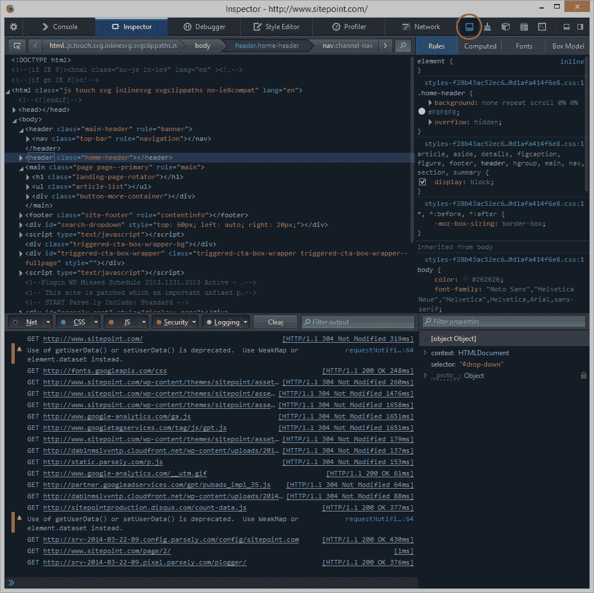

# 火狐 28 的新功能

> 原文：<https://www.sitepoint.com/whats-new-firefox-28/>

已经是火狐 28 了？距离 Firefox 27 已经过去整整六周了，Mozilla 带着新出炉的版本回来了。您可以通过以下三种方式获得它:等待自动更新；从菜单中选择**关于火狐**；或者从 Firefox.com[下载安装程序](http://firefox.com/)。

再说一次，对最终用户来说没有什么明显的特性，但是我们开发者更幸运…

## 开发人员工具更新

我发现自己比 Firebug 更经常使用内置的开发工具。虽然 Firebug 在大多数领域仍有优势，但在速度和快速检查方面，它无法击败 Mozilla 工具。

Firefox 28 引入了分控制台模式，允许你使用 DOM 检查器、调试器、分析器等。，而不必来回切换到控制台窗格。您可以通过点击工具窗口右上角的**切换分割控制台**图标来查看。

该检查器还允许您使用新的颜色选择器小部件来更改 CSS 颜色，而不是键入十六进制代码。

## 游戏手柄 API

HTML5 游戏变得越来越复杂，但键盘、鼠标和触摸并不总是最好的控制机制。新的[游戏手柄 API](https://dvcs.w3.org/hg/gamepad/raw-file/default/gamepad.html) 为传统游戏控制台控制器定义了一个跨浏览器界面，提供了一系列按钮和轴。

游戏手柄 API 出现在 Firefox 24 中，但必须通过在`about:config`偏好设置中将 **dom.gamepad.enabled** 设置为 *true* 来启用。该 API 在 Firefox 28 中是默认启用的，也在 Chrome 中实现，只是有一组稍微不同的特性和一个`-webkit`前缀。

使用可能有点早，但是更多信息请参见[在 MDN](https://developer.mozilla.org/en-US/docs/Web/Guide/API/Gamepad) 上使用 Gamepad API。

## 视频更新

Firefox 的视频处理做了一些更新:

*   浏览器现在可以播放 WebM 格式的 VP9 编码视频
*   Opus 音频支持已添加到 WebM 媒体
*   水平音量控件现在出现在标准 HTML5 音频和视频容器上
*   支持并启用 WebVTT(网络视频文本轨道)。这用于使用`<track>`标签显示文本轨道。蒂芙尼·布朗的《HTML5:多媒体》用了一章的篇幅来介绍这项技术。

## 杂项更新

一些小的更新悄悄地溜了进来:

*   已经为`<input type="color" />`控件实现了颜色选择器小部件。
*   增加了多行 flexbox 布局支持。
*   实现了 SPDY/3 网络协议，但不再支持 SPDY/2。
*   [网络通知](https://developer.mozilla.org/en-US/docs/WebAPI/Using_Web_Notifications)现在显示在 Mac OS X 通知中心。
*   增加了爱沙尼亚语。
*   Android 用户获得了改进的原生文本选择、剪切和复制功能。
*   常见的一系列[安全和漏洞修复](https://www.mozilla.org/security/known-vulnerabilities/firefox.html)已经出现。

## 地铁模式被放弃

最后，Mozilla 决定放弃一个在 Windows 8 和 RT *上运行的 Metro 版本的 Firefox(我意识到它已经不叫 Metro 了，但我还没见过不使用这个名字的人！)*

Firefox 的 Metro 版本已经开发了一年多，更加强调全屏的简单性和触摸控制。在最近的新闻发布会上，该团队的领导者乔纳森·南丁格尔说:

> “在此后的几个月里，随着团队构建、测试和改进产品，我们一直在关注 Metro 的采用。从我们所看到的来看，它相当平坦。例如，在任何一天，我们都有数百万人测试 Firefox 桌面的预发布版本，但我们从未见过 Metro 环境中的日活跃用户超过 1000 人。
> 
> “这带来了风险，Metro 明天可能会起飞，我们不得不匆忙追赶，但对我们来说，这是一个更好的风险，而不是投资于我们的用户几乎没有采用迹象的平台的真实成本。”

我并不惊讶。Firefox 吸引了超级用户和开发者，他们更倾向于使用标准的 Windows 桌面，而不是全屏应用。这意味着 Windows RT 用户将无法使用 Firefox，但平板电脑尚未对市场产生重大影响。RT 用户可以选择 Chrome 32+和 IE11，Chrome 32+提供了不同寻常的(如果不是怪异的话)RT 体验，IE11 是专门为 Metro 界面设计的浏览器。

Firefox 可能不会像以前那样受到关注，但 Firefox 28 仍然是金钱买不到的最好的浏览器之一*(除非你[付钱给戴尔安装它](http://www.bbc.co.uk/news/technology-26465203)！)*

## 分享这篇文章