# 拨号风格#2:黑色电影风格

> 原文：<https://www.sitepoint.com/nailing-look-film-noir-style/>

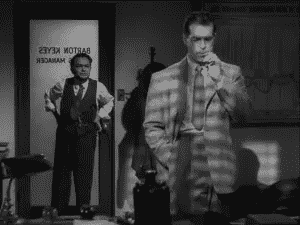

电影启发了每个人，从时装设计师，电子游戏，甚至音乐视频。网站设计也不例外，电影借用其技术来建立一种特殊的外观或情绪。

紧随包豪斯之后，我们将解释黑色电影，它的历史，它的主要角色，以及如何将它运用到你的设计中。

让我们开始吧。

## 那么，什么是黑色电影？

这个词在法语中的字面意思是“黑色电影”，但在电影界，它已经包含了某些美学和比喻。

这些包括使用黑白胶片、小插图、高低调灯光，以及愤世嫉俗的角色。这种类型通常与犯罪剧或那些符合一战和二战时间表的电影联系在一起，但黑色电影经常从这些“刻板印象”中衍生出来。

像《美好生活》和《T2 迷魂记》这样的电影挑战了许多经典的黑色电影，但仍然被归入这一类别。

在《这是一种美好的生活》中，主角有自杀倾向，电影的基调是黑暗的，而《眩晕》虽然不是一部黑白电影，但却具有黑色电影的主题——一个备受折磨的反英雄，一个战后时间线，当然还有一个复杂的情节。

## 开始

### 德国表现主义

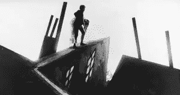

卡利加里博士的内阁。韦纳

在我们深入研究黑色电影之前，让我们先了解一下它的前身“德国表现主义”。

德国表现主义的特点是使用抽象的意象、非常规的拍摄角度、鲜明的灯光对比、过于风格化的场景和角色以及过度戏剧化的手法，与黑色电影有许多相似的技巧。

在表现主义运动中，艺术家们通过他们的作品来表达他们的不满——通常是表达一个惊恐和破碎的民族的情感。

### 黑色电影的崛起

虽然德国表现主义运动被认为对黑色电影的诞生有着强大的影响，但 1945 年由马塞尔·杜哈梅尔创办的犯罪小说出版物《黑色故事》启发了法国评论家尼诺·弗兰克创造了这个术语。

黑色系列描绘了私家侦探的工作，这是许多黑色电影的核心人物。

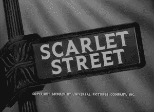

《猩红街》:弗里茨·兰导演

当德国电影出口禁令解除后，德国电影制作人得以接触全球观众。然而，这并没有阻止纳粹党的崛起，这导致了许多最伟大的电影制作人移民到美国。

在这里，德国表现主义运动的许多著名导演，如[弗里茨·兰](http://www.imdb.com/name/nm0000485/ "IMDB: Fritz Lang")、[卡尔·弗罗伊德](http://www.imdb.com/name/nm0005713/ "IMDB: Karl Freund")和[迈克尔·柯蒂兹](http://www.imdb.com/name/nm0002031/ "IMDB: Michael Curtiz")带来了他们戏剧灯光、反英雄的感觉，当然还有对永远重要的场景的关注。

好莱坞开始积极接受这些电影技术，因为他们也开始厌倦“快乐结局”的电影。他们开始将轻松的气氛换成忧郁的气氛，一种对疏离感的心理感受，以及其他现代感性的噩梦般的想法。

环球影城采用了这种类型的黑暗和风格化的外观，从而诞生了《德古拉》、《弗兰肯斯坦》和《木乃伊》等电影(均于 1931 年上映)。

从那以后，犯罪惊悚片和侦探片获得了巨大的成功，给我们带来了像汉弗莱·鲍嘉、艾伦·拉德和维罗妮卡·莱克这样的标志性人物。

## 黑色电影的关键人物

### 弗里茨·兰

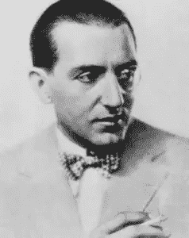

出生于弗里德里希·克里斯蒂安·安东·“弗里茨”·朗，拥有德国和奥地利的血统，是德国表现主义学派最著名的电影制作人之一。

凭借《大都会》(T1)(1927)和《M》(1931)等标志性电影，郎为电影带来了一种新的黑暗方式，这有助于黑色电影的诞生。

郎的作品为未来的黑色电影制作人提供了模板。他的电影涉及黑色主题——偏执、疯狂、破碎的梦、内心冲突和道德。

在郎后来的一些作品中，这种类型的愤世嫉俗和残酷的一面更经常地出现，如《大热》(1953)、《大热》(T1)、《城市沉睡时》(1956)、《T3》和《超越合理怀疑》(1956)、《T5》。

这些电影都带有典型的悲观主义色彩，而郎本人对世界的悲观看法更是夸大了这一点。

他的风格变得简单，但仍然坚持黑色电影的特点。

### 阿尔弗雷德·希区柯克

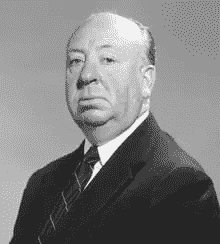

阿尔弗雷德·约瑟夫·希区柯克爵士(1899 年 8 月 13 日至 1980 年 4 月 29 日)是一位以电影和制作闻名的英国人，他只是众多受德国表现主义影响的导演之一。后来，他继续制作了一些经典的黑色惊悚片。

在《房客》(1927) 这样的电影中，他不顾工作室的反对，运用了表现主义电影中常见的技巧，比如模糊的拍摄角度和不同的灯光。

这种德国的影响可以在他的大多数电影中看到，甚至那些不被认为是黑色电影的电影，包括《惊魂记》，他通过浴帘模糊了诺曼·贝茨的形象，以模仿诺斯费拉图(1922)中使用的技术。

希区柯克的作品取得了令人难以置信的成功，尤其是黑色电影，包括《恶名昭彰》(1946)、《火车上的陌生人》(1951)、《后窗》(1954)和《惊魂记》(1960)。

希区柯克将这种类型转变成他自己的风格，使他的作品在他的同时代人中与众不同，因为他继续用他的作品影响其他人。

### 奥逊·威尔斯

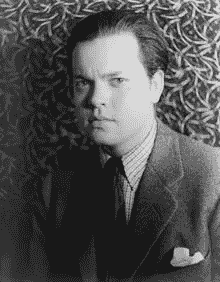

乔治·奥逊·威尔斯(1915 年 5 月 6 日-1985 年 10 月 10 日)可能最著名的作品有[《公民凯恩》(1941)](http://www.imdb.com/title/tt0033467/ "IMDB: Citizen Kane") 、[《上海贵妇》(1947)](http://www.imdb.com/title/tt0040525/ "IMDB: The Lady fron Shanghai") 和[《触摸邪恶》(1958)](http://www.imdb.com/title/tt0052311/ "IMDB: Touch of Evil") 。威尔斯是美国演员、导演、作家和制片人。众所周知，他的作品具有许多黑色电影的特质，这些特质促使他的作品成为该类型中一些更著名的作品。

这三部电影涵盖了所有经典的黑色电影。

在《公民凯恩》(Citizen Kane)中，高低调照明的使用有助于设定基调，黑暗的阴影与光线形成对比。主观和低角度拍摄也被利用。

《上海女人》延续了威尔斯的黑色电影手法，引入了神秘和复杂的情节，由蛇蝎美人丽塔·海华丝讲述了一个关于欺骗和谋杀的故事。

《触摸邪恶》体现了黑色电影的整体风格。

虽然奥逊·威尔斯的作品被认为是商业上的失败，但他仍然被认为是“终极导演”，因为他独特的技术和对相机角度、明暗对比照明和非线性故事的创新使用。

# 打造黑色电影的外观

## 规则 1:照明就是一切

灯光——也就是你的色调范围——是这部黑色电影中最重要的因素。

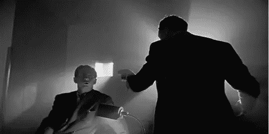

奥逊·威尔斯的代表作《公民凯恩》

在强调人物和物体时，使用对比是必不可少的。黑暗的阴影池和分散的光点不仅用来“突出”，也象征性地使用。

在《卡利加里医生的柜子》(1920) 这样的电影中，在一个已经喜怒无常的黑暗氛围中使用倾斜的角度，突出了人物陷入疯狂的状态。

黑色电影世界不仅仅是戏剧发生的地方。黑暗、粗糙的环境反映了生活在那里的角色的内心生活。是另一种性格。

柔和的灯光被用在女性角色身上，让她们看起来温柔而没有威胁，即使是看起来没有威胁的雌狐，也是这部电影的蛇蝎美人。

黑色电影中的灯光也被用来营造气氛或增加紧张感。

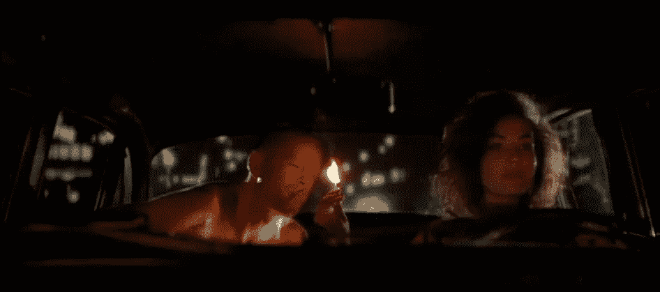

低俗小说(1994)

### 规则 2:字体——让它看起来又大又亮

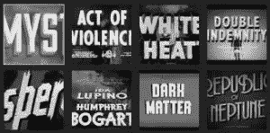

各种黑色文本处理

黑色的粗砺和阴暗决定了你的文字在黑暗中会有较浅的色调。通常情况下，这将是窄，块无衬线字体-但有足够的变化空间。

伪 3D 文本处理在标题上很常见，但像《沉睡》这样的电影表明，即使是经典的罗马衬线也可以在黑色电影环境中工作。

一些非常适合黑色电影处理的字体包括:

#### 解放者

[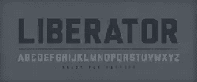](http://www.losttype.com/font/?name=liberator)

瑞恩·克拉克将解放者描述为战争时代的字体，灵感来自轰炸机上的文字标记。

这是一种阳刚的、报纸用的块状字体，从黑色灵感设计的阴影中美丽地隐现出来。

#### 弗朗索瓦一号

[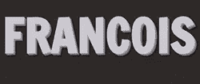](http://www.fontsquirrel.com/fonts/francois-one)

Francois One 是另一种实体字体，但有一种前卫的感觉。略带棱角的笔触使其看起来和蔼可亲，但略显焦虑。

Francois One 可以通过 Font Squirrel 免费下载，也可以通过 Google Fonts 作为嵌入式网络字体。

#### 布里衬线

虽然无衬线字体是标准字体，但衬线字体甚至是 brushscript 风格的字体在过去也有很好的效果。

布里衬线是块衬线，非常适合 50 年代的仿 3d 效果。它也可以通过良好的网络字体库获得。

### 规则 3:黑色电影中没有英雄，只有灰色阴影

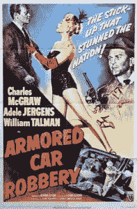

黑色电影打破了人们对“英雄”的概念。在黑色的世界里，没有谁是纯洁善良的，即使是反派也有他们的道理。

甚至女性角色也脱离了典型。“蛇蝎美人”第一次出现在银幕上，展现神秘，以操纵和欺骗的方式表现——一切都带着控制和团结的气息。

不仅仅是人物不典型，故事情节也不典型。情节更加复杂，气氛更加黑暗和残酷，结局偏离了童话的结局。

那么，这对设计意味着什么呢？

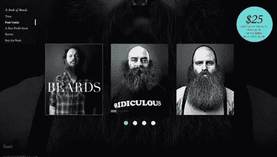

《胡须之书》网站展示了一群有趣的黑色风格的人物

当你创作“英雄镜头”时，不要想“超人”——不管是产品还是人。

肖像是关于情绪和潜台词的——而不是微笑和调情。

产品与其说是物体，不如说是捕捉光影和纹理的表面。在 Curadmir Cycles 网站上，你几乎看不到这些自行车，但是粗糙的图像和暗色调营造了一种难忘的氛围。

### 规则 4:风格化——使用形状、阴影和轮廓

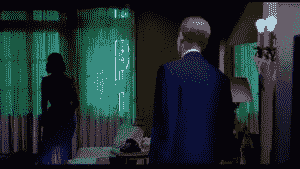

眩晕(希区柯克)

借用它的前身，黑色电影努力在电影中创造艺术风格的作品。德国表现主义拥抱抽象和梦幻，在某种意义上黑色电影也是如此。

德国艺术导演赫尔曼·伐尔姆曾经说过"*电影影像必须成为平面艺术*"，本质上德国表现主义和黑色电影都是这么做的。

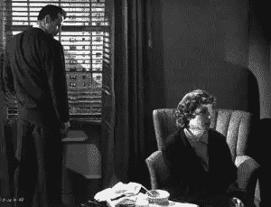

大热(1953)

[明暗对比照明技术](http://500px.com/blog/605 "Photo Tutorial:  Chiaroscuro Portraits")被用来实现一个戏剧性的阴影图案，同时切割光线以形成坚硬锐利的光线。

这种技术可以在更多的侦探电影中看到，光线穿过打开的威尼斯百叶窗，用光线切割人物的脸。

网站:Curadmir Bikes

倾斜的、宽的、歪斜的和低的摄像机角度也成为了黑色电影中的主要元素。电影布景也采用了表现主义风格，突出了硬线与软线的对立。

这些类型的电影中也使用了晕影，包括让人物的脸大部分被阴影淹没——这种技巧一直沿用至今。

## 你今天在哪里看黑色电影？

#### 黑色城市

[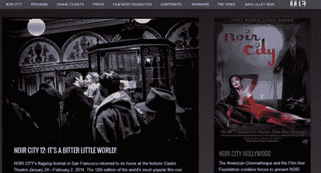](http://www.noircity.com/)

毫不奇怪，黑色城市电影节网站的设计者创建了一个符合该类型惯例的网站。

除了彩色海报之外，该网站还以深色调色板为特色，介绍黑色电影的所有内容。该网站的海报和白色文本的位置保持网站的可读性，同时保持其喜怒无常的优势。

#### 信仰滑板

[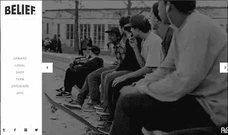](http://beliefnyc.com/ "Website: Belief Skateboards & Clothing")

[信仰滑板](http://beliefnyc.com/ "Website: Belief Skateboards")将一些经典的黑色元素与一些很酷的现代元素混合在一起。

市中心的场景、粗糙的黑白影像和冷酷的面孔是抄袭的黑色电影。

虽然日光摄影和浅色背景打破了这种模式，但他们仍然设法获得了一个简朴，几乎荒凉的现场外观。

#### S4C 标志

[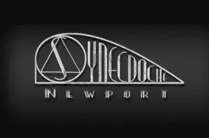](http://juzzybunnisketch.blogspot.com/2013/01/final-film-noir-s4c-title-cards-and-logo.html)

就像 Juzzy Bunni 在她的设计中展示的那样，即使是 logos 也可以获得黑色电影的待遇，将黑色电影的风格融入到一些看起来像是从经典电影中抄袭来的东西中。

使用纹理和梯度的背景给你真正的砂砾的感觉。字体中的硬线确实引起了对标志本身以及每个字母内部附加处理的注意。

### 黑色图标

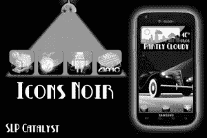

也可以在你的网页元素中加入黑色电影的元素，比如图标。SLP 催化剂的灵感直接来自 1940 年的犯罪剧，创造了一套黑白图标使用图形的项目可以在那个时期找到。

这些设计足够简单，但仍然符合黑色电影的风格。

* * *

今天到此为止。我希望这能给你一些想法，让你知道如何在下一个合适的项目中加入一些坚韧不拔的戏剧。

## 分享这篇文章