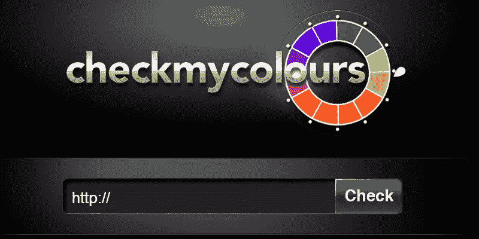
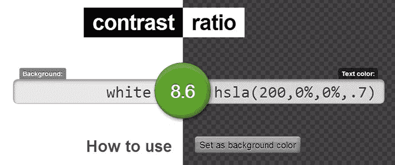
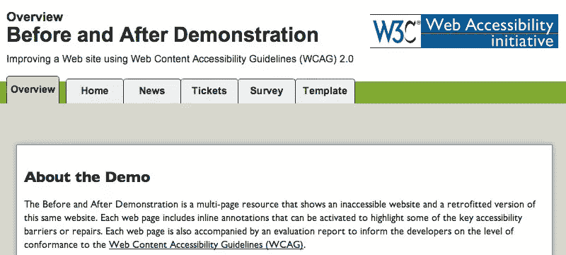

# 轻松检查网站的可访问性

> 原文：<https://www.sitepoint.com/easy-checks-website-accessibility/>

几周前，我发表了一篇文章，强调了检查网站可访问性的流行工具和其他考虑因素。在那里，我简要地谈到了这些工具在您的代码中寻找的可能错误以及如何避免它们。在这篇文章中，我将谈论通过遵守 [WCAG 2.0](https://www.w3.org/TR/WCAG20/) (网页内容可访问性指南)来使网站可访问的指南。

为了清楚地了解不同类型的可访问性问题，以及用户如何利用辅助技术来克服这些问题，在我们继续之前，您可能需要通读[web 可访问性的基本组件](https://www.w3.org/WAI/intro/components.php)。

## 页面标题

页面标题是包含在`title`标签中的文本。它显示在某些浏览器的标题栏中，并作为页面标题出现在搜索结果和书签中。加载页面时，屏幕阅读器也会读取它。虽然非屏幕阅读器用户可以避免阅读不合适的标题，但屏幕阅读器总是会把它读出来。所以题目要慎重选择。

 * SitePoint 的主页，标题显示在工具提示中。*

### 页面标题指南

*   确保标题充分描述了页面的性质，并且长度适当。
*   一个网站上的两个页面不应该共享同一个标题。
*   每次标题改变时，屏幕阅读器都会读出标题，所以除非在极少数情况下(例如，在聊天应用程序中)，否则不要改变页面标题。

## 形象

图像对盲人用户几乎没有任何用处。为图像提供适当描述图像的相关`alt`文本是很重要的。替代文本不能只描述图像，但它也应该提供相同的用户体验。例如，用于脸书通知的“世界”图标图像的替代文本应该是“通知”，而不是“世界”或“地球”。

图像的 alt 文本是由屏幕阅读器读出的，因此用于装饰目的的图像应该总是作为背景包含在 CSS 中，否则它们的 alt 属性将为 null 或空值，这将指示屏幕阅读器忽略该图像。

您可能想知道:为什么不干脆完全排除`alt`属性，而不是包含一个空值呢？这是因为如果缺少 alt 文本，屏幕阅读器会读出`src`属性——图像的路径！当然，您不希望这样，所以最好通过 CSS 包含装饰图像，或者包含 alt 属性，但将其留空。

属性还有另一个用途。如果用户为了节省带宽而关闭了图像，通常会显示替代文本来代替禁用的图像。这样你不用下载就能知道图像的用途。

### 可访问图像指南

*   如上所述，alt 文本必须解释图像的用途，而不仅仅是描述图像。
*   请确保在替换文本中包含图像中的任何文本。
*   为没有任何有用意义的图像提供 null 或空的 alt 属性，例如那些用于装饰目的的图像。
*   如果一个图像很复杂，比如一个图表，描述应该是图像的内容，图像中的数据应该显示在页面的其他地方。
*   替代文本应该是准确的，不应该包含多余的话，如“的图像”或“链接到”。

### 如何检查图像替代文本

检查许多不同图像的替代文本的一个简单方法是使用 [Web 可访问性评估工具(WAVE)](http://wave.webaim.org/) ，它列出了 URL 中每个图像的替代文本，如果图像缺少替代文本，将显示一个错误。

## 标题

大多数 CSS 开发人员都知道如何使用标题(`h1`、`h2`等等)。然而，在 CSS 运动的早期，许多页面看起来像这样:

```
<div class="heading">HTML</div>
<div class="text">
    <p>HTML is the language of the web.</p>
    <div class="subheading">br tag</div>
    <p>br is used to insert line breaks.</p>
    <div class="subheading">p tag</div>
    <p>p is used to create paragraphs.</p>
</div>
<div class="heading">CSS</div>
<div class="text">
    <p>CSS is used for styling</p>
</div>
```

如您所见，没有使用标题，而是使用各种类来设计元素的样式。更容易理解的表达方式是用标题:

```
<h2>HTML</h2>
<p>HTML is the language of the web.</p>

<h3>br tag</h3>
<p>br is used to insert line breaks.</p>

<h3>p tag</h3>
<p>p is used to create paragraphs.</p>

<h2>CSS</h2>
<p>CSS is used for styling.</p>
```

必须维护正确的标题结构，并且样式应该应用于 HTML 元素。幸运的是，今天大多数开发人员都有良好的习惯，并且在大多数情况下都做得很好。

### 标题指南

*   所有页面必须至少使用一个标题。
*   用作标题或副标题的文本必须用适当的标题标记换行。
*   标题必须保持适当的层次结构。

### 如何检查标题的可访问性

虽然通过将标记与页面的视觉结构进行比较，不使用工具进行检查是可能的，但通常建议使用像 [WAVE](http://wave.webaim.org) 或 [W3 HTML 验证器](http://validator.w3.org/)这样的工具。

## 色对比度

随着背景和前景之间的颜色对比度降低，很难区分呈现的是什么——是文本还是图像。患有色盲的人也很难阅读低对比度的文本，因为颜色显示为不同的灰色阴影(取决于他们残疾的严重程度)。

据说十二个人中就有一个患有某种颜色的缺陷。这意味着大量的人不能像你一样浏览你的网站。

### 颜色对比指南

*   在设计你的网站时，确保你的颜色对比度很高，以最大化可读性。
*   避免使用颜色范围很广的背景图像。

### 如何测试颜色对比

*   使用浏览器插件，如 Chrome 的[灰度工具](https://chrome.google.com/webstore/detail/grayscale-tool/odolflphhameojgliipcnahnipmogigo?hl=en)，查看网页在灰度下的样子。
*   使用颜色对比度检查工具，如[检查我的颜色](http://www.checkmycolours.com/)(检查你的整个页面的低对比度)或[对比度](http://leaverou.github.io/contrast-ratio/)(在输入你想要使用的文本和背景颜色后给你一个 WCAG 分数)。

*checkmycolours.com 对比测试工具。*

 * Lea Verou 的对比测试工具。*

## 键盘访问

无法精确使用鼠标的人只能依靠键盘来浏览网站。对于这样的用户，网站必须只使用键盘就可以导航，并且某些元素上的键盘焦点必须是可见的。

### 键盘辅助功能指南

*   每个元素都应该可以通过键盘访问:链接、按钮、表单域和 WYSIWYG 编辑器或媒体播放器的控件。
*   在下拉菜单中，确保每个项目都可以使用 tab 或箭头键通过键盘访问。
*   确保用户可以切换出他们切换到的元素，而不是停留在一个元素上。
*   在浏览内容时，从上到下和从左到右(阿拉伯语等从右到左的语言相反)检查阅读顺序中的焦点转移。
*   视觉焦点不应该丢失。

### 如何检查键盘访问

*   用鼠标点击地址栏，不要再用鼠标。相反，使用 tab 键在元素间移动，使用 SHIFT+Tab 向后移动。
*   在下拉菜单或其他元素中，您可能需要使用箭头键来代替 tab 键进行导航。
*   确保在浏览数据时不会失去视觉焦点。

## 使用不良

演示前的[演示后的](https://www.w3.org/WAI/demos/bad/)(坏)是 W3C 创建的一个演示，展示了一个不可访问的网站，解释了遵循一般可访问性准则后该网站和同一网站的问题。

 * W3.org 的演示前后。*

您可以比较演示中的页面，以便更好地理解 web 辅助功能。

## 结论

有了网页可及性检查的知识，你应该就你的发现联系网站所有者和/或开发者，并鼓励他们改正错误。然而，你也应该考虑一种[接近他们](https://www.w3.org/WAI/users/inaccessible)的适当方式。

我们已经讨论了一些关于检查网站可访问性的话题，但是还有很多其他的检查我们没有讨论。网站可访问性的简单检查的完整列表可以在 W3C 对网站可访问性的初步评估中找到。

应该注意的是，可访问性始终是一项持续的任务。即使网站通过了所有的网站可访问性检查，仍然可能存在难以通过键盘或使用屏幕阅读器或其他辅助设备访问的区域。没有什么比实际测试更好的了，所以即使所有的技术测试都通过了，也要继续测试。

## 分享这篇文章