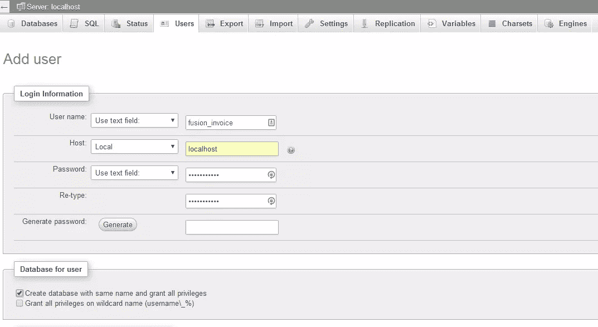
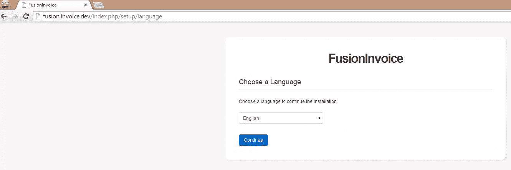
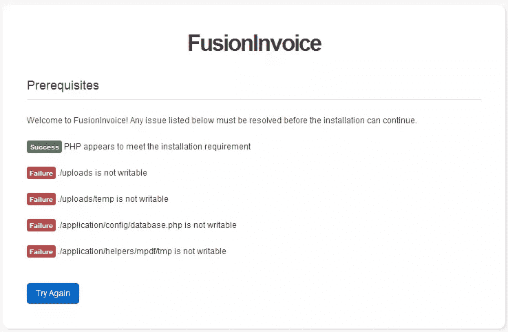
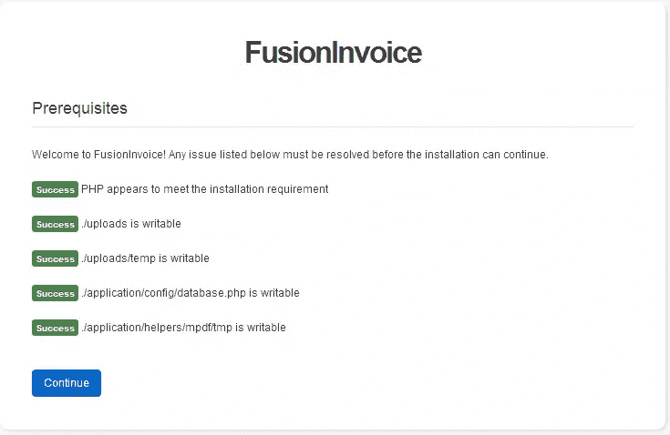
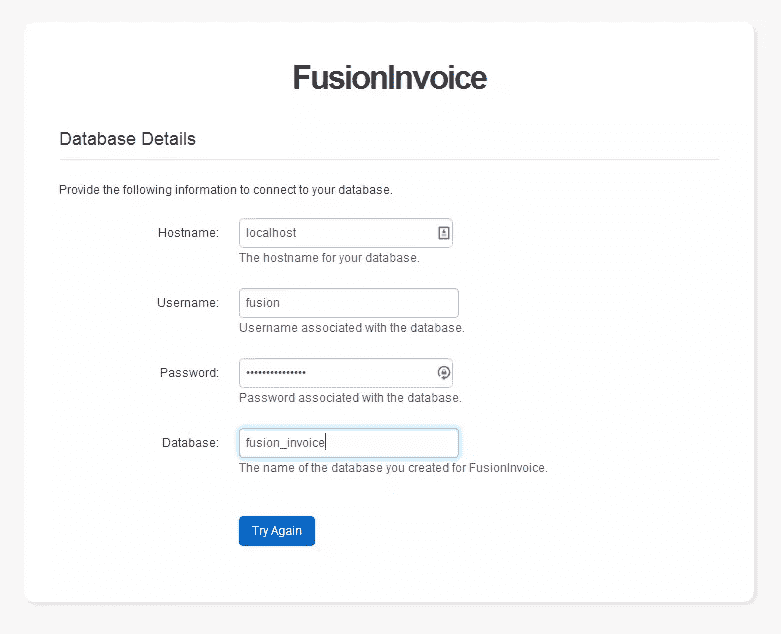
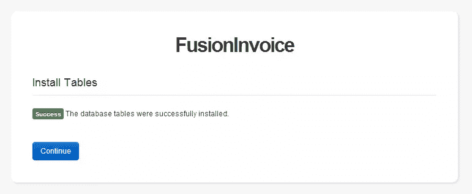
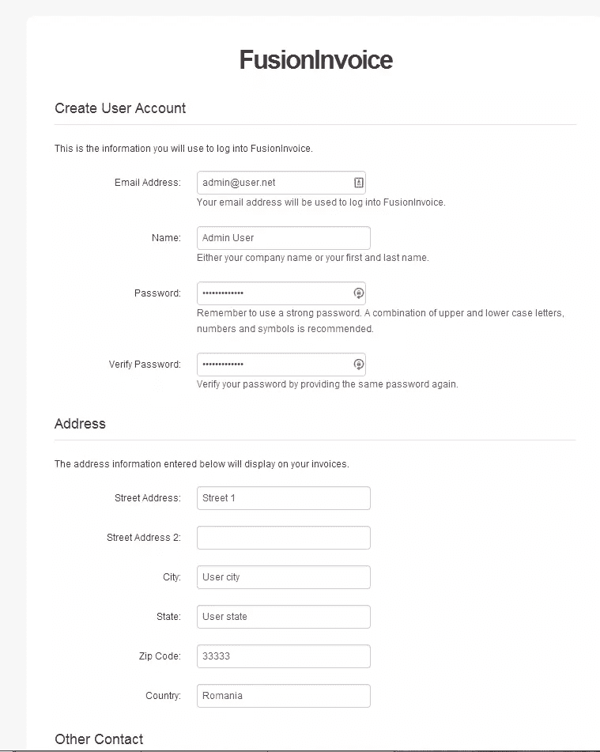

# 自托管免费发票应用程序–fusion invoice

> 原文：<https://www.sitepoint.com/self-hosted-free-invoicing-app-fusioninvoice/>

 *请注意，大约在本文发表的确切时间，FusionInvoice 2 作为商业软件发布，它基于 Laravel，而不是像以前的版本那样基于 CodeIgniter。它实际上是一个完全不同的应用程序。本文关注的是旧的但功能仍然完整的版本 1.3.4。

* * *

作为自由职业者或小企业，你的时间最好花在创造下一个大项目或满足客户的要求上，而不是跟踪发票。

FusionInvoice 是一个为自由职业者和小型企业构建的开源、自托管的发票 web 应用程序。虽然有相当多的免费在线发票应用程序，但没有一个给你 FusionInvoice 所提供的隐私或灵活性。客户管理、仪表板和报告、经常性发票和发票历史只是其功能的一部分。

FusionInvoice 是一个开源项目，这意味着您可以随时根据需要更改或添加其功能，甚至可以将其安装在私有系统上，从而限制访问您的敏感数据的用户数量。

虽然该应用程序是开源的，但开发人员认为，社区可以通过提供他们的输入和建议来更好地帮助项目，因为作为社区，他们希望在项目中看到这些功能和增强，但开发应该是一个封闭的团队工作。

这似乎是一种奇怪的开源项目的方法，但是它让团队专注于保持开发新功能和修复 bug 的恒定速度。

## 软件要求

由于 FusionInvoice 版本 1.3.4 是一个基于 CodeIgniter 的项目，基本要求相当简单:
–PHP 5.3 或更新版本
–MySQL 5.0 或更新版本
–Apache 或 Nginx server

让我们检查一下您的系统是否符合这些要求。
在您的终端中运行以下命令，检查安装的 PHP 版本:

```
$ php -v
```

如果 PHP 安装正确，您应该会收到类似如下的输出:

```
PHP 5.5.3-1ubuntu2.1  (cli)  (built:  Dec  12  2013  04:24:35)  Copyright  (c)  1997-2013  The PHP Group  Zend  Engine v2.5.0,  Copyright  (c)  1998-2013  Zend  Technologies  with  Zend  OPcache v7.0.3-dev,  Copyright  (c)  1999-2013,  by  Zend  Technologies  with  Xdebug v2.2.3,  Copyright  (c)  2002-2013,  by  Derick  Rethans
```

现在，让我们通过在 MySQL 提示符下运行以下命令来检查 MySQL 版本:

```
mysql> SHOW VARIABLES LIKE "%version%";
```

如果 MySQL 服务器正确安装并运行，您现在应该会看到类似下面的输出。

```
+-------------------------+-------------------------+  |  Variable_name  |  Value  |  +-------------------------+-------------------------+  | innodb_version |  5.5.34  |  | protocol_version |  10  |  | slave_type_conversions |  |  | version |  5.5.34-0ubuntu0.13.10.1  |  | version_comment |  (Ubuntu)  |  | version_compile_machine | x86_64 |  | version_compile_os | debian-linux-gnu |  +-------------------------+-------------------------+
```

根据您的服务器设置，版本号可能会有所不同，但输出应该是相似的。

好了，既然已经满足了这个虚拟机的要求，我们就继续下一部分吧。

## 下载 FusionInvoice 应用程序

首先，让我们通过运行以下命令来创建要安装 FusionInvoice 的文件夹:

```
$ cd /var/www/ $ sudo mkdir -m 755 fusioninvoice
```

注意:我假设你在一个*nix 平台上(如果在 Windows 上，请使用[流浪者](https://www.sitepoint.com/build-virtual-machines-easily-puphpet/)来建立一个工作环境)，并且使用默认的 Apache/Nginx 配置，将`/var/www`作为你的基本文档根文件夹。否则，请将路径更改为您正在使用的路径。

可以从 [Github](https://github.com/sitepointweb/fusioninvoice) 下载 1.3.4 版本。完成后，将其解压到你的网站文件夹中(如上所述的 www)。

## 创建数据库

现在我们需要创建一个数据库来存储 FusionInvoice 的数据。有两种方法可以做到这一点，命令行或 phpMyAdmin。
如果您在生产或全球可用的服务器上安装 FusionInvoice，我个人推荐命令行。

a)在 mysql 提示符下执行以下命令:

```
mysql> CREATE DATABASE `fusion_invoice`; mysql> CREATE USER 'fusion_invoice'@'localhost' IDENTIFIED BY 'fusion_pass'; mysql> GRANT ALL PRIVILEGES ON `fusion_invoice`.* TO 'fusion_invoice'@'localhost' IDENTIFIED BY 'fusion_pass';
```

b)使用 phpMyAdmin，转到`USERS`选项卡并选择`Add user`。在新的用户表单中填写所有字段，并确保选中`Create database with same name and grant all privileges`复选框，phpMyAdmin 将为您创建数据库。



* *注意:如果您在 world available server 上安装 FusionInvoice 应用程序，请确保采取所有必要的安全预防措施，并相应地调整新用户的权限。

就是这样！我们现在准备运行 FusionInvoice 设置模块。

## 融合语音的初始配置

要开始设置过程，我们需要从您的首选浏览器访问`/setup`模块:

```
http://[domain-name]/[fusioninvoice]/index.php/setup
```



* *注意:根据您的服务器配置，URL 可能会有所不同。这个想法是，为了启动 FusionInvoice 应用程序，您需要将所有没有映射到物理文件的请求发送到`index.php`。如果您不知道如何创建虚拟主机或将您的请求重定向到`index.php`,您可以在文章末尾找到一个可选步骤，它将指导您完成这个过程。

在步骤 2 中，FusionInvoice 设置系统为我们提供了一个要求可写的文件和文件夹列表。



让我们通过从终端运行以下命令来解决这个问题:

```
$ cd /var/www/fusioninvoice
$ chmod 777  -R uploads/ $ chmod 777 application/config/database.php 
$ chmod 777  -R application/helpers/mpdf/tmp/
```

如果您刷新页面，现在应该可以看到正确设置的所有先决条件。



在步骤 3 中，我们必须为 FusionInvoice 提供数据库服务器连接的详细信息。



如果在接下来的 2 页中连接成功，FusionInvoice 将让您知道数据库表已经正确安装和升级。



到达最后一步时，将要求您创建一个基本用户，即管理员帐户。



完成此步骤后，您将成功地在系统上安装 FusionInvoice。

现在，您可以登录并开始创建这些发票:)

## 在您的服务器上创建虚拟主机

这个可选步骤将引导您完成在 Apache 或 Nginx 上创建基本虚拟主机的过程。

* *重要注意事项:虽然本文中介绍的许多虚拟主机设置也用于生产中，但它们只是一个起点，从安全角度来看，它们绝不应该被认为足以满足生产服务器的需求。请确保您已经采取了所有必要的预防措施来保护您的服务器。

a)设置 Apache 虚拟主机

首先，让我们确保 Apache 激活了`mod_rewrite`模块。您可以通过运行以下命令进行检查:

```
$ apache2ctl -t -M
```

上面的命令将列出 Apache2 服务器加载的所有模块。如果加载了`mod_rewrite`模块，您应该会看到如下条目:
`rewrite_module (shared)`

如果上述行不存在，请在终端中运行下一条命令来启用该模块:

```
$ sudo a2enmod rewrite
```

既然 mod_rewrite 模块已经激活，我们需要为新主机创建一个配置文件。您可以通过在终端中运行以下命令来实现这一点:

```
$ sudo vim /etc/apache2/sites-available/fusion_invoice.dev.conf
```

现在将下面的代码复制到您的配置文件中，并编辑路径以匹配您的路径:

```
 <VirtualHost *:80> ServerAdmin webmaster@localhost
            DocumentRoot /var/www/fusioninvoice

            ServerName fusion.invoice.dev #change this setting according to your domain name

            DirectoryIndex index.php <Directory  /var/www/fusioninvoice> RewriteEngine On
                RewriteBase /

                RewriteCond %{REQUEST_FILENAME} !-f
                RewriteCond %{REQUEST_FILENAME} !-d
                RewriteRule ^(.*)$ index.php [QSA,L] </Directory> ErrorLog ${APACHE_LOG_DIR}/error.log
            CustomLog ${APACHE_LOG_DIR}/access.log combined </VirtualHost>
```

现在保存并关闭编辑器，在终端中运行以下命令:

```
$ sudo a2ensite fusion_invoice.dev.conf
$ sudo service apache2 restart
```

仅此而已。现在可以使用新的 URL fusion . invoice . dev，而不是 localhost 或 VM 的 IP 地址。

b)建立 Nginx 虚拟主机

让我们在您的终端中运行以下命令，为我们的新虚拟主机创建配置文件:

```
$ sudo vim /etc/nginx/sites-available/fusion_invoice.dev.conf
```

现在将下面的代码复制到您的配置文件中，并编辑路径以匹配您的路径:

```
server { listen 80; server_name   fusion.invoice.dev;  #change this setting according to your domain name root /var/www/fusioninvoice;  # path to fusioninvoice's install directory error_log /var/log/nginx/fusion.error.log debug; access_log /var/log/nginx/fusion.access.log; index         index.php; location ~  ^(.+\.php)(.*)$ { fastcgi_split_path_info ^(.+\.php)(.*)$; fastcgi_pass       unix:/var/run/php5-fpm.sock; include            fastcgi_params; fastcgi_param      HTTPS off;  #this is required for development mode fastcgi_param      PATH_INFO $fastcgi_path_info; fastcgi_param      SCRIPT_FILENAME $document_root/$fastcgi_script_name;  } location /  { try_files          $uri $uri/  /index.php?$args;  }  }
```

现在我们已经创建了配置，在*nix 系统上，您需要创建一个从文件当前位置到`/etc/nginx/sites-enabled`文件夹的符号链接，以便 Nginx 加载新的虚拟主机。

您可以通过在终端中运行以下命令来创建符号链接:

```
$ sudo ln -s /etc/nginx/sites-available/fusion_invoice.dev.conf /etc/nginx/sites-enabled/fusion_invoice.dev.conf
```

同样，改变所有的路径来匹配你的。现在，让我们重启 Nginx 服务器来加载新的虚拟主机配置。

```
$ sudo service nginx restart
```

如果一切顺利，您现在应该能够使用服务器名称而不是机器的 IP 地址或本地主机来访问您的新虚拟主机。

## 从 URL 中删除“index.php”条目

现在我们已经创建了一个虚拟主机，让我们也从 URL 中删除`index.php`,得到一些漂亮的、容易记住的 URL。
为此，我们只需打开位于`/var/www/fusioninvoice/application/config/`的`config.php`文件，并编辑以下行:

```
$config['index_page']  =  'index.php';
```

现在只需删除`index.php`值并保存文件。

## 结论

丰富的功能，设置和管理应用程序所需的相对较低的技术知识水平，以及随时准备提供帮助的活跃社区，使 FusionInvoice 成为任何希望将时间花在项目上而不是跟踪发票上的自由职业者或小企业主的绝佳工具。

## 分享这篇文章*