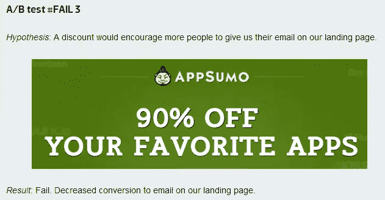
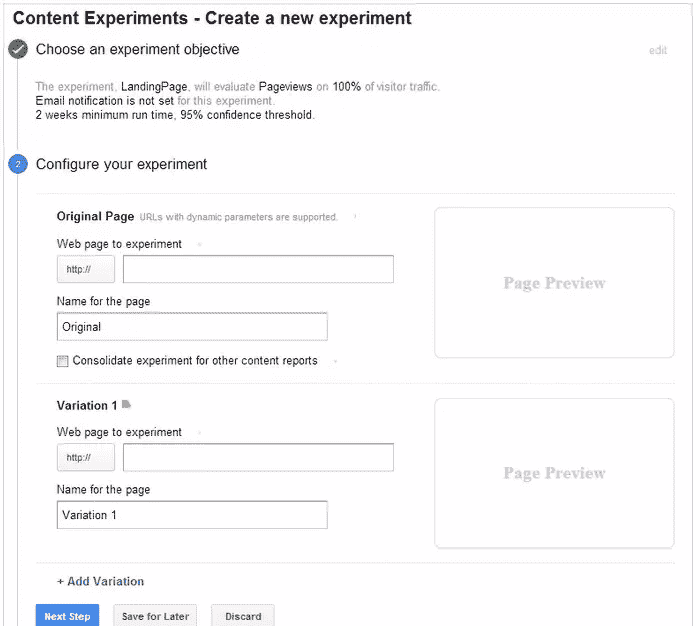

# 大多数获奖的 A/B 测试结果是否有误导性？

> 原文：<https://www.sitepoint.com/winning-ab-test-results-misleading/>

马丁·古德森(Martin Goodson)最近关于[量子位](http://www.qubitproducts.com/)(一家转换优化初创公司)的一份报告断言， *[大多数赢得 A/B 测试的结果都是虚幻的](http://www.qubitproducts.com/content/most-winning-ab-test-results-are-illusory)* ，这在很大程度上是由于这种测试被糟糕地执行。作者认为，这不仅会导致“不必要的网站修改”，而且在某些情况下会损害公司的盈利能力。

那么为什么会这样呢？如果进行了 [A/B 测试](https://en.wikipedia.org/wiki/A/B_testing)(也称为分割测试),设计师和企业如何确保正确有效地完成？

## 什么是 A/B 测试？

从一个快速入门开始，A/B 测试是一种比较两个版本的网页(例如，它可能是一个登录页面)的方法，以查看两个版本中哪一个执行得最好。为了进行一项测试，两组人将分别看到不同的页面，结果由两组人如何与每个页面互动来衡量。

例如，在页面的某个区域包含强烈的行动号召(CTA)的页面可能会与另一个类似的页面进行比较，但 CTA 位于不同的位置，并且可能使用不同的措辞或颜色。

A/B 测试中常用的页面的其他方面包括:

*   标题和产品描述
*   形式
*   页面布局
*   特价
*   形象
*   文本(长格式、短格式)
*   小跟班

然而，根据 Goodson 的说法，在这些页面上进行的测试经常会返回错误的结果，预期的“提升”(转化率的增加)永远不会实现。

## A/B 测试的数学

简单地说，你可以说 A/B 测试就像转换和非转换一样简单。从这些可能性中，接下来就是计算访问次数和转化百分比的问题了。在他的报告中，古德森指出了两种测试方法:**统计功效**和**多重测试**。

对前者，古德森解释道:

> 统计功效就是当*确实是一个潜在的差异时，统计测试检测到两个值之间的差异的概率。它通常用百分比表示。*

然而，这可能会受到样本大小的影响——如果没有那么多人参与，那么您可能不会得到真实的结果。除此之外，获得提升和真实的结果也取决于测试运行的时间。

为了知道如何计算运行时间，有必要在实现和运行测试之前正确计算样本大小。如果做错了，将会返回错误的结果，并且不太可能看到销售的任何提升，即使测试已经表明他们会。

多重测试通常依赖于软件，并使用经典的 [p 值](https://en.wikipedia.org/wiki/P-value)来测试统计显著性。所以这两个模型都依赖于统计数据，但是经常使用软件如[优化](https://www.optimizely.com/)进行多重测试。

## 使用 P 值的危险

p 值的使用可能并且确实经常产生错误的结果，这是由于两个众所周知的因素:

*   进行许多测试
*   看到阳性结果时停止测试

记住这一点，当涉及到你用来检查变量是如何被测试的以及软件有多直观的软件时，你最好是真正地做你的研究。

例如，Optimizely 建议您在使用其软件运行测试之前设置变体。如果不这样做，您实际上只是在运行一个 A/A 测试，因为结果与原始页面相同。该公司还指出，如果变量设置不当，你很可能会得到虚假的获奖结果。

## A/B 测试中的常见错误

首先，为了执行返回真实结果的 A/B 测试，有必要**拥有足够大的样本量**。根据 Goodson 的说法，统计能力随着样本的增加而增加，虽然你可能会从大样本中得到奇怪的随机变量，但这是不可避免的，不一定会返回错误的结果。

然而，并不是所有的网站都有很大的流量，所以在某种程度上样本会有些超出你的控制。请注意这一点，因为如果你的访客很少，你更有可能得到随机变量，这可能是浪费你的时间。

成功的 A/B 测试的第二个重要方面是**测试运行的时间长度**。同样，如果你缩短测试，你基本上减少了它的统计能力，你可能会收到假阳性，虽然看起来产生了提升，但实际上并没有改变底线:收入。

古德森说，如果你认为自己看到了成功的结果，就缩短测试时间。

> "几乎三分之二的获奖测试都是完全伪造的。"

换句话说，让测试运行足够长的时间是至关重要的——即使你看到了大量的转换——以便建立统计能力并获得真正的结果。因此，您可以从一个好的可靠的测试模型开始，有一个好的样本大小，但是不耐烦会导致错误的结果。

## 运行同步测试

另一个最近的破坏性趋势是同时进行大量的测试。这是一个坏主意，因为如果你进行 20 次测试，那么平均你会看到一个成功的结果，如果是 40 次，那么你会看到两个，因为每个测试有 5%的机会获胜。古德森说:

> “最好不要采用漫无目的的方法，而是进行少量有针对性的、有充分依据的测试，所有这些测试都有足够的统计能力。”

[根据 AppSumo](http://visualwebsiteoptimizer.com/split-testing-blog/a-b-testing-tips/) ，在他们自己的产品测试中:

> "只有八分之一的 A/B 测试带来了显著的变化."

AppSumo 每天有大约 5000 名访客，虽然他们坚持认为他们看到了一些出色的结果，如电子邮件转化率增加了五倍以上，购买率翻了一番，但该网站也看到了一些测试过程中的“残酷现实”。

即使是那些他们确信有效的方法也会因为各种原因而失败，这些原因包括:

*   没有读课文的人
*   使用%而不是美元作为奖励
*   弹出式/灯箱激怒了游客

为了真正做到以上几点，有必要拥有一个人们信任的非常强大的品牌，这仍然是我们许多人的圣杯。

在上面的例子中，AppSumo 的人认为测试失败是因为需要输入电子邮件地址——这对所有网站来说都是一种珍贵的商品。然而，它对“老练”的用户来说同样珍贵，他们不会轻易放弃他们的电子邮件地址，这就是为什么提供现金奖励比百分比奖励更好。

## 运行成功的 A/B 测试

在实施测试之前，要做好计划，并确定*该测试如何*提高转化率。你当然应该[在谷歌分析](https://support.google.com/analytics/answer/1006230?hl=en-GB)中为可衡量的结果设定目标，并使用适当的软件。您可以手动进行测试，使用您自己的计算或使用一个[模板，例如由可视化网站优化器](https://docs.google.com/spreadsheet/ccc?key=0Al1dyjbyDwCNdG9YRXpLc0o5ZmVfRkF1UUZDdzZMT0E#gid=0)准备的模板。或者(或者另外)，有一个[免费的在线 A/B 测试显著性工具](http://visualwebsiteoptimizer.com/ab-split-significance-calculator/)你可以使用，它是由同样的人创建的。

**注意:**你也可以使用[谷歌分析内容实验](https://support.google.com/analytics/answer/1745147?hl=en&topic=1745207)进行测试。

你还应该意识到，不要着急，如果你想获得成功的结果，你必须**保持耐心——测试很可能需要几周甚至几个月才能完成。**

此外，您应该:

*   一次只测试一个页面，甚至是页面上的一个元素。
*   选择跳出率/退出率高的页面。
*   在看到任何结果之前，预计至少有 1000 名访问者。
*   做好失败的准备；很少有测试第一次就成功的。
*   理解 A/B 测试有一个学习曲线。
*   耐心点。
*   了解你的客户。

Miva 商人博客上写道:

> “了解 8 次测试中有 7 次会产生微不足道的改进，这可能会防止你产生不切实际的期望。坚持下去，不要在多次无足轻重的结果后放弃。”

如果你的测试要成功，了解你的受众也很重要。创建购买者角色应该总是在设计和开发阶段之前进行，但是许多企业没有理解这一点的重要性。如果你不知道你在和谁说话，那么你怎么可能给他们想要的东西呢？

这一切都在计划中，因为它几乎是商业的每一个方面。为了获得转化，总是需要[做你的研究](http://conversionxl.com/moneyball-design-why-the-research-and-data-analysis-is-critical-to-getting-your-prospects-to-convert/)，没有例外。

## 最后的想法

Martin Goodson 建议，如果您执行了 A/B 测试，但没有看到任何真正的提升，或者提升没有保持，那么总是值得再次执行测试，以检查它是否在第一个实例中有效地执行。他还指出，从测试中估计的提升经常被高估(“赢家的诅咒”)，对于那些样本量小的人来说尤其如此。

如果你有一个小样本，那么问问你自己是否值得在这个阶段进行测试，因为你得到的结果可能一点也不准确。如果是这种情况，那么你就冒着做出改变的风险，这会疏远未来的访问者。

A/B 测试确实有价值，但是**如果没有正确执行，就会返回错误的结果**。即使做得对，也不能保证一定会成功——所以在开始之前要做好准备。做你的研究，理解你的目标，适当地设置测试，同时一直保持耐心，你会成功的。

## 分享这篇文章