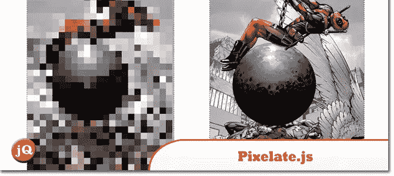
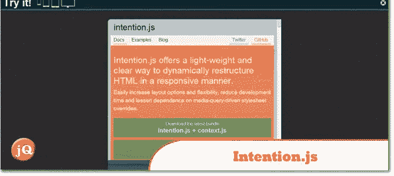
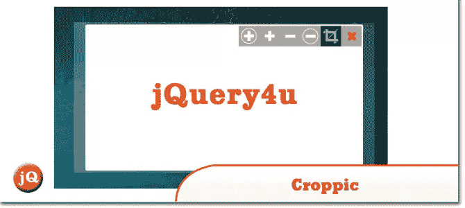
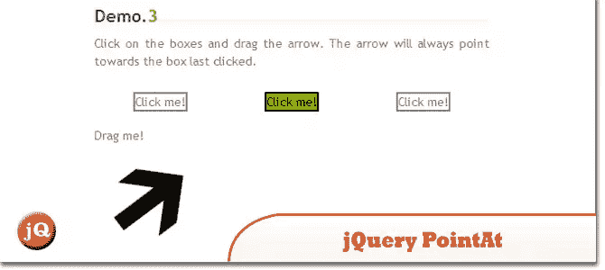
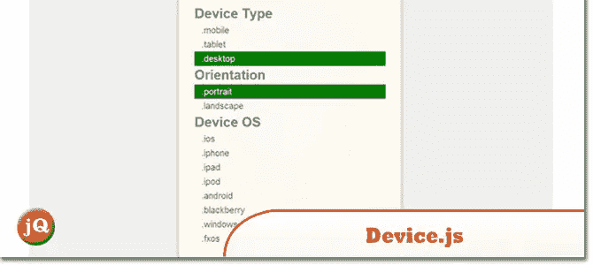
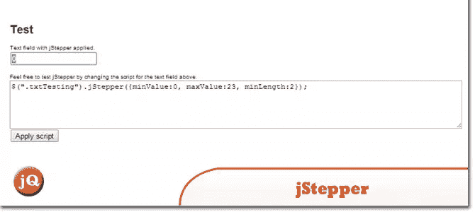

# 10 个随机 jQuery 插件

> 原文：<https://www.sitepoint.com/10-random-jquery-plugins-7/>

在这篇文章中，每周有 10 个随机的 jQuery 插件，你可能会发现它们非常有用。看看他们！:)

## 1.pixelate.js

jQuery 插件，用于像素化图像，并且可以选择在悬停时显示。

 
[来源](https://github.com/43081j/pixelate.js) [演示](http://43081j.github.io/pixelate/)

## 2.认真点. js

一个基于节点的实时视频效果合成器，使用 HTML5、Javascript 和 WebGL 构建。

 
[源+演示](http://seriouslyjs.org/)

## 3.IOs 脚本

高级桌面和移动 jQuery 插件

 
[源+演示](https://iosscripts.com/)

## 4.intention.js

提供了一种轻量级的、清晰的方法，以响应性的方式动态地重构 HTML。

 
[源+演示](http://intentionjs.com/)

## 5.克罗皮奇

是一个图像裁剪 jquery 插件，将满足您的需求和更多。

 
[源+演示](http://www.croppic.net/)

## 6.jQuery(即时查询)。瞄准点

一个简单的 jQuery 插件。

 
[源+演示](http://pointat.idenations.com/demo)

## 7.device.js

基于设备操作系统(iOS、Android、Blackberry、Windows、Firefox OS、MeeGo)、方向(纵向与横向)和类型(平板电脑与移动设备)，轻松编写条件 CSS _ 和/或 _ JavaScript

 
[来源](https://github.com/matthewhudson/device.js) [演示](http://matthewhudson.me/projects/device.js/)

## 8.textillate.js

结合了一些很棒的库，提供了一个易于使用的插件，可以将 CSS3 动画应用于任何文本。

 
[源+演示](http://jschr.github.io/textillate/)

## 9.jStepper

一个由 EmKay 开发的 jQuery 插件，可以让一个数字文本字段的值容易地增加或减少。

 
[源+演示](http://jstepper.emkay.dk/)

## 10.滚开，js

一个 Javascript 库，允许你创建一个贴纸效果。

 
[来源](https://github.com/cmiscm/stickerjs) [演示](http://stickerjs.cmiscm.com/)

## 分享这篇文章