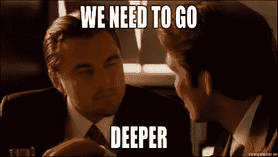

# 我当前的 CSS 和 Sass 样式指南

> 原文：<https://www.sitepoint.com/css-sass-styleguide/>

找到一种方法来编写一致的、经得起未来考验的、健壮的 CSS 从来都不容易。我花了几个月，如果不是几年，想出一个干净的方式来写我的。事实上，我的过程仍在发展，我希望它能有更大的变化。

与此同时，我已经积累了足够的知识来写一篇关于我写 CSS 的感受的文章。我并不认为这些建议适用于所有人，它们当然也不完美。但是我认为把这些放到一篇文章中与社区分享会很好。

## 命名规格

命名约定是团队的决定。如果你像我一样，独自处理你的 CSS，你可以疯狂地使用适合你的东西。就我个人而言，我赞同尼古拉斯·加拉格尔的方法论，这种方法论受到著名的 T2 Yandex 边界元系统的影响。

**BEM** 代表*块元素修饰符*，这是一种聪明而简洁的命名 CSS 类的方法。是的，我说的是*类*，不是*id*。我在我的 CSS 中不使用任何 id，你也不应该使用。任何。id 是多余的，会导致特殊性问题。当然，对于 JavaScript 钩子和 HTML 锚，id 还是很有用的。

BEM 语法背后的要点是直接在选择器中提供上下文，以使项目的任何新手都能容易地理解它们。

这是边界元法的一个非常基本的例子:

```
.block { }
.block--modifier { }
.block__element { }
.block__element--modifier { }
```

是的，双破折号，双下划线。我们一会儿就知道为什么了。

本怎么样了？看起来又长又丑。是的，它是！但它又长又丑的事实实际上是它高效的原因。

主要思想很简单:当你构建一个组件时，你给它一个名字。组件的子元素将被命名为`.{{ name of component }}__{{ name of child-element }}`。当一个元素被稍微修改时，它将被命名为`.{{ name of component }}--{{ name of modifier }}`。当然，子元素也可以被修改。

那么双破折号和下划线是怎么回事呢？嗯，这些允许连字符的名字，如`.my-component`。然后你就可以毫无问题的读`.my-component--disabled`了。双下划线也是如此。别担心，你很快就会习惯的。

因为没有什么比一个好的例子更好的了，这里是我使用 BEM 命名系统(你可以在 CodePen 上找到[)编写的一个分步向导模块:](http://codepen.io/HugoGiraudel/pen/scluw)

```
.steps { }
.steps__item { }
.steps__item--first { }
.steps__item--last { }
.steps__item--active { }
.steps__item--done { }
.steps__link { }
```

如您所见，我们处理 3 种不同的元素:

*   哪个是模块包装器
*   `.steps__item`哪个是模块的主要元素，因为它至少有 4 个修改状态
*   `.steps__link`，模块中的另一个元素

这可能看起来有点冗长，但我可以向你保证，一旦你习惯了，这是一种真正的乐趣。它描述性很强，不容易出错和混淆。

## 命名变量

关于如何命名 Sass 变量，尤其是那些涉及颜色的变量，一直存在着争论。我们应该按照变量所代表的颜色来命名变量，还是应该按照它们在项目中的用途来命名？基本上，你更愿意和哪一个打交道？

```
$blue: #4183c4;
// Or
$primary-color: #4183c4;
```

这真是见仁见智了。我两个都去。

```
$blue: #4183c4;
$primary-color: $blue;
```

这样我就可以有一堆很酷的变量，比如`$blue-like-the-sky`、`$red-like-blood`和`$sexy-pink`，它们比十六进制的颜色**和**更有意义，可以在整个项目中决定哪种颜色应该用在哪里(这里是原色，那里是次色，等等)。

*注意:连字符(`-`)和下划线(`_`)在 Sass 中被以同样的方式处理，所以`$blue-like-the-sky`和`$blue_like_the_sky`都是指同一个变量。*

## 命名断点

如果你还没有命名你的媒体查询，你**真的**应该这样做。当不得不更新断点或读取一些高度依赖于屏幕分辨率的代码时，这将产生巨大的差异。命名断点就像使用这个简单的 mixin 一样简单:

```
@mixin breakpoint($name) {
  @if $name == "small" {
    @media (max-width: 767px) {
      @content;
    }
  }
  @else if $name == "medium" {
    @media (max-width: 1024px) {
      @content;
    }
  }
  @else if $name == "large" {
    @media (min-width: 1025px) {
      @content;
    }
  }
}
```

我习惯选择一个简单的命名系统，比如:`small`、`medium`和`large`，如果需要的话，还可以加上`tiny`或`huge`。这样做的主要好处是非常容易阅读，并且与设备无关，而像`phone`、`tablet`和`desktop`这样的东西就不一样了，因为我们有超大的手机、平板电脑和非常小的电脑屏幕，所以它们不再有什么意义了。

但是！如果你想找点乐子，而且你的团队也同意的话，你可以想些更好玩的。我在自己的网站上仍然使用克里斯·科伊尔的`baby-bear`、`mama-bear`和`papa-bear`、T6，但为什么不使用类似`r2d2`、`c3p0`和`chewbacca`的东西呢？像这样更酷的例子可以在克里斯的文章中找到。

## 制表符与空格

这是一个会导致核战争的话题，所以我会告诉你我对这种情况的看法——你可以自由地想别的。我以前只使用制表符，但我最终切换到空格。**两个空格**。

我不确定这有很多原因，除了我觉得这最适合我。它有它的优点和缺点。在优点中，由于额外的嵌套，它避免了从屏幕中间开始的线条。

另外，基本编辑器不能很好地处理标签。以`textarea`元素为例。它们允许您插入空格，但不允许您插入制表符(除非您从其他地方复制并粘贴，这并不理想)。到处都支持空格。因此我选择前者。

## CSS 规则集

我喜欢干净的东西。我所有的 CSS 规则集都是以同样的方式编写的，并且遵循严格的(标准的)惯例。这里有一个例子:

```
.selector,
.other-selector {
  color: black;
  padding: .5em;
  font-size: 1.2em;
}
```

嗯，这只不过是最基本的，包括:

*   每行一个选择器
*   左花括号前的一个空格
*   左花括号后的换行符
*   一致的缩进
*   冒号前没有空格
*   冒号后的空格
*   分号前没有空格
*   分号后的换行符
*   右花括号前没有空格
*   右花括号后的一个换行符和一个空行

一些旁注:

*   我倾向于在处理`0`和`1`之间的小数时去掉填充`0`，使数字以`.`开头；
*   我尽量让颜色尽量短，按照这个顺序:关键字>小六边形三连音>六边形三连音>`rgb` / `hsl` > `rgba` / `hsla`，
*   我不惜一切代价避免[幻数](http://css-tricks.com/magic-numbers-in-css/)(不圆或者本身没有意义的数字)，
*   我不使用任何`px`值(只有`em`或者甚至`rem`，如果浏览器支持允许的话)，除非它是一个值(`1px`)；像素是不可缩放的，这太糟糕了。

## 胡说八道

我刚刚浏览的是相当标准的 CSS 指南。现在来看一些萨斯特有的东西。

```
.element {
  $scoped-variable: whatever;
  @extend .other-element;
  @include mixin($argument);
  property: value;

  &:pseudo {
    /* styles here */
  }

  .nested {
    /* styles here */
  }

  @include breakpoint($size) {
    /* styles here */
  }
}
```

Sass 规则集中的不同项目按以下顺序排列:

1.  范围变量
2.  带`@extend`的选择器扩展
3.  混合包含与`@include`除了媒体查询的东西
4.  常规`property: value`对
5.  空行后带有`&`的伪类/元素嵌套
6.  空行后嵌套的常规选择器
7.  媒体查询材料(有或没有混音)

以我们之前的分步向导示例为例，下面是按上述顺序排列的真实示例:

```
.step__item {
  counter-increment: steps; /* 1 */
  background: $step-background-color;
  float: left;
  padding: $step-baseline 0;
  position: relative;
  border-top: $step-border;
  border-bottom: $step-border;
  white-space: nowrap;

  &:after {
    @include size($step-arrow-size);
    @include absolute(top .3em left 100%);
    @include transform(rotate(45deg));
    content: '';
    z-index: 2;
    background: inherit; 
    border-right: $step-border;
    border-top: $step-border;
    margin-left: -$step-arrow-size/2;
  }

  &[disabled] {
    cursor: not-allowed;
  }

  @media (max-width: 767px) {
    width: 100% !important;
    border-left: $step-border;
    border-right: $step-border;
    padding: $step-baseline*2 0;

    &:after {
      content: none;
    }
  }
}
```

## 在萨斯筑巢

嵌套肯定是 Sass 或任何其他 CSS 预处理程序最有争议的特性之一。嵌套既有用——避免一次又一次地重复同一个选择器——又危险，因为它会产生[意想不到的 CSS](http://pastebin.com/Jy9PqFTy) 。只有当它是你的意思时才使用嵌套，而不仅仅是因为它方便。如果你的意思是，`.a .b`，那么你可以写`.a { .b { } }`。如果`.b`刚好在`.a`里面，但是自己就够了，就不要嵌套了。



我打赌你已经看过电影《盗梦空间》。很棒的电影，对吧？嗯，你知道这些角色不能比梦中的梦中梦更深入，否则他们会被打入冷宫？Sass 嵌套也是一样的:嵌套不要超过 3 层。永远不会。如果你不得不这么做，这意味着要么你的标记要么你的 CSS 写得很差。无论哪种方式，你可能会在“地狱边缘”结束，正如我们在电影中看到的，那里并不漂亮。

> "嵌套深度不要超过 3 层."
> ——[科布](http://www.imdb.com/character/ch0162705/)

## 评论

当您使用 Sass 时，您有两种不同的方式来编写您的注释:您都非常了解的好的 ol' `/* */`和在普通 CSS 中不存在的单行注释`//`([尽管您可以绕过那个](http://www.xanthir.com/b4U10))。这两者的区别在于，单行注释永远不会在结果样式表中编译。这就是单行注释被称为“透明注释”或“不可见注释”的原因。同时，如果你不是在`compressed`模式下编译(你应该是)，常规的 CSS 注释会在编译后的 CSS 中。

就我而言，我评论*很多*。CSS 是一种充满技巧、黑客和肮脏小秘密的语言。我觉得如果我想让别人(甚至是我)在几个月后理解代码，甚至是在编写代码时看起来显而易见的事情，我需要进行注释。

```
/**
 * Purpose of the selector or the rule set
 * 1\. Hardware acceleration hack (http://davidwalsh.name/translate3d)
 * 2\. Fallback for unsupported rgba
 */
.selector {
  @include transform(translate3d(0, 0, 0)); /* 1 */
  background: black; /* 2 */
  background: rgba(0, 0, 0, .5);
}
```

我从规则集的一个小描述开始，然后我数出值得解释的小细节。然后将这些数字与 CSS 规则末尾的带编号的注释进行匹配(例如`/* 1 */`)。

最后，我不怎么使用单行注释，除了在 Compass 扩展中(例如 [SassyJSON](https://github.com/HugoGiraudel/SassyJSON/blob/master/stylesheets/decode/types/_string.scss) )。当我意识到来自我的第一个 Compass 扩展 [SassyLists](http://sassylists.com) 的常规 CSS 注释被转储到 [Sassmeister](http://sassmeister.com/) 上的 CSS 输出时，我开始这么做。

## 带注释的准合格选择器

我相信使用注释来避免限定选择器[的想法来自哈利·罗伯茨](http://csswizardry.com/2012/07/quasi-qualified-css-selectors/)。

出于哈利帖子中描述的许多原因，合格的选择器是不好的。最重要的是:它们被不必要地过度指定，它们破坏了级联，并且它们不可重用。

也就是说，能够说*“这个类应该只应用于这种类型的元素”*可能是有用的。比方说，在某个时候，您使用 CSS 转换并为不受支持的浏览器创建一个后备，使用 Modernizr 来检测支持。下面是您的代码可能的样子:

```
.no-csstransforms .selector {
  /* Styles here */
}
```

现在，如果您想明确指出`no-csstransforms`类应该在`html`元素上，而不是在其他任何地方，该怎么办呢？做`html.no-csstransforms`会让你的选择器过分合格，这不是一个好主意。您可以使用规则集上方的常规注释来做笔记，就像我们在上一节中看到的那样。或者您可以尝试准合格的选择器:

```
/*html*/.no-csstransforms .selector {
  /* styles here */
}
```

这就对了:这个类现在被明确地绑定到 html 元素上，而不需要改变选择器或者破坏任何东西。这种技术一开始可能看起来很奇怪，但是你可以很快习惯它。

## 最后的想法

如前所述，使用所有这些规则你可能会感到不舒服。我也不指望你会。重要的是，您和您的团队能够阅读彼此的代码，并轻松地更新代码。

也许这篇文章中你能做的最好的事情就是采纳这些建议，把它们变成你自己的，加入你自己的味道来改进你自己的工作流程。

如果你已经为 Sass 和 CSS 的任何领域开发了自己的方法，我们很乐意在评论中听到它们。

## 分享这篇文章