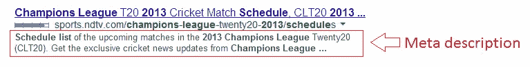
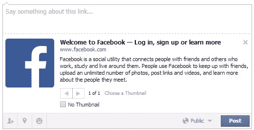

# 在 HTML 中使用 Meta 标签:一些基础知识和最佳实践

> 原文：<https://www.sitepoint.com/meta-tags-html-basics-best-practices/>

元数据通常被称为“关于数据的数据”，它在网页上的一种表现方式是通过 [`<meta>`标签](http://www.whatwg.org/specs/web-apps/current-work/multipage/semantics.html#the-meta-element)。`meta`标签的内容通常描述了关于 HTML 页面的信息，这些信息通常不能由任何其他 HTML 标签来表示。除此之外，`meta`标签还可以用来模拟 HTTP 响应头(就像重定向到不同的页面)，它有像`http-equiv`和`charset`这样的属性，其细节已经在 [Mozilla 开发者网络](https://developer.mozilla.org/en-US/docs/Web/HTML/Element/meta)上描述得很清楚了。

## 为什么元标签很重要？

在过去，元标签被搜索引擎用来根据标题、描述甚至关键字来索引网页。在一个完美的世界中，如果每个人都公平地使用它们，这将是一个福音。然而，某些网站开始过度使用它们，塞满流行的关键字，希望得到更好的搜索结果。谷歌认识到了这一点，于 2009 年宣布，他们不会在搜索算法中使用元关键词或描述来进行排名。

尽管描述元标签对搜索引擎排名没有影响，但它们确实会出现在搜索结果中。这意味着在点击你的链接之前，一个人可以在搜索结果页面上阅读你的描述，这表明元描述应该写给人们阅读，而不是让机器人找到。因此，虽然一个好的元描述不会提高你的排名，但它会增加搜索页面对你网站的点击率。



另一个需要注意的重要事情是，并不是所有的搜索流量都来自谷歌、必应和雅虎。想想那些[赋予元标签](http://www.codethat.co.uk/blog/search/baidu-seo-guide)权重的其他网站(比如[百度](http://www.baidu.com/)),它们占据了每天数百万的搜索量。

## 不同元标签的用法

通过将[的`name`属性](http://www.whatwg.org/specs/web-apps/current-work/multipage/semantics.html#standard-metadata-names)更改为有效值来定义不同的元标签。

最常用的 meta 标签是用于**描述**的标签:

```
<meta name="description" 
      content="A general guide on the use of meta tags in html pages">
```

在描述为空(或不存在)的情况下，搜索引擎将从页面内容中生成一个描述。

您还可以使用 meta 标签来设置页面的作者。

```
<meta name="author" content="Shaumik Daityari">
```

`charset`属性用于指定内容的字符编码。一个 HTML 页面只能有一个字符集。对于大多数网页，您应该使用 UTF-8 字符编码。

```
<meta charset="UTF-8">
```

关于字符编码和选择字符编码的更多信息可以在 W3C 上找到。

## 替换 HTTP 头

如前所述，meta 标记可用于执行 HTTP 头的任务，如重定向和刷新。

```
<meta http-equiv="refresh" content="5;url=https://www.sitepoint.com/">
```

`content`属性的值是指执行刷新之前的时间间隔(以秒为单位)。URL 可能保持不变，也可能不同，这取决于您是希望刷新页面还是重定向到新页面。您也可以将 url 留空来刷新当前页面。

## 过时的用法

标签的用法随着时间的推移已经发生了变化，多年前的一些流行做法今天不应该再遵循了。例如:

```
<!-- don't use this! -->
<meta http-equiv="Content-Type" content="text/html; charset=UTF-8" />
```

这是 XHTML 中常见的字符编码的较长版本。将它缩短到我们上面讨论的长度就足够了。

Meta 标签也被用来表示版权。

```
<!-- don't use this! -->
<meta name="copyright" content="SitePoint" />
```

这可以通过提供指向版权页面(或同一页面上的锚)的链接标签来改进。

```
<link rel="copyright" href="copyright.html">
```

最后，虽然很多网站仍然使用`name`属性的`keywords`值，但是 Google 不会在其搜索排名算法中或者在显示搜索结果时考虑这一点。事实上，谷歌在其搜索算法中从未考虑过关键词。

```
<meta name="keywords" content="web,design,html,css,html5,development">
```

[谷歌已经说过](http://googlewebmastercentral.blogspot.ca/2009/09/google-does-not-use-keywords-meta-tag.html)这种情况在未来极不可能改变，所以你不应该为关键词元标签而烦恼。

但正如前面指出的，一个重要的因素是，百度的中文搜索引擎将关键词元标签[视为其搜索算法](http://searchengineland.com/the-b2b-marketers-guide-to-baidu-seo-180658)中的一个主要因素。因此，如果你预计你的流量的很大一部分来自中文用户，那么你应该包括关键字元标签，但要始终注意不要使用不必要的和不道德的关键字填充。

说了这么多，使用这些过时的方法不会损害你的排名，但是它们经常会给你的页面添加不必要的代码，所以最好避免使用它们，使用替代方法。

## 在社交媒体中的使用(Open Graph、Twitter Cards 和 Schema.org)

随着社交网络的相关性不断增加，元标签也在不断发展。[脸书的开放图](https://developers.facebook.com/docs/opengraph/)允许你指定你的内容如何在用户的时间线上显示。这些标签可以让你使用 [Insights](https://developers.facebook.com/docs/opengraph/guides/insights) 查看你的数据在脸书上是如何被分享的。



```
<meta property="og:title" content="The best site">
<meta property="og:image" content="link_to_image">
<meta property="og:description" content="description goes here">
```

为了进一步阅读，我建议你浏览一下[脸书的开放图文档](https://developers.facebook.com/docs/opengraph)。

与 Open Graph 类似，Twitter 有 [Twitter 卡](https://dev.twitter.com/docs/cards)(使用`name="twitter:title"`或`name="twitter:url"`)，Google+使用[Schema.org](http://schema.org/)(使用`itemscope`和`itemprop`)。

开放图已经变得非常流行，所以如果没有其他元标签，大多数社交网络默认为开放图。如果开放图元标签也不存在，它们将为不存在的元标签采用默认值。

## 元数据工具

元数据工具不需要对 HTML 或其他 web 技术有很深的了解，所以如果你不想弄脏自己的手，你还是有出路的。

如果你使用 WordPress，在创建或编辑帖子时，你有很多选择来生成元数据，其中最受欢迎的是 Yoast 的 [WordPress SEO。](http://wordpress.org/plugins/wordpress-seo/) [Joomla](http://extensions.joomla.org/extensions/site-management/seo-a-metadata/meta-data) 和 [Drupal](https://drupal.org/project/project_module?text=meta) 也有一套 meta 相关的插件和模块。如果你不使用其中的任何一个，总是可以选择使用一个[在线元标签生成器](http://www.scrubtheweb.com/abs/builder.html)。

## 结论

Meta 标签不会解决你所有的 SEO 和可访问性问题，但是它们在这些领域确实扮演着重要的角色。如果你是一个网站的所有者，你可以通过在[谷歌网站管理员工具](http://www.google.com/webmasters/tools/)上注册来监控你的网站性能。注册后，如果出现任何可能与错误使用 meta 标签有关的爬网错误，您会收到通知。

## 分享这篇文章