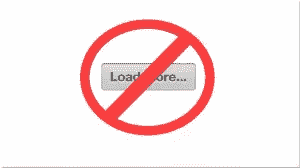

# 实际上，使用 Rails 进行无限滚动

> 原文：<https://www.sitepoint.com/infinite-scrolling-rails-practice/>



在本文的前身中，我们建立了一个非常简单的博客，里面有演示文章，并实现了无限滚动，而不是简单的分页。我们使用了`will_paginate`和一些 javascript 来完成这个任务。

工作演示可以在 [Heroku](http://sitepoint-infinite-scrolling.herokuapp.com) 上找到。

源代码可以在 [GitHub](https://github.com/bodrovis/SitePoint-InfiniteScroll) 上找到。

今天，让我们实现一个“加载更多”按钮，而不是无限滚动。例如，当页脚中有一些链接，无限滚动会导致它“跑掉”直到所有记录都被加载时，这个解决方案可能会派上用场。

为了演示如何做到这一点，对`PostsController`进行以下更改:

*posts_controller.rb*

```
def index
    get_and_show_posts
end

def index_with_button
    get_and_show_posts
end

private

def get_and_show_posts
    @posts = Post.paginate(page: params[:page], per_page: 15).order('created_at DESC')
    respond_to do |format|
        format.html
        format.js
    end
end
```

并添加一条路线:

*config/routes.rb*

```
get '/posts_with_button', to: 'posts#index_with_button', as: 'posts_with_button'
```

现在有两个独立的页面演示两个概念。

*index _ with _ button . html . erb*

```
<div class="page-header">
    <h1>My posts</h1>
</div>

<div id="my-posts">
    <%= render @posts %>
</div>

<div id="with-button">
    <%= will_paginate %>
</div>

<% if @posts.next_page %>
    <div id="load_more_posts" class="btn btn-primary btn-lg">More posts</div>
<% end %>
```

在很大程度上，观点是相同的。我只更改了分页包装器的标识符(我们稍后将使用它来编写适当的条件)并添加了一个`#load_more_posts`块，它将在 Bootstrap 类的帮助下显示为一个按钮。我们希望这个按钮只在有更多页面可用时才显示。想象一下博客中只有一篇文章的情况——为什么我们需要呈现“加载更多”按钮？

这个按钮最初应该是不可见的——我们将使用 javascript 显示它。这样，如果 JS 被禁用，就可以返回到默认行为:

*application.css.scss*

```
#load_more_posts {
    display: none;
    margin-bottom: 10px; /* Some margin to separate it from the footer */
}
```

是时候修改客户端代码了:

*pagination.js.coffee*

```
if $('#with-button').size() > 0
    $('.pagination').hide()
    loading_posts = false

    $('#load_more_posts').show().click ->
      unless loading_posts
        loading_posts = true
        more_posts_url = $('.pagination .next_page a').attr('href')
        $this = $(this)
        $this.html('').addClass('disabled')
        $.getScript more_posts_url, ->
          $this.text('More posts').removeClass('disabled') if $this
          loading_posts = false
      return
```

这里我们隐藏了分页块，显示了“Load more”按钮，并绑定了一个`click`事件处理程序。此外，`loading_posts`标志用于防止用户多次点击按钮时发送多个请求。

在事件处理程序中，我们使用和以前一样的概念:获取下一个页面 URL，添加一个“正在加载”的图像，禁用按钮，并向服务器提交 AJAX 请求。我们还添加了一个回调函数，在收到响应时触发。这个回调将按钮恢复到原始状态，并将标志设置为`false`。

现在的观点是:

*index_with_button.js.erb*

```
$('#my-posts').append('<%= j render @posts %>');
<% if @posts.next_page %>
    $('.pagination').replaceWith('<%= j will_paginate @posts %>');
    $('.pagination').hide();
<% else %>
    $('.pagination, #load_more_posts').remove();
<% end %>
```

同样，我们在页面上添加了新的帖子。如果有更多的文章，则呈现一个新的分页，然后隐藏。否则，分页按钮将被删除。

## 链接到特定页面

现在您知道如何创建无限滚动或“加载更多”按钮，而不是经典的分页。你可能应该考虑的一件事是，用户如何共享一个特定页面的链接？现在，没有办法做到这一点，因为当我们加载新页面时，我们不改变 URL。

让我们尝试通过使用 javascript 更改 URL 中的`search`部分(以`?`符号开始的部分)来实现这一点:

```
window.location.search = 'page' + page_number
```

不幸的是，这会立即重新加载页面，这不是我们想要的。在我们的第二次尝试中，改为改变`hash`部分(以`#`符号开始的部分)。事实上，这很有效。页面
没有被重新加载。然而，还有第三种更优雅的解决方案——历史 API 。有了这个 API，我们可以直接操纵浏览器的历史。

在这个特殊的例子中，我们想使用`pushState`方法向历史中添加一些条目。

首先，让我们下载本杰明·亚瑟·勒普顿的 [History.js](https://github.com/browserstate/history.js) 库，它为 HTML 5 历史/状态 API 提供跨浏览器支持。对于 jQuery，您可能希望使用位于`scripts/bundled/html4+html5/jquery.history.js`下的脚本。

现在，让我们编写一个简单的函数，它将在`$.getScript`完成加载资源后触发:

*pagination.js.coffee*

```
page_regexp = /\d+$/

pushPage = (page) ->
    History.pushState null, "InfiniteScrolling | Page " + page, "?page=" + page
    return

$.getScript more_posts_url, ->
    # ...
    pushPage(more_posts_url.match(page_regexp)[0])
```

不要忘记`more_posts_url`包含一个到下一页的链接，在那里获取页码。在`pushPage`函数中，我们使用 History.js 来操作浏览器的历史记录，并基本上更改 URL(使用最后一个参数)。第二个参数改变窗口的标题。第一个参数(`null`)可以用来存储一些附加数据，如果需要的话。请注意，修改 URL 后，用户可以单击浏览器中的“后退”按钮导航到上一页。相当酷。

最后要担心的是遗留浏览器:更确切地说是 IE 9 和更低版本，它们不支持历史 API。在这些古老的东西中，产生的 URL 将是这样的:`http://example.com#http://example.com?page=2`而不是`http://example.com?page=2`。所以，我们必须增加对这个案例的支持。

*pagination.js.coffee*

```
[...]

hash = window.location.hash
  if hash.match(/page=\d+/i)
    window.location.hash = '' # Otherwise the hash will remain after the page reload
    window.location.search = '?page=' + hash.match(/page=(\d+)/i)[1]

[...]
```

这段代码在页面加载时运行。这里，我们扫描`page=`的 url 散列。如果找到了，URL 的`search`部分会用相应的页码进行更新，然后页面会被重新加载。

稍微修改一下视图是个好主意，这样只有下一页可用时才显示分页(就像我们对“加载更多”按钮所做的那样)。否则，当用户输入 URL 直接转到最后一页时，仍将显示分页，javascript 事件处理程序仍将被绑定。

*index.html.erb*

```
<% if @posts.next_page %>
    <div id="infinite-scrolling">
        <%= will_paginate %>
    </div>
<% end %>
```

然而，这种解决方案导致了一个问题，即用户不能加载以前的帖子。您可以实现一个更复杂的解决方案，使用“加载上一页”按钮，或者只显示一个“转到第一页”链接。

另一种方法是将显示在页面顶部的基本分页与无限滚动结合起来。这解决了另一个问题:如果我们的访问者想看到最后一页，比如说第 31 页，该怎么办？上下滚动(或者点击“加载更多”按钮 30 次)会非常烦人。我们应该提供一种跳转到所需页面的方法，或者实现一些过滤器(按日期、类别、查看次数等)。

## 分页和无限滚动

让我们实现“组合”解决方案，将无限滚动和基本分页结合起来。在禁用 javascript 的情况下也可以，我们的用户只会在两个地方看到分页，这还不错。

首先，向视图添加另一个分页块(在下一节中，我们将使用`static-pagination`包装器):

*index.html.erb* 和*index _ with _ button . html . erb*

```
<div class="page-header">
    <h1>My posts</h1>
</div>

<div id="static-pagination">
    <%= will_paginate %>
</div>

[...]
```

之后，我们必须稍微修改脚本，以便只引用一个分页块(我在修改的行附近放置了注释):

*pagination.js.coffee*

```
[...]

if $('#infinite-scrolling').size() > 0
    $(window).bindWithDelay 'scroll', ->
      more_posts_url = $('#infinite-scrolling .next_page a').attr('href') # <--------
      if more_posts_url && $(window).scrollTop() > $(document).height() - $(window).height() - 60
        $('#infinite-scrolling .pagination').html( # <--------
          '') # <--------
        $.getScript more_posts_url, ->
          window.location.hash = more_posts_url.match(page_regexp)[0]
      return
    , 100

  if $('#with-button').size() > 0
    # Replace pagination
    $('#with-button .pagination').hide() # <--------
    loading_posts = false

    $('#load_more_posts').show().click ->
      unless loading_posts
        loading_posts = true
        more_posts_url = $('#with-button .next_page a').attr('href') # <--------
        if more_posts_url
          $this = $(this)
          $this.html('').addClass('disabled')
          $.getScript more_posts_url, ->
            $this.text('More posts').removeClass('disabled') if $this
            window.location.hash = more_posts_url.match(page_regexp)[0]
            loading_posts = false
      return

[...]
```

*index.js.erb*

```
$('#my-posts').append('<%= j render @posts %>');
$('.pagination').replaceWith('<%= j will_paginate @posts %>');
<% unless @posts.next_page %>
    $(window).unbind('scroll');
    $('#infinite-scrolling .pagination').remove(); // <--------
<% end %>
```

在`index.js.erb`内部，我们不修改第二行，因为我们希望在两个地方都更新分页。

*index_with_button.js.erb*

```
$('#my-posts').append('<%= j render @posts %>');
$('.pagination').replaceWith('<%= j will_paginate @posts %>');
<% if @posts.next_page %>
    $('#with-button .pagination').hide(); // <--------
<% else %>
    $('#with-button .pagination, #load_more_posts').remove(); // <--------
<% end %>
```

同样的概念也适用于此。另外，请注意，在这两种情况下，我都将`replaceWith`移出了条件语句。此时，我们希望每次打开下一页时都重写我们的分页。如果我们在用户打开最后一页时不进行这种更改，顶部的分页将不会被替换，只有底部的分页会被删除。

## 窥探滚动！

我们已经到了最后，也可能是最棘手的部分。此时，当用户向下滚动并加载更多帖子时，我们更新 URL 并突出显示当前页面。然而，如果我们的用户决定向后滚动(到顶部)呢？当然，无论是 URL 还是分页都不会更新，这可能会相当混乱！

这可以通过实现滚动间谍来解决。我们的计划如下:在不同页面的文章之间添加分隔符(这些分隔符将包含页码)，并在用户滚动这些分隔符时引发一个事件。在事件内部，检查他当前正在查看哪个页面，并相应地更新 URL 和分页。

让我们从分隔符开始。

*index.html.erb 和 index_with_button.html.erb*

```
[...]

<div id="my-posts">
  <div class="page-delimiter first-page" data-page="<%= params[:page] || 1 %>"></div>
  <%= render @posts %>
</div>

[...]
```

这里的`data-page`包含实际的页码。我们要么从 GET 参数中获取它，要么在没有提供页码的情况下设置为 1。注意我们很快就会用到的`first-page`类。

我们还必须更新脚本。

*index.js.erb 和 index_with_button.js.erb*

```
var delimiter = $('<div class="page-delimiter" data-page="<%= params[:page] %>"></div>');
$('#my-posts').append(delimiter);
$('#my-posts').append('<%= j render @posts %>');

[...]
```

现在这些分隔符对用户来说是不可见的。

最后，实现实际的卷轴侦察。为此，我们可以使用 Caleb Troughton 创建的 jQuery 的[航路点](https://github.com/imakewebthings/jquery-waypoints)库。还有其他一些库提供了类似的功能，但是这个库允许跟踪用户是向上还是向下滚动，这在我们的例子中会很方便。

下面的函数将一个事件处理程序附加到分隔符上，每当用户滚动到该分隔符时，该事件处理程序就会触发。不幸的是，由于我们的定界符是动态添加的，我们将不得不把这个事件分别附加到每个事件上，否则路点将不起作用。

*pagination.js.coffee*

```
jQuery ->
  page_regexp = /\d+$/

  window.preparePagination = (el) ->
    el.waypoint (direction) ->
      $this = $(this)
      unless $this.hasClass('first-page') && direction is 'up'
        page = parseInt($this.data('page'), 10)
        page -= 1 if direction is 'up'
        page_el = $($('#static-pagination li').get(page))
        unless page_el.hasClass('active')
          $('#static-pagination .active').removeClass('active')
          pushPage(page)
          page_el.addClass('active')

    return

  [...]
```

这里，代码检查用户没有向上滚动，也没有到达第一页。然后，它从`data-page`属性中获取页码，如果方向是向上的，就减 1。这是因为我们的分隔符放在相应页面的文章之前，所以当用户向上滚动并经过该分隔符时，他实际上离开了该页面并转到了上一页。

`#static-pagination`选择器指向具有基本分页的块。它返回带有当前页码的`li`元素，并给它分配一个`active`类(从另一个`li`中移除这个类)。注意，页面编号从 1 开始，而由`$('#static-pagination li')`返回的元素的索引从 0 开始，然而我们没有将`page`减 1。这是因为分页块中的第一个`li`总是包含“上一页”链接，所以我们跳过它。最后，我们还更改了 URL 中的散列。

还要注意的是，`preparePagination`功能是附属于`window`的。因此，我们不仅从这个文件中调用它，还从我们的`*.js.erb`视图中调用它。CoffeeScript 用自调用匿名函数将代码包装在每个文件中，以防止污染全局范围(这实际上是一件好事)。不过，在这种情况下，如果我们不将该功能附加到`window`上，那么从外面看不到它。

现在，我们可以应用它。

*pagination.js.coffee*

```
[...]

if $('#infinite-scrolling').size() > 0
    preparePagination($('.page-delimiter'))

[...]

if $('#with-button').size() > 0
    preparePagination($('.page-delimiter'))

[...]
```

*index.js.erb 和 index_with_button.js.erb*

```
var delimiter = $('<div class="page-delimiter" data-page="<%= params[:page] %>"></div>');
$('#my-posts').append(delimiter);
$('#my-posts').append('<%= j render @posts %>');
$('.pagination').replaceWith('<%= j will_paginate @posts %>');
preparePagination(delimiter);

[...]
```

最后要做的重要事情是从`index.js.erb`中删除`$(window).unbind('scroll');`，因为 Waypoints 依赖于这个事件，我们应该一直监听它。

您可能还希望为基本分页分配一个固定的位置，以便用户可以检查当前页面。让我们应用一些非常简单的样式:

```
#static-pagination {
  position: fixed;
  top: 30px;
  opacity: 0.7;
  &:hover {
    opacity: 1;
  }
}
```

现在分页块将总是显示在顶部，并且是半透明的。当用户悬停这个元素时，
它的不透明度将被设置为 1。

## 结论

这就把我们带到了本文的结尾。我希望你在阅读的时候发现了一些有用的提示。给出的解决方案并不理想，但应该让您了解如何完成这项任务。请分享你对这篇文章的想法，以及你解决在你的网站上加载以前的帖子的问题的任何方法。

## 分享这篇文章