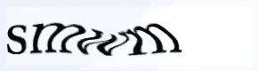
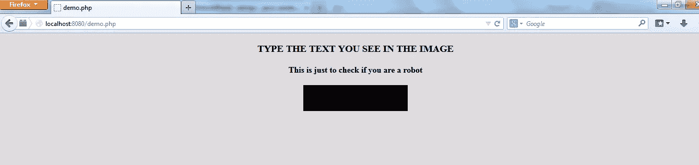
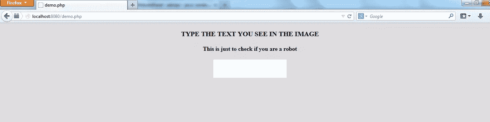
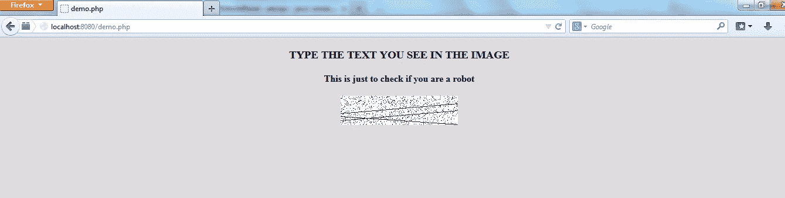
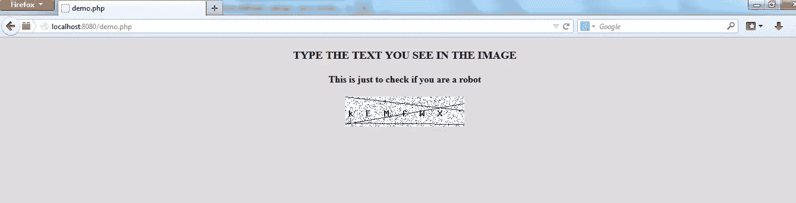
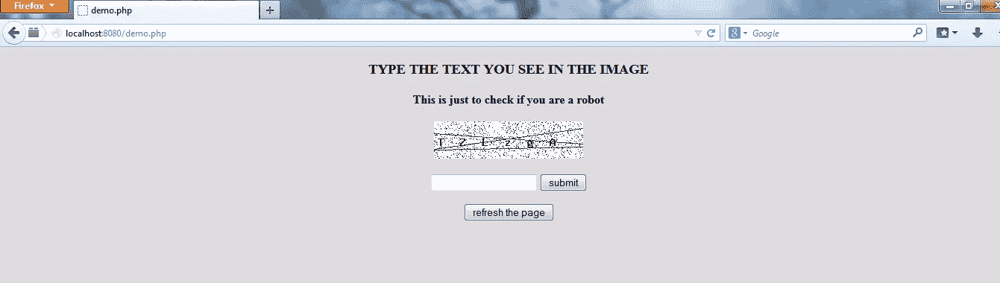
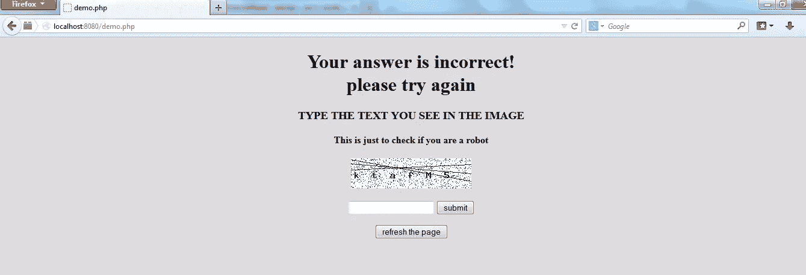
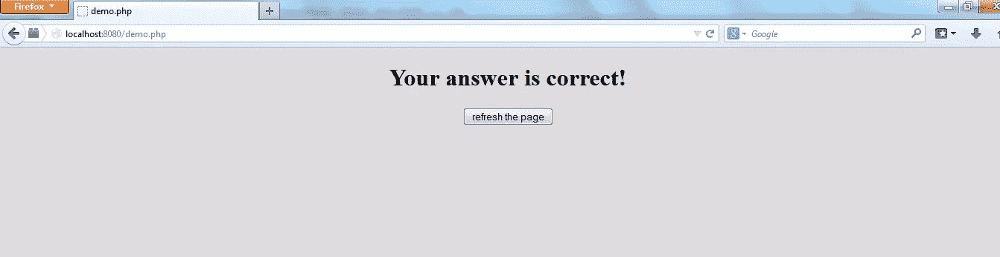

# 简单的验证码与 PHP 和 GD

> 原文：<https://www.sitepoint.com/simple-captchas-php-gd/>



到目前为止，我们都遇到过在线表单中的验证码图片。验证码是一种必要的邪恶，这篇文章将教你它们是如何制作的。

请注意，虽然有更好的自动第三方验证码解决方案，如 ReCaptcha，但本教程的目的只是解释和演示这种技术实际上是如何工作的。我们不会解释验证码实际上是什么，因为它被认为是常识，并且已经在其他地方更详细地介绍了[。](http://en.wikipedia.org/wiki/CAPTCHA)

## 绘制验证码

在继续之前，您必须安装 GD(图形绘制)库。这个库支持通过内置的 PHP 函数绘制图形和图像。要安装它，运行`sudo apt-get install php5-gd`，或者如果在非基于 Ubuntu 的操作系统上，按照[的说明](http://www.php.net/manual/en/image.installation.php)进行操作。

验证码通常由三部分组成——**形状、变形和文本**。
我们将遵循下面提到的步骤:

1.  在浏览器上显示空图像。
2.  创建一个形状。
3.  生成随机线条。
4.  生成随机点。
5.  生成随机文本。

本文中使用的过程化风格仅仅是因为这是一个概念验证，并尽可能保持最终文件的简单。在一个真实的项目中，你会去 OOP。

### 显示空图像

HTML 会将该图像视为使用“img”标签显示的外部图像。使用了两个功能-一个用于创建图像，另一个用于显示。

```
<?php
session_start();
?>

    <title>demo.php</title>
    <body style="background-color:#ddd; ">

    <?php
    create_image();
    display();
    /***** definition of functions *****/
    function display()
    {
        ?>

        <div style="text-align:center;">
            <h3>TYPE THE TEXT YOU SEE IN THE IMAGE</h3>
            <b>This is just to check if you are a robot</b>

            <div style="display:block;margin-bottom:20px;margin-top:20px;">
                
            </div>
            //div1 ends
        </div>                          //div2 ends

    <?php
    }

    function  create_image()
    {
        $image = imagecreatetruecolor(200, 50);
        imagepng($image, "image.png");
    }

    ?>
    </body>
<?php
?>
```

第一行表示我们页面上用户会话的开始。

**display()** 函数除了在浏览器中显示图像的普通 HTML 代码之外别无它物。除此之外，只对输出进行了样式化处理，以使其看起来更像样。

在`create_image()`函数中，一个变量用于引用由`imagecreatetruecolor()`函数返回的图像，该函数将图像的宽度和长度作为其参数。`imagepng()`创建指定名称和路径的 png 图像(在同一个目录下)。

在我们的第一步之后，将会输出一个黑色的图像。



请注意，函数`imagepng()`将是我们函数的最后一行，所有后续步骤将仅在此函数调用之前插入到`create_image()`函数中，否则它们不会生效。

### 创建一个形状

验证码可以选择任何形状。我们将使用函数`imagefilledrectangle()`选择一个矩形。它有五个参数——图像引用、起始 x 位置、起始 y 位置、结束 x 位置、结束 y 位置和背景颜色。您可以使用椭圆的相应函数来生成椭圆验证码。

`imagecolorallocate()`函数将颜色分配给变量，因为它将颜色的 RGB 组合作为参数。以下代码将被添加到`create()`函数中。

```
$background_color = imagecolorallocate($image, 255, 255, 255);  
imagefilledrectangle($image,0,0,200,50,$background_color);
```

经过这一步，前面的图像将变成白色。



### 生成随机线条。

现在，我们实际上开始让**变形**成为验证码的一部分。在 PHP 中，从起点(x1，y1)到终点(x2，y2)生成直线。现在，因为我们希望我们的线接触盒子的两端，我们将保持`<x1,x2>`坐标为`<0,200>`，即盒子的完整宽度。`<y1,y2>`坐标将随机生成。这将创建一个随机线。我们将通过将该功能放入 for 循环来生成多行。

```
$line_color = imagecolorallocate($image, 64,64,64); 
for($i=0;$i<10;$i++) {
    imageline($image,0,rand()%50,200,rand()%50,$line_color);
}
```

`imageline()`函数将 x1、x2、y1、y2 坐标作为参数，除了图像参考和线条颜色。线条颜色的分配就像上一步中背景颜色的分配一样。

y 坐标被给定为`rand()*%50`，因为这是我们盒子的高度，并且将总是返回一个小于 50 的值。您也可以使用`rand(0,50)`。它们将产生相同的输出范围。


### 生成随机点。

随机点将以与随机线相同的方式生成。使用的函数是`imagesetpixel()`。此函数获取点在框中放置位置的坐标值。

```
$pixel_color = imagecolorallocate($image, 0,0,255);
for($i=0;$i<1000;$i++) {
    imagesetpixel($image,rand()%200,rand()%50,$pixel_color);
} 
```

x 坐标是通过使用`rand()*%200`随机生成的，因为这是我们盒子的宽度，并且它将总是返回一个小于 200 的值。您也可以使用`rand(0,200)`。它们将产生相同的输出范围。y 坐标是在线步骤中生成的。



### 生成随机文本

我们将随机指向字符串中的一个位置(包含小写和大写字母)并将它赋给变量`$letter`

```
$letters = 'ABCDEFGHIJKLMNOPQRSTUVWXYZabcdefghijklmnopqrstuvwxyz';
$len = strlen($letters);
$letter = $letters[rand(0, $len-1)];

$text_color = imagecolorallocate($image, 0,0,0);
```

当放入一个循环时，它看起来像这样-

```
for ($i = 0; $i< 6;$i++) {
    $letter = $letters[rand(0, $len-1)];
    imagestring($image, 5,  5+($i*30), 20, $letter, $text_color);
    $word.=$letter;
}
$_SESSION['captcha_string'] = $word;
```

我们会解释这些台词

```
$word.=$letter;
$_SESSION['captcha_string'] = $word; 
```

在下一节中。

函数`imagestring()`在我们的图像中写入文本。它有 6 个参数:

1.  图片参考。
2.  文本的字体大小(最多为 5)。
3.  x 坐标(按比例改变每个字母)。
4.  y 坐标(保持不变，尽管我们也可以随机改变)。
5.  要写入的实际字符串。
6.  字体-文本的颜色。

如果您希望有更大的字体和不同的字体风格，您也可以使用功能`imagettftext()`。它为文本的角度和字体样式附加了两个参数。

x 坐标的计算通过检查完成。粗略地说，字母的间距约为 35 像素`(5+($i*30))`，其中`$i=0,1,2,3,4,5,6`。这是因为如果我们将这个值保持在 15-20px 左右，就有两个字母重叠的可能性。如果该值大于 40px，那么这些字母将完全放不进这个盒子。

这将生成一个 6 个字母的验证码文本。我们总是可以通过改变由于简单而保持不变的方面来创造更多的随机性，比如颜色、y 坐标等等。

最终的验证码将是这样的



每次刷新页面时，验证码中的文字都会改变。通过创建带有像素的设计，或者通过改变颜色或尺寸，可以获得更多的随机性。

## 验证

在这里获取用户的响应，并在处理它之后，他/她会收到一个回复。首先，一个简单的表单由一个输入框和一个提交按钮组成。根据复杂 web 应用程序的要求，可以有多种处理验证码的方式。但是为了这个例子简单起见，我们将在同一页上处理它。

前面代码片段中没有解释的两行代码现在开始发挥作用了:

1.  `$word.=$letter;`–串联运算符`.`用于将所有单个字母一个接一个地追加，生成 6 个字母的单词。
2.  我们的验证码字符串存储在一个会话变量中，该变量将用于验证目的。

我们将改变`display()`的定义，添加一个类似表单的结构。

将使用两个提交按钮，一个用于提交字符串，另一个用于刷新页面。

下面几行将被添加到两个结束 div 标签之间(见前面的`display()`函数中的注释)

```
function display()
{
    ?>

    <div style="text-align:center;">
        <h3>TYPE THE TEXT YOU SEE IN THE IMAGE</h3>
        <b>This is just to check if you are a robot</b>

        <div style="display:block;margin-bottom:20px;margin-top:20px;">
            .png">
        </div>
        <form action=" <?php echo $_SERVER['PHP_SELF']; ?>" method="POST"
        / >
        <input type="text" name="input"/>
        <input type="hidden" name="flag" value="1"/>
        <input type="submit" value="submit" name="submit"/>
        </form>

        <form action=" <?php echo $_SERVER['PHP_SELF']; ?>" method="POST">
            <input type="submit" value="refresh the page">
        </form>
    </div>

<?php
}
```

在继续之前，我们必须知道什么时候显示，什么时候不显示输入框。它将只被显示

1.  如果页面刚刚加载。
2.  如果用户的答案不正确。

第一个条件是通过使用一个`$flag`来满足的，每次点击提交按钮时，它被设置为‘1’。最初，它被设置为任何其他值。第二个条件是通过检查存储在我们的会话变量中的值是否与用户输入的值相同来实现的(参见下面的代码)。

为了实现这一点，我们将替换文章开头的起始步骤中的以下几行:

```
 create_image();
    display();
```

使用:

```
$flag = 5;

if (isset($_POST["flag"])) //  check that POST variable is not empty
{
    $input = $_POST["input"];
    $flag = $_POST["flag"];
}

if ($flag == 1) // submit has been clicked
{
    if (isset($_SESSION['captcha_string']) && $input == $_SESSION['captcha_string']) // user input and captcha string are same
    {

        ?>

        <div style="text-align:center;">
            <h1>Your answer is correct!</h1>

            <form action=" <?php echo $_SERVER['PHP_SELF']; ?>" method="POST"> // refresh the page
                <input type="submit" value="refresh the page">
            </form>
        </div>

    <?php

    } else // incorrect answer, captcha shown again
    {

        ?>
        <div style="text-align:center;">
            <h1>Your answer is incorrect!<br>please try again </h1>
        </div>
        <?php
        create_image();
        display();
    }

} else // page has just been loaded
{
    create_image();
    display();
}
```

请注意，函数`create_image()`和`display()`仅根据上述两个条件调用。

我们需要上一页中的会话变量，这样会话就不会在这里被销毁。一旦浏览器窗口关闭，会话将被自动销毁。

验证码会是这样的-



如果输入不正确，则只会再次提示用户。



如果输入正确，将向用户显示一条消息。



有一个小警告——当用户按下后退按钮时，浏览器缓存中已经存在的任何图像都不会重新加载，而页面会。在 POST 请求中，浏览器的 back 按钮将显示一个“文档过期”页面，但是当请求被获取时，图像不会重新生成。

解决方案很简单——每次都为图像创建唯一的名称，这样浏览器就不会在缓存中找到它们。在创建和在浏览器中显示时，我们将把内置的`time()`函数返回给我们的唯一字符串附加到图像名称上。

在您开始会话的位置下方添加这一行:

```
$_SESSION['count']=time(); // unique string stored
```

将`display()`函数中的 img src 标签替换为

```
.png">
```

我们在`create_image()`函数中创建 png 图像的部分也将被替换为

```
imagepng($image,"image".$_SESSION['count'].".png");
```

这些图像现在将被称为类似于`image39342015.png`的东西。这个过程将在页面刷新的时候创建图像，这会浪费大量的磁盘空间，所以我们将确保在创建图像之前，删除所有其他的`png`扩展的图像。在调用`imagepng()`函数之前添加以下内容。

```
$images = glob("*.png");
foreach($images as $image_to_delete)
{
    unlink($image_to_delete);      
}
```

在生产应用程序中，只要确保你隔离了存放验证码图片的文件夹，否则其他有用的图片也会被删除。

点击下载完整代码[。](https://gist.github.com/Swader/9050789)

## 结论

在 PHP 中制作各种类型的验证码非常容易。本文涵盖了创建标准验证码的三个基本要素——**形状、扭曲和文本**。这篇文章是一个概念的证明，这里介绍的代码不应该在生产中使用——特别是因为存在像 [ReCaptcha](http://www.google.com/recaptcha) 这样的优秀替代产品，它们也支持声音输出，以帮助有听力障碍的人。我们希望您对这篇文章感兴趣。请在下面留下您的评论和反馈！

## 分享这篇文章