# 15 个有用但鲜为人知的火狐插件

> 原文：<https://www.sitepoint.com/15-useful-lesser-known-firefox-add-ons/>

我们都知道开发者工具可以让我们的工作变得更容易。我们中的大多数人可能已经熟悉 Firebug、Web Developer、ColorZilla 等附加组件和扩展。

在这篇文章中，我将向你展示一些你可能还没有尝试过的附加组件。我希望您在从事各种项目时会发现其中一些有用的内容。

## 查看源图表

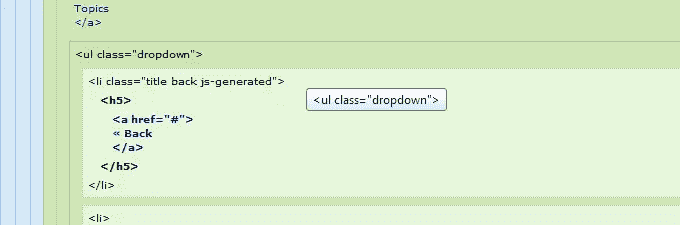

当前版本:3.0.5
用户数量:23，000+
平均。评分:5 颗星

查看源代码图表提供了一个网页的 DOM 的完整可视化。这是通过指示标签边界和层次结构的视觉线索来完成的，以使查看代码不那么复杂。通过查找然后读取标签，以及点击和滚动等手动操作来建立标签边界，这导致用户在认知处理中经历强制中断。当标记变得更加复杂时，生产率会以更高的速度下降。因此，查看源图表避免了这些事情，并提供了更好的标签可视化。

## 安慰

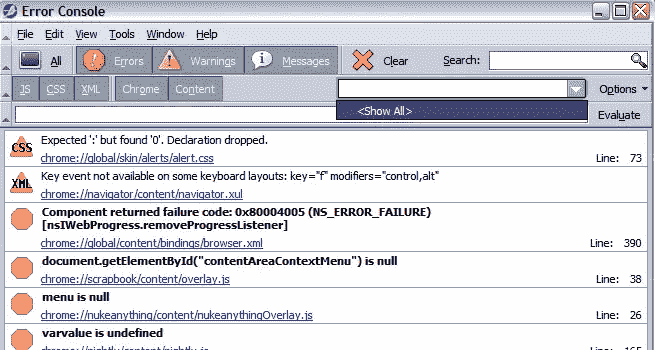

当前版本:0.9
用户数量:20，000+
平均。评分:5 颗星

控制台(发音为控制台平方或控制台二)“用下一代错误控制台取代 JavaScript 控制台。”该插件的页面进一步解释道:“让您显示按类型(错误、警告、消息)、语言(JavaScript、CSS、XML)和上下文(Chrome、内容)过滤的错误。此外，它还提供了一个简单的搜索框(如历史和书签侧栏所示)，隐藏重复项，侧栏优化，可定制的工具栏和一些更多的可访问性改进。”

## MobileView

当前版本:1.0.2rev56
用户数量:~300
平均。评分:5 颗星

这是一个新的插件，可以让你在一个类似手机的面板中查看当前标签的内容(也就是说，你可以测试任何网页的移动视图)。在当前选项卡的右侧可以看到一个面板。这对于响应测试来说很方便。即使在切换到新标签后，您也可以保持另一个标签的面板活跃。

## 扩展状态栏

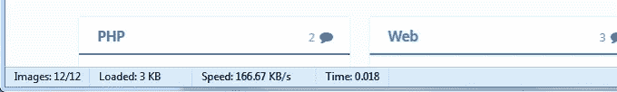

当前版本:1.5.8
用户数量:82，000+
平均。评分:4 星

扩展状态栏可以在浏览器窗口中添加一个类似 Opera 的状态栏，显示以下信息:

*   加载的图像数量
*   页面负载的百分比
*   下载的字节数
*   平均下载速度
*   装入时间

## 测量

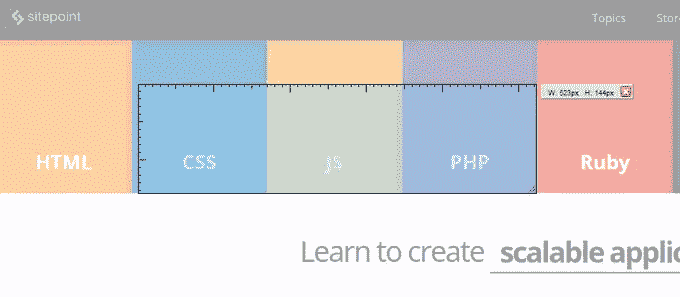

当前版本:0.4.13
用户数量:170，000+
平均。评分:4 星

如使用数字所示，这在开发人员社区中更为知名。MeasureIt 它允许您在任何网页上绘制一个类似标尺的指示器，以检查宽度、高度或只是页面元素的基本对齐方式。距离以像素为单位。

## 砖石工

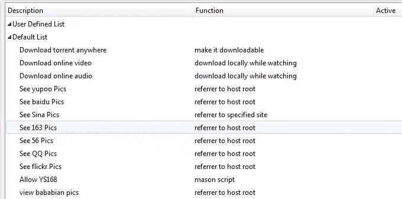

当前版本:0.3.7.9.18
用户数:12000+
平均。评分:5 颗星

对于高级用户来说，这无疑“有助于定制 Http 中的几乎所有东西”包括以下功能及更多内容:

1.  加载自定义脚本(类似于油脂猴子)
2.  HTTP 请求重定向和阻止
3.  缓存任何文件并保存到指定的文件路径
4.  修改 cookies
5.  修改引用站点(自定义网站或网站根)
6.  假 IE6

## 服务器切换器

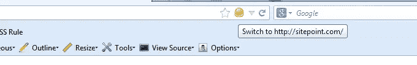

当前版本:0.5.3
用户数量:1600+
平均。评分:5 颗星

服务器切换器允许用户在开发中的站点(托管您当前正在工作的临时版本)和活动服务器之间轻松切换，这样您可以立即看到差异。

例如:如果你有一个托管在`localhost/example.html`(开发服务器)的站点，点击服务器切换器图标，你将立即被重定向到`yoursite.com/example.html`(实时服务器)，反之亦然。服务器名称(“localhost”和“yoursite.com”)是可配置的。功能包括:

*   可以创建多个项目(开发/实时服务器对)。
*   键盘快捷键:CTRL+SHIFT+X
*   在新标签中点击鼠标中键或 CTRL+左键打开本地/远程服务器。
*   支持子目录、不同的端口和本地文件。

更多信息，请参见[GitHub 回购](https://github.com/Bronkoknorb/Server-Switcher/)

## 页面差异

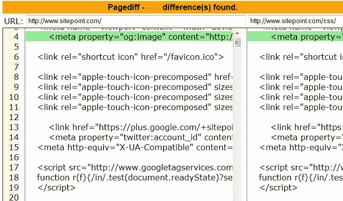

当前版本:1.5
用户数量:1，900+
平均。评分:4 星

Pagediff 是一个基本的网页比较应用程序，它采用浏览器生成的 DOM 兼容视图源来帮助开发人员查看网页之间的 HTML 代码差异。

安装后的说明:

*   将当前页面(第一页)保存到内存中，右键单击该页面并选择“开始差异”
*   右键单击第二页并选择“显示差异”。

## [defyFormValidation](https://addons.mozilla.org/en-US/firefox/addon/defyformvalidation/)

[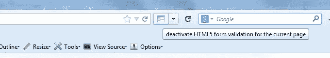](https://addons.mozilla.org/en-US/firefox/addon/defyformvalidation/)

当前版本:0.2.2
用户数量:130+
平均。评分:4 星

这个附加组件停用 HTML5 页面中的表单验证，允许您测试应用程序的服务器端验证以及客户端(例如，基于 JavaScript 的)表单验证方法。要恢复页面的原始状态，只需重新加载页面。

## HttpFox

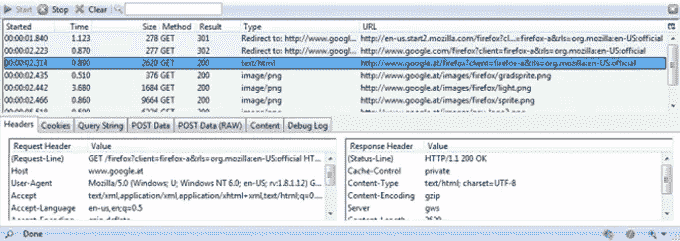

当前版本:0.8.12
用户数量:114，000+
平均。评分:4 星

HttpFox 监视和分析浏览器和 web 服务器之间所有传入和传出的 HTTP 流量。它旨在将 HttpWatch 和 IEInspector 等工具的功能引入 Firefox。

每个请求提供的信息包括:

*   请求和响应标头
*   发送和接收的 cookies
*   查询字符串参数
*   发布参数
*   响应正文

## 修改标题

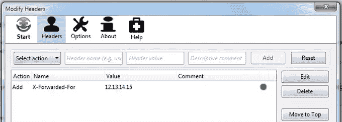

当前版本:0.7.1.1
用户数量:122，000+
平均。评分:5 颗星

这个附加组件对于移动 web 开发、HTTP 测试和隐私特别有用。它允许您添加、替换和过滤 HTTP 请求头。它还允许修改发送到 web 服务器的 HTTP 请求头。开发人员还可以导入和导出标题。

## JavaScript Deobfuscator

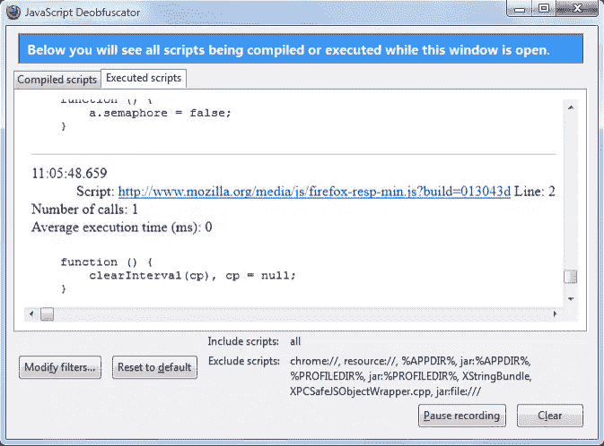

当前版本:1.6.4
用户数量:63，000+
平均。评分:4 星

这个插件将向你展示任何网页上的 JavaScript，即使它是模糊的。从工具菜单中打开 JavaScript Deobfuscator，观察正在编译/执行的脚本。显示的代码来自浏览器的 JavaScript 引擎。每当 JavaScript 引擎编译或执行一个脚本时，它都会被添加到相应的列表中。

Deobfuscator 窗口底部的规则定义了应该显示哪些脚本。默认情况下，浏览器自己的脚本和扩展被排除在外，但是可以调整过滤器来显示它们。

## 桌面 2

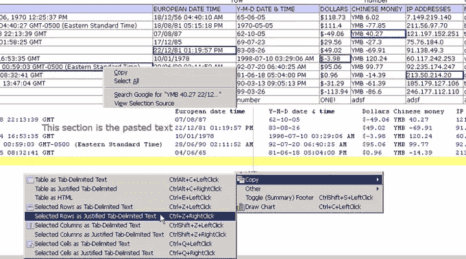

当前版本:1.17
用户数:19000+
平均。评分:5 颗星

这个附加组件专注于 HTML 表格数据。功能包括:

*   复制(表格/行/列/单元格)
*   排序(多列)
*   搜索(使用正则表达式和范围操作)
*   过滤、图表、统计、重新排列和组合/比较

## 转诊控制

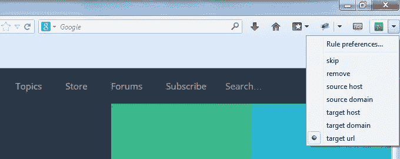

当前版本:0 . 4 . 3
fo 用户数:3700+
平均。评分:5 颗星

这个附加组件允许你控制火狐如何发送推荐 http 头。一些服务器可能会使用 referrer 来阻止带宽盗窃。如果工作不正常，只需点击一下就可以关闭。功能包括:

*   仅处理第三方请求的选项
*   七类政策
*   自定义特定于 url 的规则
*   导入/导出规则文件，支持从 RefControl 规则文件导入

参考[项目 wiki](https://github.com/muzuiget/referrer_control/wiki) 中的实例。

## 尖牙屏幕阅读器模拟器

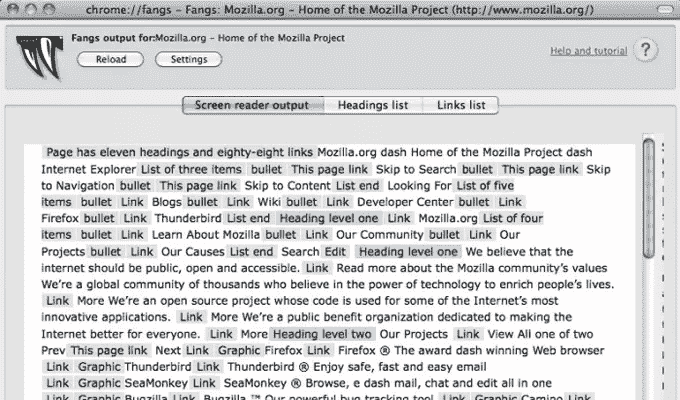

当前版本:1.0.8
用户数量:平均 5200+
。评分:5 颗星

Fangs 呈现网页的文本版本，类似于屏幕阅读器的阅读方式。这有助于开发人员了解辅助设备将如何呈现网站，从而增加早期发现可访问性问题的机会。开发人员、教师和质量保证人员使用 Fangs 来让尽可能多的人访问网站。

## 知道其他的吗？

这个附加组件列表到此为止。如果你知道这里没有列出的任何其他人，也不太为人所知，请在评论中告诉我们。

## 分享这篇文章