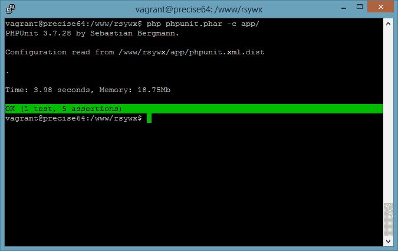
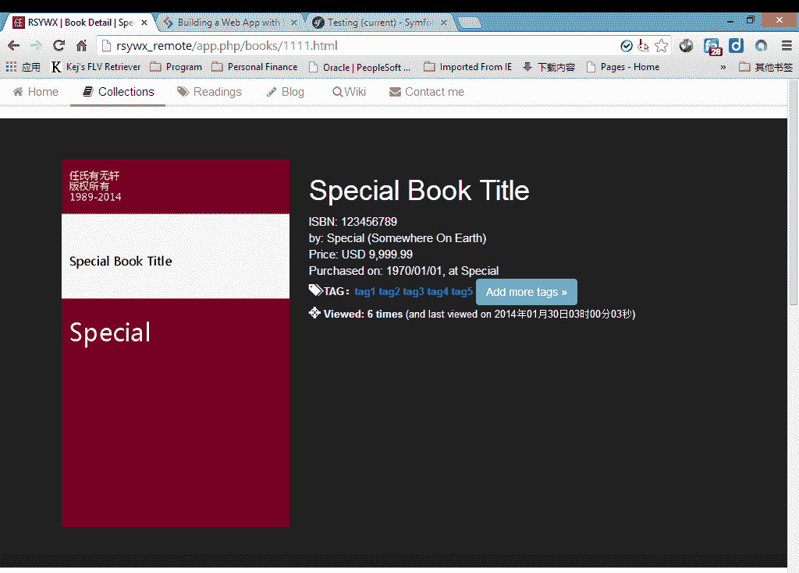

# Symfony2 中的功能测试

> 原文：<https://www.sitepoint.com/functional-testing-symfony2/>

在我的[上一篇文章](https://www.sitepoint.com/data-fixtures-symfony2)中，我们展示了如何将样本数据加载到 Symfony 开发环境中。

测试数据可能没有用，因为它是独立的。然而，当与功能测试相结合时，它就成了救命稻草。

### 功能测试

Symfony 的官方网站有[一个有用的文档](http://symfony.com/doc/current/book/testing.html)关注单元测试和功能测试。如果你想深入了解这个话题，一定要看一看。

在我的前一篇文章中，我已经在一定程度上介绍了单元测试。

简言之，单元测试测试一个类和/或它的成员函数的行为。例如，我为我的站点创建了一个分页类，在页面中显示我所有的图书收藏，它还显示了一个页面列表，用于导航。为了使页面列表有用，函数必须根据当前页面和总页数返回一个页面数组，以便当前页面位于数组的中间。这是该函数的内置行为，与不同的情况无关(但在结合使用时必须表现良好)。这就是单元测试的用武之地。

如果我们看看在我的[早期文章](https://www.sitepoint.com/building-web-app-symfony-2-finalizing/)中测试分页类，我们可以非常清楚地看到不同的场景是如何伪造的，输出是如何测试的:

```
 $paginator=new  Paginator(2,  101,  10); $pages=$paginator->getTotalPages(); $this->assertEquals($pages,  11); $list=$paginator->getPagesList(); $this->assertEquals($list, array(1,2,3,4,5)); $paginator=new  Paginator(7,  101,  10); $list=$paginator->getPagesList(); $this->assertEquals($list, array(5,6,7,8,9)); $paginator=new  Paginator(10,  101,  10); $list=$paginator->getPagesList(); $this->assertEquals($list, array(7,8,9,10,11)); 
```

功能测试是不同的。我们不看单个功能的“正确性”，这要通过单元测试来验证，而是看更大的画面。功能测试回答的问题是:我们的应用程序在显示正确的内容、对应用户的交互等方面表现良好吗？

它可以通过重复用户的步骤和重现 bug 来帮助我们调试应用程序。如果用户报告一个错误，说“当我这样做的时候，那么这个数据，系统是有问题的”，我们可以模拟操作序列，找到一些根深蒂固的错误。

让我们看看如何对网站进行功能测试。再看一下网站的索引页面。我们应该在这个页面的内容中测试什么，这样我们才能确信这个站点的性能是正常的？

当然，就测试而言，静态内容与我们无关。静态内容中的任何错误都被认为是输入错误，不在功能测试的范围内。因此，很明显，我们将专注于“动态”内容和用户交互。

在此索引页面中，我们将根据数据库的示例数据和应用程序逻辑，重点关注以下动态内容:

*   我们图书馆应该总共有 101 本书。
*   最新收录的书应该是 1970-01-01 的购买日期**，作者是“**特稿**”。**
*   我们应该有 **2** 文章集(标题)供我阅读，最新的评论应该被命名为“**评论 2** ”。

您自己的应用程序的逻辑和数据可能不同，但在页面内容中识别这些重要信息是非常重要的。我使用上述 5 个粗体数字，以便我可以确定我在寻找什么:我的控制器正在对书籍和标题进行正确的计数，并从数据库中选择最新的书籍/标题。

测试上述条件(或“断言”)的测试文件位于:`src/tr/rsywxBundle/Tests/Controller/DefaultControllerTest.php`，摘录如下:

```
<?php namespace tr\rsywxBundle\Tests\Controller;  use  Symfony\Bundle\FrameworkBundle\Test\WebTestCase;  class  DefaultControllerTest  extends  WebTestCase  {  public  function testIndex()  { $client =  static::createClient(); $crawler = $client->request('GET',  '/');  //        $text = $crawler->text();  //        $fp = fopen('index.txt', 'w');  //        fwrite($fp, $text);  //        fclose($fp); $this->assertTrue($crawler->filter('html:contains("1970-01-01")')->count()  ==  1); $this->assertTrue($crawler->filter('html:contains("101 books")')->count()  ==  1); $this->assertTrue($crawler->filter('html:contains("by Special")')->count()  ==  1); $this->assertTrue($crawler->filter('html:contains("2 articles")')->count()  ==  1); $this->assertTrue($crawler->filter('html:contains("Review 2")')->count()  ==  1);  //We click a link and go to the detail page $links=$crawler->selectLink('Special Book Title')->links(); $link=$links[0]; $crawler=$client->click($link);  }
```

我们创建一个 HTTP 客户端，并创建一个模拟用户动作的爬虫。在这个测试用例中，我们想要访问站点的主页，所以我们使用`$crawler = $client->request('GET', '/');`。

然后，为了确保页面内容包含之前确定的关键信息，我们使用`assertTrue`做了几个断言。例如，将“我们的图书馆应该总共有 **101** 本书”翻译成:

```
$this->assertTrue($crawler->filter('html:contains("101 books")')->count()  ==  1);
```

我们希望在响应中“101 本书”只出现一次。我用了一个更长的短语“101 本书”，以避免其他一些“101 本书”被计算在内。如果这个断言失败，这可能意味着模板中有一些错别字，或者有一个逻辑缺陷，所有书籍的计数都失败了。

要运行测试，请在终端窗口中发出以下命令:

```
php phuunit.phar -c app/
```

“-c app/”参数只是告诉 PHPUnit 使用 Symfony 发行版附带的`app`目录中的配置。



瞧啊。所有测试通过！看到这个绿条感觉很棒。如果任何断言失败，条将是红色的。

让我们也测试一些其他方面。链接怎么样？他们正在做他们应该做的事情吗(就 URI 和把我们带到正确的一页而言)？

例如，现在我们确定页面显示的是最新收集的书籍，人们会认为如果我们单击该链接，它会将我们带到书籍详细信息页面，显示关于该书的更多详细信息。

让我们再添加几行代码:

```
 //We click a link and go to the detail page $links=$crawler->selectLink('Special Book Title')->links(); $link=$links[0]; $crawler=$client->click($link); $this->assertTrue($crawler->filter('html:contains("ISBN: 123456789")')->count()  ==  1); $this->assertTrue($crawler->filter('html:contains("tag1")')->count()  ==  1); $this->assertTrue($crawler->filter('html:contains("tag2")')->count()  ==  1); $this->assertTrue($crawler->filter('html:contains("tag3")')->count()  ==  1); $this->assertTrue($crawler->filter('html:contains("tag4")')->count()  ==  1); $this->assertTrue($crawler->filter('html:contains("tag5")')->count()  ==  1);
```

在这个代码段中，我们选择其文本为“特殊书名”的链接。基于我们的数据设备和应用程序逻辑，索引页面中应该有两个。任何一个都可以将我们带到这本书的详细页，所以我使用第一个:



通过做出上述附加断言，我们确信我们正在查看的书(我们之前创建的“特殊”书)是由 ISBN 和 5 标签标识的。我们还确信主页中的链接正确地将我们带到了图书详情页面，该页面显示了主页中列出的图书(作为最新收藏的图书)。

在上面的测试代码中，我已经注释掉了几行。如果取消注释，这些行将把页面内容写入一个文本文件。在测试过程中，可能会有一些奇怪的行为(例如，您可以看到有一个字符串“Special Book Title ”,但是断言相同字符串的存在就是失败的)。如果发生这种情况，建议将响应转储到一个文本文件中，并搜索以查看是否有不常见的问题。

**注意:** Symfony 使用一个特殊的`test_env`(不同于`dev`和`prod`)来运行测试。我们甚至可以将该环境配置为使用不同但结构相似的数据库。建议使用单独的环境进行纯测试，但是为了本文的简单，我们跳过了这个过程。

### 结论

在本文中，我们介绍了在 Symfony 应用程序中使用 PHPUnit 运行功能测试。单独的功能测试意义不大，因为没有足够的数据来以更有意义的方式填充我们的页面。数据夹具对于自动化数据加载过程来说很方便，更重要的是，以一种可控的方式填充数据，以便我们可以对预期的输出做出进一步的断言。

请随意评论，如果您感兴趣，我们将很乐意更详细地讨论这个话题。

## 分享这篇文章