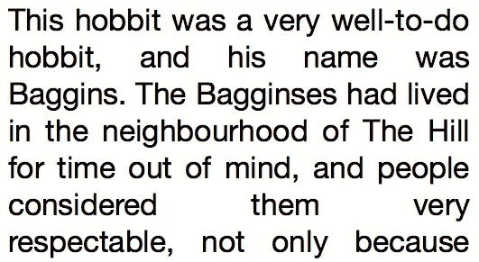
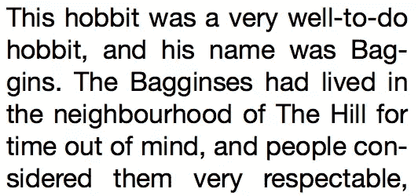

# 跨浏览器 Web 字体–第 3 部分

> 原文：<https://www.sitepoint.com/cross-browser-web-fonts-part-3/>

浏览器对`@font-face`的广泛支持为网页排版创造了奇迹，让我们可以在任何地方自由使用自定义字体。但是不同的字体并不是网页排版的全部。还有一些 web 长期以来的弱点，如长单词的正确连字符，以及开放字体功能的使用，如连字和风格转换，这些功能经常被锁在字体文件中，永远不会公开。

在这篇文章中，我们将看看这些新的 CSS 字体功能。

## 用连字符号连接

这一部分也可以被命名为“解决文本/长单词在文本列中看起来很糟糕的问题”…但这听起来也真的很糟糕，所以我坚持使用计划 a。简而言之，问题在于这样一个事实，多年来，没有一种体面的方式来使用`text-align: justify`而不会看起来很糟糕。



幸运的是，现在有了解决这个问题的方法，它可以在你的支持列表中的大多数浏览器上工作。其中最好的是 CSS3 `hyphens`属性，它在需要的地方添加了适当的连字符，为单词在下一行继续提供了一个很好的视觉线索。它还努力断开没有完全覆盖整个列宽度的单词，有效地减少了空白河流效应。代码看起来像这样:

```
p { 
  font-size: 2.1em; 
  text-align: justify;  
  -webkit-hyphens: auto; 
  -moz-hyphens: auto; 
  -ms-hyphens: auto; 
  hyphens: auto; 
}
```



`hyphens`属性还有其他值:`none`将关闭已经在其他地方设置的连字符，只有当使用`&hyphen;`或`&shy;`字符在单词上手动设置了连字符时，`manual`才会导致单词断行。

下面是一个演示，您必须在支持[的浏览器](http://caniuse.com/#search=hyphens)中查看:

参见 [CodePen](http://codepen.io) 上 SitePoint ( [@SitePoint](http://codepen.io/SitePoint) )的笔[断字示例](http://codepen.io/SitePoint/pen/iusvq)。