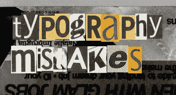
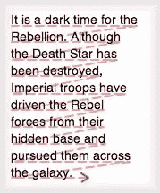
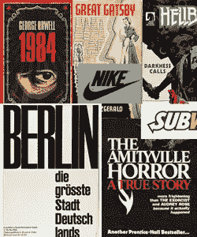
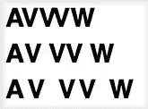
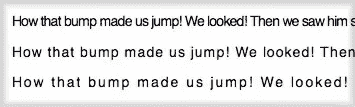
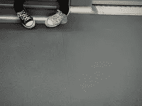
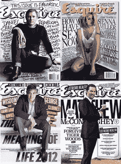
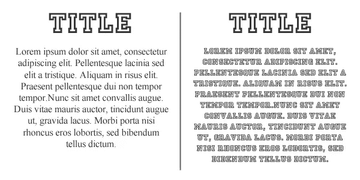
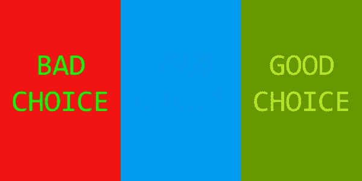
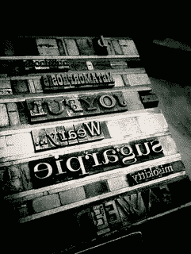

# 排版备忘单:要避免的 6 大错误

> 原文：<https://www.sitepoint.com/typography-cheat-sheet/>

印刷术是一种奇怪的技能——太过数学化而不是纯粹的艺术，但是太过无形而不是纯粹的科学。

我们的现代生活充斥着文本，所以所有的前端开发人员都需要对“排版艺术”有一个透彻的工作知识。

因此，让我们快速浏览一些最常见的排版错误，以及避免它们的方法。

## 判断错误的文本行长度

许多设计者倾向于对他们的文本的平均行中的字符数量不够重视，并对文本的可读性产生不利影响。

幸运的是，这是一个容易避免的错误，因为最佳长度早已确定。

伟大的瑞士印刷工埃米尔·鲁德在 20 世纪 50 年代就这个主题做了很多工作。

在他的开创性文章《字体设计:设计手册》中，他总结道，行长度的“最佳点”大约是 50 或 60 个字符。

较短的线长度
会降低理解速度，因为
眼睛会花更多的时间
追踪下一条线
。

他的测试发现，当阅读较长的、横向排列的文本时，读者很难从一行的结尾追踪到下一行的开头。事实上，读者常常不得不重读上一行，以确保找到下一行。

另一方面，短的行长度——可以预见——迫使眼睛花更多的时间向下和向右扫描下一行。

在这两种情况下，一个错误的线长选择会导致压力，注意力分散，理解和记忆能力下降。

当然，在响应式设计的时代，线长度不再是一个静态的数字。

流动布局意味着你需要将行的长度视为断点之间的一个“范围”,而不是一个数字。我建议将下限保持在 45 个字符以上，上限保持在 80 个字符以下。

## 跟踪:中间人

标志、标题、书的封面和其他大的文本通常采用比任何正文所能忍受的更紧密的跟踪。

有时候设计师对字母之间的空间不够重视——技术上称之为“跟踪”。从一个字母到下一个字母的距离是阅读流畅度的关键因素。

这可能很棘手，因为徽标、标题和书籍封面通过减少跟踪来创造内部凝聚力是很常见的——他们甚至有时使用负面跟踪来迫使字母重叠(旧的 ebay 徽标)。

正如你在上面一些著名的例子中看到的，这看起来很棒。

然而，如果你试图用同样的方法处理你的正文，这几乎总是一个错误。

2006 年，一个太平洋大学团队的研究表明，即使是默认字母间距的微小减小也会立即降低阅读速度。有趣的是，字母间距的逐渐增加并没有显著改变阅读速度，直到这些间距超过一个完整的字母宽度。

字母间距分别设置为-4px、默认值和+4px。

如果你想确定“跟踪”你的单词是正确的，有两个简单的测试。

你应该经常检查“AV”是否易读，是否可以看出“w”和“vv”的区别。

在 web 上，跟踪是由“字母间距”CSS 属性控制的。

随着跟踪的减少，正文的易读性会很快降低。

这个属性有很好的浏览器支持，尽管不幸的是更有用的“em”单元没有普通的旧“px”得到可靠的支持。

来源:太平洋大学(PDF): [字符间距对文本易读性的影响](http://www.pacificu.edu/vpi/publications/documents/EffectofCharacterSpacingonTextLegibility.pdf "A PDF Direct Link to this report")

## 字体搭配不当

照片:ejorpin

不久前，在“网络字体崛起”之前，这是一个更难犯的错误。

就在三年前，网站类型选择的决定很像校服的决定。由于可供我们使用的系统字体范围有限，没有一种字体看起来令人惊叹，但也很少有人看起来很糟糕。

容易接触到大量的新字体，为伟大创造了空间，但也带来了新的可怕的错误。

首先，重要的是要注意，在配对字体时没有精确的公式可以遵循——只有一些指导原则。

你必须永远记住，和谐很可能是你的目标，但你可以通过使用对比字体来实现。

我所说的“对比”是指找到不同的字体，但同时又能互补。这很难做到正确，但可以带来一个杰出的和非传统的结果。

大卫·库里托的《时尚先生》杂志封面打破了几乎所有的布局和字体规则。

大卫·库里托的《时尚先生》杂志封面是传奇，因为它们完全无视关于空白、一致性甚至易读性的传统观点——然而它们却在报摊上取得了巨大成功。

这意味着，你不一定要排除用超薄字体加粗，或者用大字体加小字体；你可以唤起对比的想法。

在这种情况下，你当然应该考虑“衬线”和“无衬线”字体的匹配。

一种常见的搭配方式是在标题上使用装饰性的“衬线”,而在正文上使用“无衬线”字体更好，因为这样可以提供更好的可读性(无论如何在屏幕上)。

正如 Esquire 所展示的，很少会出现只能使用一对字体的情况，所以我的建议是在得出最终结果之前做几次实验。

只有这样，你才能以最好的方式得到满足你需求的结果。

## 不适当的正文字体选择

由于可用字体的范围很广，选择一种用于您的工作可能并不总是一件容易的事情。

通常，设计师会爱上一种奇妙的新字体，然后立即寻找合适的地方。我想我们可能都这样做过。

让我们看一个例子:

不幸的是，这是一个好字体变坏的例子。’。你可以看到标题中使用的令人惊叹的装饰性字体在正文中使用时变得令人不快。

在后一种情况下，文本的易读性被破坏，并且读者可能不会对段落给予正确的注意，因为理解单词有困难。

所以，当渲染任何正文时，我的建议是选择线性的、经典的、易读的字体。

另一个非常常见的错误是选择字体时没有首先考虑我们写作的原因。

其实你要知道，根据不同的情况来改编字体是有可能的。

例如，“衬线”字体可以传达权威的思想，通常适用于正式文件，如法律文本、简历或科学论文。

或者，如果你需要写一个更友好和非正式的文本，你可以悄悄地决定使用“无衬线”字体或一种粗而圆的字体。

## 糟糕的颜色选择

另一个有助于增加文本可读性的重要因素是背景颜色和文本颜色的选择。

一个普遍的错误是使用了两个音调，这两个音调太相似了，以至于从周围环境中区分单词变得非常困难。虽然这对大多数用户来说是令人恼火的，但对于任何有视力问题的人来说，这通常是一个阻碍。

你还应该意识到，一些颜色可能会产生一种可怕的和刺眼的效果:比如绿色和红色或者白色和黄色，千万不要一起使用。

总之，每当你需要为你的作品选择两种或两种以上的颜色时，我建议你寻找一个合适的对比，既不太多也不太弱。

## 主要的

“Leading”(发音为“L-ed-ing”而不是“L-EEee-ding”)是文本中连续两行之间的垂直距离。

摄影:jcolman

这个术语来源于传统活版印刷机用来固定每行文字的“铅”条。

许多设计者没有给予这个特性正确的重要性，结果，他们可能得到一行的“下降”与一行的“上升”重叠。或者，如果你在行与行之间放置太多的空间，你会得到一个松散的，难以阅读的文本。

为了避免这些问题，一个好的经验法则是从 140%的字体大小开始。

例如:假设你的字体尺寸是 20 磅，右行高大约是 26-28 磅。

但是，请记住，“衬线”字体通常比“无衬线”字体需要更多的前导，而较重的块状字体比较轻的字体需要更多的垂直空间。

这就暂时结束了。我希望这些建议能帮助你享受打字的乐趣。

## 分享这篇文章