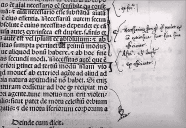
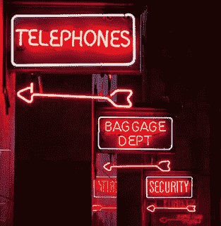
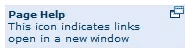
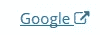
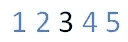
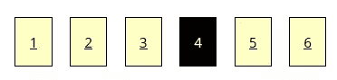
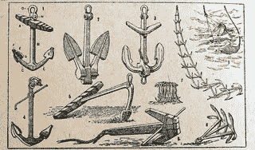
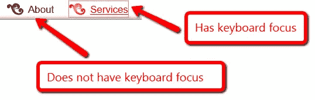
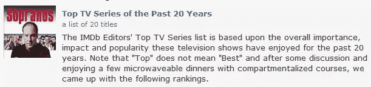

# 创建可访问链接:开发者的 15 条黄金法则

> 原文：<https://www.sitepoint.com/15-rules-making-accessible-links/>

[](http://www.flickr.com/photos/58558794@N07/9710243736)

图片:宾州出处项目。在链接之前，旁注是出版商为正文提供额外背景的
方式之一
。

链接是网站的灵魂——是它们让网站与众不同。

从古代开始，印刷文本就依赖于更沉闷的装置——比如脚注、附录和旁注——来给正文添加相关内容和额外的上下文。

但是，如果说网络有一个伟大的技巧，那就是它有能力以一种非线性但仍然有意义的方式将不同的内容缝合在一起。

这就是为什么我们——卑微的网络开发者——有巨大的责任来确保所有这些链接为各种能力的用户服务！

不幸的是，这比避免使用像“点击这里”这样的短语要复杂一些。

让我们看看需要什么。

## 那么，什么是好的链接文本呢？

虽然当前 W3C 的 Web 内容可访问性指南(WCAG2)强调为链接提供整体上下文，但很少强调让残疾用户能够理解链接本身的文本。

我认为这是错误的方法。

屏幕阅读应用程序只提供有限的方法来解释页面。一种常见的方法是生成一个链接列表(没有上下文)来确定页面的内容。屏幕阅读器用户也经常通过简单地从一个链接跳到另一个链接来浏览页面(不阅读中间的文本)。

当面对一堆“<u>点击此处</u>下载年报”、“<u>更有</u>在划船”时，这样的技巧毫无用处。

一旦你开始谈论手机和平板电脑网站，链接文本也会成为一个严重的问题。

最著名的两套移动可访问性指南——[W3C 移动最佳实践](https://www.w3.org/TR/2008/REC-mobile-bp-20080729/)和 [BBC 的移动可访问性指南](http://www.bbc.co.uk/guidelines/futuremedia/accessibility/mobile_access.shtml) —建议清楚地识别和描述链接的目标。

在我审计网站的工作中，我识别了所有的“点击这里”链接，并将它们标记为可访问性失败。当然，“点击这里”链接可以通过键盘激活，但这意味着你需要一个鼠标来激活链接。

这是一个失败。

当然，要说 WCAG2 下的“这里”和“更多”链接严格来说是不可访问的*有点困难。我仍然将它们标记为错误，但是几乎不可能找到它们失败的成功标准。*

所以，这里是我的 15 点清单，当你在网上链接文字时要记住。

### 规则 1:不要在你的链接中使用“链接”这个词

这是一个简单的问题。

屏幕阅读器在遇到链接时会告诉用户，所以你不需要在链接文本中使用“*链接*”或“*链接到*”或“*转到*”这样的词语。

### 规则 2:不要大写链接

[](http://www.flickr.com/photos/daniel_gies/5392604084/)

照片来源:~dgies

链接中的大写文本有两个问题。

首先，一些屏幕阅读器逐字母阅读大写文本。这种情况偶尔会发生在 HTML 是句子大小写，CSS 强制大写的时候。

第二个问题是大写字母更难读(对每个人来说，但尤其是有阅读障碍的人)。

大写的文本在形状上没有区别:所有的单词只是一个大矩形。句子的大写字母根据使用的字母有不同的形状。

请参见以下示例:

> 大写的文本很难阅读。它是一个大长方形。
> 
> 大写的文本很难阅读。它是一个大长方形。

阅读的一般规则是:如果对公众来说更难，那么对于一个有认知障碍的人来说阅读几乎是不可能的。

谁想对观众大喊大叫呢？

### 规则 3:避免 ASCII 字符

[](http://www.flickr.com/photos/jessicatam/4057782618/)

图片来源:杰西卡塔姆

在[成功标准 1.1.1](https://www.w3.org/TR/2013/NOTE-UNDERSTANDING-WCAG20-20130905/text-equiv-all.html) 下:非文本内容是为 ASCII 字符提供文本替代的要求。

具体要求是 [H86:为 ASCII art、表情、leetspeak](https://www.w3.org/TR/2013/NOTE-WCAG20-TECHS-20130905/H86) 提供文本替代，也就是说你需要为笑脸之类的东西提供文本替代。

他们建议使用 TITLE 属性；即使它没有得到很好的支持，或者没有得到`ABBR`或`ACRONYM`元素的支持。

然而，如果你绝对*必须*使用表情符号，那么至少用一些咏叹调来标记它们:

```
<span class="sr-only">Smiley face</span>
<span aria-hidden="true">:-)</span>
```

然而，我一直认为这项技术应该更进一步，并且包括大多数标点符号。

让我们以长破折号为例。

对于视觉用户来说，下面的链接文本可能很清楚，但是对于屏幕阅读器用户来说就不一样了:

> [16-17 岁](#)，[17-21 岁](#)

有些屏幕读者会把上面的链接读成“*链接一六一七年结束链接*”。

用“to”这个词代替长破折号要清楚得多。在那种情况下，屏幕读者会把它读成“链接十六到十七年结束链接”。

清楚多了，对吧？

### 规则 4:避免使用 URL 作为链接文本

当我们看到“www.londontoylibrary.co.uk”时，我们看到的是“伦敦”、“玩具”和“图书馆”这些词，但一个屏幕阅读器是要一个字母一个字母地读取 URL 的。双 U，双 U，双 U，点，El-Oh-En-Dee..

可以想象，这在前 4-5 个字母之后就变得难以理解了。

所以，一定要用有意义的文字作为链接，比如“伦敦玩具图书馆”。如果您确实需要以文本形式提供 URL—例如，如果您希望人们打印出内容—那么在打印样式表中将 URL 附加到链接文本中，如下所示:

```
 @media print{
   a:after{content:" (" attr(href) ") ";font-size:0.8em;font-weight:normal;}
} 
```

### 规则 5:保持链接文本简洁

将链接文本的长度限制在 100 个字符以内是一个非常好的主意。

屏幕阅读器有大量的功能，允许用户跳到下一个单词、下一个句子、下一个段落或下一个标题，但他们必须阅读整个链接。

所以，你可以想象一下，如果你把整个段落变成了一个链接(随着 HTML5 中块级链接的出现，我们会看到更多)，整个链接会被屏幕阅读器读出。

你可以想象这会变得多烦人。

### 规则 6:限制页面上文本链接的数量

这很重要，因为用户将链接视为一种导航形式:他们知道他们没有在正确的页面上，所以他们正在寻找将带他们去他们想去的地方的链接。

如果一个页面上有很多链接，那么浏览一个网站会变得更加困难。

当然，屏幕阅读器用户可以拉出一个页面中的所有链接，所以如果有数百个链接，那么通读它们就是一场噩梦。

好吧，那么多少环节才算多呢？这就是“一根绳子有多长”的问题，取决于你的网站类型。

当你构建你的页面时，请记住用户是从一个链接导航到另一个链接的。

对于附加链接文本或上下文信息至关重要的区域，该怎么办？

有三个关键领域需要额外的链接文本或上下文信息:

*   链接到下载
*   在新窗口中打开的链接
*   分页/按字母排序的链接。

我们将分别介绍它们。

### 规则 7:不要直接链接到下载

在我所见证的可用性测试中，有一点是普遍的:人们讨厌下载。

更令人讨厌的是，他们会在没有预期的情况下打开一个下载。

但是对于普通用户来说仅仅是烦恼的事情对于残疾人来说却是一个非常严重的问题。当一个链接激活一个下载时，你必须正确地指出，并确保这个信息在链接文本中**。**

如果你用“PDF”或“Word”图标代替文本，一定要确保它们有有用的 ALT 属性！

我最近看到的一件事，是通过 CSS 自动添加一个下载图标。请记住，这对屏幕阅读器来说是不可见的——它们不读取 CSS 图像——所以千万不要在 CSS 中嵌入关键信息。

我一直建议你添加更多的细节，而不仅仅是下载的类型，比如下载的大小。

所以，如果你只有一份文件，那就没问题。但是如果你有一大堆呢？

WCAG2 现在允许以下内容(标题编码为“残疾人服务年度报告”):

> **残疾人服务年度报告**
> [2013 年 PDF](#) ， [2013 年 Word](#)
> [2012 年 PDF](#) ， [2012 年 Word](#)
> [2011 年 PDF](#) ， [2011 年 Word](#)

或者类似这样的事情(其中第一列和第一行是使用Coded table title):

| 标题 | 便携文档格式 | 单词 |
| --- | --- | --- |
| 2013 年残疾人服务年度报告 | [](#) | [](#) |
| 2012 年残疾人服务年度报告 | [](#) | [](#) |
| 2011 年残疾人服务年度报告 | [](#) | [](#) |

或者甚至是两者的组合(标题和表格标题):

**残疾人服务年度报告**

| 标题 | 便携文档格式 | 单词 |
| --- | --- | --- |
| Two thousand and thirteen | [](#) | [](#) |
| Two thousand and twelve | [](#) | [](#) |
| Two thousand and eleven | [](#) | [](#) |

我认为，更清晰、更有语义、更容易理解。

### 规则 8:当打开新窗口时，总是提醒用户

重要的是要警告残疾人，一扇新的窗户已经打开——尤其是那些可能没有注意到的认知障碍者。

指示链接在新窗口中打开的最佳方式是向链接添加文本，例如“(在新窗口中打开)”。

但是，您也可以添加一个具有适当 ALT 属性的图标，但是您必须在页面的某个位置解释图标的含义，就像《老友记》一样(尽管注意到他们的可访问性信息已经过时了):



如果你绝对**必须用一个字符来表示一个链接，我已经开始使用[字体牛逼的](http://fortawesome.github.io/Font-Awesome/ "Link to FontAwesome Github Project page")[外部链接](http://fortawesome.github.io/Font-Awesome/icon/external-link/ "FontAwesome external link icon example page")图标在新窗口中打开。**

 **HTML 是:

```
 <a href="http://www.google.com/" target="_blank">Google 
 <span class="sr-only">Opens in new window</span>
 <i aria-hidden="true" class="fa fa-edit fa-external-link"></i>
</a> 
```

CSS 是:

```
 .sr-only {
  position: absolute;
  width: 1px;
  height: 1px;
  padding: 0;
  margin: -1px;
  overflow: hidden;
  clip: rect(0, 0, 0, 0);
  border: 0;
} 
```

它是这样渲染的:



总是在链接文本的后面包含图标*。否则屏幕阅读器用户拉出每个页面的链接，将得到一个以“*在新窗口*打开”开始的完整列表，而不是有意义的链接文本。*

### 规则 9:注意分页和按字母顺序排列的链接

对于视觉用户来说，搜索结果底部的一系列编号链接意味着“移至下一页”，但在我的用户测试中，我一次又一次地发现，残疾人不知道这些链接是什么意思。

要使这些链接可访问，只需在链接列表前添加一些上下文信息，如“转到搜索页面:1 2..等等”。

如果它是一个按字母顺序排列的链接列表，那么一个解释链接的标题是最好的，例如:

**作者姓氏开头:**
[A](# "Surnames starting with 'A'")|[B](# "Surnames starting with 'B'")|[C](# "Surnames starting with 'C'")|[D](# "Surnames starting with 'D'")|[E](# "Surnames starting with 'E'")|[F](# "Surnames starting with 'F'")|[G](# "Surnames starting with 'G'")|[H](# "Surnames starting with 'H'")|[I](# "Surnames starting with 'I'")|[J](# "Surnames starting with 'J'")|[K](# "Surnames starting with 'K'")|[L](# "Surnames starting with 'L'") [S](# "Surnames starting with 'S'")|[T](# "Surnames starting with 'T'")|[U](# "Surnames starting with 'U'")|[V](# "Surnames starting with 'V'")|[W](# "Surnames starting with 'W'")|[X](# "Surnames starting with 'X'")|[Y](# "Surnames starting with 'Y'")|[Z](# "Surnames starting with 'Z'")

用户代理和辅助技术现在擅长于呈现相邻的链接，所以没有必要像上面的例子那样在链接之间放置竖线。

相邻链节之间留有空间仍然很重要。

当用户触摸包含多个链接时，Android 设备会放大一个区域，但苹果和 Windows 设备不会。

我建议在链接周围使用 CSS border 属性，使它们看起来更像按钮。这使得边框内的整个空间都是可点击的，只需添加:

```
 border: 1px solid black; 
```

我还看到在分页或按字母顺序排列的链接中使用颜色来表示当前链接，例如:



这违反了[成功准则 1.4.1 颜色的使用:](https://www.w3.org/TR/UNDERSTANDING-WCAG20/visual-audio-contrast-without-color.html)“*颜色不作为传达信息、指示动作、提示响应或区分视觉元素的唯一视觉手段*”。

最好的办法是把当前页码变成纯文本，其他页码变成链接。

并且确保这些链接都有下划线！这样，链接在视觉上是不同的(不仅仅依赖于颜色)，在编程上也是不同的。

分页和按字母顺序排列的链接的另一个问题是，它们通常为用户提供一个非常小的目标区域来选择。

这对于键盘用户来说没有问题，但是使用其他输入设备(如鼠标、操纵杆或触摸屏)的人会发现很难正确选择一个字母的链接。

最好让单个字符链接的文本尺寸比周围的内容大。

在链接周围使用大量 CSS 填充来增加可点击区域也是明智的，例如:

```
 padding-left: 1em;
padding-right: 1em; 
```

所以如果你把这些技术放在一起，你会得到:

```
 span.pag a {
  padding: 1em;
  border: 1px solid black;
  margin: 0.5em;
  background: #ffffc3;
  color: black;
} 
span.current-page {
  padding: 1em;
  border: 1px solid black;
  margin: 0.5em;
  background: black;
  color: white;
} 
```

实际分页链接的 HTML 是:

```
 <span class="pag">
 <a href="http://www.one.com">1</a>
 <a href="http://www.two.com">2</a>
 <a href="http://www.three.com">3</a>
 <span class="current-page">4</span>
 <a href="http://www.five.com">5</a>
 <a href="http://www.six.com">6</a>
</span> 
```

您最终得到的分页链接看起来像这样(一个工作示例参见[Oz 的可访问向导](http://wizardofoz.accessibilityoz.com.au/accessible.html "Accessible Wizard of Oz")):



当然，你可以随意用圆角和一些颜色来装饰它！

### 规则 10:使用锚定链接时要小心

[](http://www.flickr.com/photos/fdctsevilla/5038391223/)

照片:El Bibliomata

重要的是要非常小心地使用锚链接。

对于非常长的页面，我见过许多用户浏览页面，然后选择锚链接，假设它会把他们带到一个不同的页面。通常他们没有意识到他们只是在已经浏览过的页面上上下移动。

请记住:如果某样东西对普通用户来说是一个问题——我们知道是这样的——对残疾人来说将是一个严重的问题。

屏幕阅读器通常通过添加短语“页面内链接”来识别链接是否是锚，因此在激活锚链接时，他们至少会有一些反馈。但是有视觉障碍的用户、使用放大镜的人和有认知障碍的人可能根本没有意识到他们正在激活锚定链接。

我建议使用一个标准的前置短语来表示锚链接，例如“在此页面中:”或“此页面包含以下内容:”等。

### 规则 11:给链接加下划线的情况

人们希望链接有下划线。

当他们看到带下划线的文本时，他们认为这是一个链接(这就是为什么你永远不应该在网络世界中给文本加下划线，除非你代表一个链接)。

WCAG2 建议您为内联文本链接添加下划线，但是如果开发人员对周围的文本使用 3:1 的对比度，并为仅使用颜色来识别链接或控件的焦点提供额外的视觉提示，则也允许他们满足可访问性标准。

这要求你的文本链接与周围的文本有足够的对比(W3C 有一个[链接颜色列表，与黑色文本和白色背景](https://www.w3.org/TR/2013/NOTE-WCAG20-TECHS-20130905/working-examples/G183/link-contrast.html)形成适当的对比)，并且当链接获得鼠标或键盘焦点时有一个额外的视觉提示。

这个视觉提示可以是下划线(继续，给那些链接加下划线！)、粗体、斜体或增加字体大小，或者可以是添加字形或图像。它可以通过 CSS 实现，因为这只需要是一个视觉指标。

但是要记得给 a:hover 加上 a:focus！

### 规则 12:设计时要考虑只使用键盘的用户

链接 HREF 的标题属性中传达的额外信息([见 H33:用标题属性](https://www.w3.org/TR/2008/WD-WCAG20-TECHS-20081103/H33.html)补充链接文本)对键盘用户不可用。

此外，该工具提示不能调整大小以适合用户，[不符合 AA 级成功标准 1.4.4:调整文本大小。](https://www.w3.org/TR/2008/REC-WCAG20-20081211/#visual-audio-contrast-scale)文本颜色或背景颜色也不能改变。

另一个严重的键盘问题可能是缺少键盘焦点指示器，这通常会使键盘用户几乎无法使用网站。

键盘用户知道哪个链接、导航项或字段具有焦点的唯一方法是该项是否具有键盘焦点指示器。正如您在下一个截图中看到的，具有键盘焦点的项目与周围的内容是不同的颜色，并用虚线边框勾勒出来。



指示键盘焦点。

我总是建议，如果鼠标悬停时内容发生变化，同样的情况也应该发生在键盘焦点上。几乎在所有情况下，你都需要在你有“a:hover”的地方加上“a:focus”来达到这个目的。

**脚本链接**

通过 JavaScript 使用脚本事件来模拟链接也是 WCAG2 禁止的。

所有的链接都应该使用 HREF 或区域创建。不允许在随机元素上使用 ONCLICK，如 SPAN、IMG 和 DIV。

**负的 TABINDEX 值**

HTML5 引入的负 TABINDEX 值非常明显地违反了[成功标准 2.1.1:键盘:内容的所有功能都可以通过键盘接口](https://www.w3.org/TR/UNDERSTANDING-WCAG20/keyboard-operation-keyboard-operable.html)操作。

### 规则 12:使用图片作为链接时要小心

作为链接的图像有特殊的要求。ALT 属性充当链接文本。如前所述，您不需要添加单词“link ”,也不需要添加单词“graphic”或“image ”,因为屏幕阅读器也可以向用户识别图像。

在为图像链接创建 ALT 属性时，您确实需要小心，因为 ALT 属性有两个要求:它必须描述图像，并且它必须告诉用户激活链接将会做什么。

对于图像按钮，ALT 属性如“搜索”、“查找”或“提交”是很好的，但是要避免使用“转到”这个词，因为我发现用户不理解这个术语(“转到哪里？”他们问)。

如果你有一个链接的图片，旁边有一个文本链接指向同一个页面，那么在大多数情况下，这个图片需要一个空的 ALT 属性。

这是在[技术 H2 下的一个要求:为同一资源](https://www.w3.org/TR/2013/NOTE-WCAG20-TECHS-20130905/H2)组合相邻的图像和文本链接。

这也是一个要求，一个链接应该包含链接文本和图像。令人高兴的是，现在可以做到这一点，因为 HTML5 允许 A 作为块级元素。

这个规则有一个例外，那就是当图片传达了文本链接中没有提供的额外的重要信息。

#### 以下是**不**如何处理链接图像



这个图片/链接组合的代码太糟糕了，我不得不把它放在这里:

```
 <div class="list-preview-item-wide">
<a onclick="(new Image()).src='/rg/list-user-wide/list-imaimg/b.gif?link=%2Flist%2Fgm7xsjP4vD8%2F';" href="/list/gm7xsjP4vD8/">
<noscript></noscript>
</a></div>
 <div class="list_name"><b><a onclick="(new Image()).src='/rg/list-user-wide/list-titimg/b.gif?link=%2Flist%2Fgm7xsjP4vD8%2F';" href="/list/gm7xsjP4vD8/">Top TV Series of the Past 20 Years</a></b></div> 
```

这段代码包含一大段无意义的内联 JavaScript，可以很容易地用 HTML 替换。它还有一个令人难以置信的无用 ALT 属性，即“标题图像”。

为了确定，他们也在标题属性中添加了“标题图像”!

在前面的截图中，图像和链接文本“过去 20 年的顶级电视剧”去往同一个地方，因此它们应该都是一个链接。

然而，电视剧《黑道家族》的形象告诉我们一些重要的信息:黑道家族在前 20 名。因此，图像需要有一个像“女高音”ALT 属性。

正确的代码应该是(我还必须去掉 JavaScript):

```
 <a href="/list/gm7xsjP4vD8/">
<span class="list-preview-item-wide">

</span>
<span class="list_name"><b>Top TV Series of the Past 20 Years</b></span></a> 
```

### 规则 13:消除断开的或空的链接

大多数人使用工具来找到他们网站上的坏链接，所以我不经常遇到这些。

但是在我测试的几乎每个网站中，我都发现了这样的空链接:

```
 <a href='someplace.html'></a> 
```

[](http://www.flickr.com/photos/roeyahram/8746674286/)

照片:罗耶赫拉姆

我只能猜测它们是由一些内容管理系统故障插入的。

无论来源如何，它们对于屏幕阅读器用户来说都是不可访问和令人讨厌的。

他们所听到的是“ *link end link* ”，并且发现他们自己怀疑是否遗漏了什么——或者他们可能会认为该链接是一个具有空 ALT 属性的图像。

不管是哪种，都很气人。

### 规则 14:保持链接的一致性

一致性是你的朋友。它能让你的用户快速定位。

你的网站上的一切都应该是一致的:你的标题，字段标签，按钮等。你的链接也不例外。

如果你不顾我的敦促，决定不强调你的链接，这一点尤其重要。

您的用户将浏览您的网站，并决定您如何显示您的内联链接文本-所以要确保它是一致的！你绝不能在一个页面上用一种颜色表示链接，然后在另一个页面上用另一种颜色。

### 规则 15:测试你的颜色对比

您需要确保链接文本的颜色与背景颜色形成足够的对比。无论你的链接是否有下划线，这都是必须的。

如果您更改鼠标和键盘焦点上的链接的颜色，您需要确保新颜色也符合颜色对比要求。

有很多在线工具可以让测试对比变得既无痛又科学。

其中包括:

*   [检查我的颜色](http://www.checkmycolours.com/)(checkmycolours.com)
*   [光度色彩对比度分析仪](http://juicystudio.com/services/luminositycontrastratio.php)(juicystudio.com)

### 你成功了！

正如你现在所知道的，如果你走到这一步，有一系列(通常)简单的方法可以让你的网站更容易被残疾人访问。

还有更多方法可以让这种经历变成一场噩梦。

明智地选择。

我认为这应该涵盖了一切，但如果你想了解更多细节:

1)我在自己的博客上对可访问链接有更详细的讨论。

2)也可以尝试这些可访问性情况说明书:

*   [链接上的经理概况介绍](http://wiki.accessibilityoz.com.au/doku.php/checklists/content/manager#link_text1)
*   [链接上的开发者资料](http://wiki.accessibilityoz.com.au/doku.php/checklists/content/developer#link_text1)
*   为了方便 HTML5 标签参考，请查看 [Digital 的 HTML5 备忘单](https://digital.com/tools/html-cheatsheet/)** 

## **分享这篇文章**