# CSS3:文本样式和其他基础知识

> 原文：<https://www.sitepoint.com/css3-text-styling-basics/>

## 如何设置我的文本以某种字体显示？

浏览器将以该浏览器和操作系统使用的默认字体显示文本。怎么改成你设计中用的那种？

### 解决办法

使用`font-family`属性指定文本将采用的字体:

```
p {
  font-family: Verdana;
}
```

### 讨论

除了特定的字体，如 Verdana 或 Times，CSS 还允许指定一些更通用的族名:

*   衬线
*   无衬线字体
*   单一间隔
*   草书
*   幻想

当您指定字体时，重要的是要记住用户不太可能在他们的计算机上安装与您相同的字体。如果你定义了一个用户没有的字体，你的文本将根据他们浏览器的默认字体显示，不管你喜欢什么。

为了避免这种情况，您可以简单地指定通用字体名称，并让用户的系统决定应用哪种字体。

例如，如果您希望文档以无衬线字体(如 Arial)显示，您可以使用以下样式规则:

```
p {
  font-family: sans-serif;
}
```

现在，你可能希望对你的站点显示方式有更多的控制——你可以做到。可以在同一个声明块中指定字体名称和通用字体。

例如，`p`元素的样式规则如下:

```
p {
  font-family: Verdana, Geneva, Arial, Helvetica, sans-serif;
}
```

这里，我们已经指定，如果系统上安装了 Verdana，就应该使用它；否则，指示浏览器查看是否安装了 Geneva 如果失败，计算机会寻找阿里亚，然后是 Helvetica。如果这些字体都不可用，浏览器将使用系统默认的无衬线字体。

如果字体系列名称包含空格，应该用引号括起来，如下所示:

```
p {
  font-family: "Courier New", "Andale Mono", monospace;
}
```

通用字体系列名称应始终不带引号，并出现在列表的最后。字体列表通常被称为“字体堆栈”，如果您正在查找以这种方式使用的字体的信息，这是一个很好的搜索术语。

您可以放心使用的字体有:

**Windows**
Arial、Lucida、Impact、Times New Roman、Courier New、Tahoma、Comic Sans、Verdana、Georgia、Garamond

**Mac**
Helvetica、富特拉、博多尼、泰晤士报、帕拉蒂诺、信使报、吉尔桑斯、吉内瓦、巴斯克维尔、安达尔莫诺

这个列表揭示了我们选择样式规则中指定的字体的原因。我们首先指定我们的首选项，一种通用的 Windows 字体(Verdana)，然后列出一种类似的 Mac 字体(Geneva)。然后，如果这两种字体都不可用，我们将继续使用其他字体。

## 如何从链接中删除下划线？

网页上的文本链接到另一个文档的普遍接受的默认标志是它带有下划线，并以不同于文本其余部分的颜色显示。但是，在某些情况下，您可能希望删除该下划线。

### 解决办法

我们使用`text-decoration`属性从链接文本中删除下划线。默认情况下，浏览器会将所有元素的`text-decoration`属性设置为`underline`。要删除下划线，只需将链接的`text-decoration`属性设置为`none`:

```
text-decoration: none;
```

用于创建图 2.3 所示效果的 CSS 如下:

```
a:link, a:visited {
  text-decoration: none;
}
```

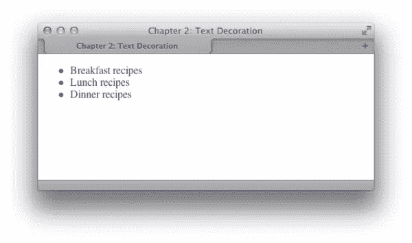

图 2.3。删除带文本修饰的下划线

### 讨论

除了下划线和无，您还可以尝试其他文本修饰值:

*   眉题
*   直通线路
*   眨眼

可以将这些值结合起来。例如，如果你希望在一个特定的链接上有一个`underline`和`overline`,如图 2.4 所示，你可以使用这个样式规则:

```
a:link, a:visited {
  text-decoration: underline overline;
}
```

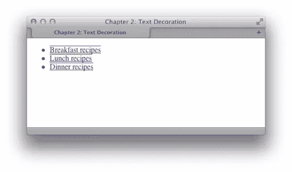

图 2.4。带有文本装饰下划线和上划线集的链接

### 什么时候删除下划线是个坏主意？

给链接加下划线是所有 web 浏览器遵循的标准约定，因此，用户希望看到带下划线的链接。删除大面积文本中出现的链接的下划线会使人们很难意识到这些单词实际上是链接，而不仅仅是突出显示的文本。我建议不要删除文本中链接的下划线。还有其他方法可以设置链接的样式，使它们看起来更有吸引力，并且很少需要删除下划线。

作为菜单的一部分使用的链接，或者在文本明显是链接的其他情况下出现的链接——例如，文本使用 CSS 样式以类似于图形按钮——是另一回事。如果你愿意，你可以去掉这类链接的下划线，因为从它们的上下文中可以明显看出它们是什么。

## 如何移除 h1 元素和下面段落之间的大间隙？

默认情况下，浏览器会在所有标题和段落元素之间呈现一个间隙。该间隙是由浏览器应用于这些元素的默认上下边距产生的。图 2.12 所示的标题页边空白反映了默认值。使用 CSS 可以消除这种差距。

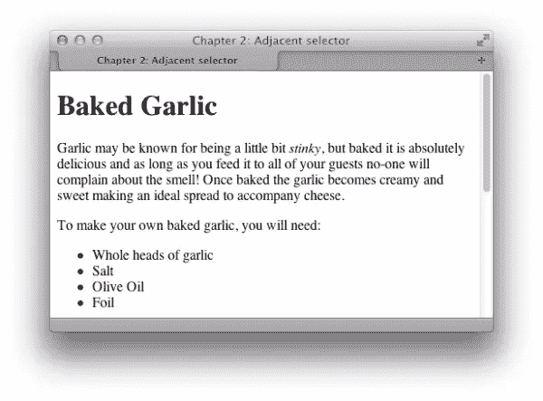

图 2.12。Safari 中的默认标题和段落间距

### 解决办法

要删除标题和其后段落之间的所有空格，必须删除标题的下边距和段落的上边距。在现代浏览器中——包括 Internet Explorer 7 和更高版本——我们可以通过 CSS 使用相邻选择器来实现这一点。然而，为了在较旧的浏览器中达到同样的效果，我们需要回到更好支持的其他技术。

### 使用相邻选择器

相邻选择器允许您将另一个元素后面的元素作为目标，只要这两个元素共享同一个父元素。事实上，您可以使用相邻的选择器来指定一个元素跟在几个其他元素之后，而不是只跟在一个元素之后。应用样式的元素总是链中的最后一个元素。如果你感到困惑，请放心，一旦我们看到它的实际应用，这个概念会变得更加清晰。

下列样式规则删除紧跟在一级标题后面的任何段落的上边距。请注意，顶部边距实际上是从跟随`h1`的段落中移除的，而不是一级标题本身:

```
h1 {
  font: 1.6em Verdana, Geneva, Arial, Helvetica, sans-serif;
  margin-bottom: 0;
}

h1+p {
  margin-top: 0;
}
```

图 2.13 显示了应用该规则后原始页面的显示。

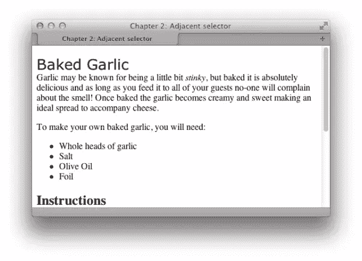

图 2.13。使用相邻选择器改变航向显示

如你所见，跟在`h1`后面的第一段不再有上边距；但是，所有后续段落都保留其上边距。

### 讨论

Internet Explorer 7 和更高版本以及其他浏览器的所有最新版本都支持相邻选择器。

## 我如何使列表中的第一项的样式不同于其他项？

通常，设计师发现他们需要将一组项目中的第一个项目——无论是列表项目还是容器中的许多段落——与该组中的其他项目区分开来。实现这一点的一种方法是将一个`class`分配给第一个项目，然后将这个`class`与其他项目区别开来；然而，使用伪类选择器`first-child`有一种更优雅的方式来创建这种效果。

### 解决办法

下面是一个标记为无序列表的简单项目列表:

```
<ul>
  <li>Brie</li>
  <li>Cheddar</li>
  <li>Red Leicester</li>
  <li>Shropshire Blue</li>
</ul>
```

要改变列表中第一项的颜色而不影响它的邻居，我们可以使用`first-child`选择器。这允许我们将目标放在`ul`元素中的第一个元素，如图 2.8 所示:

```
li:first-child {
  color: red;
}
```

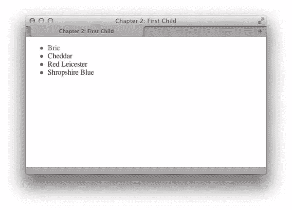

图 2.8。以红色文本显示第一个列表项

### 讨论

从 CSS2.1 规范开始，伪类选择器就在浏览器中得到很好的支持。唯一不支持的浏览器是 IE6。

## 如何给我的文本添加阴影？

投影可以用来添加一个微小的阴影，无论是轻轻突出一些文字，还是允许一个更戏剧性的阴影效果。

### 解决办法

`text-shadow`属性允许您给文本添加阴影—从微妙到完全疯狂:

```
<h1>Baked Garlic</h1>
<p>Garlic may be known for being a little bit <em>stinky</em>, but
  baked it is absolutely delicious and as long as you feed it to all
  of your guests no-one will complain about the smell! Once baked
  the garlic becomes creamy and sweet making an ideal spread to
  accompany cheese.</p>
```

```
h1 {
  font-size: 250%;
  color: #256579;
  text-shadow: 3px 3px 3px #999;
}
```

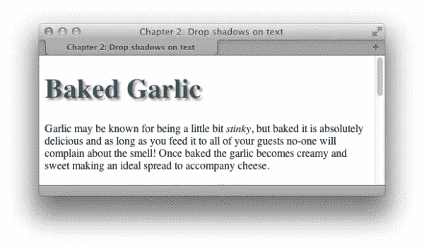

图 2.23。标题上的阴影

### 讨论

`text-shadow`属性的语法很简单:

```
text-shadow: 5px, 5px, 5px, #999;
```

第一个值是与文本的水平距离；第二是垂直距离；第三是阴影的模糊半径或扩散；最后的值是颜色。了解文本阴影如何工作的最简单的方法是创建一个大标题，这样您就可以很容易地看到您所做的更改，然后调整这些值。你还可以在在线的 [CSS3 生成器](http://css3generator.com/)上体验一下文本阴影和许多其他 CSS3 属性。

### 毫无疑问

给文本添加阴影时，请确保文本仍然清晰可辨。我发现`text-shadow`在给表单按钮和大标题添加效果时最有用，但是大量的正文在应用了阴影的情况下很难阅读。遗憾的是，Internet Explorer(包括版本 9)不支持`text-shadow`属性。

## 如何突出显示页面上的文本？

许多网站的一个共同特征是在页面上突出一个重要的术语，例如访问者通过搜索引擎定位我们的网页所使用的搜索术语。使用 CSS 很容易突出显示文本。

### 解决办法

如果您用`span`标签包装要突出显示的文本，并添加一个`class`属性，您可以很容易地为那个`class`添加一个 CSS 规则。例如，在下面的段落中，我们将一个短语包装在应用了`class` `hilite`的`span`标签中:

```
<p>Garlic may be known for being a little bit <span class="hilite">
  stinky</span>, but baked it is absolutely delicious and as long as
  you feed it to all of your guests no-one will complain about the
  smell! Once baked the garlic becomes creamy and sweet making an
  ideal spread to accompany cheese.</p>
```

`hilite`类的样式规则如下所示；突出显示的部分将如图 2.14 所示:

```
.hilite {
  background-color: #FFFFCC;
  color: #B22222;
}
```

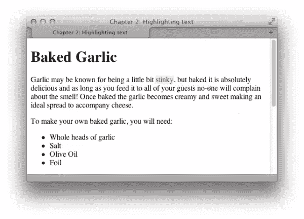

图 2.14。用类高亮显示文本

### 当这一切都是为了表演

如果这种效果纯粹是演示性的，并且只与那些可以在浏览器中看到文本的人相关，那么就应该用这种方式突出显示文本。如果需要突出显示文本以传达其含义，可以考虑使用`em`(强调)或`strong`来代替，然后设置`em`或`strong`元素的样式。通过使用`em`或`strong`，你可以影响文档的意思。在这种情况下，突出显示只是为了看起来，不需要额外的语义元素，这里解释的技术是最好的方法。

## 如何使用 CSS 将文本全部改为大写？

### 解决办法

通过使用`text-transform`属性，您可以将文本更改为全部大写，并执行其他转换:

```
<p class="transform">Garlic may be known for ...</p>
```

```
.transform {
  text-transform: uppercase;
}
```

请注意图 2.20 中的大写文本。

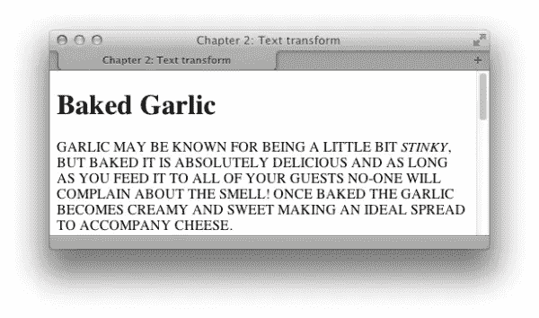

图 2.20。该段落已被转换为大写

### 讨论

`text-transform`属性还有其他有用的值。值大写将`capitalize`每个单词的第一个字母，如图 2.21 所示。这对于通过 CMS 输入文本时转换标题非常有用。用户不太可能记得正确地将所有内容大写，但是使用 CSS 可以确保文本显示整洁，不管输入了什么。但是，您应该知道，像“a”和“the”这样的词也会大写。

```
.transform {
  text-transform: capitalize;
}
```

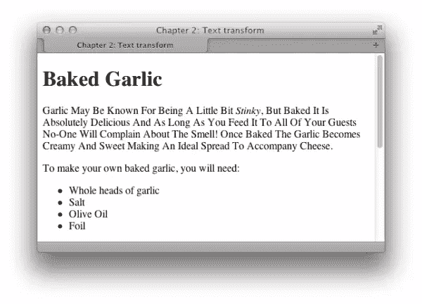

图 2.21。每个单词的第一个字母都大写了

`text-transform`属性可以采用的其他值有:

*   小写字母
*   没有人

## 我如何创建首字下沉效果？

用 CSS 可以很容易地使段落中的第一个字母变大——一种简单的首字母下沉效果。

### 解决办法

这可以通过使用`first-letter`伪类选择器来实现:

```
<h1>Baked Garlic</h1>
<p>Garlic may be known for being a little bit <em>stinky</em>, but
  baked it is absolutely delicious and as long as you feed it to all
  of your guests no-one will complain about the smell! Once baked
  the garlic becomes creamy and sweet making an ideal spread to
  accompany cheese.</p>
```

```
h1 + p:first-letter {
  font-size: 200%;
  font-weight: bold;
  float: left;
  width: 1em;
  line-height: 1;
}
```


图 2.22。简单的首字下沉效应

### 讨论

这是一个演示伪类选择器`first-letter`使用的基本例子。我还使用了一个相邻的选择器，只针对紧跟在`h1`之后的段落；如果没有这个，每个段落的第一个字母都会有首字下沉。因为浏览器对`line-height`的解释不同，结果可能会有点不一致，所以你需要做一些实验来获得令人满意的效果。

SitePoint 网站上有一篇詹姆斯·爱德华兹的有用文章，详细讨论了如何创建首字下沉效果。

## 如何更改或删除列表项上的项目符号？

### 解决办法

通过改变`list-style-type`属性，可以改变无序列表上显示的项目符号的样式。首先，这里是列表的标记:

```
<ul>
  <li>Brie</li>
  <li>Cheddar</li>
  <li>Red Leicester</li>
  <li>Shropshire Blue</li>
</ul>
```

要显示如图 2.24 所示的方形项目符号，请将`list-style-type`属性设置为方形:

```
ul {
  list-style-type: square;
}
```

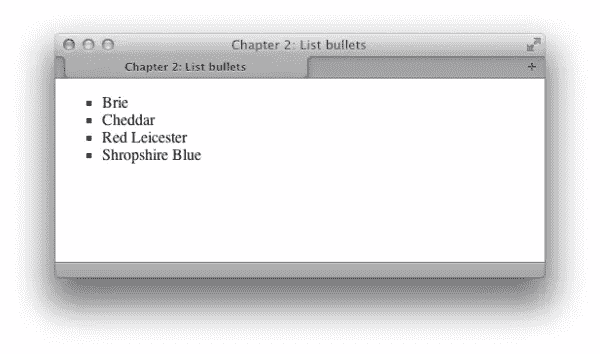

图 2.24。方形列表项目符号

### 讨论

`list-style-type`属性可以取的其他值有`disc`、`circle`、`decimal-leading-zero`、`decimal`、`lower-roman`、`upper-roman`、`lower-alpha`、`upper-alpha`和`none`。

你会发现其中一些值在某些浏览器中不受支持；那些不支持特定项目符号类型的浏览器将显示默认类型。在[列表样式类型的 CSS 测试套件](http://meyerweb.com/eric/css/tests/css2/sec12-06-02a.htm)，你可以看到不同的类型，并检查你的浏览器对它们的支持。将`list-style-type`设置为`none`将从显示中移除项目符号，尽管列表仍会缩进，就像项目符号在那里一样，如图 2.25 所示:

```
ul {
  list-style-type: none;
}
```

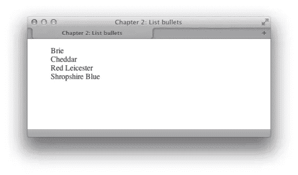

图 2.25。没有列表项目符号

## 如何为列表项目符号使用图像？

### 解决办法

创建您的图像，然后使用`list-style-image`属性而不是`list-style-image`来设置您的项目符号。此属性接受一个 URL，该 URL 可以将图像文件的路径作为一个值包含在内:

```
ul {
  list-style-image: url(bullet.gif);
}
```

图 2.26 显示了如何使用这种效果来美化一个列表。

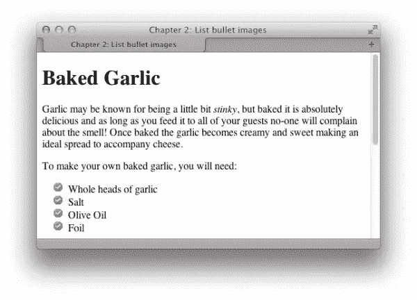

图 2.26。用于列表项目符号的图像

### 在单个列表项目上设置项目符号

`list-style-image`属性适用于列表中的列表项(`li`)元素。但是如果将`list-style-image`作为一个整体应用到列表中(`ul`或`ol`元素)，那么每个单独的列表项都会继承它。但是，您可以选择通过给每个列表项分配一个`class`或`id`来设置单个列表项的属性，为单个列表项提供它们自己独特的项目符号图像。

*这是摘自瑞秋·安德鲁*的《CSS3 选集》第四版

## 分享这篇文章