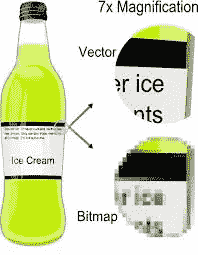
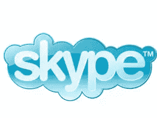
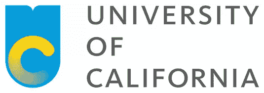
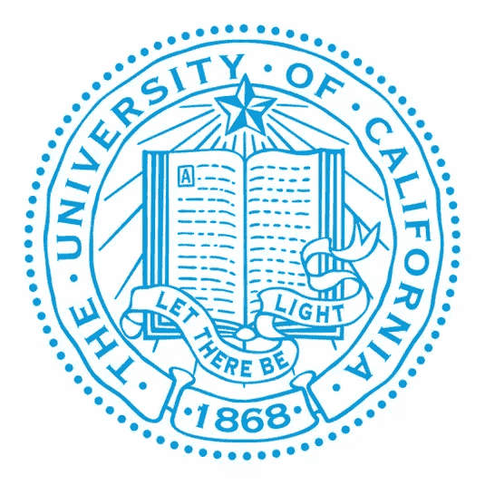
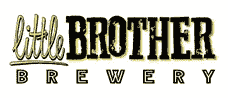
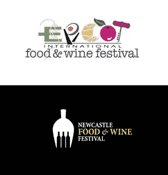
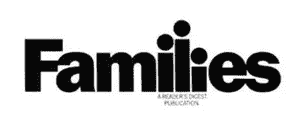

# 标志设计中的 6 个常见错误

> 原文：<https://www.sitepoint.com/6-common-mistakes-logo-design/>

可以说，对于任何品牌来说，标识都是最重要的方面。它旨在展示一个品牌的个性，并立即传达该公司所做的一目了然。

标识不应该很难弄清楚，或者有一个标识是毫无意义的——除非你的目标受众喜欢谜题，而公司制作了它们。

即便如此，一个标志也应该以一种清晰、非居高临下、即时的方式讲述一个品牌的故事。

Gap 臭名昭著的 2010 年标志重新设计反应如此之差，以至于在发布一周内就被草率废弃。

标志设计是艰难的，即使是最大的组织也可能出错。[Gap 2010 年的重新设计在一周内被撤销](http://mashable.com/2010/10/11/gap-logo/),最近，雅虎！安然度过了一个[有问题的接待他们的更名](http://www.webdesignerdepot.com/2013/09/yahoos-branding-disaster/)。

它从来都不是一门精确的科学，而且确实涉及到很高水平的创造力。

它还包括知道如何使用颜色和图像来传递信息，这意味着还需要一定的理论知识。

考虑到这一点，让我们来看看一些在标志设计中常见的错误，以及为什么它们不起作用。

## 错误#1:分辨率相关的光栅图形

我首先谈到这一点，因为我们现在牢牢地扎根于移动时代，确保徽标正确地缩放以适合其主机设备比以往任何时候都更重要。

图像需要以一致的质量出现，没有像素问题，因此光栅图形并不理想。

使用位图不再是标准的做法；大多数设计师明智地使用矢量图形，矢量图形缩放得很好，因为它们不使用像素，所以不会损失质量。

编辑矢量图形也容易得多，从最初的草图开始直接使用通常也更容易。

光栅(或基于像素的)图形与矢量图形

即使在处理更传统的打印图形时，栅格也不总是理想的。通常，当放大到更大的格式(如广告牌和横幅)时，它们会产生模糊的结果。

虽然 Photoshop 在缩放像素方面很聪明，但矢量让事情变得更简单。

但是，请记住，由于矢量处理数据的数学方式，它们对于细节颜色并不完美，并且可能无法处理阴影等样式事件。

对于在线徽标，HTML5 可以与 SVG(可缩放矢量图形)一起使用，将徽标直接嵌入代码中。这些也是非常轻量级的，非常适合响应式网站设计。它们在视网膜显示器上看起来也很棒。

## 错误 2:追随噱头、潮流和时尚

在设计领域，似乎总是有一些新的趋势在发生，无论是网页设计、平面设计，甚至是时尚。

举个例子，当前的趋势是扁平化和[极简设计](https://creativemarket.com/blog/2014/02/03/logo-design-trends-new-logos-re-designs-january-2014)。

虽然有一些令人惊叹的网站在使用这些，但你必须问自己"*这会持续下去吗？*”。

Skype 标志从 2006 年开始喊你好！

获得一个新的标识就像买一套好衣服。这应该是一项持续多年的投资——而不仅仅是这一季。

Skype 在“web 2.0”时期人造光泽塑料的鼎盛时期设计了这个标志。请放心，它在 2006 年是白热化的，但此后就像吃了一半的苹果一样老去。这是一个永远锚定在历史时刻的标志。

另一个关于用户如何对新标志做出负面反应的很好的例子是加州大学。

其新的简约标志引起了 50，000 名不满的学生和支持者的强烈抗议。一份在线请愿书(现已关闭)试图迫使该机构停止使用“monogram”，尽管它收到了:

> ..来自一群不属于这所大学的有成就的设计专家的赞扬。

新的 UC 标志

根据上尉州长加文·纽瑟姆写给大学校长的一封信，大学似乎应该在资金问题上更关注创造力，而不是理念。

最初的 UC 标志

许多附属于该大学的人认为，新的标志并没有说明该机构的任何情况。纽瑟姆指出，许多人认为:

> ..不尊重加州大学的历史和声誉。

记住这一点，确切地知道品牌想要如何表现是值得的。但是更重要的是知道它的用户和顾客想要什么。

## 错误 3:不明智地使用字体

使用字体时不要过于兴奋也是有好处的。糟糕的搭配可能看起来很傻，选择一个不适合品牌形象的搭配可能是致命的。

例如，为一个使用漫画 Sans(是的，我知道每个人都讨厌它)的律师设计一个标志，并且显得太轻松和有趣，不太可能取悦这个客户。

当勾画出最初的想法时，仔细考虑你想让字体表达什么，不是用文字，而是用感觉。

所以，前面提到的律师应该是在寻找能传递信任感和职业精神的东西。一个童装制造商可能更喜欢一些有趣的东西，同时也为父母传达了一定的质量。

选择要使用的字体时，请考虑:

*   你为之设计的公司——他们是做什么的，你应该有多正式，你想传达的主要信息是什么
*   字体如何配合整体设计
*   你如何利用负空间来获得优秀的结果

后者的一个很好的例子是著名的联邦快递标志，它在字母中使用负空间来创建一个箭头形状，暗示速度和方向。

这里有很多字体，尽管
值得称赞的是，小兄弟啤酒厂的人给
他们的决定提供了一个非常全面和合理的理由
。

标志设计的另一个常见错误是使用了过多的字体；坚持一到两个，否则会变得很乱。Julian Hanson 创作的这个[是一种关于如何使用字体的地图，作为一个通用指南很有趣也很有用。](http://www.standingdog.com/blog/wp-content/uploads/2012/03/fonts31.png)

## 错误 4:模仿成功的品牌

嗯（表示踌躇等）..奇怪的熟悉..

虽然模仿可能是最真诚的奉承，但模仿他人的设计并不酷。

首先，作为一名设计师，这说明了你什么？

它说你几乎没有创造力，并暗示了一定程度的懒惰。

使用谷歌颜色可能很有诱惑力(顺便提一下，谷歌颜色用得很好——很少在有很多颜色的情况下正确使用)。但是它对你正在为之设计标志的公司有什么影响呢？

这表明它正试图利用另一个国家的成功。不好看。

这在某种程度上把我们带回到潮流和时尚，因为当潮流正在进行时，很容易复制一些东西，甚至是不经意地，尤其是考虑到现代极简主义的当前时尚。

做你的研究，T1 永远是 T2，T3 是原创的，你的客户会感谢你，你也不会在法庭上打知识产权官司。

## 错误 5:让事情过于复杂

有时候创造一些真正展示你技能的东西是很诱人的，但是太复杂了，你聪明的设计可能会落空。首先，它可能无法在所有情况下使用，如印刷和网络，尤其是当缩小到细节会丢失。

简单是关键，原因如下:

*   即时影响:你希望客户和消费者能够在一瞬间接受商标所表达的内容
*   高记忆性:(这是一个词吗？)一个能被瞬间理解的 logo，会让人们更容易记住。
*   易于复制:它应该能够在任何媒体上以任何尺寸复制，而不会失去任何影响

比较食品和葡萄酒节标志:EPCOT vs .纽卡斯尔

让我们来看看两个具有可比性的食品和葡萄酒节标志。

EPCOT 使用以下方式讲述它的故事:

*   两种截然不同的字体
*   10x 颜色
*   1x 意大利面和叉子标志(也很难看)
*   1 套筷子和碗(我想)标志
*   1 个牛角包标志
*   1x 梅花(我想)标志
*   1x 软木螺旋标志

我仍然觉得很难把它解析成字母。

Newcastle 用一种字体、两种颜色讲述它的故事，并将两种视觉创意(叉子和瓶子)融入一个简单的形状中。

他们不需要整个分叉，只需要让它“分叉”的重要部分。我们都立刻知道它是什么。

我认为伟大的标志往往是在你把页面上所有其他不重要的元素去掉之后剩下的东西。

简单并不意味着最小。但与此同时，最好确保所有组件都能很好地协同工作，并且不会有太多的颜色和字体冲突。

## 错误 6:过于字面化

LSO 标志暗示了指挥和指挥棒。

与最后一点有点关系，请记住，徽标不是图表或指导性图纸。

伟大的 logos 往往*暗示*一个主题，但不需要准确地说明。

伦敦交响乐团不需要画小提琴、大提琴或鼓。他们著名的 LSO 字母传达了情感和能量，但也出色地暗示了一个全面飞行的指挥。

同样，面向家庭的刊头不需要详细描述具体的父母和孩子，甚至人脸和四肢。

我们的大脑被设计来扫描我们世界中的人类形象。这就是为什么我们会在云朵、树皮和面包上看到人脸——我们会直觉地认出“熊爸爸、熊妈妈、熊宝宝”这三个字母是一个小家庭。聪明。

家庭刊头。

试着抓住一个物体或组织的“本质”。你能传达一只只有爪子的熊的形象吗？或者只是一只爪子？

简单。难忘。有创意。

当然，这些只是设计一个标志时可能出现的一些错误。

有创意很重要，但也要保持简洁，谨慎使用颜色和字体，避免老套的图片。毕竟，任何人都可以得到它们。

我认为设计 logo 时需要考虑的六个最重要的事情是:

1.了解你的观众。
2。彻底了解品牌形象。
3。让最初的想法得到批准，不要让客户说得太多(记住，你是设计师)。
4。保持简单。
5。确保它适用于各种媒体。
6。让它令人难忘。

在某种程度上，设计是主观的。

但是做你的研究和确切地知道你的标志是针对谁会使它不那么重要。

如果你完全了解他们想要什么，即使他们不知道他们想要什么，你也越有可能得到正确的答案。

这当然会带来一个快乐的客户，品牌会为你这个设计师赢得客户和一个伟大的组合。

## 分享这篇文章