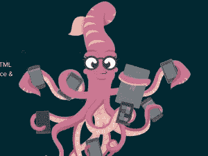
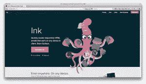
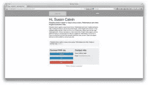
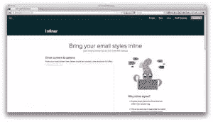
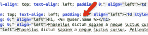
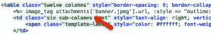

# Rails 中带有墨水的回复电子邮件

> 原文：<https://www.sitepoint.com/responsive-emails-rails-ink/>



## 为什么有反应？

如今，许多用户通过他们的移动设备阅读电子邮件(根据这个[统计](https://litmus.com/blog/48-of-emails-are-opened-on-mobile-gmail-opens-down-20-since-tabs)大约 48%)，如果你想为你的用户提供良好的用户体验，你应该考虑响应式电子邮件设计。

有几种方法可以解决这个问题。你可以自己从头开始创建电子邮件，并使用媒体查询来迎合不同的屏幕，或者你可以使用在线提供的高级和非高级模板，并根据你的需要进行修改。这些解决方案的问题是让你的电子邮件在所有的电子邮件客户端有一致的外观。Outlook 是一个很难处理回复邮件的电子邮件客户端，因为它对 CSS 的支持有限。

## 解决方法是什么？

Zurb，也就是提出了[基金会](http://foundation.zurb.com/)框架的那家公司，发布了一个名为 Ink 的电子邮件框架。据他们称，Ink 可以让你“快速创建可在任何设备&客户端上运行的响应性 HTML 电子邮件”。甚至展望。。这就是我们将在本教程中学习的内容。我们将创建一个 Rails 应用程序，在用户注册帐户后向用户发送电子邮件。



首先我们将创建一个名为 rails_ink 的新应用程序。

```
rails new rails_ink
```

出于演示目的，我们不会构建大型应用程序。我使用 scaffold 命令来生成一个用户模型及其相关的视图和控制器。

```
rails generate scaffold user name:string email:string
```

之后迁移数据库。

```
rake db:migrate
```

接下来，我们将生成邮件程序。

```
rails generate mailer UserMailer
```

这将创建一个邮件类、视图目录和一个测试文件。

接下来，我们将向`config/initializers`目录添加一个配置文件。这将保存邮件程序配置设置。为了测试，我们将使用 Gmail 的 smtp 服务器。在生产中，您可能会使用另一种交付方法，如本地服务器的 sendmail。

在`config/initializers`目录中创建一个名为`mailer_settings`的文件，并插入以下代码，根据需要进行修改。

```
ActionMailer::Base.smtp_settings = {
  :address => "smtp.gmail.com",
  :port => 587,
  :user_name => ENV['GMAIL_USERNAME'],
  :password => ENV['GMAIL_PASSWORD'],
  :authentication => "plain"
}
```

我们需要在`app/mailers/user_mailer.rb`文件中添加一个名为`registration_email`的方法。该方法将向注册的用户发送一封电子邮件。该方法将接受一个`User`对象，并将其分配给一个实例变量，以便它对我们的视图可用。由于我们的电子邮件会在横幅中有一个图像，我们必须将它作为邮件中的内嵌附件。

```
class UserMailer < ActionMailer::Base
  default from: 'example@sitepoint.com'

  def registration_email(user)
    @user = user
    attachments.inline['banner.jpeg'] = File.read("#{Rails.root}/app/asseimg/banner.jpeg")
    mail(to: user.email, subject: 'Registration Confirmation')
  end
end
```

我们现在需要为我们的电子邮件创建一个视图文件。这将位于`app/views/user_mailer`目录中，并且必须与`UserMailer`类中相应的方法同名。

在`app/views/user_mailer`中创建一个名为`registration_email.html.erb`的文件。

我们将使用 Ink [网站](http://zurb.com/ink/templates.php)上的其中一个模板。我在这个演示中使用的是基本模板。



为了简单起见，在测试过程中，我更喜欢只处理 HTML 和 CSS，直接在浏览器中运行，而不是从 Rails 应用程序中运行。完成后，我会将代码转移到我的 Rails 应用程序中。

您可以在电子邮件中链接“ink.css”文件，但这只能用于测试目的。当您对结果满意时，复制 css 并将其粘贴到 HTML 文档中的`style`标记之间。那么你应该通过一个内嵌器来运行你的邮件内容。内联器将所有样式内联，这很重要，因为一些电子邮件客户端倾向于去掉`style`标签中的 CSS。有几个在线内嵌器，但我们将使用墨水[内嵌器](http://zurb.com/ink/inliner.php)。



不要把任何 ERB 代码放在 HTML 文件中，因为内嵌器不能理解它，因此不能输出正确的 HTML。我们必须搜索并用必要的变量替换静态文本。在这里，我将用注册用户的名字替换横幅图像和收件人(Susan Calvin)的名字。

一旦我们有了电子邮件输出，将这段代码粘贴到邮件视图模板`app/views/user_mailer/registration_email.html.erb`中，并插入任何需要的变量。这里，我们将搜索字符串`Susan Calvin`，并用以下内容替换它:

```
<%= @user.name %>
```



现在，搜索我们想要替换的图像的`img`标签，并插入相应的`image_tag`。确保包含内嵌器在标签中插入的 css 样式和属性。

我把它改成了这样:

```

```

对此:

```
<%= image_tag attachments['banner.jpeg'].url, :style => "outline: none; text-decoration: none; -ms-interpolation-mode: bicubic; width: auto; max-width: 100%; float: left; clear: both; display: block;", :align=>"left" %></td>
```



在`UsersController`中，保存用户后，我们调用`UserMailer.registration_email`并传递给它`User`对象。

```
def create
  @user = User.new(user_params)

  respond_to do |format|
    if @user.save
      UserMailer.registration_email(@user).deliver
      format.html { redirect_to @user, notice: 'User was successfully created.' }
      format.json { render action: 'show', status: :created, location: @user }
    else
      format.html { render action: 'new' }
      format.json { render json: @user.errors, status: :unprocessable_entity }
    end
  end
end
```

`UserMailer.registration_email(@user).deliver`发送我们的邮件。

仅此而已。注册一个用户，在不同的客户端上测试电子邮件。

## 结论

如果你想给你的用户发送回复邮件，而不需要花钱买模板或者从头开始写代码，试试 Ink 吧。它可以用于你为你的应用程序选择的任何语言，也可以与电子邮件服务提供商合作，如 [Mailchimp](http://mailchimp.com/) 和 [Campaign Monitor](http://www.campaignmonitor.com/) 。

## 分享这篇文章