# 使用 IBM Worklight 构建混合移动应用程序，第 2 部分

> 原文：<https://www.sitepoint.com/build-hybrid-mobile-app-using-ibm-worklight-part-2/>

在本系列的前一篇教程[使用 IBM Worklight 构建移动混合应用程序，第 1 部分](https://www.sitepoint.com/build-a-mobile-hybrid-app-using-ibm-worklight-part-1/)中，我们介绍了如何设置 IBM Worklight 的开发环境，并使用 Worklight 插件的 WYSIWYG HTML5 编辑器创建了一个“Hello，World”应用程序。我们还在移动 web 浏览器模拟器中测试了 Web 应用程序。

在本文中，我们将介绍如何在原生 Android 模拟器中测试我们的应用程序，以及如何使用 Worklight 适配器将应用程序连接到后端系统。

## 准备 Android 模拟器

正如我们在第一篇文章中看到的，要构建一个 Android 原生移动应用程序，应该安装 Android SDK 和 ADT 插件。在这个强制步骤之后，我们应该创建一个 Android 设备模拟器，并检查 ADT 管理器中的更新，这样我们就不会在编译本机代码时出现问题。

首先，打开位于“android-sdks”文件夹中的 SDK 管理器，并确保您已经安装了 android SDK 工具、构建工具和 Android 平台的最新更新。

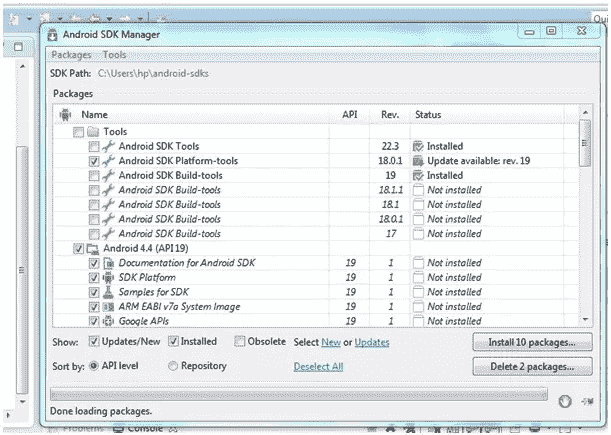

接下来，打开位于“android-sdks”文件夹中的 AVD 管理器，并通过单击“新建”按钮创建一个新的虚拟设备模拟器。之后，为 AVD 选择一个名称并选择设备:

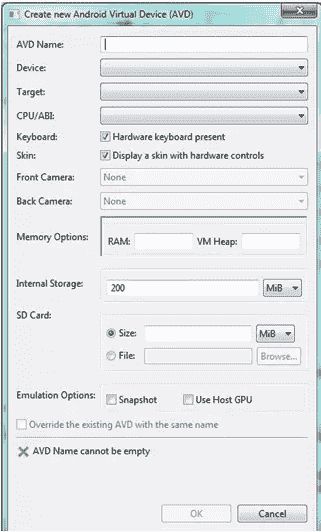

既然已经检查了 SDK 并创建了 AVD，我们应该重启 Eclipse 来保存更改。

## 模拟 AVD 中的应用

准备好 SDK 和 AVD 之后，我们现在应该能够在创建的模拟器中构建和运行 Android 原生应用程序。我们也可以得到。apk 文件，并在真正的 Android 手机上运行。

要在 AVD 中模拟应用程序，请转到第一篇文章中描述的添加 Android 环境后创建的 Android 项目，右键单击它，然后选择“Run as”。然后点击安卓应用。

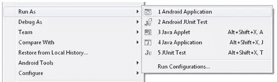

等到 Eclipse 控制台向您显示“构建成功”消息:


此时，AVD 应该会启动，在应用程序闪屏(带有 IBM 徽标)出现之前，您应该等待几秒钟。之后，应用程序应该显示在移动网络浏览器模拟器模拟的“你好”消息。

AVD 中的应用程序列表:

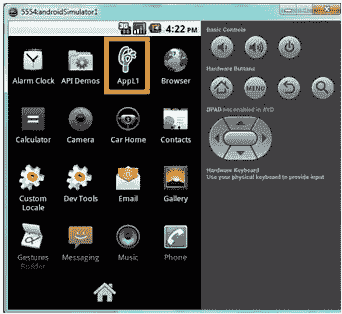

点击图标启动应用程序。现在应该会出现启动画面:

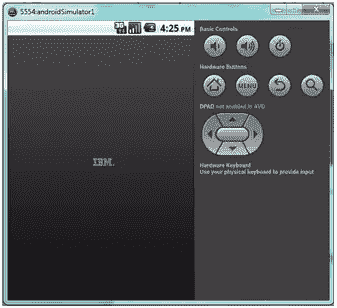

该应用现已推出:

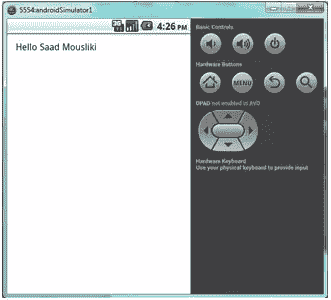

在理解了模拟从移动 web 应用程序生成的 Android 本地移动应用程序的工作流之后，我们将看到如何使用 IBM Worklight HTTP 适配器将该应用程序连接到后端服务器。

## 企业后端的架构

正如我在第一篇文章中解释的，IBM Worklight 在 Worklight 服务器端提供了几种类型的适配器。适配器可以用来与 web 服务、数据库或其他后端应用程序通信。使用适配器与第三方通信的好处是将多个请求合并成一个可以发送到移动应用程序的请求，缓存频繁请求的数据，并在使用 IBM Worklight 服务器端 JavaScript API 将数据发送到移动应用程序之前解析数据。

在我们的应用程序中，我们将使用 Wakanda 服务器通过 HTTP 适配器提供的 REST 服务，并且我们将使用 JSON 作为数据格式。

交通流量如下图所示。Worklight 移动应用程序将向包含 HTTP 适配器的 Worklight 服务器发送一个 HTTP 请求。适配器将向 Wakanda 服务器发送一个 HTTP 请求来获取数据。然后瓦坎达服务器会响应 HTTP 适配器，适配器会把数据发回手机 app。

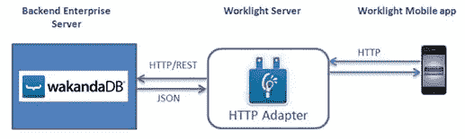

在下一步中，我们将了解如何创建 HTTP 适配器，如何编写从后端企业服务器获取数据的方法，以及如何在 Worklight 服务器中部署适配器。

## 创建新的工作灯适配器

要启动工作灯适配器向导，请单击 Eclipse 菜单栏中的工作灯图标:

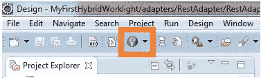

选择工作灯适配器，然后选择 HTTP 适配器作为适配器类型，并为其命名:

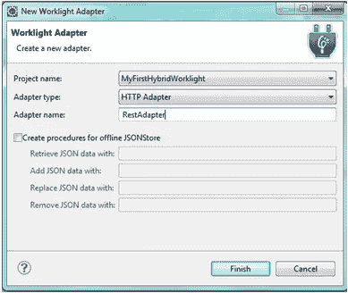

然后点击完成。

## 编辑适配器方法的代码

现在，我们应该编辑我们创建的工作灯适配器方法的代码，以指向一个后端系统。对于后端系统，我将使用在本文的[中创建的 Wakanda REST 服务。](https://www.sitepoint.com/storing-mobile-positions-remote-database-part-1/)

后端系统包含数据库，该数据库包含填充有移动设备的地理位置的数据类(表)。后端系统支持 CORS(跨源资源共享)。

接下来，在编辑器中打开“RestAdapter-impl.js”文件，将`getStories`方法名修改为`getPositions`。您还应该删除`interests`参数，添加到后端 REST 系统的路径，并修改数据类型以使用 JSON 格式:

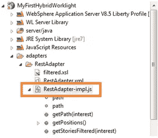

```
function getPositions() {
    path = "http://127.0.0.1:8081/rest/Position/?$top=40&$params='%5B%5D'&$method=entityset&$timeout=300&$savedfilter='%24all'";

    var input = {
        method : 'get',
        returnedContentType : 'json',
        path : path
    };

    return WL.Server.invokeHttp(input);

}
```

**注意**:确保您也修改了 RestAdapter.xml 文件中的方法名。

## 启动 Worklight 服务器来部署适配器

要启动工作灯服务器，请按照下列步骤操作:

1.  选择工作灯项目。
2.  点击“启动工作灯服务器”。
3.  将工作灯适配器部署到工作灯服务器:
    *   选择[工作灯项目]>适配器>重新适配器。
    *   选择运行方式>部署工作灯适配器。

控制台视图确认工作灯适配器在 Worklight Studio 中的成功部署。

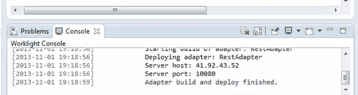

您也可以通过在浏览器中输入 web 控制台 URL 来验证适配器是否已成功部署到服务器:

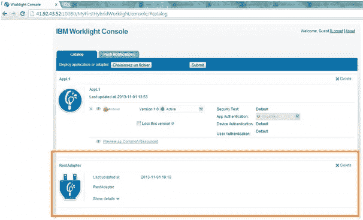

## 概括起来

本教程到此为止。如果你有过在 IBM Worklight 中创建混合应用程序的类似经历，一定要在评论中分享你的想法！

## 分享这篇文章