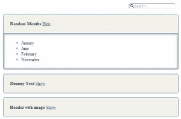

# 介绍一个可访问的折叠式小部件

> 原文：<https://www.sitepoint.com/introducing-accessible-accordion-widget/>

在千禧年的黎明，一位盲人绅士成功地起诉了悉尼奥运会组委会，因为他们没有让盲人用户充分访问奥运会的官方网站。多年来，许多这样的案例被曝光，许多国家通过了许多法案，强制要求你的网站具有充分的可访问性。

今天，许多 JavaScript 库提供了各种各样的小部件，如滑块和菜单栏，但是开发人员经常选择忽略可访问性。jQuery Accordion 小部件就是这样一个例子。accordion 是一个有用的小部件，它解决了在空间有限的区域显示内容的问题。

## 问题是

使用 jQuery 1.9.1、jQuery UI 1.10.4 和 Chrome 32，无法在折叠标题中切换。但是，一旦折叠面板被激活，您可以使用上下箭头键浏览标题，并按回车键取消折叠(这本身并不直观)。其次，屏幕阅读器(在本例中是 NVDA)没有办法读取刚刚未折叠区域中的内容。

在谷歌 2013 年代码之夏期间，我正在从事包容性设计研究所的 ATutor 项目。ATutor 是一个开源的学习内容管理系统，它完全符合可访问性规范。我们遇到了一个严重的问题——课程页面中的数据。它通常会列出所有课程及其相应的信息，这使得使用辅助技术(AT)的人很难轻松导航。一个解决方案是手风琴，但它符合 ATutor 设定的高无障碍标准。

## a11 分类

我的项目导师 Alexey Novak 为 AContent 开发了类似的东西，a content 是一个内容创作系统，用于创建基于 web 的学习内容。然后开发了一个独立的版本并开源，这样它就可以用于 ATutor 项目以及其他任何项目。

这个项目有两个主要目标——只有键盘的用户必须能够相对容易地浏览小部件，屏幕阅读器必须能够读出小部件中的所有内容。

在当前版本中，你可以使用键盘浏览整个小部件，屏幕阅读器也可以阅读内容。如果你使用搜索栏，标题是动态变化的，这使得屏幕阅读器读出它来更新你的搜索结果的数量。

### 快速启动

该项目托管在 GitHub 上，你可以下载[源代码](https://github.com/anvk/a11yAccordion)。还有一个[演示](http://anvk.github.io/a11yAccordion/example.html)，你可以在下载前观看。注意，您需要包含 CSS ( `dist/css/a11yAccordion.css`)和 JavaScript ( `dist/js/a11yAccordion-0.2.2.min.js`)文件。或者，您可以使用 grunt 编译它。

示例 accordion 的标记如下所示。

```
<ul class="a11yAccordion" id="Accordion1">
  <li class="a11yAccordionItem">
    <div class="a11yAccordionItemHeader">
      <strong>Random Months</strong>
    </div>
    <div class="a11yAccordionHideArea">
      <ul>
        <li>January</li>
        <li>June</li>
        <li>February</li>
        <li>November</li>
      </ul>
    </div>
  </li>
  <li class="a11yAccordionItem">
    <div class="a11yAccordionItemHeader">
      <strong>Dummy Text</strong>
    </div>
    <div class="a11yAccordionHideArea">
      Lorem ipsum dolor sit amet, consectetur adipisicing elit, sed do eiusmod tempor incididunt ut labore et dolore magna aliqua. Ut enim ad minim veniam, quis nostrud exercitation ullamco laboris nisi ut aliquip ex ea commodo consequat.
    </div>
  </li>
  <li class="a11yAccordionItem">
    <div class="a11yAccordionItemHeader">
      <strong>Header with image</strong>
    </div>
    <div class="a11yAccordionHideArea">
      
    </div>
  </li>
</ul>
```

操纵之前定义的 accordion 所需的 JavaScript 代码如下所示。

```
var myAccordion = a11yAccordion({
  parentSelector: '#Accordion1'
});
```

生成的折叠显示在下图中。



### 使用小部件

a11yAccordion 的最新版本可以在 GitHub 上找到。克隆存储库或将其下载为 zip 文件以开始使用。由于小部件是基于 jQuery 1.10 0 构建的，所以在启动小部件之前，您需要包含 jQuery。

正如您已经看到的，options 对象被传递给 accordion 的 JavaScript 构造函数。a11yAccordion 支持以下选项。

*   `parentSelector`–具有折叠标记的父容器的选择器。这默认为`undefined`。
*   `accordionItemSelector`–包含标题和隐藏区域的行的选择器。这默认为`.a11yAccordionItem`。
*   `headerSelector`–行内标题的选择器。这默认为`.a11yAccordionItemHeader`。
*   `hiddenAreaSelector`–折叠行内隐藏区域的选择器。默认为`.a11yAccordionHideArea`。
*   `visibleAreaClass`–添加到将被取消折叠/对用户可见的每一行的类。默认为`.visibleA11yAccordionItem`。
*   `colorScheme`–手风琴的配色方案。默认为`.light`。
*   `speed`–以毫秒为单位的动画速度。默认为 300。
*   `hiddenLinkDescription`–为使用辅助技术的用户提供的每个显示/隐藏链接的描述。
*   `showSearch`–一个布尔选项，告诉手风琴呈现搜索选项。
*   `showOne`–一个布尔值，它定义了 accordion 是否一次只能向用户取消折叠一行。
*   `overallSearch`–一个布尔选项，告诉搜索不仅要在标题中查找，还要在折叠区域中查找。

#### API

a11yAccordion 还带有一个 JavaScript API，允许编程操作。API 函数描述如下。

*   `collapseRow(rowIndex)`–该功能隐藏对应`rowIndex`行下的隐藏区域。
*   `uncollapseRow(rowIndex)`–该功能显示对应`rowIndex`行下的隐藏区域。
*   `toggleRow(rowIndex)`–该函数在折叠和未折叠之间切换行的状态。
*   `getRowEl(rowIndex)`–该函数返回带有相应`rowIndex`的 jQuery 行元素。
*   `showOne`–这是一个布尔值，一次只向用户显示一个未折叠的行。

## 未来

虽然我们已经从一个简单的手风琴走了很长的路，但还有很多事情要做。[问题页面](https://github.com/anvk/a11yAccordion/issues?state=open)跟踪我们的近期计划。举个例子，我们计划添加一个函数，帮助以编程方式禁用行。

### 为项目做贡献

这个项目很有潜力，但是需要开发商和设计师的帮助。派生并克隆 [GitHub 库](https://github.com/anvk/a11yAccordion/)来贡献。开发者需要安装 Grunt 并运行`npm install`在本地设置系统。设计者也可以直接在 LESS 文件中添加主题。

## 分享这篇文章