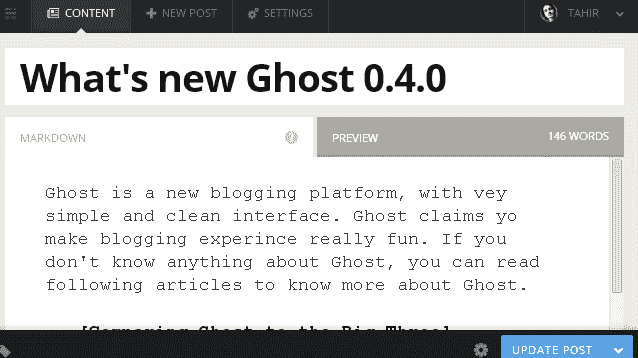
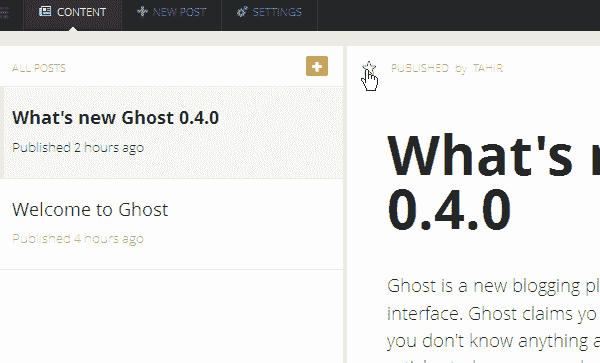
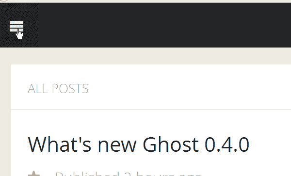
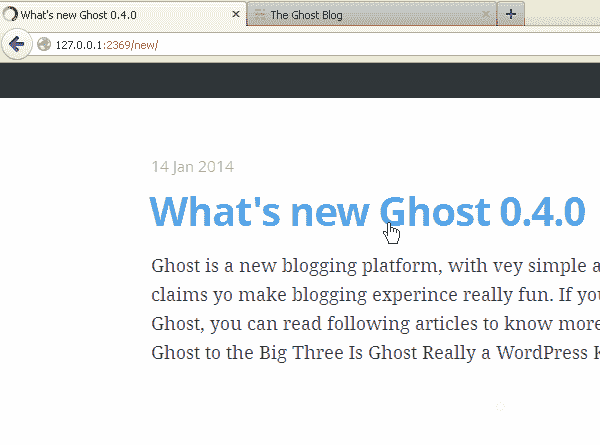
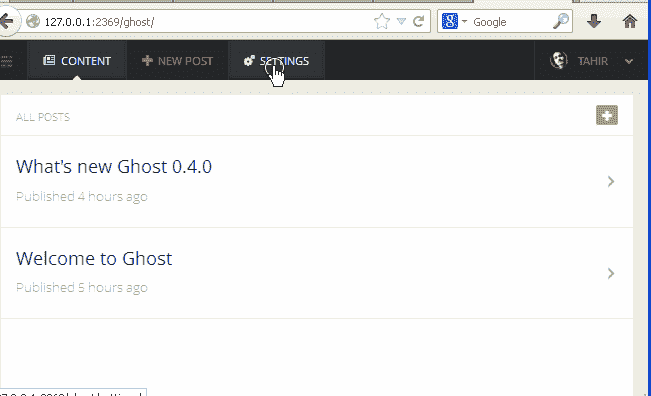
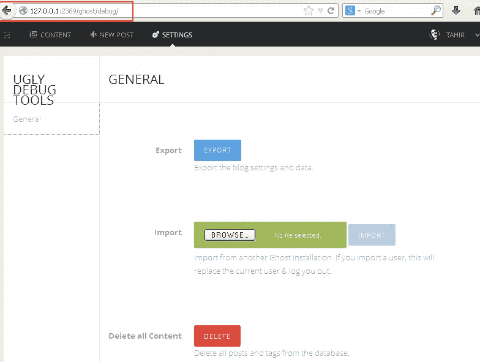

# Ghost 0.4 有什么新功能？

> 原文：<https://www.sitepoint.com/whats-new-ghost-04/>

Ghost 是一个新的博客平台，有一个简单干净的界面，提供发布工具，使博客体验变得简单有趣。如果你想了解 Ghost 是怎么回事，你可以看看下面的文章:

*   [将 Ghost 比作三巨头](https://www.sitepoint.com/comparing-ghost-to-the-big-three/)
*   《幽灵》真的是 WordPress 黑仔吗？
*   [如何在 Windows 上安装 Ghost](https://www.sitepoint.com/install-ghost-windows/)

同时，让我们考虑一下 Ghost 的最新版本提供了什么。

## ghost 0.4–Aton 发布

2014 年 1 月 13 日，Ghost 0.4 发布，增加了许多新功能、改进和修复。在一篇博文中，约翰·奥诺兰(Ghost 的创始人)[写道](http://blog.ghost.org/ghost-0-4/):

> 它是一个更干净，更快，更复杂的幽灵。

让我们看看 Ghost 在这个新版本中的一些主要变化。

(如果你想知道这个版本的名字——Aton——根据约翰的博客帖子，这是一个埃及神的名字，这是第一个以 Kickstarter 的三个支持者之一命名的 Ghost 版本，他们承诺了 1000 英镑。)

## 怎么样

我们来看看新功能。

### 静态页面

您现在可以在 Ghost 中轻松创建静态页面(关于、联系等)。然而，没有一个新的屏幕来创建页面。你只需点击顶部菜单中的“新帖子”链接，给你的帖子起一个标题(例如“关于我们”)，然后写下帖子的内容。在点击“发布”按钮之前，从“帖子设置”菜单中选择“静态页面”复选框，这将从你的帖子源中删除你的页面。

### 特色帖子

您现在可以将您的帖子标记为“特色”。如果你愿意的话，你可以在你的主题中设计特色文章。要将帖子设置为“精选”，请转到内容部分，在那里您可以看到所有带有实时预览的帖子，然后单击星形图标将您想要的帖子设置为“精选”。

### 新装载栏

当 Ghost 正在加载内容时，一个蓝色的小条会在屏幕上爬行，让您知道，如下图所示。

### 快速帖子编辑

Ghost 让编辑任何帖子变得非常简单。只需在任何帖子的 URL 末尾键入`edit`并按回车键，这将把你带到帖子编辑屏幕，在那里你可以开始编辑所选的帖子。

### 基于日期的永久链接支持

Ghost 现在支持基于日期的永久链接结构。这可以从常规设置菜单中启用。点击标题工具栏上的“设置”，然后选择“日期永久链接”。

### 其他流产变化

其他新功能和更新包括:

*   子目录支持
*   用户图像的 Gravatars
*   SSL 支持
*   博客创建的欢迎邮件
*   可用的更新通知
*   更安全的密码重置过程
*   在内容屏幕上按发布日期排序
*   添加媒体时支持 SVG 图像

这还不是全部。您可以阅读[Ghost 0.4–Aton 发行说明](https://github.com/TryGhost/Ghost/wiki/Release-Notes:-0.4.0)来查看所有新功能和错误修复。

### 如何升级

如前所述，Ghost 0.4 引入了自动更新检查服务，让您知道 Ghost 的新版本何时可用。如果您愿意，可以在任何时候用 config.js 中的标志禁用该服务。

如果你用的是 Ghost 的托管平台，你的博客会自动更新。如果您在自己的服务器上运行 Ghost，您将需要[下载 Ghost 0.4](https://ghost.org/download/) ，然后阅读 [Ghost 升级文档](http://docs.ghost.org/installation/upgrading/)以了解如何升级。

当然，强烈建议您在升级前进行备份。要备份您的数据库，请登录您的 Ghost 博客并转至`http://your-blog/ghost/debug/`，您将看到以下屏幕。

## 摘要

Ghost 与 WordPress 有很多相似之处，但是如果你正在寻找更注重发布和简单性的东西，它是值得一试的。如果你已经尝试过 Ghost 或者检查过其中的一些新功能，我们很想听听你的看法。

## 分享这篇文章