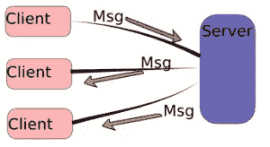

# Ruby TCP 聊天

> 原文：<https://www.sitepoint.com/ruby-tcp-chat/>

今天，我们将使用 ruby 标准库套接字构建一个小的 TCP ruby 聊天应用程序。我用的是 ruby 2.0.0 和 Ubuntu Linux 12.04LTS，但它应该也能在 Mac OS 上运行。我没有在 Windows 上试过。

首先简要概述 TCP(传输控制协议):

> TCP 是互联网协议族(IP)的核心协议之一，并且如此普遍，以至于整个协议族通常被称为 TCP/IP。Web 浏览器在连接到万维网上的服务器时使用 TCP，它用于发送电子邮件和将文件从一个位置传输到另一个位置。欲了解更多详细信息，请访问 [TCP 维基百科](https://en.wikipedia.org/wiki/Transmission_Control_Protocol)

我们的 TCP 聊天是这样进行的:



## 描述

首先，我们将创建一个服务器来接收客户端连接，并将它们存储在数据字典中。这些字典将跟踪客户位于哪个房间，接收消息，并将消息转发给其他用户。每个用户必须有一个不同的用户名，这将是我们在数据字典中查找我们的连接的主键，这样我们就可以跟踪连接的用户。现在，我们不打算将消息存储在数据库中，但是添加这样一个特性并不需要太多。完成后，我们将打开不同的命令终端来测试我们的聊天，每个模拟用户一个终端。

首先，我们将创建必要的文件:“server.rb”和“client.rb”，在 server.rb 和 client.rb 中，我们需要[套接字库](http://www.ruby-doc.org/stdlib-2.0.0/libdoc/socket/rdoc/Socket.html)。

```
# in client.rb and server.rb
require "socket"
```

然后用一些属性创建各自的类来处理用户。

客户端接收一个服务器实例，这样它就可以与服务器建立连接。我们需要初始化一个请求和响应来通过服务器发送和接收消息。现在我们的`@response`和`@request`对象是空的，但是稍后我们将构建两个线程，并把它们分配给我们的对象来同时读写。

```
# in client.rb
require "socket"
class Client
  def initialize(server)
    @server = server
    @request = nil
    @response = nil
  end
end
```

如果您想了解有关线程的更多信息，请查看:

*   [红宝石中的线程](https://www.sitepoint.com/threads-ruby)
*   [红宝石螺纹](http://ruby-doc.org/core-2.0.0/Thread.html)
*   [Ruby 多线程](http://www.tutorialspoint.com/ruby/ruby_multithreading.htm)

这是我们服务器的开始。服务器接收一个端口，该端口将成为我们在用户之间建立连接的通道。服务器监听端口上的任何事件，并向每个感兴趣的人发送响应。初始化器还创建了三个 3 哈希:

*   `@connections`是连接到服务器的用户池。
*   `@rooms`键入房间名称，保存每个房间的用户。
*   `@clients`是我们连接的客户端实例

```
#in server.rb
require "socket"
class Server
  def initialize(port, ip)
    @server = nil
    @connections  = {}
    @rooms = {}
    @clients = {}
  end
end
```

现在我们可以跟踪哪个用户在哪个房间。需要重申的是，客户端名称/用户名必须是唯一的。下面是一些数据的哈希值

```
# hash Connections preview
connections: {
  clients: { client_name: {attributes}, ... },
  rooms: { room_name: [clients_names], ... }
}
```

然后我们需要在客户端创建两个线程，这样它就可以同时读/写消息。如果没有这个功能，我们的聊天会很无聊。想象一下，输入你的信息，只有在完成后才能寻找答案，而不可能同时做这两件事。这是大多数聊天客户端的基本工作方式。

```
# ( @request, @response ) objects preview and descriptions
# The request and response objects implementation may look like this

# in client.rb
def send
  @request = Thread.new do
    loop { # write as much as you want
      # read from the console
      # with the enter key, send the message to the server
    }
  end
end

def listen 
  @response = Thread.new do
    loop { # listen for ever
      # listen the server responses
      # show them in the console
    }
  end
end
```

以下是 client.rb 文件:

```
#!/usr/bin/env ruby -w
require "socket"
class Client
  def initialize( server )
    @server = server
    @request = nil
    @response = nil
    listen
    send
    @request.join
    @response.join
  end

  def listen
    @response = Thread.new do
      loop {
        msg = @server.gets.chomp
        puts "#{msg}"
      }
    end
  end

  def send
    puts "Enter the username:"
    @request = Thread.new do
      loop {
        msg = $stdin.gets.chomp
        @server.puts( msg )
      }
    end
  end
end

server = TCPSocket.open( "localhost", 3000 )
Client.new( server )
```

在服务器端，我们需要类似的东西，基本上每个连接的用户一个线程。这样，我们可以在没有任何并发问题的情况下处理尽可能多的用户。

```
# in server.rb
def run
  loop {
    Thread.start do |client| # each client thread
    end
  }
end
```

对于我们的测试，IP ip 是本地的。客户端和服务器端的端口必须相同，在这种情况下。请记住，端口是虚拟的:

> 端口不是一个物理设备，而是一个抽象概念，便于服务器和客户端之间的通信。一台机器最多可以有 65536 个端口号(范围从 0 到 65535)。端口号分为三个范围:众所周知的端口、注册端口以及动态和/或专用端口。–[TCP 和 UDP 的简要描述](http://agenda.ictp.trieste.it/agenda_links/smr1335/networking/node28.html)

我们还将清除消息末尾的所有多余字符，如行尾、制表符等。

实现非常简单。我们所需要的就是用`run`方法结束，并验证所提供用户名的唯一性。如果用户名被占用，用一个错误消息告诉客户端并终止连接。否则，给客户端一个成功的连接消息。

```
# server.rb ( server side )
class Server
  def  initialize(port,ip)
    @server = TCPServer.open(ip, port)
    ...
  end

  def run
    loop {
      # for each user connected and accepted by server, it will create a new thread object
      # and which pass the connected client as an instance to the block
      Thread.start(@server.accept) do | client |
        nick_name = client.gets.chomp.to_sym
        @connections[:clients].each do |other_name, other_client|
          if nick_name == other_name || client == other_client
            client.puts "This username already exist"
            Thread.kill self
          end
        end
        puts "#{nick_name} #{client}"
        @connections[:clients][nick_name] = client
        client.puts "Connection established, Thank you for joining! Happy chatting"
      end
    }
  end
end
server = Server.new("localhost", 3000) # (ip, port) in each machine "localhost" = 127.0.0.1
server.run
```

现在我们的聊天就要结束了，但是还有一种方法可以处理所有连接用户之间的所有消息。没有它，我们的用户将无法相互发送消息。

```
# in server.rb
def listen_user_messages(username, client)
  loop {
    # get client messages
    msg = client.gets.chomp
    # send a broadcast message, a message for all connected users, but not to its self
    @connections[:clients].each do |other_name, other_client|
      unless other_name == username
        other_client.puts "#{username.to_s}: #{msg}"
      end
    end
  }
end
```

所有的`listen_user_messages`方法所做的就是监听用户消息并将它们发送给所有其他用户。现在，在服务器实例的`run`方法中调用这个方法，就这样。

```
# in server.rb
def run
  loop {
    Thread.start(@server.accept) do | client |
      ...
      listen_user_messages(nick_name, client)
    end
  }
end
```

以下是完整的 server.rb 文件:

```
#!/usr/bin/env ruby -w
require "socket"
class Server
  def initialize( port, ip )
    @server = TCPServer.open( ip, port )
    @connections = Hash.new
    @rooms = Hash.new
    @clients = Hash.new
    @connections[:server] = @server
    @connections[:rooms] = @rooms
    @connections[:clients] = @clients
    run
  end

  def run
    loop {
      Thread.start(@server.accept) do | client |
        nick_name = client.gets.chomp.to_sym
        @connections[:clients].each do |other_name, other_client|
          if nick_name == other_name || client == other_client
            client.puts "This username already exist"
            Thread.kill self
          end
        end
        puts "#{nick_name} #{client}"
        @connections[:clients][nick_name] = client
        client.puts "Connection established, Thank you for joining! Happy chatting"
        listen_user_messages( nick_name, client )
      end
    }.join
  end

  def listen_user_messages( username, client )
    loop {
      msg = client.gets.chomp
      @connections[:clients].each do |other_name, other_client|
        unless other_name == username
          other_client.puts "#{username.to_s}: #{msg}"
        end
      end
    }
  end
end

Server.new( 3000, "localhost" )
```

这是我们在我的终端上进行的聊天。在未来的文章中，我们将建立聊天室，发送私人信息，以及更多的酷的东西来定制我们的聊天。

## 让我们看看我们的小聊天

#### 初始化服务器

```
RubyChat: ./server.rb
```

#### 初始化客户端 Simon

```
RubyChat: ./client.rb
Enter the username:
Simon
Connection established, Thank you for joining! Happy chatting
```

#### 初始化客户端 Foo

```
RubyChat: ./client.rb
Enter the username:
Foo
Connection established, Thank you for joining! Happy chatting
```

#### 西蒙发来的信息

```
RubyChat: ./client.rb
Enter the username:
Foo
Connection established, Thank you for joining! Happy chatting
Hi! It's Simon!
```

#### 在 Foo 的终端上收到来自 Simon 的消息

```
RubyChat: ./client.rbEnter the username:
Foo
Connection established, Thank you for joining! Happy chatting
Simon: Hi! It's Simon
```

#### 从 Foo 发送的消息

```
RubyChat: ./client.rbEnter the username:
Foo
Connection established, Thank you for joining! Happy chatting
Simon: Hi! It's Simon
Hey Simon! Foo here.
```

#### 从 Simon 终端上的 Foo 收到的消息

```
RubyChat: ./client.rb
Enter the username:
Simon
Connection established, Thank you for joining! Happy chatting
Hi! It's Simon!
Foo: Hey Simon! Foo here!
```

#### 服务器-客户端连接

```
RubyChat: ./server.rb
Simon #<TCPSocket:0x007fbc94836820>
Foo #<TCPSocket:0x007fbc94834a98>
```

### 后续步骤

*   [教程要点](http://www.tutorialspoint.com/ruby/ruby_socket_programming.htm)
*   [TCP 套接字书](http://www.jstorimer.com/products/working-with-tcp-sockets)

## 编码快乐！

## 分享这篇文章