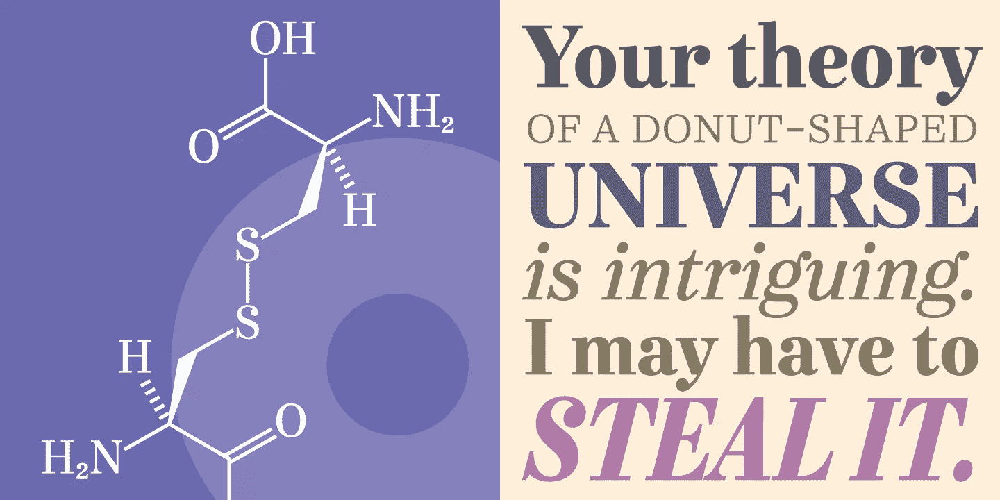
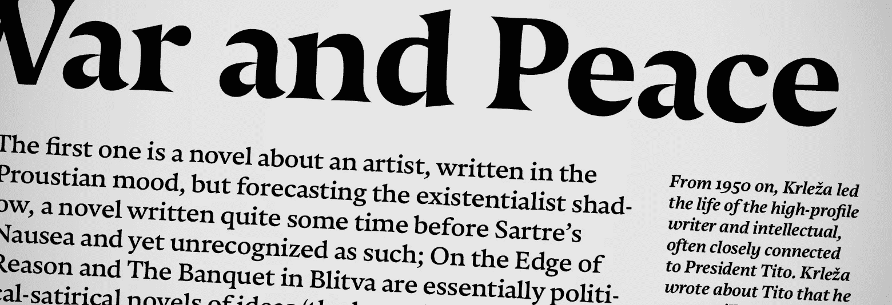
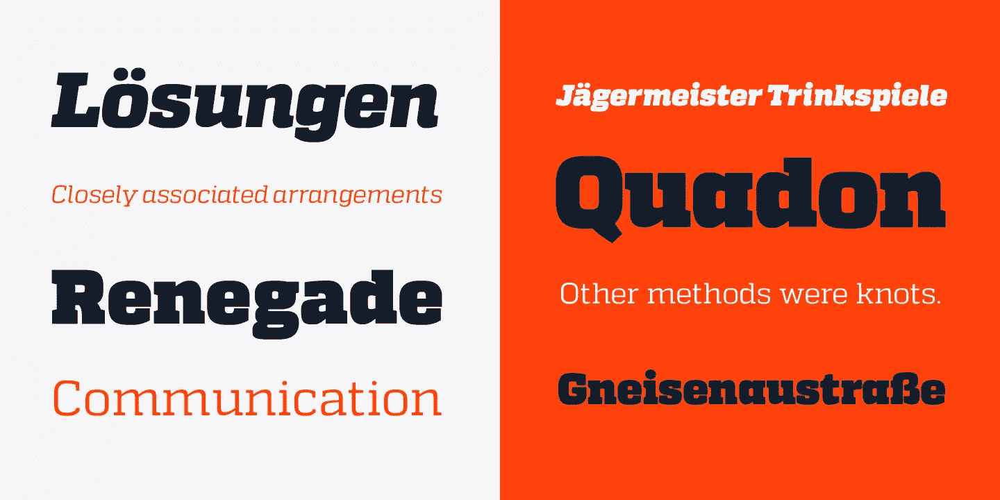
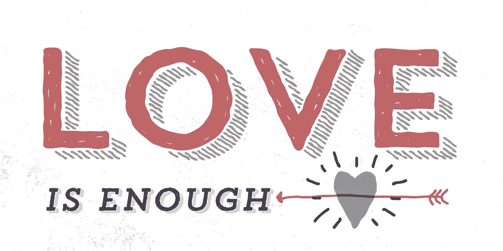
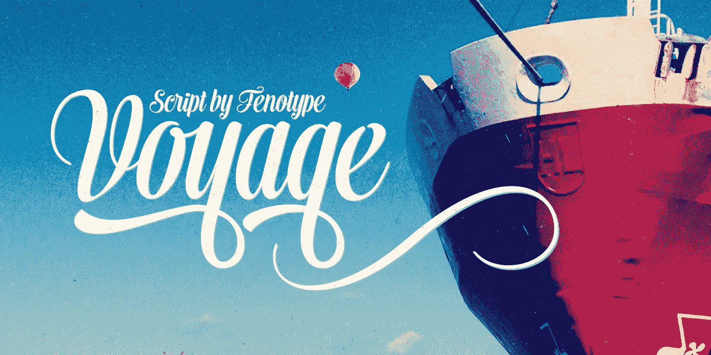

# 2014 年五大最佳新字体

> 原文：<https://www.sitepoint.com/top-5-best-new-fonts-2013/>

因此，2013 年来了又走了，一路上迎来了许多新趋势，正如它所看到的那样。虽然简单设计的概念从未真正过时，但它可以说在网页设计中扮演了一个更加重要的角色，作为使网站及其内容在最大范围的设备上可访问的主要方法。

虽然“skeumorphism”——将现实世界的特征设计到数字界面中——越来越被视为一种设计失误，但“扁平化设计”运动继续赢得设计界的关注。这最后一个趋势标志着对极简主义的普遍偏好，平面色彩和对高质量排版的重视。

当然，排版一直是现代平面设计中的主导元素。事实上，类型的选择，结合对颜色和比例的感觉，可能是从人群中区分高质量设计的最可靠的方法。

因此，记住这一点，让我们来看看一些准备在 2014 年成为主流的新字体。

当然，创造出前五名并不是一件容易的事情——有许多字体受到了认真的考虑——但我们最终不得不挑选出以下几种。

# 我们 2014 年的 5 大最佳新字体是:

## 催促文本

字体设计师戴夫·罗兰将其定义为“半斜体”字体。事实上，字母的顶部有一个自然的斜体形式，而较低的字形是受罗马风格的启发。

字体系列由六种不同的粗细组成，所有字体都有轻体和粗体两种风格，标准连字，区分大小写的形式和自动分数。敦促文本绝对是一种字体，可以适应不同的印刷场景，它不应该在你的电脑上丢失。

[你可以在这里找到字体](http://www.myfonts.com/fonts/schizotype/urge-text/):购买整个字体包将花费你大约 240 美元，但对于你的钱来说，这是一个很大的字体。

## 晚上吗

Nocturno 是一种专为别致和非常时尚的文本和标题设计的字体，它的特点是有效的比例和大开口，使字体非常易读。

斜度、宽度、形状和重量之间的对比使我们有可能在正面和负面的文章中使用这种字体。

Nocturno 可以从 Typonine 网站下载，根据你想购买的许可证类型，价格从 6 欧元到 369 欧元不等(单个重量为 70 欧元)。

## quando

Quadon 是德国设计师 Rene Bieder 创造的字体。它的目的是在过去和现在之间建立联系，前者以使用衬线字体为代表，后者以使用无衬线字体的新趋势为代表。它看起来现代、轻盈、灵活，由于其开放和宽大的外形，阅读起来不费吹灰之力。

Quadon 有九种不同的权重，每一种都有自己的斜体，它还有几个可选的字形，使字体高度可定制；因此，它可以用于各种设计目的。

这里是[字体下载页面](http://www.myfonts.com/fonts/rene-bieder/quadon/)，套装售价 250 美元，我认为对于这样一个多功能的字体来说，这是一笔很大的投资。

## 潮流手工制作

Trend Hand Made 是由设计二人组 Daniel Hernandez 和 Paula Nazal Selaive 创造的字体，他们说他们在“观察、搜索和研究全球趋势”后设计了这种字体。

创作者希望表达时尚和风格的纯粹之美，从 sans slab 字体开始。当然，这里有一点时髦，但这不是一件坏事。只需 159 美元，你就可以让[潮流手工制作](http://www.youworkforthem.com/font/T4415/trend-hand-made)成为你的专属——这是对优秀、独特作品的恰当奖励。

## 航行

埃米尔·卡尔·贝尔泰尔创造的这种字体是一种简单友好的字体，似乎在过去和旧字体之间架起了一座桥梁。它优雅、经典、高雅，因此可以用于不同的目的，从广告到书籍封面到标题。

Voyage 包装有两个砝码，外加一套饰品。想知道从哪里获得这种字体？在这个链接可以很容易地下载到它，我认为 50 美元很便宜。

## 分享这篇文章