# 2013 年 100 大 jQuery 插件(第 5/5 部分)

> 原文：<https://www.sitepoint.com/top-100-jquery-plugins-year-2013-part-55/>

从 100 开始倒数，以下是我们认为的 2013 年最好的 jQuery 插件。这里是 20-1 个条目。注意:如果在 2013 年进行了重大升级，一些旧插件可能会出现。

## 20.自定义滚动条

自定义滚动条插件，完全可定制的 CSS。具有垂直/水平滚动，鼠标滚轮支持(通过 jQuery mousewheel 插件)，滚动按钮，滚动惯性，自动调整滚动条长度，嵌套滚动条，滚动到功能，用户定义的回调等等。

[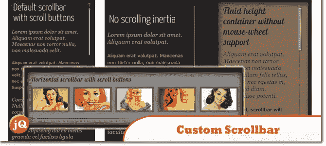](http://manos.malihu.gr/tuts/custom-scrollbar-plugin/complete_examples.html) 
[源+演示](http://manos.malihu.gr/tuts/custom-scrollbar-plugin/complete_examples.html)

## 19.Adipoli jQuery 图像悬停插件

Adipoli 是一个简单的 jQuery 插件，用于带来时尚的图像悬停效果。

[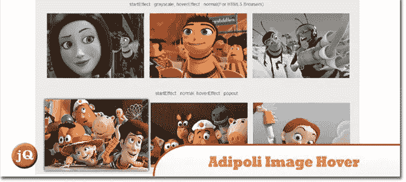](http://cube3x.com/adipoli-jquery-image-hover-plugin/) 
[来源](http://cube3x.com/adipoli-jquery-image-hover-plugin/) [演示](http://cube3x.com/demo/adipoli-jquery-image-hover-plugin/)

## 18\. Mobi Pick

jQuery Mobile 的一个 Android 风格的 datepicker 小部件。它使用日期库 XDate，并允许使用 Modernizr 对日期输入字段进行渐进增强。

[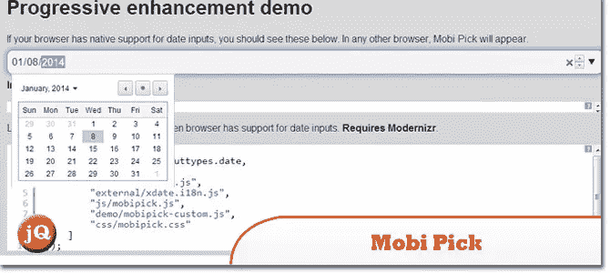](http://mobipick.sustainablepace.net/) 
[来源](http://mobipick.sustainablepace.net/) [演示](http://mobipick.sustainablepace.net/demo-progressive-enhancement.html)

## 17.欧芹. js

Javascript 表单验证，无需实际编写一行 javascript 代码！

[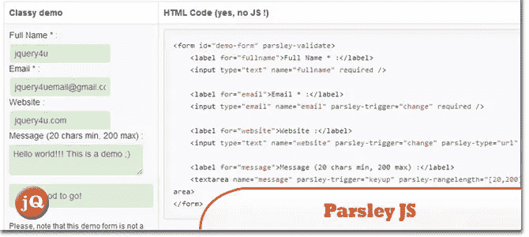](http://parsleyjs.org/documentation.html) 
[源+演示](http://parsleyjs.org/documentation.html)

## 16.选择 2

一个基于 jQuery 的选择框的替代品。它支持搜索、远程数据集和结果的无限滚动。

[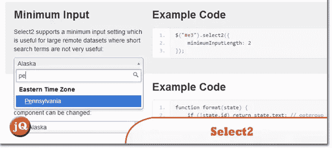](http://ivaynberg.github.io/select2/) 
[源+演示](http://ivaynberg.github.io/select2/)

## 15.jQuery UI 映射

用于 jQuery 和 jQuery Mobile 的 Google map v3 插件

 
[来源](https://code.google.com/p/jquery-ui-map/) [演示](http://jquery-ui-map.googlecode.com/svn/trunk/demos/jquery-google-maps-mobile.html)

## 14.Hook.js

拉动刷新。对于网络来说。

 
[源+演示](http://usehook.com/)

## 13.ModalBox

一个强大的 jQuery 插件，可以用来高亮显示照片、视频、地图、AJAX 内容或内嵌 HTML 内容。ModalBox 还可以用来显示警告、确认或提示框。

[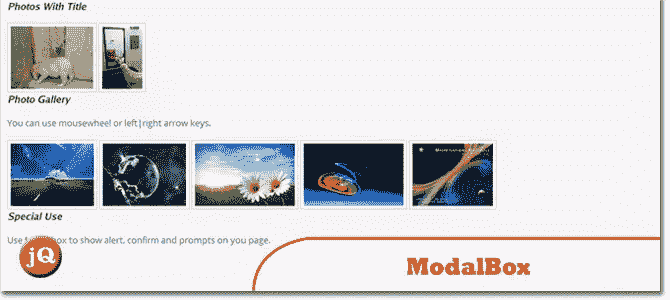](http://www.rudrasofttech.com/modalbox) 
[来源](http://www.rudrasofttech.com/modalbox) [演示](http://www.rudrasofttech.com/modalbox#examples)

## 12.伊庇鲁斯

它是免费 iPicture jQuery 插件的一个发展。iPicture 使用 javascript 和 css3 创建带有额外描述、嵌入视频、链接或其他任何内容的交互式图片。

 
[来源](http://ipicture-square.justmybit.com/) [演示](http://ipicture-square.justmybit.com/clothes.html)

## 11.画布查询

HTML5 Canvas 元素的包装器库，允许它与类似 jQuery 的语法一起使用。它还增加了许多常用的图像处理方法，方便了游戏开发者。

[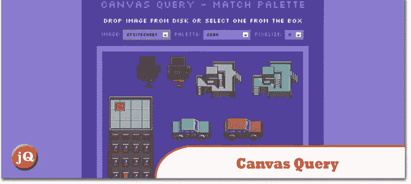](http://canvasquery.com/) 
[来源](http://canvasquery.com/) [演示](http://canvasquery.com/examples/matchPalette/)

## 10.百分比加载器

一个 jQuery 插件，用于以比普遍存在的水平进度条/文本计数器更醒目的方式显示进度小部件。

[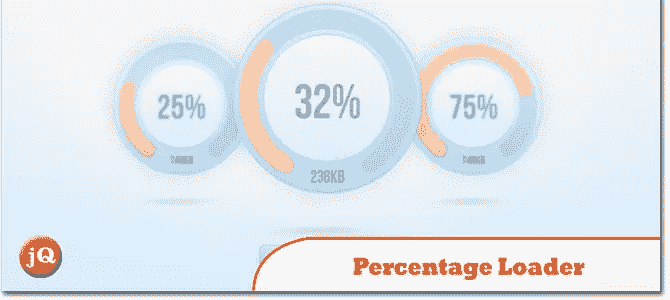](http://widgets.better2web.com/loader/) 
[源+演示](http://widgets.better2web.com/loader/)

## 9.Moment.js

一个 javascript 日期库，用于解析、验证、操作和格式化日期。

[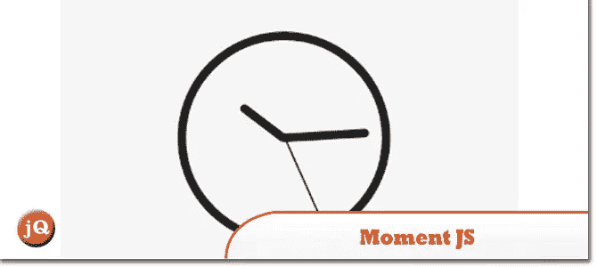](http://momentjs.com/) 
[源+演示](http://momentjs.com/)

## 8.Chart.js

面向设计者和开发者的简单、面向对象的客户端图表。

[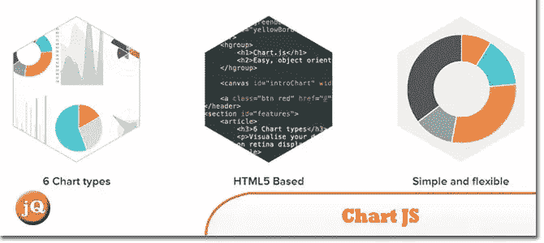](http://www.chartjs.org/) 
[源+演示](http://www.chartjs.org/)

## 7.培根！

一个 jQuery 插件，允许你用 bezier 曲线或直线环绕文本。

[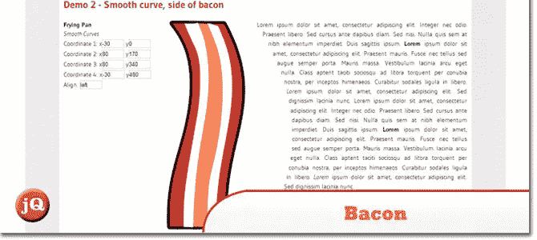](http://baconforme.com/) 
[源+演示](http://baconforme.com/)

## 6.雷尼戴. js

rainyday.js 背后的想法是创建一个 JavaScript 库，该库利用 HTML5 画布来呈现雨滴落在玻璃表面的动画。

 
[来源](http://maroslaw.github.io/rainyday.js/) [演示](http://maroslaw.github.io/rainyday.js/demo.html?imgur=rhnaa4G&youtube=MLBSAVcC1TA&preset=2)

## 5.jQuery 文件上传

文件上传小部件，具有多个文件选择、拖放支持、进度条、验证和预览图像、用于 jQuery 的音频和视频。

[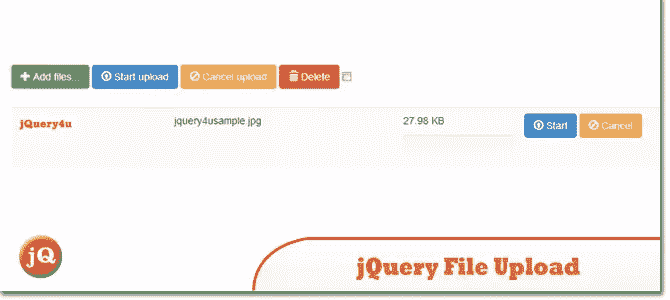](https://github.com/blueimp/jQuery-File-Upload) 
[源](https://github.com/blueimp/jQuery-File-Upload) [演示](http://blueimp.github.io/jQuery-File-Upload/)

## 4.Vegas 后台 jQuery 插件

Vegas 是一个 jQuery 插件，可以给你的网页添加漂亮的全屏背景。你甚至可以制作令人惊叹的幻灯片。

[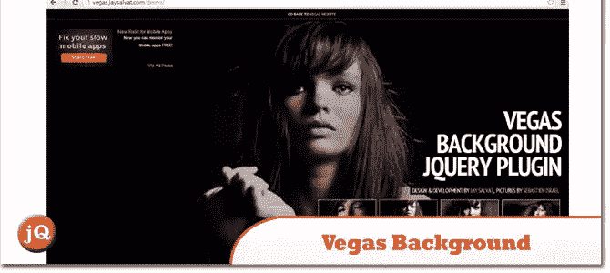](http://vegas.jaysalvat.com/) 
[来源](http://vegas.jaysalvat.com/) [演示](http://vegas.jaysalvat.com/demo/)

## 3.狡猾的

JavaScript 库，支持基于项目的单向滚动导航。

[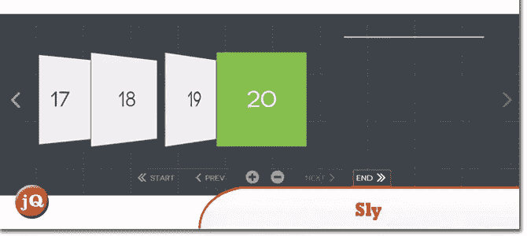](http://darsa.in/sly/) 
[源+演示](http://darsa.in/sly/)

## 2.jQuery 社交流插件

包括脸书、Twitter、Google +和 LinkedIn 共享链接，使您的社交网络流更具互动性，有助于推广您的社交网络帖子并提高您的流量！

[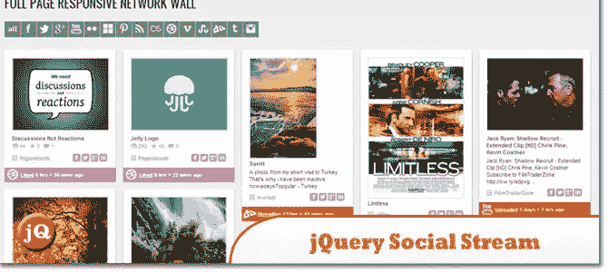](http://www.designchemical.com/blog/index.php/premium-jquery-plugins/jquery-social-stream-plugin/) 
[来源](http://www.designchemical.com/blog/index.php/premium-jquery-plugins/jquery-social-stream-plugin/) [演示](http://www.designchemical.com/blog/index.php/premium-jquery-plugins/jquery-social-stream-plugin-full-page-responsive-network-wall/)

## 1.MixItUp

CSS3 和 jQuery 过滤和排序插件

[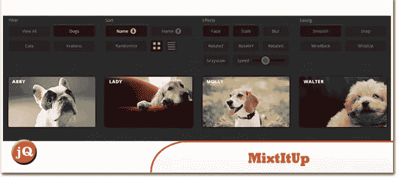](http://www.mixitup.io/) 
[源+演示](http://www.mixitup.io/)

## 分享这篇文章