# 2013 年 100 大 jQuery 插件(第 3/5 部分)

> 原文：<https://www.sitepoint.com/top-100-jquery-plugins-year-2013-part-35/>

从 100 开始倒数，以下是我们认为的 2013 年最好的 jQuery 插件。**下面是 60-40 的参赛作品**。注意:如果在 2013 年进行了重大升级，一些旧插件可能会出现。

## 60.简介. js

更好地介绍网站和功能，并为您的项目提供分步指南。

[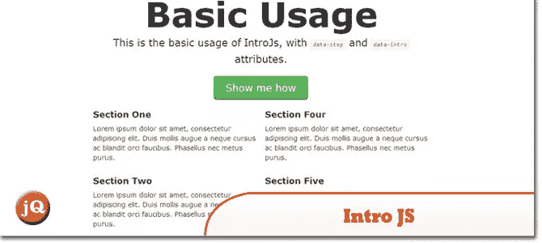](http://usablica.github.io/intro.js/) 
[来源](http://usablica.github.io/intro.js/) [演示](http://usablica.github.io/intro.js/example/index.html)

## 59.超级盒子

重新想象的灯箱画廊。完全响应的 HTML5。

[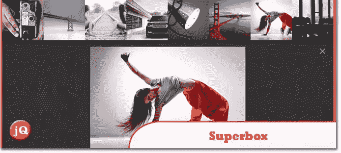](http://toddmotto.com/labs/superbox/) 
[源+演示](http://toddmotto.com/labs/superbox/)

## 58.nanoScroller.js

一个 jQuery 插件，为你的网站提供了一个简单的实现 Mac OS X 狮子样式滚动条的方法。最新版本利用了原生滚动，可以在 iPad、iPhone 和一些 Android 平板电脑上使用。

[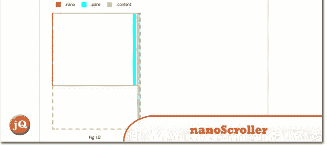](http://jamesflorentino.github.io/nanoScrollerJS/) 
[源+演示](http://jamesflorentino.github.io/nanoScrollerJS/)

## 57.视频. js

开源 HTML5 视频播放器

[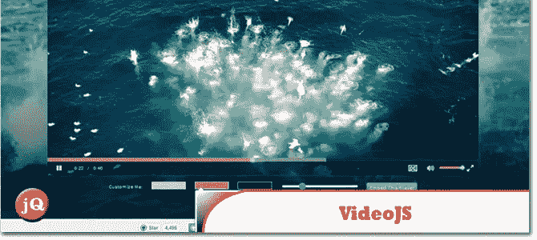](http://www.videojs.com/) 
[源+演示](http://www.videojs.com/)

## 56.ARCTEXT。射流研究…

虽然 CSS3 允许我们旋转字母，但沿着弯曲的路径排列每个字母是相当复杂的。Arctext.js 是一个 jQuery 插件，可以让你做到这一点。基于 Lettering.js，它计算每个字母的右旋，并将字母平均分布在给定半径的假想圆弧上。

[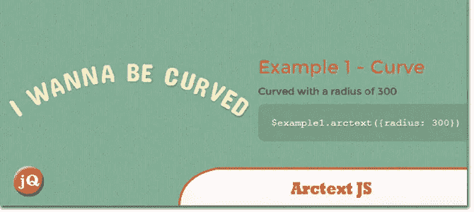](http://tympanus.net/Development/Arctext/) 
[源+演示](http://tympanus.net/Development/Arctext/)

## 55.kGallery

该图库的第一个显著优势是能够稳定处理数百张图片或巨幅图片，而不会冻结浏览器。这种效果是通过从外部源(JSON 或 XML)检索图像列表并在播放幻灯片时逐渐下载图片来实现的，而不是一次全部下载。

[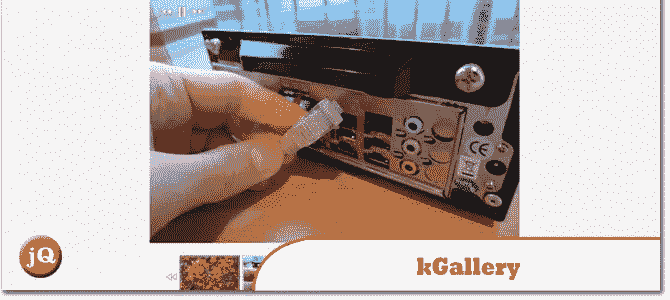](http://kopolo.ru/for-webmasters/kgallery/kgallery_docs.html) 
[来源](http://kopolo.ru/for-webmasters/kgallery/kgallery_docs.html) [演示](http://kopolo.ru/for-webmasters/kgallery/example_typical.html)

## 54.jQuery Litelighter

Litelighter 是一个超轻量但功能强大的 jQuery 和 Zepto 语法高亮插件。默认自带明暗主题和 js、html、css 语言。超级容易扩展！

[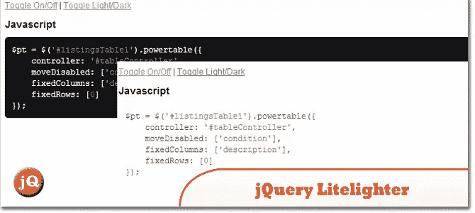](http://trentrichardson.com/examples/jQuery-Litelighter/) 
[来源](http://trentrichardson.com/examples/jQuery-Litelighter/) [演示](http://trentrichardson.com/examples/jQuery-Litelighter/#Examples)

## 53.jQuery 复杂化

Complexify 旨在为网站提供一个很好的密码复杂性衡量标准，既可以以强度栏的形式给用户提供提示，也可以出于安全原因随意实施最低复杂性。

 
[源+演示](http://danpalmer.me/jquery-complexify/)

## 52.Touch Touch–一个触摸优化的图库插件

TouchTouch 完全依赖 CSS3 来制作动画，这意味着移动设备上的过渡非常平滑(当然，这也意味着你不会在旧浏览器上看到任何过渡)。

[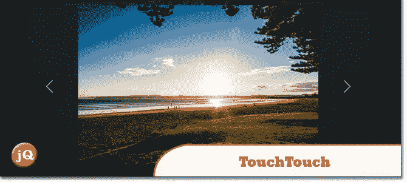](http://tutorialzine.com/2012/04/mobile-touch-gallery/) 
[来源](http://tutorialzine.com/2012/04/mobile-touch-gallery/) [演示](http://demo.tutorialzine.com/2012/04/mobile-touch-gallery/)

## 51.Lettering.js

一个轻量级、易于使用的 Javascript 注入器，用于激进的网络排版

 
[源+演示](http://letteringjs.com/)

## 50.一页滚动 1.2 版

用 BucketListly 创始人 Pete R .创建的单页滚动插件创建一个类似苹果的单页滚动网站(iPhone 5S 网站)

 
[来源](https://github.com/peachananr/onepage-scroll) [演示](http://www.thepetedesign.com/demos/onepage_scroll_demo.html#)

## 49.Pongstagr.am

一个 jQuery 插件，允许你使用引导前端样式和模态插件在你的网站上显示你的 Instagram 媒体。

[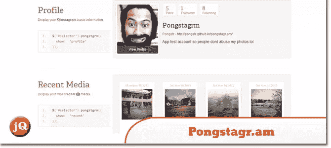](http://pongstr.github.io/pongstagr.am/) 
[源+演示](http://pongstr.github.io/pongstagr.am/)

## 48.数字. js

一个用于格式化和操作数字的 javascript 库。

[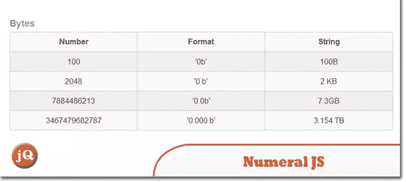](http://numeraljs.com/) 
[源+演示](http://numeraljs.com/)

## 47.Zoomerang.js

一个插件库，允许用户放大(几乎)现有页面上的任何元素。没有设置，任意造型。

 
[源+演示](http://yyx990803.github.io/zoomerang/)

## 46.JQuery 路径贝塞尔曲线生成器–Jqbezier.ericlesch.com

允许您在使用 jQuery animate 函数时创建自定义路径。贝塞尔曲线特别有趣，因为它们允许你沿着几乎任何可以想到的路径移动对象(尤其是当链接动画时)。

[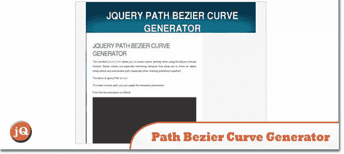](http://jqbezier.ericlesch.com/) 
[来源](http://jqbezier.ericlesch.com/)

## 45.typeahead.js

一个快速且功能全面的自动完成库

[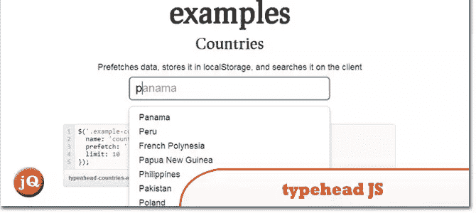](http://twitter.github.io/typeahead.js/) 
[源+演示](http://twitter.github.io/typeahead.js/)

## 44.挑选出来的

一个 jQuery 插件，它使得又长又笨重的选择框更加用户友好。

[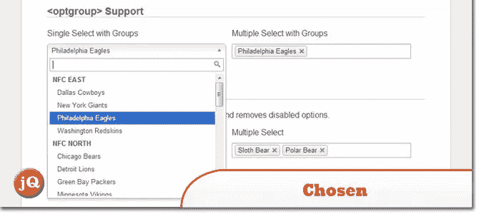](http://harvesthq.github.io/chosen/) 
[源+演示](http://harvesthq.github.io/chosen/)

## 43.三十

用于创建可拖动 360 的 jQuery 插件

[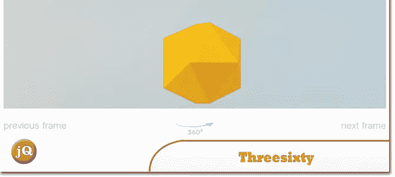](http://nick-jonas.github.io/threesixtyjs/) 
[源+演示](http://nick-jonas.github.io/threesixtyjs/)

## 42.jQuery。别针

将任何元素固定在容器顶部。很容易禁用它的小屏幕尺寸，那里没有这种恶作剧的空间。

[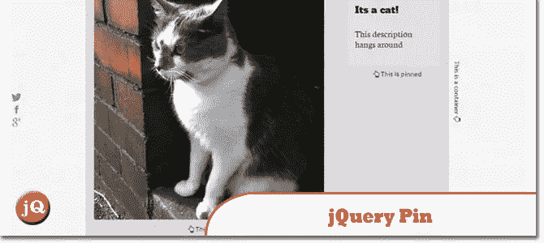](http://webpop.github.io/jquery.pin/) 
[源+演示](http://webpop.github.io/jquery.pin/)

## 41.bxSlider

响应性 jQuery 内容滑块

[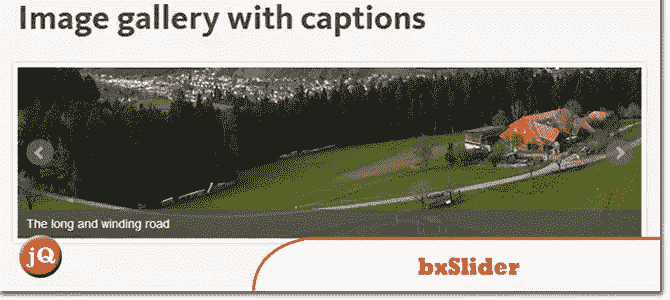](http://bxslider.com/) 
[来源](http://bxslider.com/) [演示](http://bxslider.com/examples)

## 分享这篇文章