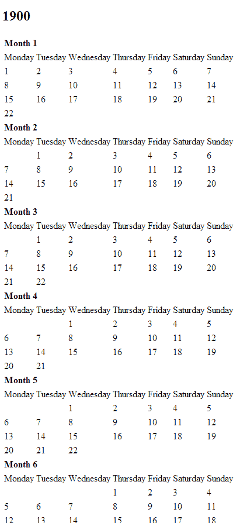

# PHP 工作面试任务:星期几计算

> 原文：<https://www.sitepoint.com/php-job-interview-task-day-week-calculation/>

不久前，我接到一个面试任务。如果我知道闰年发生的频率，如果有的话，他们的一年有几个月，以及每个月有几天，我将编写一个函数来推导一个假想日历的标准 7 天周的日期。

这是一个相当常见的介绍性工作面试任务，在这篇文章中，我将解决和解释背后的数学问题。我不是雨人，所以请随意对我进行简化和纠正——我确信我的方法是不必要的复杂方法之一。这篇文章将介绍解决这个问题的两种方法——一种是让你在头脑中即时解决这个问题(我猜是为了给你的朋友留下深刻印象？)，以及一个对计算机更友好的(更少的代码行，更大的数字)。

我得到的日历的定义如下:

*   每年有 13 个月
*   每个偶数月有 21 天，每个奇数月有 22 天
*   每个闰年的第 13 个月缺少一天
*   闰年是能被 5 整除的任何一年
*   每周有 7 天:星期日，星期一，星期二，星期三，星期四，星期五，星期六

任务是这样进行的:

> 假设 1900 年的第一天是星期一，写一个函数，打印给定日期的星期几。例如，对于输入{日:17，月:11，年:2013}，输出为“星期六”。

在本文的其余部分，我将使用下面的日期格式:dd.mm.yyyy，因为只有[才有意义](http://d24w6bsrhbeh9d.cloudfront.net/photo/422590_700b.jpg)。

## 准备

在开始任何聪明的冒险之前，重要的是建立一个合适的环境，以避免在可以提前准备好的事情上浪费时间。我总是建议你冒险在一个加速的开发环境中编写工作面试任务，随时准备测试你的代码。

创建一个包含两个子文件夹的新文件夹:`classes`和`public`。是的，这是一个一次性的任务，可以用一个简单的过程函数来解决，但是我喜欢做得彻底一些。你会明白为什么。

在`classes`子文件夹中，创建一个名为`CalendarCalc.php`的空 PHP 类。在`public`子文件夹中，创建一个名为`index.php`的文件，内容如下:

```
<?php

require_once '../classes/CalendarCalc.php';
echo "Hello";
```

如果您可以在浏览器中打开它，并且显示“Hello ”,那么您就可以开始了。

## CalendarCalc 初始化

为了使事情更容易验证和可视化，我创建了一个演示方法，打印出 1900 年 1 月 1 日的整个日历。至 2013 年 13 月 22 日。这将允许我们很容易地检查我们的计算功能是否工作。但是，首先要像这样初始化这个类:

```
<?php

class CalendarCalc {

    /** @var array */
    protected $aDays = array('Sunday', 'Monday', 'Tuesday', 'Wednesday', 'Thursday', 'Friday', 'Saturday');

    /** @var int Cached number of days in a week, to avoid recounts. This way, we can alter the week array at will */
    protected $iNumDays;

    /** @var int Array index of starting day (1.1.1900.), i.e. Monday = 1*/
    protected $iStartDayIndex;

    /** @var int */
    protected $startYear = 1900;

    /** @var int */
    protected $leapInterval = 5;

    /** @var array Array gets populated on instantiation with date params. This is to make params accessible to every alternative calculation method. */
    protected $aInput = array();

    public function __construct($day, $month, $year) {
        $this->iNumDays = count($this->aDays);
        $this->iStartDayIndex = array_search('Monday', $this->aDays);
        $this->aInput = array('d' => $day, 'm' => $month, 'y' => $year);
    }

    public function demo() {
    }
}
```

让我们解释一下受保护的属性。

`$aDays`是日期的数组。定义它可以确保一周中的每一天都有一个数字索引——这对以后确定一周中的每一天非常重要。我们用`$iNumDays`属性缓存它的长度。这允许我们在以后扩展 days 数组，如果我们这样选择的话——另一个任务可能要求相同的计算，但是可能提到一周多于或少于 7 天。

`$iStartDayIndex`是星期一的指数(在本例中)，因为开始日(1.1.1900。)在任务描述中定义为周一。当我们有了开始日的索引时，我们可以将它与计算出的偏移量结合使用，以获得一周中的实际日期。你过一会儿就会明白我的意思。

`$aInput`是保存输入值的数组。当我们实例化 CalendarCalc 时，我们传递想要知道星期几的日期值。该属性存储这些值，使它们可用于我们想到的每一个可选的 calc 方法，从而确保我们不需要转发它们，或者更糟的是，在另一个函数调用中重复它们。`$aInput`、`$iStartDayIndex`、`$iNumDays`的逻辑在`__construct`法中。

其他属性是不言自明的。

现在，用以下内容填充`demo()`方法:

```
 public function demo() {

        $demoYear = $this->startYear;
        $totalDays = 0;

        while ($demoYear < 2014) {

            echo "<h2>$demoYear</h2><table>";
            $demoMonth = 1;
            while ($demoMonth < 14) {
                echo "<tr><td colspan='7'><b>Month $demoMonth</b></td></tr>";
                echo "<tr><td>Monday</td><td>Tuesday</td><td>Wednesday</td><td>Thursday</td><td>Friday</td><td>Saturday</td><td>Sunday</td></tr>";

                $dayCount = ($demoMonth % 2 == 1) ? 22 : 21;
                $dayCount = ($demoMonth == 13 && $demoYear % 5 == 0) ? 21 : $dayCount;

                $demoDay = 1;

                echo "<tr>";
                while ($demoDay <= $dayCount) {
                    $index = ++$totalDays % 7;
                    if ($demoDay == 1) {
                        for ($i = 0; $i < $index-1; $i++) {
                            echo "<td></td>";
                        }
                        if ($index == 0 || $index == 7) {
                            $i = 6;
                            while ($i--) {
                                echo "<td></td>";
                            }
                        }
                    }
                    echo "<td>$demoDay</td>";
                    if ($index == 0) {
                        echo "</tr><tr>";
                    }
                    $demoDay++;
                }
                echo "</tr>";
                $demoMonth++;
            }
            echo "</table><hr />";
            $demoYear++;
        }
    }
```

不要费心去理解这种方法，它完全不重要。它只是帮助我们验证我们的工作，事实上它部分基于我们将在本文中提出的第二个解决方案。

将 index.php 文件的内容更改为:

```
<?php

require_once '../classes/CalendarCalc.php';

$cc = new CalendarCalc(17, 11, 2013);
$cc->demo();
```

…并在浏览器中打开它。您应该会看到类似于下图的日历输出:



我们现在有一种方法来检查结果的真实性(注意，日期是 2013 年 11 月 17 日。确实是星期六)。

## 心理方式

做这个计算的心法其实很简单。首先，我们需要基准日期和给定日期之间的闰年数。1900 能被 5 整除，本身就是闰年。因此，跳跃的次数是输入日期和基准日期之间的年数差，除以 5，向下舍入(当然，只计算完全消逝的年数)，再加上 1900 年的 1。在`CalendarCalc`中创建一个名为`calcFuture`的新方法，并赋予它以下内容:

```
$iLeaps = floor(($this->aInput['y'] - $this->startYear) / $this->leapInterval + 1);
```

我们还被告知，每个偶数月有 21 天，每个奇数月有 22 天:

1 = > 22
2 =>21
3 =>22
4 =>21
5 =>22
6 =>21
7 =>22
8 =>21
9 =>22
10 =>21
11 =>22
12 =【T2

因此，他们一年的总天数是 280 天，闰年是 279 天。如果我们取 280 % 7 的模，我们得到 0，因为 280 能被 7 整除。在闰年，模数是 6。

这意味着该日历中的每一年都从同一天开始，但闰年除外，闰年是从上一年第一天的前一天开始。因此，如果 1.1.1900。是星期一:

*   1.1.1901.是星期一
*   1.1.1902.是星期天
*   1.1.1903.是星期天
*   1.1.1904.是星期天
*   1.1.1905.是星期六
*   1.1.1906.是星期六
*   等等…

据此，我们可以计算出直到我们输入年份的天数移动。正如我们所知，在输入日期(2013 年)之前，我们有 23 次跳跃，我们一天向后移动了 23 次。23 % 7 的模是 2，这意味着我们绕了 3 圈，然后又走了两天(这是偏移量)-2013 年 1 月 1 日。是星期六。请查看演示日历，亲自体验一下。

让我们把它写成代码。在上面的“leaps”行之后，添加以下内容:

```
$iOffsetFromCurrent = $iLeaps % $this->iNumDays;

        $iNewIndex = $this->iStartDayIndex - $iOffsetFromCurrent;

        if ($iNewIndex < 0) {
            $iFirstDayInputYearIndex = $this->iStartDayIndex + $this->iNumDays - $iOffsetFromCurrent;
        } else {
            $iFirstDayInputYearIndex = $iNewIndex;
        }
```

首先，我们计算偏移。然后，我们计算 days 数组的新索引，它根据新索引是否为正而变化。这给了我们输入年开始的星期几。

我们还知道，每个月 X 有 21 天，使得下个月 Y 与 X 月在同一天开始，因为 21 % 7 = 0。然而，在奇数月份，起始日提前一天(22 % 7 = 1)。因此，如果第 1 个月从周六开始，第 2 个月从周日开始，第 3 个月从周日开始，第 4 个月从周一开始，依此类推。我们得出的结论是，从年初到输入日期所在的月份，每个奇数月份的日索引都增加了 1。我们在第 11 个月，所以有 5 个多月。新的偏移量是+5，或者在我们的例子中，2013 年的第 11 个月从星期四开始。让我们把它直接放到前面几行下面的代码中。

```
$iOddMonthsPassed = floor($this->aInput['m'] / 2);

$iFirstDayInputMonthIndex = ($iFirstDayInputYearIndex + $iOddMonthsPassed) % $this->iNumDays;
```

现在剩下的就是看看我们输入日期的日子离月初有多远。

```
$iTargetIndex = ($iFirstDayInputMonthIndex + $this->aInput['d']-1) % $this->iNumDays;

return $this->aDays[$iTargetIndex];
```

我们把日子数加减一(因为日子还没过呢！)并用 7(天数)对其取模。我们得到的数字是我们的目标指数，可靠地给我们星期六。

从顶部开始，`CalendarCalc`的整个`calcFuture`方法是这样的:

```
 /**
     * A more "mental" way of calculating the day of the week
     * @return mixed
     */
    public function calcFuture() {
        $iLeaps = floor(($this->aInput['y'] - $this->startYear) / $this->leapInterval + 1);
        $iOffsetFromCurrent = $iLeaps % $this->iNumDays;

        $iNewIndex = $this->iStartDayIndex - $iOffsetFromCurrent;

        if ($iNewIndex < 0) {
            $iFirstDayInputYearIndex = $this->iStartDayIndex + $this->iNumDays - $iOffsetFromCurrent;
        } else {
            $iFirstDayInputYearIndex = $iNewIndex;
        }

        $iOddMonthsPassed = floor($this->aInput['m'] / 2);

        $iFirstDayInputMonthIndex = ($iFirstDayInputYearIndex + $iOddMonthsPassed) % $this->iNumDays;

        $iTargetIndex = ($iFirstDayInputMonthIndex + $this->aInput['d']-1) % $this->iNumDays;

        return $this->aDays[$iTargetIndex];
    }
```

## 机器友好的方式

或许更简单的方法是计算自基准日期以来已经过去的天数，以 7 为模，这样就可以得到偏移量。然而，没有多少人能在运行中计算出如此大的数量，这就是为什么它对机器更友好。

同样，我们需要飞跃:

```
public function calcFuture2() {
    $iTotalDays = 0;

    $iLeaps = floor(($this->aInput['y'] - $this->startYear) /    $this->leapInterval + 1);
}
```

然后，先把年考虑进去。这是 280 乘以经过的年数，减去考虑到损失天数的跳跃次数，再加 1，因为当前年仍在进行中。

```
 $iTotalDays = (280 * ($this->aInput['y'] - $this->startYear)) - $iLeaps + 1;
```

然后，我们通过合计所有过去的月份来添加天数。

```
 $iTotalDays += floor($this->aInput['m'] / 2) * 21 + floor($this->aInput['m'] / 2) * 22;
```

最后，我们添加输入日期的天数，再次减一，因为当天还没有过去:

```
 $iTotalDays += $this->aInput['d'] - 1;
        return $this->aDays[$iTotalDays % $this->iNumDays];
```

非常简单，不是吗？

## 结论

要查看这个计算的实例，请点击查看[。您可以浏览该 URL 下的包含目录来查看文件，或者您可以从](http://code.bitfalls.com/demo1/public/) [Github](https://github.com/Swader/calendarCalc) 下载该演示站点的完整源代码，以及最终的`CalendarCalc`类。repo/demo 的代码比本文中给出的代码稍微多一点——使用了一些 html 5 样板来使它更有条理，并使 ajax 请求能够在您输入日期时检查它们，因此您不需要每次检查日期时都重新加载屏幕并重新生成日历。

如果你有可供选择的解决方案或改进建议，请在下面的评论中留下它们——就像我说过的，我不是数学天才，我欢迎有机会了解更多。例如，我们应该考虑极限情况——边缘日期或过去的日期需要对原始算法进行更多的修改。我将把那件事留给你。随意提交一个拉请求，你会在文章中得到一个呼喊！

希望你喜欢这个，并学到了新的东西！祝你面试好运！

## 分享这篇文章