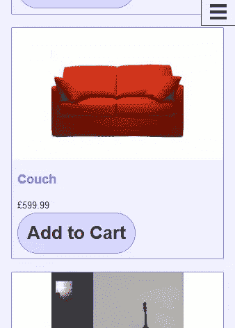
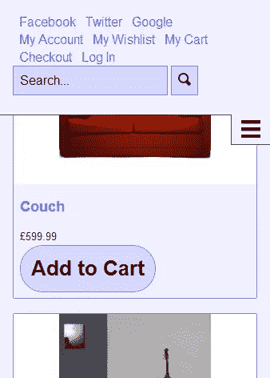

# 为 Magento 构建一个快速响应的访问盒

> 原文：<https://www.sitepoint.com/building-responsive-quick-access-box-magento/>

## 快速访问框

在大多数 Magento 主题中，快速访问框出现在网站的右上角，通常包含一些方便的链接，比如购物车、结帐和搜索框。

在响应式设计中处理这一点可能很棘手。它占据了页面顶部很大的空间，你真的不想把它从一个小屏幕视图中完全删除。

## 非画布解决方案

我提出的一个解决方案是使用一个带有切换按钮的画布外容器来将内容滑入和滑出屏幕。

这种形式的导航现在在移动应用程序设计中已经变得很常见，并且主要以隐藏侧边栏的形式出现。

如果你想了解更多，在 [Smashing Magazine](http://coding.smashingmagazine.com/2013/01/15/off-canvas-navigation-for-responsive-website/) 上有一篇非常棒的关于非画布导航的文章。

我实现的方式是使用一个隐藏的复选框，并使用`:checked`伪选择器来切换快速访问框的可见性。与其他技术相比，这有几个优点:

1.  没有 JavaScript 这是 100%的 CSS
2.  不会改变浏览器的历史状态——同样的效果可以用在`:targetpseudo`选择器上，但是我不喜欢它通过添加散列来改变历史状态(这只是个人观点)

但是隐藏的复选框也有不好的语义的缺点。

## 模板文件

快速访问框包含在默认 Magento 主题的头模板文件(app/design/frontend/base/default/template/page/html/header . phtml)中。

注意:你应该遵循最佳实践，不要编辑这个文件，而是在你自己的主题中进行修改。

要添加的两个最重要的东西是复选框和控制复选框状态的标签。

在`<div class="quick-access"></div>`前添加复选框:`<input type="checkbox" name="quick-access-checkbox" id="quick-access-checkbox"/>`。

标签可以放在页面上的任何地方，只要它被标记为您刚才添加的复选框。请记住，当快速访问框隐藏和显示时，标签都需要是可点击的。

我选择将标签包含在快速访问框中，并将快速访问框的主要内容包装在容器 div 中。这样，标签可以出现在快速访问框的底部，并在它打开时一起向下滑动。

```
<div class="quick-access">
    <div class="quick-access-container">
        <?php echo $this->getChildHtml('topSearch') ?>
        <p class="welcome-msg"><?php echo $this->getWelcome() ?> <?php echo $this->getAdditionalHtml() ?></p>
        <?php echo $this->getChildHtml('topLinks') ?>
        <?php echo $this->getChildHtml('store_language') ?>
    </div>
    <label for="quick-access-checkbox" class="menu-toggle-button"><span class="visually-hidden">Menu</span><span aria-hidden="true" data-icon="&#xe000;"></span></label>
</div>
```

另一件需要注意的事情是，我在标签中使用了图标字体，但是您可以包含您想要的任何内容。

这就是你在 HTML 中所需要的。非常简单。

## CSS

### 隐藏复选框

在页面上显示复选框没有任何意义，因为它除了作为一种存储真值或假值的方式之外，没有任何实际用途。我喜欢使用可视化隐藏元素的 [HTML5 样板](http://html5boilerplate.com/)方法:

```
#quick-access-checkbox {
    border: 0;
    clip: rect(0 0 0 0);
    height: 1px;
    margin: -1px;
    overflow: hidden;
    padding: 0;
    position: absolute;
    width: 1px;
}
```

### 将快速存取盒置于屏幕之外

我选择了隐藏页面顶部的快速访问框，但它也可以很容易地隐藏在旁边。

您可以为隐藏内容指定一个固定的高度，并非常容易地将其放置在屏幕之外:

```
.quick-access-container {
    height: 250px;
    overflow-y: auto;
}

.quick-access {
    position: fixed;
    top: -250px; /* Just enough to hide the content */
    left: 0;
    right: 0;
    z-index: 9999; /* Make sure it's on top of everything */
}
```

然后当用户点击菜单按钮时，只需要将盒子移动到正确的位置。

```
#quick-access-checkbox:checked + .quick-access {
    top: 0;
}
```

为了更吸引眼球，您可以添加一个过渡，让它平滑地上下滑动:

```
.quick-access {
    -webkit-transition: all .4s;
    -moz-transition: all .4s;
    -o-transition: all .4s;
    transition: all .4s;
}
```

### 大屏幕样式

我通常以移动优先的方式编写 CSS，所以只要屏幕足够大，快速访问框就需要重置为默认位置。

```
@media (min-width: 40em) {
    .quick-access-container {
        height: auto;
    }

    .quick-access {
        position: static;
    }
}
```

## 收尾

这是基本的功能完成。剩下要做的就是根据你的主题设计风格。

这是一个很基本的入门主题的例子。

在隐藏视图中，您只能看到菜单按钮。



当按下菜单按钮时，快速访问框向下滑动，显示许多有用的链接和功能。



## 浏览器支持

浏览器对这项技术的支持非常好，所有现代浏览器都支持`:checked` 和过渡。一些旧的/功能不全的移动浏览器不支持`position: fixed;`，这意味着快速访问栏不一定会出现在屏幕顶部，但它会优雅地降级到只出现在网站的顶部。

最后要记住的一点是，IE8 不支持媒体查询，因此如果您正在进行移动优先设计并希望支持 IE8，您将需要添加一个 [polyfill](https://github.com/scottjehl/Respond) 。

## 分享这篇文章