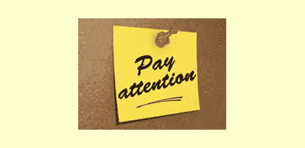

# 处理关于脸书的评论

> 原文：<https://www.sitepoint.com/dealing-comments-facebook/>

*图片来源:[罗伯特·s·多诺万](http://www.flickr.com/photos/10687935@N04/3972319375/) via [康普菲](http://compfight.com) [cc](http://creativecommons.org/licenses/by/2.0/)*

在脸书吸引客户或潜在客户可以提供大量的黄金机会，但有时你必须公开处理偶尔出现的不满客户——在你所有其他客户的公众面前。然而，作为一名自由职业者，这种公众参与对你来说非常有价值。脸书是品牌化你的设计业务的一个有价值的部分，使它和你对客户来说更加个人化。

人们喜欢有一个肥皂盒，从中他们可以兜售消极和兴奋。他们也喜欢在自己舒适安全的家中参与一项非常受欢迎的活动。几乎每个人都喜欢能够一对一地联系，即使是和陌生人，只要这种联系不是面对面的。在电脑屏幕后面的一些东西给了我们所有的社交勇气，否则我们不会有。

这些方面以及更多的方面使得脸书对网页设计师如此重要。关键是知道如何处理这种联系，让它为你服务，而不是与你作对。学习如何在脸书吸引客户的礼仪，你的自由职业将更有可能为你创造长期的客户。当然，你可能会发现在 Google+或 MySpace 这样的网站上，客户更愿意与你合作，但是下面的建议可以很容易地用于任何类似于脸书的社交媒体网站，只需稍加调整。

### 脸书互动的独特之处

*图片来源:[单向股票](http://www.flickr.com/photos/60141638@N06/8942341907/)via[Compfight](http://compfight.com)[cc](http://creativecommons.org/licenses/by-nd/2.0/)*

脸书允许任何喜欢你的公共页面的人发表全世界都能看到的评论。这是独一无二的，因为在 Twitter 这样的网站上，这样的评论可能不会被任何人注意到，因为它会很快从你的提及源中消失。

不像 Twitter，你不能忽视你的脸书页面上的评论——它在最前面和最中心。如果其他人“喜欢”这个评论，你可能会无限期地停留在你的提要顶部。当然，这对于积极的反馈来说是很好的，但是消极的评论可能会比你想要的时间更长。

虽然你可以简单地删除一个不好的帖子，但这通常会导致更多的负面影响。诀窍是对你页面上的帖子发表评论，包括正面的和负面的。对积极的帖子发表评论将有助于它在你的页面顶部停留更长时间。然而，在负面帖子上留下评论也是有帮助的。询问您如何解决问题，将评论者引向适当的联系点。有时，这可能会导致评论者回来留下一个积极的更新，告诉他们你在解决他们的问题上是多么有帮助。

### 你一定在听听

如果你不关注你的脸书页面上的评论，你将永远不知道如何回应。如果可以的话，把这个任务分配给其他人，这样你就可以专注于完成项目。然而，如果你是唯一的资源，只需通过电子邮件发送提醒，这样你就不会错过评论。然后每天留出时间，如果活动频繁，甚至可能一天两次回复帖子。

可能发生的最糟糕的事情是，一个负面(或正面)的评论没有被注意到，也没有得到回应。脸书的主要好处是有机会接触你的客户。如果你不积极参与你页面上发生的每一件事，那么客户就会放弃尝试建立这种联系。研究你的服务的潜在客户可能会认为你缺乏参与是你的商业行为不规范的表现。

### 有计划

无论何时评论开始出现，都要有一个应对的策略。这将节省你每次想出应对方法的时间。它还会给你的帮助(如果你不是回复评论的人)一个可以遵循的政策。下面是一个简短的高层次概述:

*   负面评论
    *   简单的抱怨——用有益的、感同身受的回应来跟进。让他们转到电子邮件/联系页面。
    *   严重的投诉——用有益的回应跟进，并主动给他们打电话。也直接联系页面和电子邮件。
    *   极端投诉——立即回复并立即打电话。
*   正面评论
    *   接着说一句“谢谢”。
    *   一个月一次，将评论汇总成一篇类似感谢信的帖子。
*   中立的评论
    *   酌情跟进。

虽然这个计划非常基本，但它仍然提供了足够的指导方针，使回应变得更加容易，并且它提供了足够的空间，使你可以根据你的客户和情况量身定制回应。脸书的一个好处是，有时个人评论只需要一个简单的“喜欢”。

你会得到负面的反馈。它发生了。人就是人，物是人非。所以做好准备，倾听，并为你如何处理好和坏的事情做好计划。如果你一直与脸书的客户保持联系，这些客户将更有可能感受到与你的业务的个人联系，这有助于保护你免受客户转向竞争对手的影响。

## 分享这篇文章