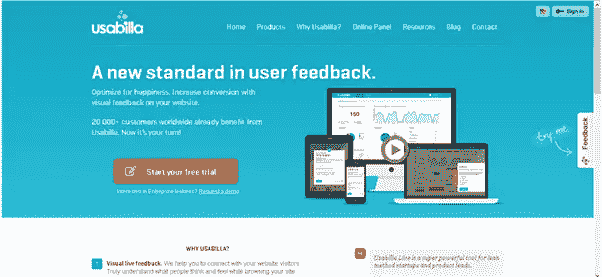
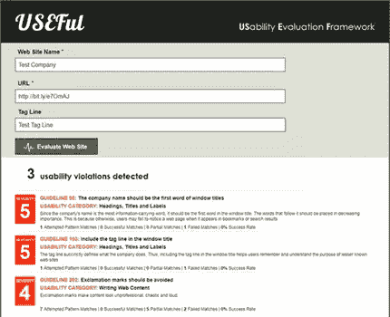

# 为什么可用性测试对成功至关重要

> 原文：<https://www.sitepoint.com/usability-testing-vital-success/>

可用性是大多数设计师最关心的事情，无论他们是前端还是后端开发人员。这也是内容创作者、SEO 专业人员、营销人员和任何参与设计项目的人都应该考虑的事情。

我以前谈到过采取“移动优先”的方法，这在某种程度上是因为在设计桌面网站时会出现一些问题。如果后来发现一个面向桌面的网站在移动设备和平板电脑上表现糟糕，那么这可能意味着放弃设计，从头开始。这当然会耗费时间和金钱；现代消费者需要跨设备的出色体验，这意味着网站/应用程序必须以多种方式运行。

## 什么是可用性？

一个显而易见的问题。但这仍然是必要的，因为现在有太多关于用户体验(UX)和用户界面(UI)的讨论，以至于很难将它们分开。

其实没必要分开。好的设计应该包含上述所有内容，这将提供一个网站，如果内容交付良好，是高度可用的。

根据 Jeffrey Rubin 和 Dana Chisnell 的*可用性测试手册:如何计划、设计和实施有效的测试* [:](http://books.google.co.uk/books?id=LyLSSg_a5kQC&printsec=frontcover#v=onepage&q&f=false)

“让某样东西变得可用的是在使用它的过程中没有挫折感”此外，“当一个产品或服务真正可用时，*用户可以用他或她期望的方式做他或她想做的事情，没有阻碍、犹豫或疑问*。

## 为什么要进行可用性测试？

虽然首先规划出一个策略并了解你的目标受众是常识，但是从来没有任何保证一个设计会在第一时间获得好评。

这意味着测试期是必要的，以确保在发布日，你有一个功能齐全的产品，你已经知道你的目标受众会喜欢。是的，你可能已经自己在各种设备上进行了测试，但你可能会有一点点偏见，所以你需要从其他不那么偏见的来源获得反馈，这些应该是潜在的最终用户。

正如史蒂夫·克鲁格所说，可用性实际上是，当你认真对待它时，最终用户说“不要让我思考”。

因此，进行测试以确保网站的内容和布局对访问者有吸引力并具有可操作性是至关重要的，这样他们就不必考虑下一步，只需点击一个按钮就可以带他们去他们想去的地方。

## 规划战略

可用性测试有几种方法，包括三大类:

1.  探测的
2.  评价
3.  比较的

第一点用于设计的早期阶段，以便可以访问基本框架，从而确定它是否符合目标受众及其期望。第二类发生在设计过程中，再次强调网站的底层技术，而不是内容。

我指的是可点击区域、导航和整个网站架构。在这一点上，测试性能也是有用的，尽管一旦内容被放置到位，这将需要再次测试。

第三，这是一种使用一个以上版本的基本网站，并在潜在用户身上进行测试的手段，以了解在他们眼中哪个版本的表现最好，这当然是最终的目标。

虽然我说这些是可用性的“类别”,但这并不是说你应该选择一个而忽略其他的。可用性测试应该贯穿整个设计过程，从规划阶段、最初的原型到网站上线。即便如此，这也是应该经常监控的事情，尤其是在第一时间。

## 可用性测试入门

首先，决定你要对谁进行测试。利益相关者？潜在用户通过测试操作？其他设计师？可用性专家甚至，比如上面提到的克鲁格先生？

首先，让我们考虑网站的实际美学，以及导航的便利性。

## 纸质原型

这是一种在规划阶段非常有用的测试，因为它不需要真正的支出，但可以通过从最初的草图设计中收集用户反馈来给出网站应该如何设计的好主意。

Jakob Nielsen 说:“精心设计的可用性测试是对资源的浪费。最好的结果来自于测试不超过 5 个用户，并运行尽可能多的小测试。”

他认为，这是由于所有测试人员会发现有用的“重叠”,所以根据他的数学公式，超过 5 个用户是对时间的根本浪费。最好是测试这 5 个方面的每一个元素，而不是使用一个庞大的测试人员库，他们会说几乎相同的事情，只是在他们说的方式上有一些变化。

这一点当然值得牢记，并说明巨额预算不一定是解决问题的答案。然而，一定要尝试找到那些不会因为是家庭成员/朋友等等而产生偏见的测试人员。

回到纸上测试，这允许你展示最初的网站布局和设计，而不需要一开始就投入大量的工作。一旦你展示了草图，给用户机会告诉你他们最初的想法，你就可以适当地改变设计。

思考:

*   可点击区域
*   内容布局和交付
*   航行

应该为各种屏幕尺寸创建纸质原型，这也将允许您在早期阶段考虑内容和布局，以及这些将如何向前发展。

## A/B 测试

这允许你展示两个不同(但相似)的模型，看看用户发现什么是可行的，哪种语言倾向于吸引他们，颜色和品牌，以及这如何影响用户在看设计时做出的选择。

A/B 测试的想法是测试人员不能同时看到两种设计，否则结果可能被证明是无用的，因为他们自然会偏向其中一种。

A/B 测试之后可以进行一项调查(纸质测试也可以)，询问用户他们喜欢和不喜欢该设计的什么，这些问题旨在向您展示，而不是告诉您每个原型哪些工作得好，哪些不好。

市场上有一些工具可以帮助你进行可用性测试，比如 usabilla，考虑到人们对可用性越来越感兴趣，我确信这些工具远不是唯一的解决方案。

## 有用的框架

这仍然是一个概念框架，允许使用一个基于网络的特别设计的框架进行广泛的可用性测试，尽管它现在仍处于原型阶段。这个概念已经发表在《国际人机交互杂志》 上，是阿列克谢·丁力&贾斯汀·米夫萨德的创意。该框架旨在解决可用性问题，并在可用性问题违反标准指南时自动识别。

虽然它仍处于原型阶段，但据其创造者称，这是一个值得期待的未来[:“与尼尔森和塔希尔的手动评估相比，这个有用的框架能够正确识别 **91.48%** 与指南相关的可用性违规。同样重要的是，代码检查表明，8.52%的差异主要是由于被测试网站的糟糕编码造成的。”](http://usabilitygeek.com/useful-a-framework-to-automate-website-usability-evaluation-part-2/)

## 进一步的方法和正在进行的测试

当谈到可用性测试时，有一些思想流派，其中许多都是完全有效的，值得在不同的阶段单独进行。正如尼尔森指出的，如果他的计算是可靠的，它不需要涉及巨大的预算和大量的人。

关键是要知道谁将使用网站，这是客户的营销代表应该已经知道的事情。这意味着对于设计师来说，有必要在规划阶段了解买家角色，以便在设计、布局和架构中恰当地处理他们。

## 偏好测试

这是另一种测试，你把两个相似的模型放在测试对象面前，让他们做出选择。这是基于心理学和人们对颜色和语言的情感反应方式。这就是了解目标受众的关键所在，因为不同的语言和颜色适用于不同的人群。

## 持续测试的重要性

可用性测试不会随着网站的正式发布而结束，设计师们很久以前就知道了这一点。对于网站上出现的问题，比如断链，网站管理员有使用报告联系方式的悠久传统。

然而，如今，仅仅要求用户这样做是不够的，随着网站在发布后开始站稳脚跟，收集新的信息也很重要。

事实上， [Steve Krug](http://www.sensible.com/about.html) 建议每月进行一次测试，以便收集新的信息并快速解决任何潜在的问题。

当然，现在固步自封不是一个好主意，一个好的网站总是一个正在进行的项目，只要客户理解维护和测试的需要。

## 这对网络和商业意味着什么

我们都关心让网络成为一个有用而有趣的地方，给用户最好的体验。然而，我们也必须牢记客户的商业观点，因此认识到可用性测试会带来良好的投资回报是很重要的。

一个经过深思熟虑的网站，简单易用，吸引观众，容易访问，比它的穷邻居、测试不充分的邻居更容易被访问。而*那*，在一天结束的时候，会带来更多的转化。

## 分享这篇文章