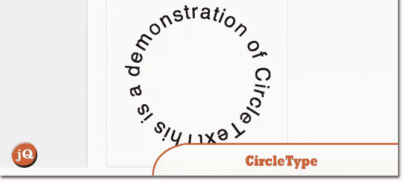
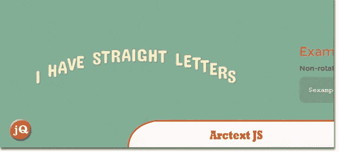
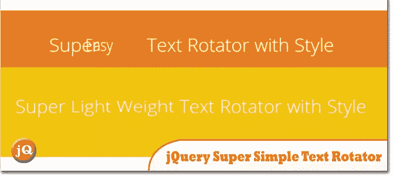
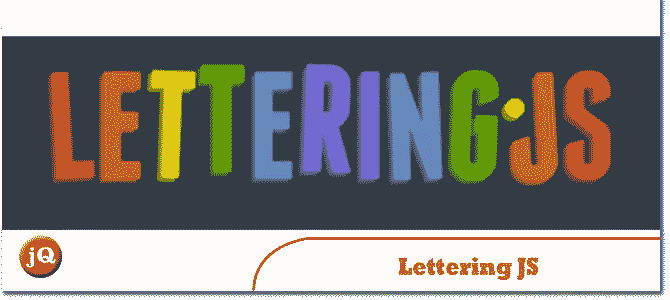

# 5 jQuery 文本旋转弧线插件

> 原文：<https://www.sitepoint.com/5-jquery-text-rotate-arc-plugins/>

你好。这里列出了 5 个 jQuery 文本旋转弧插件来满足你的文本布局/设计需求。玩得开心；)

**相关帖子:**

*   [**10 jQuery 文本转换插件**](http://www.jquery4u.com/plugins/10-jquert-text-transformation-plugins/)
*   [**5 jQuery 文本填充调整大小插件**](http://www.jquery4u.com/plugins/auto-text-fill-resize-plugins/)

## 1.CircleType.js

一个小的(4kb) jQuery 插件，让你在一个圆上设置类型。

 
[源+演示](http://circletype.labwire.ca/)

## 2.ARCTEXT。射流研究…

用 CSS3 & jQuery 弯曲文本。

 
[源+演示](http://tympanus.net/Development/Arctext/)

## 3.jQuery 超级简单文本旋转器。

添加一个超级简单的旋转文本到你的网站，几乎没有标记

 
[源+演示](http://www.thepetedesign.com/demos/jquery_super_simple_text_rotator_demo.html)

## 4.kern.js

一个为设计师设计的超级简单的书签，最终让你重新控制你网站的排版。

 
[源+演示](http://www.kernjs.com/)

## 5.Lettering.js

一个用于激进网页排版的 jQuery 插件。

 
[源+演示](http://letteringjs.com/)

## 分享这篇文章