# Windows Azure 上的 PHP 和 MySQL:从 Git 开始

> 原文：<https://www.sitepoint.com/php-mysql-windows-azure-getting-started-deploying-git/>

到目前为止，我相信你已经听说过 SitePoint 和 Windows Azure 的[推动网络前进](https://www.sitepoint.com/community/t/push-the-web-forward-and-win/36018)竞赛。如果没有，这是一场比赛，要求你在 Windows Azure 上注册一个试用帐户，并在那里部署任何应用程序，才有资格参加抽奖，每个应用程序最多可以赢得 3000 美元。你甚至可以通过参观[画廊](https://www.sitepoint.com/community/t/push-the-web-forward-and-win/36018)来查看当前的作品。

作为一名开发人员，您的工具箱中永远不会有足够的技术，所以让我们来看看这个庞大的环境。

## 安装

在本文中，我们将介绍在 Windows Azure 上设置 Hello World PHP 应用程序并将其连接到该环境的数据库的过程。我们还将通过 FTP 进行部署，并通过 Github 设置自动部署。

如果您还没有注册，请[注册一个免费试用帐户](http://www.windowsazure.com/en-us/pricing/free-trial/)。一旦您到达管理控制面板(见下面的截图)，我们将设置我们的起始网站。

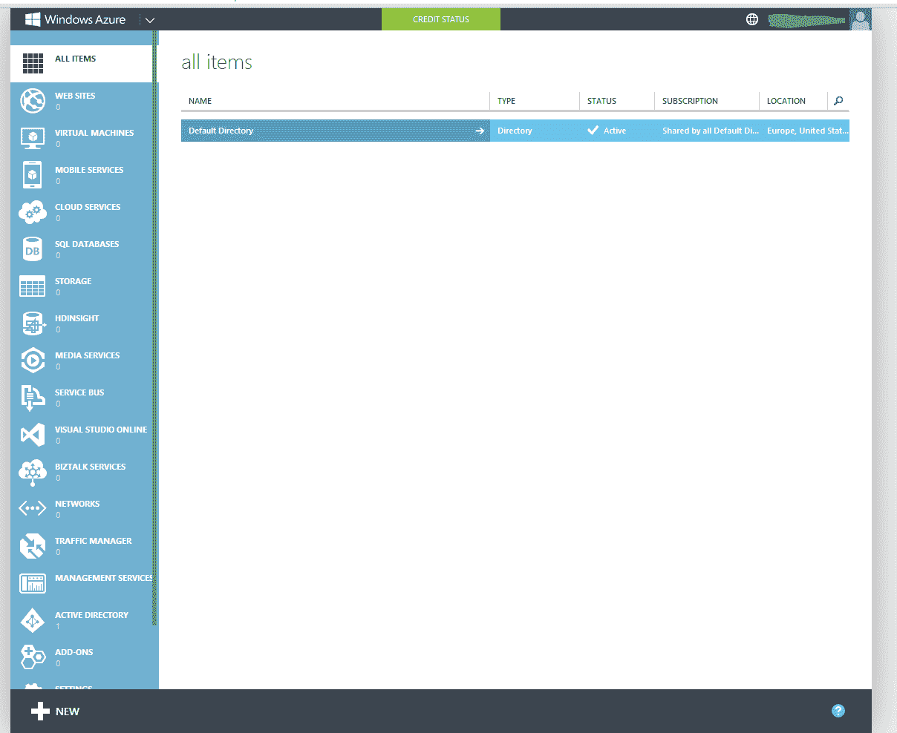

## 在 Windows Azure 上创建新的 PHP 项目

在屏幕底部附近，单击新建->计算->网站->来自图库，如下图所示。

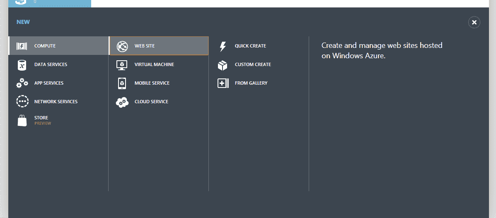

这将打开网站入门模板库，它提供了从 Ruby 应用程序到现成论坛的所有内容。我们的目标是从头开始，所以向下滚动，直到你到达“PHP 空站点”，在下一个屏幕上，为它提供一个任意的 URL 名称。在这个练习中，我选择了 SitePoint01。

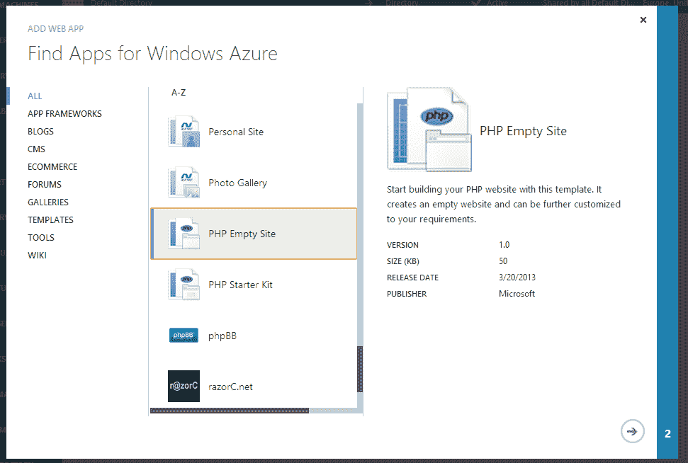

几秒钟后，你的应用程序应该可以运行了。事实上，您应该在网站列表中看到它，并且它的状态应该是“正在运行”。

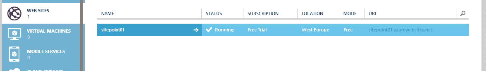

点击应用程序的名称进入其仪表板，并花些时间四处看看——熟悉各种屏幕。您看到的第一个屏幕是“快速启动”屏幕，旨在让您快速启动并运行最常用的功能，其余的功能不言自明。

如果你现在在浏览器中访问你的应用，你会得到一个空屏幕。这很好。毕竟我们还没做什么。在继续之前，让我们配置一个数据库。

## 在 Windows Azure 上配置数据库

转到应用仪表板中的“链接资源”，然后单击“链接资源”。我们想要创建一个新的资源，我们将选择 MySQL 数据库。在向导的下一个屏幕上，为其命名，同意条款，然后单击弹出窗口右下角的“完成”勾号。

在几秒钟的设置之后，资源应该已经准备好并被链接。

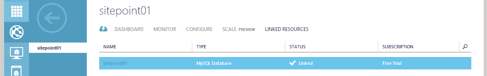

如果您现在转到仪表板,“Quick Glance”下的第一个选项应该是“View Connection Strings ”,单击它会产生一个带有数据库凭据的弹出窗口，您可以使用它来访问我们刚刚设置的数据库。

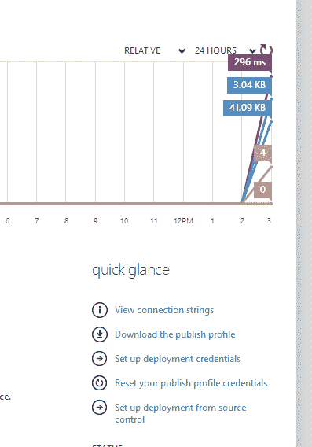

为了管理我们的数据库，我们将在本文中使用 Oracle 的 MySQL Workbench(如果您愿意，可以随意使用任何其他 SQL 管理工具)。当你在 Windows Azure 上创建 MySQL 数据库时，数据库实际上是在 [ClearDB](http://www.cleardb.com/) 上创建的。ClearDB 数据库可以远程连接，这就是我们要做的。

下载 [MySQL Workbench](http://www.mysql.com/products/workbench/) 并选择创建一个新连接。在窗口中，填写上一个屏幕截图中的数据——主机名、用户名和密码。您甚至可以从 ClearDB 下载 SSL 密钥(见下面的截图)，并在 MySQL Workbench 中的连接的 SSL 选项卡中使用它们，使您的连接更加安全。

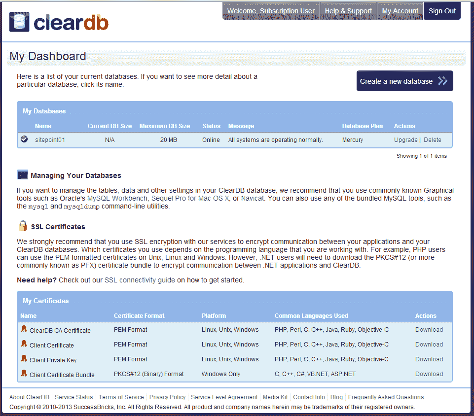

在推送测试连接之后，工作台应该连接成功。在按下 connect 之后，它应该显示一个空的数据库。

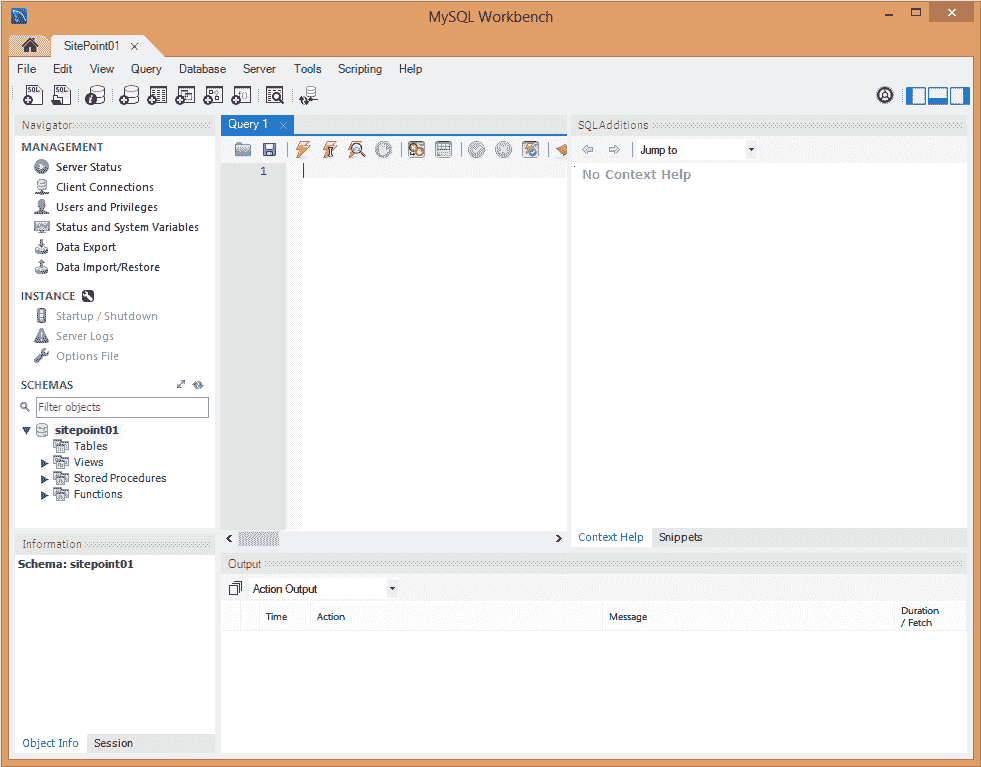

要设置一个包含我们将要检索的一些样本数据的基本表，请将以下 SQL 语句粘贴到 Workbench 的 SQL 选项卡中，然后单击“执行”按钮，该按钮由 SQL 选项卡工具栏中的 thunderbolt 图标表示。自然地，用您自己的数据库的名称替换“sitepoint01”。

```
USE `sitepoint01` ;

CREATE TABLE IF NOT EXISTS `sitepoint01`.`hello_world` (
  `id` INT UNSIGNED NOT NULL AUTO_INCREMENT,
  `data` VARCHAR(45) NULL,
  PRIMARY KEY (`id`))
ENGINE = InnoDB;

START TRANSACTION;
USE `sitepoint01`;
INSERT INTO `sitepoint01`.`hello_world` (`id`, `data`) VALUES (1, 'I was retrieved from the database!');

COMMIT;
```

我们现在在 MySQL 数据库中有数据。请记住，您还可以使用 Workbench 出色的模型编辑器以图形方式构建表和关系，然后将其全部直接导出到远程数据库。记住要经常保存——work bench 是一个很棒的工具，但是它可能会有很多错误，经常会崩溃。

## 将文件上载到 Windows Azure

可以通过两种方式将文件上传到 Windows Azure 应用程序:通过源代码管理或通过 FTP。

### 使用 FTP 将文件上载到 Windows Azure

如果你去你的应用程序的仪表板，你应该在右边的菜单中看到 FTP 主机名，但是没有用户。我们需要对此进行设置以进行测试。再次在“快速浏览”下，单击“设置部署凭证”来创建 FTP 用户。一旦完成，确保您的机器上安装了 FTP 客户端——我将使用 [FileZilla](https://filezilla-project.org/download.php?type=client) 来完成本文的目的。

连接再简单不过了。只需在 FileZilla 的新站点对话框中输入凭证，如下所示，然后单击 connect。

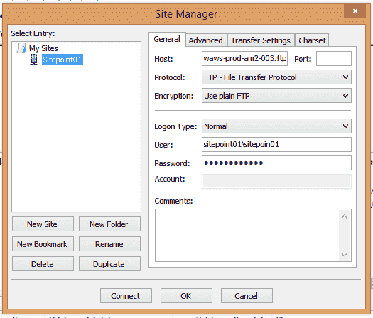

目录树一打开，你就可以导航到`/site/wwwroot/`，在那里你会找到两个文件:`favicon.ico`和`index.php`。将带有 FileZilla 的`index.php`文件下载到您决定保存应用程序内容的本地文件夹中，在您喜欢的代码编辑器中打开它，并将内容更改为以下内容:

```
<?php
echo "Hello World";
?>
```

然后，将文件上传回 Azure。如果要求您覆盖原始文件，请照办。现在，如果您访问您的 web 应用程序的 URL(该 URL 可以在仪表板的右侧栏中的其他数据中看到)，您应该会看到臭名昭著的 Hello World 消息。

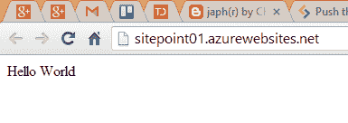

然而，使用 FTP 上传你的网站的文件是非常…九十年代。让我们进入信息时代。

### 将 Github repo 连接到 Windows Azure

要通过 Github 进行部署，我们需要先“清理”一下应用程序的本地文件夹。向其中添加以下文件:[。gitignore](https://gist.github.com/Swader/7844111) 和 [README.md](https://gist.github.com/Swader/7844135) 。

这些只是为了一个干净的仓库。每个 repo 都应该有一个 README 文件，不管它有多小，还有一个. gitignore 文件，确保没有垃圾文件被提交。

如果你使用的是 Windows，并且还没有安装用于 Windows 的 [Git 工具，那就安装吧。这些工具附带了一个 bash 应用程序(以及其他有用的项目),它使得 Git repo 设置过程在所有操作系统上都是相同的。](http://git-scm.com/downloads)

现在`cd`进入应用程序的本地文件夹，并运行命令:

```
git init
git add .
git commit -am 'First commit'
```

我目前使用的是 Windows，这个过程看起来是这样的:

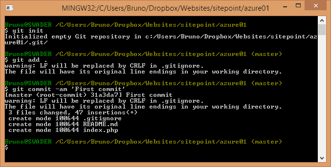

现在在 Github 上创建一个新的存储库。我把我的叫做“sitepoint-azure1”。按照 Github 的说明，将原点添加到我们刚刚在本地初始化的 repo 中。

```
git remote add origin git@github.com:Swader/sitepoint-azure1.git
git push -u origin master
```

随着我们应用程序的回购现在上线，让我们在 Azure 的管理面板中配置它。转到网站的仪表板或快速启动屏幕，然后单击“从源代码管理设置部署”选项。在出现的弹出窗口中，选择 Github，点击 next，授权 Azure 要求您授权的任何内容，并在提供的存储库列表中找到您刚刚创建的 repo。

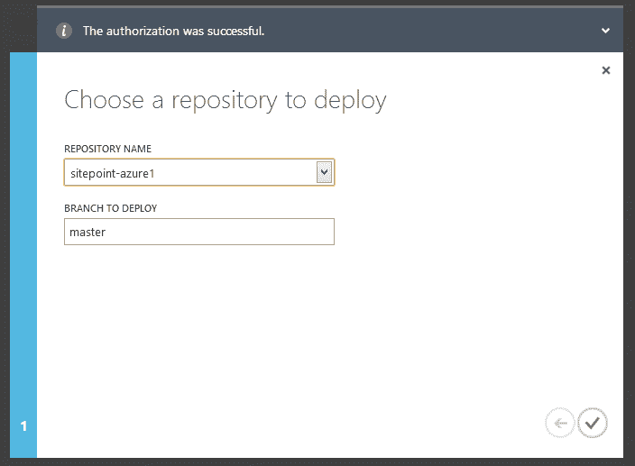

几秒钟后，部署应该准备就绪。事实上，一旦它完成处理，Azure 实例上的应用程序文件就会被更新。如果您现在刷新 FTP 客户端的视图，您会注意到我们的自述文件和。gitignore 文件也在那里。都是自动的。真的就这么简单！现在，每当你的开发伙伴之一更新你的 Github 应用，并且你接受他们对主分支的 pull 请求，Azure 会自动保持更新。如果你觉得它做得不够快，你甚至可以用部署选项卡页脚的按钮手动强制同步。

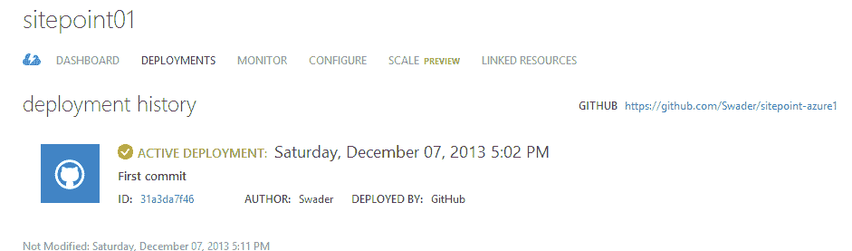

我们将在下一节演示它是如何自动更新的。

## 将 PHP 应用程序连接到 Windows Azure 上的 MySQL 数据库

首先，我们来考虑一些安全性。当连接到数据库时，我们需要让 PHP 知道使用哪个凭证来连接 MySQL。但是如果我们将它们直接包含在文件中，每个人都可以在 Github 中看到我们的密码。因此，在应用程序的本地文件夹中创建一个包含以下内容的`config.php`文件(当然，替换凭证以匹配您的凭证):

```
<?php
// Replace with your own
$sUsername = 'user';
$sPassword = 'pass';
$sHost = 'host';
$sDb = 'db';
```

然后，通过在我们的。gitignore 文件:

```
# Configuration
config.php
```

最后通过 FTP 手动上传`config.php`文件到服务器。这确保它保持不变——它将被自动部署和我们的本地 Git repo 忽略。

现在重新打开本地`index.php`文件，并将其内容更改如下:

```
<?php

require_once 'config.php';

try {
    $oConn = new PDO('mysql:host='.$sHost.';dbname='.$sDb, $sUsername, $sPassword);
    $oConn->setAttribute(PDO::ATTR_ERRMODE, PDO::ERRMODE_EXCEPTION);

    $oStmt = $oConn->prepare('SELECT data FROM `hello_world`');
    $oResult = $oStmt->fetchAll();

    foreach ($oResult as $aRow) {
        print_r($aRow['data']);
    }

} catch(PDOException $e) {
    echo 'ERROR: ' . $e->getMessage();
}
```

保存，在你的 app 的文件夹里运行`git commit -am 'Reading from DB'`，后面跟着一个`git push`。

观察应用程序管理面板中的部署屏幕——部署历史将随着每一次推送至`master`分支而增长。你的应用应该已经是最新的了——Azure 可以立即获取 Github 内容。

如果你现在重新访问你的应用程序的网址，你应该得到一个“我从数据库中检索！”显示消息。

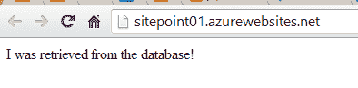

## 结论

如你所见，在 Windows Azure 上构建和部署应用程序非常简单。您可以在几分钟内设置一个自动化部署流程，所有这些都托管在一个高度可扩展且可靠的基础架构上，该基础架构具有内置指标和漂亮的仪表盘，使管理您的应用程序变得尽可能简单。

有了这些知识，为什么不试着参加 PTWF 竞赛，看看你是否能拿些奖品回家呢？

如果你想看到更具体的 Azure 主题，或者你只是有一些一般性的反馈，请在下面的评论中留下！

## 分享这篇文章