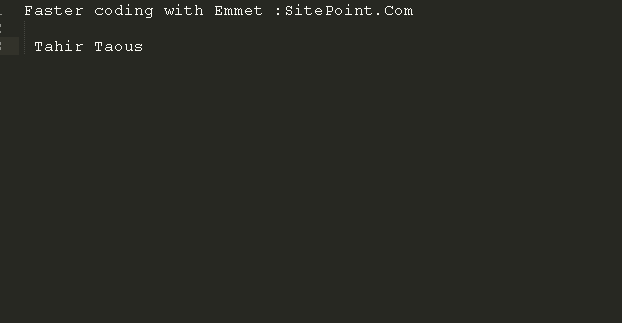
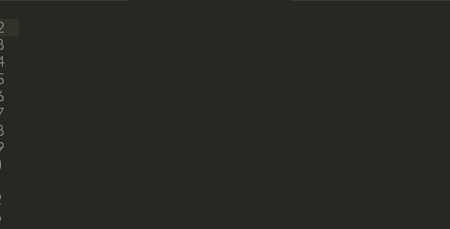
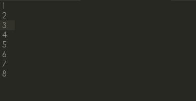
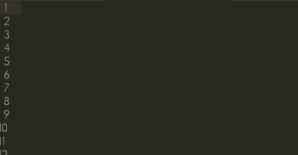
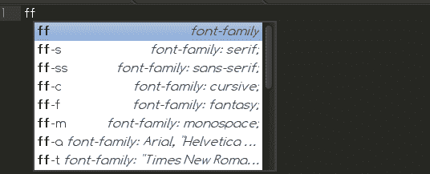
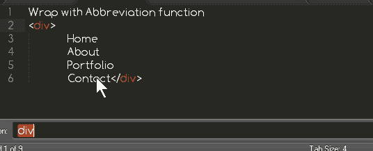

# 更快的工作流程:掌握 Emmet，第 1 部分

> 原文：<https://www.sitepoint.com/faster-workflow-mastering-emmet-part-1/>



Emmet 是一个免费的文本编辑器插件，可以更快地编写 HTML 和 CSS 代码。在这个由多个部分组成的系列中，我将向您展示如何使用 Emmet 更快地编写 HTML 和 CSS 代码，概述 Emmet 的所有功能，以及如何使用语法、缩写和键盘快捷键来节省您的时间。

[Emmet](http://emmet.io/) 是一个必须使用的网络开发工具包。使用 Emmet，您可以快速创建您的标记。你只需编写简单的缩写，然后按下`Tab`或`Ctrl+E`或任何其他支持的键盘快捷键，Emmet 就会将简单的缩写扩展成复杂的 HTML 和 CSS 代码片段。Emmet 将使你的 HTML 和 CSS 工作流程更快。

如果你制作了很多带有导航条、表格和/或多栏布局的 HTML 模板，你会发现 Emmet 非常有用。一旦你习惯了 Emmet 语法，它将改变你创建网页的方式。我向您保证，当您在工作流程中使用 Emmet 时，您会爱上它。Emmet 很可能会改变你编写 HTML 和 CSS 代码的方式。

你可以把 Emmet 作为一个插件安装在许多流行的文本编辑器上。下面我列出了一些支持 Emmet 的代码编辑器。关于如何在每个文本编辑器中安装和使用 Emmet 的文档可以在网上找到。

*   [Dreamweaver](https://github.com/emmetio/dreamweaver#readme "Emmet for Dreamweaver") 版
*   [月食](https://github.com/emmetio/emmet-eclipse#readme "Emmet for Eclipse")
*   [SublimeText](https://github.com/sergeche/emmet-sublime#readme "Emmet for Sublime Text")
*   文字
*   [浓缩咖啡](https://github.com/emmetio/Emmet.sugar#readme "Emmet for Espresso")
*   [结尾](https://github.com/emmetio/Emmet.codaplugin#readme "Emmet for Coda")
*   [括号](https://github.com/emmetio/brackets-emmet#readme "Emmet for Brackets")
*   和许多其他人

您可以在[http://emmet.io/download/](http://emmet.io/download/)查看支持的文本编辑器的完整列表

许多流行的在线服务都支持 Emmet。这意味着无论在哪里，您都可以更快地编写代码。以下是一些支持 Emmet 的服务。

*   [https://jsfiddle.net/](https://jsfiddle.net/)
*   [http://jsbin.com/](http://jsbin.com/)
*   [http://codepen.io/](http://codepen.io/)
*   [http://icecoder.net/](http://icecoder.net/)
*   [https://codio.com/](https://codio.com/)

## 为什么要用 Emmet？

答案很简单:让你的编码工作流程更快。Emmet 让你写闪电般快速的代码。简单的类似 CSS 的缩写扩展成复杂的代码。您可以轻松地生成 lorem ipsum 文本，使用许多键盘快捷键等等。



## 埃米特是如何工作的？

Emmet 使用类似 CSS 的选择器语法，您编写类似 CSS 的缩写，将光标放在缩写的末尾，然后按下`Tab`、`Ctrl+E`或任何其他配置为将缩写扩展为实际 HTML 代码的键盘键。埃米特将`a`扩展成`<a href=""></a>`。您也可以指定值，但是如果您不指定值，`<a>`将在每个空属性中产生带有制表位的`<a href=""></a>`。您可以插入一个目标 URL，然后按 Tab 键转到下一个编辑点，在那里您可以插入下一个所需的值。



让我们看另一个例子。如果你写

```
div#header>h1.logo>a{site Name}
```

您将拥有以下代码:

```
<div id="header">
	<h1 class="logo"><a href="">site Name</a></h1>
</div>
```

## 扩展缩写功能



以下是一些受支持的运算符的列表。

 **Element : (`Div`, `p`, `span`)** 

Type the element name and hit Tab to expand.

`div` will be expanded to `<div></div>`.

 **Element with id (`div#header`, `E#id`)** 

`#` is used to apply id’s to any element.

 **Element with class `(div.container, aside.sidebar)`** 

`.` is used to apply classes to any element.

 **Child element `div.header>div.main>.post`** 

`>` is used to create child elements.

 **Sibling Elements E+N `(h1+h2)`** 

`+` sign is used to create sibling elements.

 **Multilpication of Elements `li*5`** 

`*` symbol will create defined multiple numbers of any element. Useful to create list items.

 **Item numbering `li.item$*5`** 

`$` symbol create item number. You can use it with `*` to create multiple items with numbering.

**Climb-up: ^ : header>#main^footer**

With `^` operator, you can climb one level up the tree and change context where following elements should appear:

**Grouping: ()**

`{}` Parentheses can be used for grouping sub-trees in complex abbreviations.

**Adding text {} : E{text}**

`{}` is used to add text to an element.

Emmet 还提供了一些更好的特性，我将在后面详细讨论。

## CSS 缩写

虽然 Emmet 缩写对于生成 HTML、XML 或任何其他结构化标记很有用，但它们对于 CSS 也非常有用。Emmet 为你提供了 CSS 属性的简写。对于 CSS 语法，Emmet 有许多预定义的属性片段。您可以扩展`bd`的缩写得到一个`border: ;`片段，用`br`表示`border-right: ;`。您也可以为此属性指定一个值。只需输入`border-left: 10px;`的`bl:10`。

如果要指定多个值，用连字符分隔:`m10-20`展开为`margin: 10px 20px;`。要指定负值，请在第一个值前面加一个连字符，其余的用双连字符:`m-10--20`扩展为`margin: -10px -20px;`



## 动作和键盘快捷键

Emmet 提供了许多有用且省时的操作和键盘快捷键。Emmet 提供了独特的工具，可以极大地改善您的编辑体验，并且在您必须编辑 HTML 和 CSS 代码以修复错误和添加新功能时非常有用。Emmet 的一些操作对于编辑现有的 HTML 代码很有用，比如用缩写包装**函数。使用此功能，您可以将导航项目包装在导航菜单中。**



其他一些可用的操作包括:

*   展开缩写
*   匹配标签对
*   前往配对
*   前往编辑点
*   更新图像大小

我们将在本系列接下来的第 2、3 和 4 部分中了解所有这些动作，甚至更多。

## 分享这篇文章