# 用 Photoshop 设计骨骼排版

> 原文：<https://www.sitepoint.com/design-bone-typography-photoshop/>

设计师经常会发现自己被赋予了创造非典型设计的任务。客户想出富有想象力的设计，他们希望设计师将这些设计带入生活，而作为设计师，你的工作就是做到这一点。无论你是围绕一个事件还是一个单词进行设计，设计自己的字体都会打开一扇充满无限可能的门。

字体设计是试验和创造一些有趣作品的好方法。你可以创造出各种各样的创意类型，这些类型你通常不会想到在日常设计中使用。从任何东西到爆炸式排版，再到熔化式排版，你能想到的东西数不胜数。在今天的教程中，我们将创建一个骨骼填充字体，你可以用它来完成你所有的恐怖和怪异的项目。打开你的 Photoshop，让我们开始吧。

第一步新画布
我们首先需要创建一个新画布，在这里我们可以设计我们的骨骼。转到文件>新建或 Ctrl+N，使你的画布 300 像素乘 500 像素。
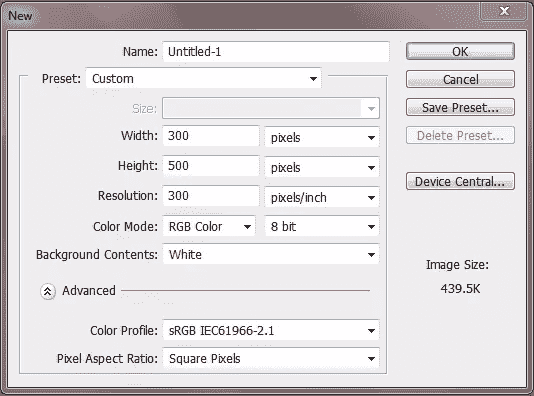

**第二步填充背景**
由于我们骨骼的基色是白色，我们需要在画布上添加一个背景色来区分背景和形状。新建一个图层，用#b3c54d 填充。

第三步专栏
我们现在可以开始创建我们的骨骼了。首先把你的前景色改成白色或者#ffffff。接下来选择矩形工具，并在画布中间添加一个细长的列。这将是我们骨骼的基础。
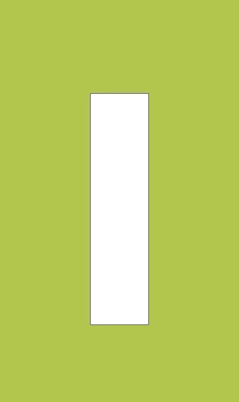

现在我们必须给我们的柱子添加一个轻微的弯曲。如下图所示，使用扭曲工具扩展角部并收缩中间。
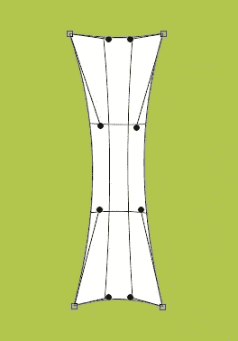

第五步骨骼顶部
为了创建骨骼的顶部，使用椭圆工具创建一个大小合适的圆。

复制你的圆，然后移动两个圆，使它们位于圆柱的顶部并稍微重叠。
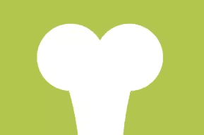

现在复制你的一对，并把它们移到列的底部，直到你最终得到一个看起来像骨头的东西。
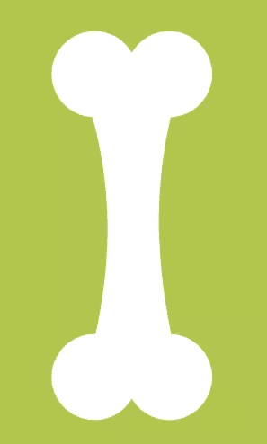

**第六步复制骨骼**
选择你所有的骨骼元素，然后将它们转换成智能对象。然后复制图像，这样你就有两层了。
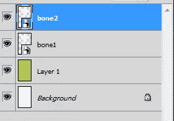

第七步灰色骨骼
在我们制作 3D 骨骼之前，我们需要改变第一层骨骼的颜色。隐藏“骨骼 2”层，并转到“骨骼 1”的混合选项。选中颜色覆盖框，将颜色更改为#7b7b7b。将不透明度更改为 20%。
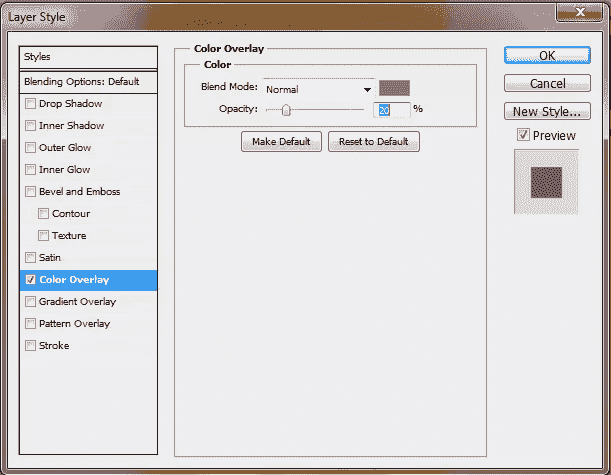

第八步灰色骨骼效果
在同一个图层上，再次选择混合选项，勾选内阴影、斜面和浮雕。
对于内部阴影，更改设置以匹配下图。
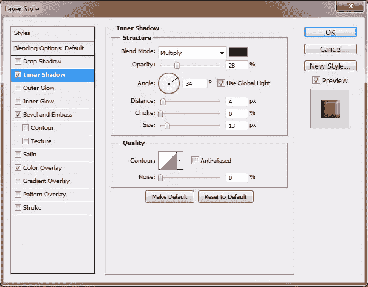

对于斜面和浮雕，更改如下所示的设置。
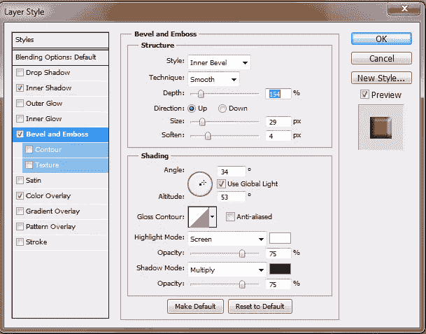

最终的图像应该是这样的。
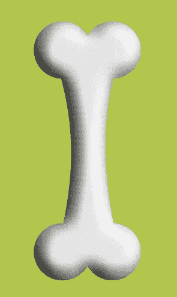

**第九步**差云
使“骨骼 2”层再次可见。接下来过滤>渲染>不同的云彩。这样做两次，使你的图像看起来像这样。
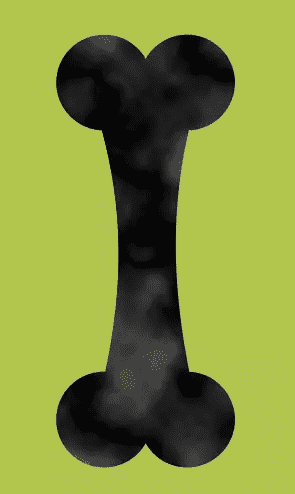

**第 10 步喷溅**
停留在同一层去过滤>笔刷笔画>喷溅，输入如下图相同的设置。
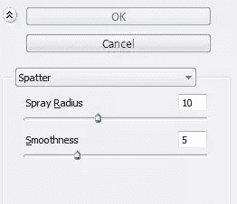

**步骤 11 霓虹辉光**
下一步进入滤镜>艺术>霓虹辉光，改变设置如下图所示。
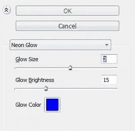

添加滤镜后，将图层模式更改为颜色加深。
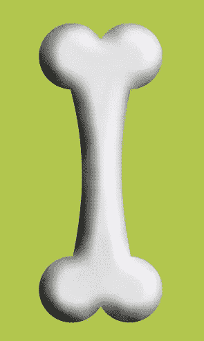

**步骤 12 斜面和浮雕**
打开“骨骼 2”层的混合选项菜单，检查轮廓和斜面框。更改斜面和浮雕的设置，但保留轮廓的默认设置。
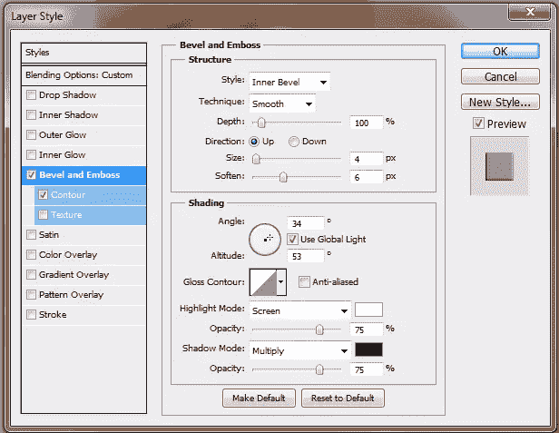

步骤 13 剪切
合并你的骨骼元素，这样你只有一个骨骼层，然后复制这个层。接下来转到滤镜>艺术>剪切，保持设置不变，然后按 OK。将图层模式改为变亮。
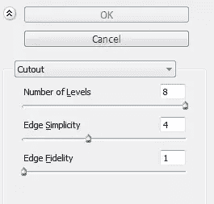

**步骤 14 颜色**
我们现在要给我们的骨骼添加一些颜色。选择颜色#8b6540，用柔软的圆形笔刷在骨骼的边缘随意绘制。
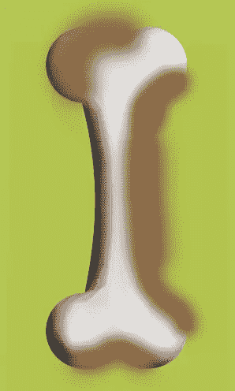

下一步改变图层模式为柔光，删除多余的部分。
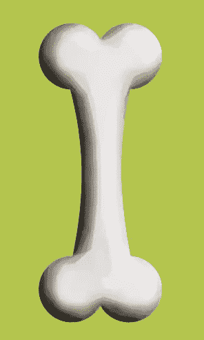

第 15 步颜色 2
改变你的前景色为#33291f，在骨骼部分的新图层上添加更暗的阴影。
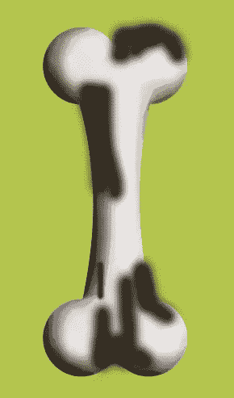

将图层模式改为柔光，再次去除多余部分。
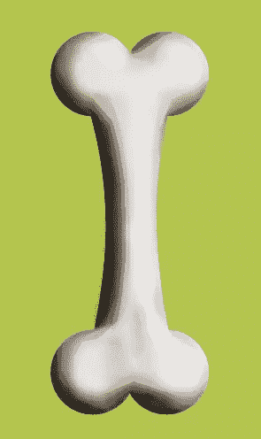

为了给我们的骨骼添加颜色，我们需要再创建一层。将前景色更改为#ea6654，并绘制骨骼的右侧。
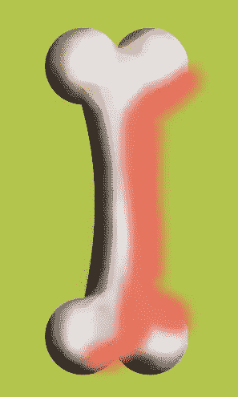

改变图层模式为饱和，不透明度降低到 27 左右。像之前一样擦掉多余的颜色。
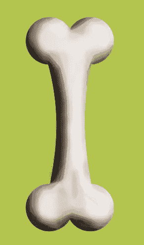

第十七步新建画布
新建一个画布，尺寸为 1100 像素和 800 像素。
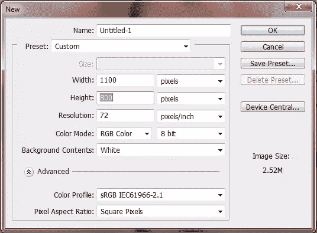

**步骤 18 背景色**
用颜色#372d26 填充背景。

确定你的前景是#372d26，背景是#fffff。完成后，通过混合选项添加一个径向渐变，但是要确保反转选项被选中。
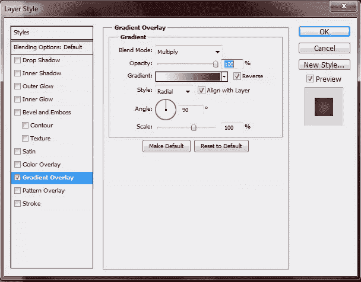

现在你可以在画布上写下你想要的文字了。你使用的字体并不重要，你只需要它作为一个指南。在这种情况下，我只是使用 Arial 字体输入“bone”。
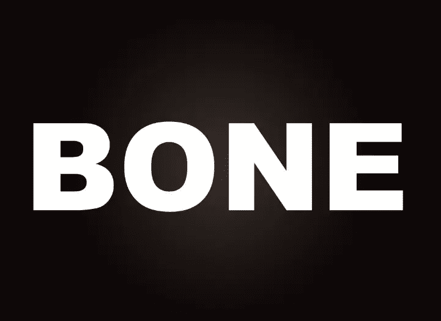

**步骤 20 导入骨骼**
我们现在已经设置好了文本，所以我们需要导入骨骼来开始构建文本。要做到这一点，只需合并你的骨骼元素在一起，除了背景，一旦完成，右键单击单一层，单击复制层，并选择适当的画布。
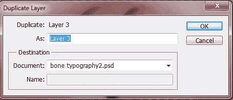

调整尺寸
你会注意到你的尺寸相对于文本来说相当大。要解决这个问题，只需按比例缩小骨骼，使其达到所需的大小，这样您就可以制作字母了。
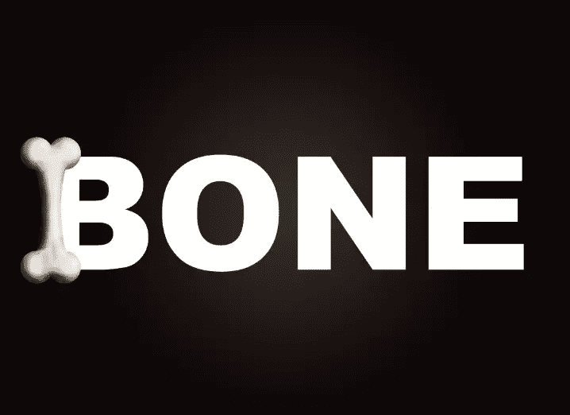

复制并旋转
为了制作我们的字母，你需要复制你的原始骨骼层并旋转它们来制作你的字母。注意我是如何让骨头重叠的。

**步骤 23 完成**
继续复制、旋转和调整你的骨骼，直到你想要的单词拼写出来。
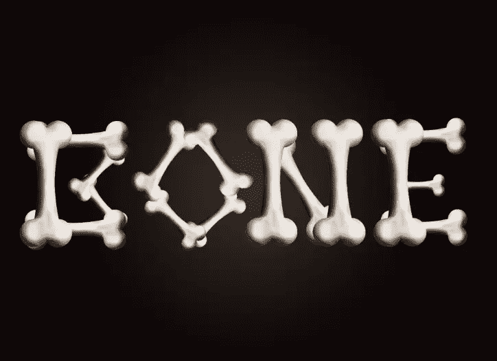

[下载 PSD 文件](https://www.dropbox.com/s/516br2zqo3ashv4/Bone%20Typography.zip)

## 分享这篇文章