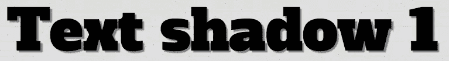
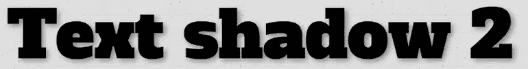
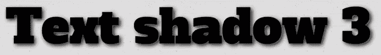
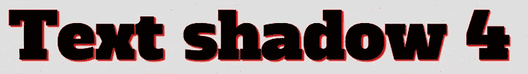
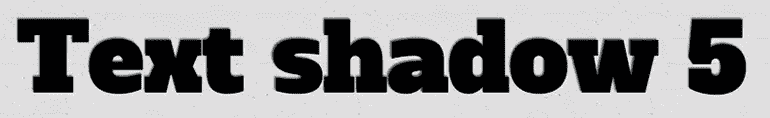
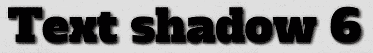
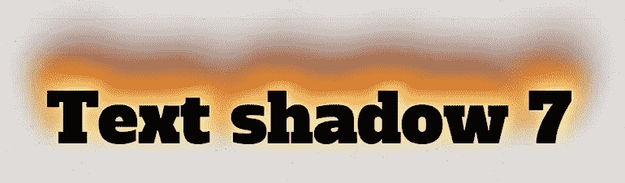
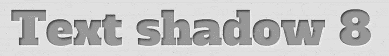
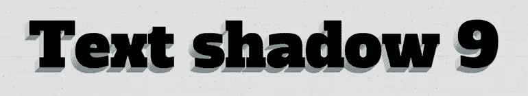
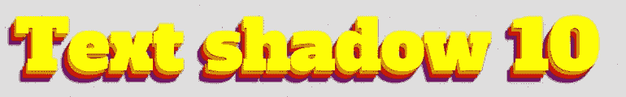

# 利用 CSS 文本阴影兼职

> 原文：<https://www.sitepoint.com/moonlighting-css-text-shadow/>

## 介绍

CSS level 3 (CSS3)的魅力很大程度上来自于其各种功能减少背景图像和 Photoshop 肌肉伸缩的能力，允许我们以编程方式创建许多图形需求。这带来了许多好处——节省时间，减少 HTTP 请求和文件重量，更大的灵活性等等。

当然，这是有代价的，因为这些特性在旧版本的 IE 中不能工作，我们可能仍然需要支持旧版本。

在这篇文章中，我将介绍古老的文本阴影属性，带你从基础开始，通过有趣的应用，直到高级考虑。我们走吧。

## 基础

一开始，文本阴影是一个非常简单的属性，可以应用于任何元素:

```
.shadow1 {
	  	text-shadow: 3px 3px 1px gray;
	  }
```

应用了文本阴影属性的元素中的任何文本内容都将有阴影。

属性值中的四个值如下:

*   文本的水平偏移量。正数使阴影向右移动，负数使阴影向左移动
*   文本的垂直偏移量。正数向下移动阴影，负数向上移动阴影。
*   阴影的模糊半径。值越大，阴影看起来越模糊
*   阴影的基本颜色。这可以是任何有效的 CSS 颜色单位，包括 RGBA/HSLA。

下图显示了模糊半径为 1px 和 7px 的简单阴影之间的差异:





您可以对单个文本选择应用多个阴影，方法是简单地编写多个文本阴影值，用逗号分隔:

```
.shadow3 {
	  	text-shadow: 1px 1px 1px #666,
	  	             3px 3px 8px black;
	  }
```



## 先进的思想

您可以使用上面给出的简单语法，随心所欲地使用它。您可能只想要一个非常简单的凸起或嵌入效果:

```
.shadow4 {
	  	text-shadow: 1px 1px 1px red,
	  	             2px 2px 1px red;
	  }
```

```
.shadow5 {
	  	text-shadow: -1px -1px 1px #555,
	  	             -2px -2px 1px #666;
	  }
```





或者更有趣的东西，比如复杂的 3D 效果:

```
.shadow6 {
        text-shadow: -1px -1px 1px #aaa,
                     0px 4px 1px rgba(0,0,0,0.5),
                     4px 4px 5px rgba(0,0,0,0.7),
                     0px 0px 7px rgba(0,0,0,0.4);
      }
```



甚至是传说中的火焰文字阴影——任何重金属网站的必备:

```
.shadow7 {
        text-shadow: 0 0 20px #fefcc9,
                     10px -10px 30px #feec85,
                     -20px -20px 40px #ffae34,
                     20px -30px 35px #ec760c,
                     -20px -40px 40px #cd4606,
                     0 -50px 65px #973716,
                     10px -70px 70px #451b0e;
	  }
```



使用 background-clip: text(不幸的是，目前只有基于 WebKit/Blink 的浏览器支持它)创建一个更漂亮、更精确的插入文本效果怎么样？)

```
.shadow8 {
        background-color: #333;
        -webkit-background-clip: text;
        -moz-background-clip: text;
        background-clip: text;
        color: transparent;
        text-shadow: rgba(255,255,255,0.5) 2px 3px 6px;
       }
```



还是一个夸张的、有趣的巨型 3D 乐高文本？

```
.shadow9 {
       	 text-shadow: 0 1px #808d93,
       	              -1px 0 #cdd2d5,
       	              -1px 2px #808d93,
       	              -2px 1px #cdd2d5,
       	              -2px 3px #808d93,
       	              -3px 2px #cdd2d5,
       	              -3px 4px #808d93,
       	              -4px 3px #cdd2d5,
       	              -4px 5px #808d93,
       	              -5px 4px #cdd2d5,
       	              -5px 6px #808d93,
       	              -6px 5px #cdd2d5,
       	              -6px 7px #808d93,
       	              -7px 6px #cdd2d5,
       	              -7px 8px #808d93,
       	              -8px 7px #cdd2d5;
       }
```



请记住，文本阴影甚至可以使用 CSS 动画制作——下面的例子创建了一堆不同颜色的字母形状，它们以一种很棒的方式来回移动。

```
.shadow10 {
       	 color: yellow;
       	 text-shadow: 1px 1px 2px rgba(0,0,0,0.7),
       	              5px 5px 1px orange,
       	              6px 6px 2px rgba(0,0,0,0.7),
       	              10px 10px 1px red,
       	              11px 11px 2px rgba(0,0,0,0.7),
       	              15px 15px 1px purple,
       	              16px 16px 2px rgba(0,0,0,0.7);
       	 -webkit-animation: text-snake 1s infinite alternate;
       	 -moz-animation: text-snake 1s infinite alternate;
       	 -ms-animation: text-snake 1s infinite alternate;
       	 animation: text-snake 1s infinite alternate;      
       }

       /* other prefixed animation blocks ommitted for brevity */

       @keyframes text-snake {
         from {
         	text-shadow: 1px 1px 2px rgba(0,0,0,0.7),
       	              5px 5px 1px orange,
       	              6px 6px 2px rgba(0,0,0,0.7),
       	              10px 10px 1px red,
       	              11px 11px 2px rgba(0,0,0,0.7),
       	              15px 15px 1px purple,
       	              16px 16px 2px rgba(0,0,0,0.7);
         }
         to {
         	text-shadow: -1px 1px 2px rgba(0,0,0,0.7),
       	              -5px 5px 1px orange,
       	              -6px 6px 2px rgba(0,0,0,0.7),
       	              -10px 10px 1px red,
       	              -11px 11px 2px rgba(0,0,0,0.7),
       	              -15px 15px 1px purple,
       	              -16px 16px 2px rgba(0,0,0,0.7);
         }
       }
```



这里有一个演示:

通过[码笔](http://codepen.io)上的 SitePoint ( [@SitePoint](http://codepen.io/SitePoint) )看笔 [qtmjw](http://codepen.io/SitePoint/pen/qtmjw) 。