# 在 Illustrator 中创建华丽的商店应用程序图标

> 原文：<https://www.sitepoint.com/create-gorgeous-shop-app-icon-illustrator/>

在本教程中，我将向您展示如何在 Adobe Illustrator 中创建一个华丽的商店应用程序图标。我们将使用各种形状工具，钢笔工具，渐变工具，形状生成器工具和一些在效果和对象菜单中的选项来达到最终的效果。希望你会学到一些有用的技巧。所以，让我们开始吧！

### 最终结果:

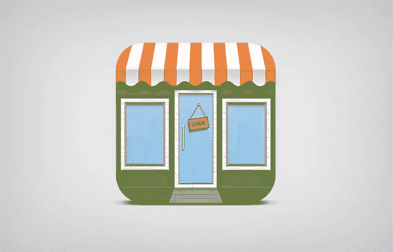

### 第一步

在 Illustrator 中创建新文档，宽度为 500 像素，高度为 400 像素。
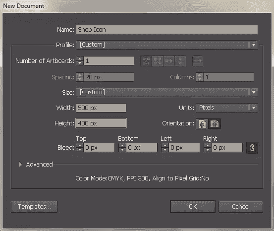

### 第二步

选择#7ABA42 填充颜色，选择矩形工具(“M”)并点击画布查看矩形窗口。输入 264px 作为宽度和高度，然后点击“确定”来绘制一个矩形。贴上“基地”的标签。
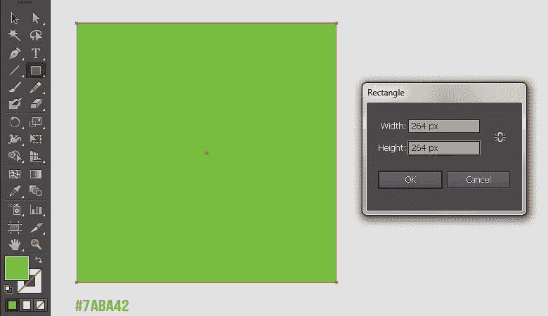

选择它，然后进入“效果”>“风格化”>“圆角”。输入 45px 半径将其转换为圆角矩形。现在转到“对象”>“扩展外观”来修改形状。
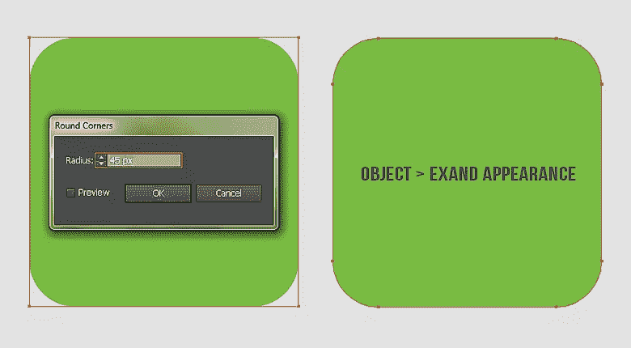

### 第三步

选择“基础”形状，进入“效果”>“风格化”>“内发光”。在此应用给定的设置。
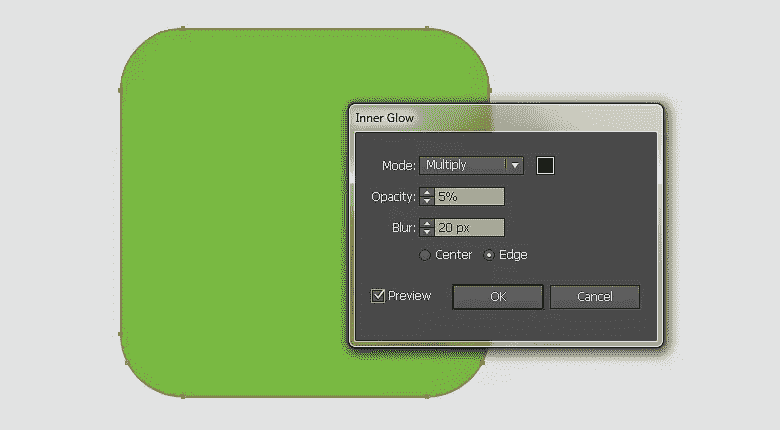

### 第四步

接下来，我们将添加纹理的基础。按 Ctrl+ "C "复制底部，按 Ctrl + "F "粘贴在前面。现在进入“效果”>“素描”>“康特蜡笔”，在这里应用给定的设置。
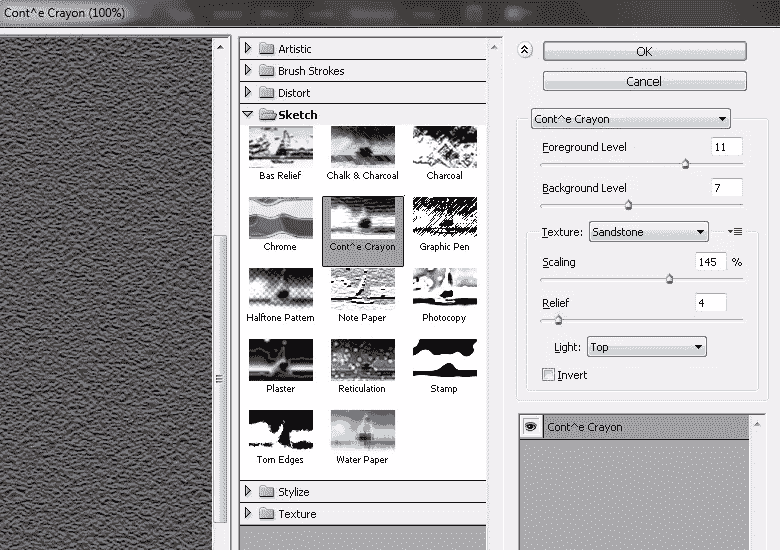

在“透明度”面板中将纹理层的不透明度降低到 10%(Shift+Ctrl+F10)。
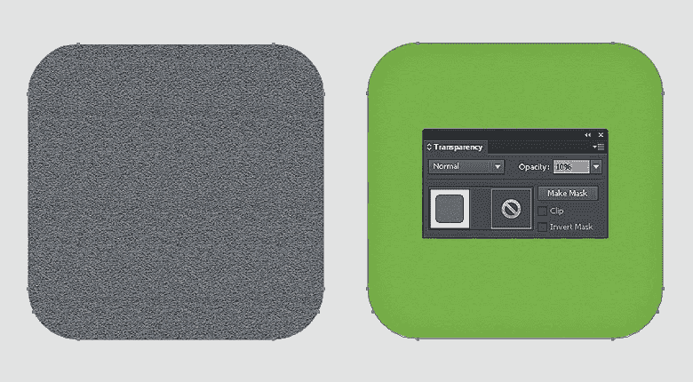

### 第五步

我们现在将创建遮阳篷。选择矩形工具(“M”)并使用任何填充颜色绘制一个矩形，宽度为 350 像素，高度为 50 像素。
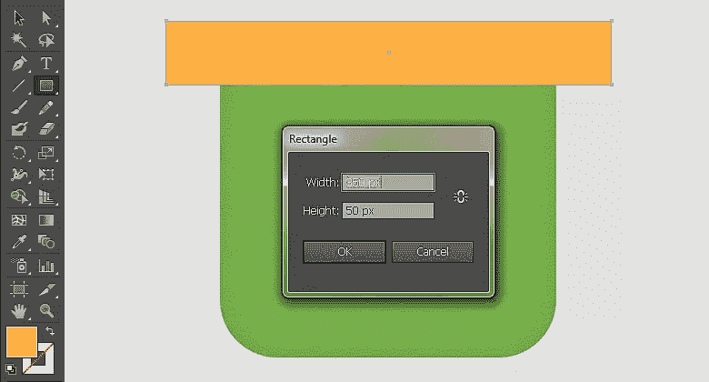

制作基础层的另一个副本；贴上“框架”的标签。我们将使用它作为指导来修剪其他形状。选择矩形和框架层，并选择形状生成器工具(Shift+“M”)。现在将工具放在框架外的矩形部分，你会注意到形状的外观发生了变化，现在单击该部分，同时按“Alt”键删除它。使用此工具删除框架外矩形的两边。将这个新形状标记为“顶部”。
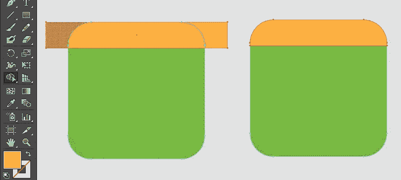

### 第六步

再次选择矩形工具(“M”)，画一个 285 像素宽，50 像素高的矩形。贴上“前面”的标签。
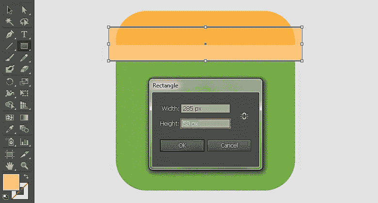

现在选择前面的形状，进入“效果”>“扭曲和变形”>“之字形”。在此应用给定的设置。并转到“对象”>“展开外观”来修改形状。
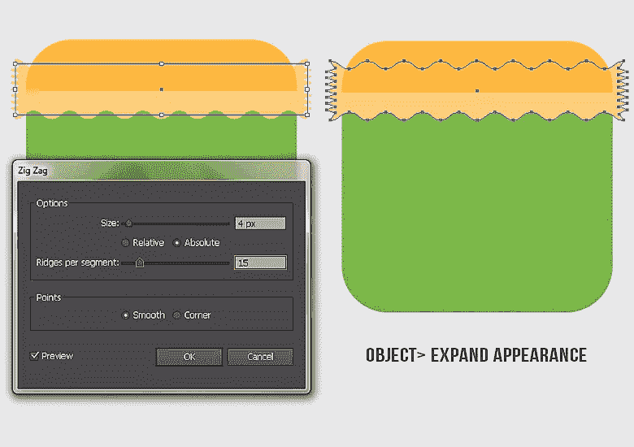

接下来，大致画一个矩形覆盖顶部形状层。之后，选择框架，前面和这个新的矩形层。选择形状生成器工具(Shift + "M ")并沿着下图所示的三条路径拖动它，同时按下" Alt "键删除它们。
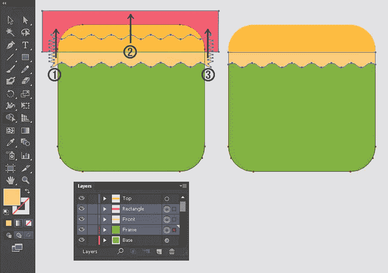

### 第七步

接下来，通过重复绘制#EF6346 和#F7F7F7 颜色矩形来制作条纹图案。要将图案限制在前部形状，请选择图案和前部形状层，并删除前部形状外的图案部分。
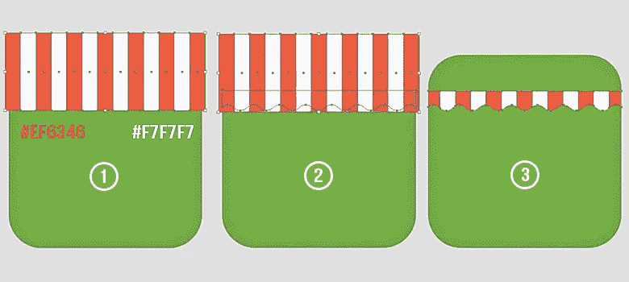

现在选择钢笔工具(“P”)并绘制遮阳篷顶部的条纹。一旦你完成了，选择这些条纹和顶部形状层，并删除顶部形状层以外的条纹部分使用形状生成器工具(Shift + "M ")。

### 第八步

现在把前面的形状层放在图案层上面，使用渐变工具(“g”)在 90⁰应用黑色到白色渐变。改变其混合模式为 20%不透明度的“乘”。
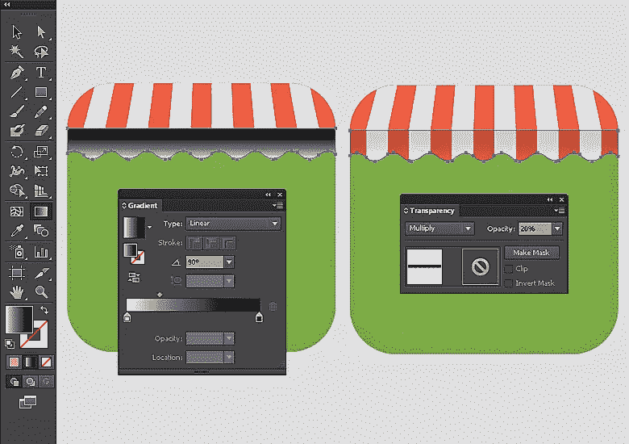

接下来，将顶部的形状层放在它的图案层上面，并在上面应用如下的“橙黄色”渐变。你可以通过“窗口”>“样本库”>“渐变”>“颜色组合”找到这个渐变。改变渐变层混合模式为“颜色减淡”，40%不透明度。
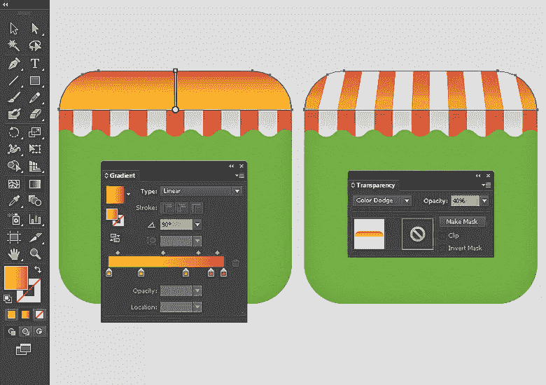

### 第九步

要制作遮阳篷的阴影，复制“前面”的形状，并将其放置在基础层的正上方。改变其填充颜色为黑色，并拖动它向下 3-5 步使用选择工具(“V”)。之后选中它，进入“效果”>“模糊”>“高斯模糊”。应用 20px 高斯模糊效果，然后改变其混合模式为“乘”40%不透明度。
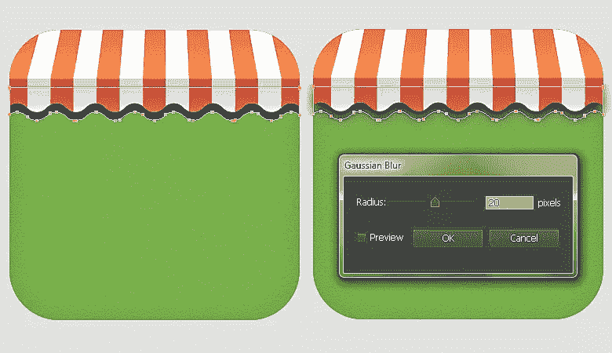

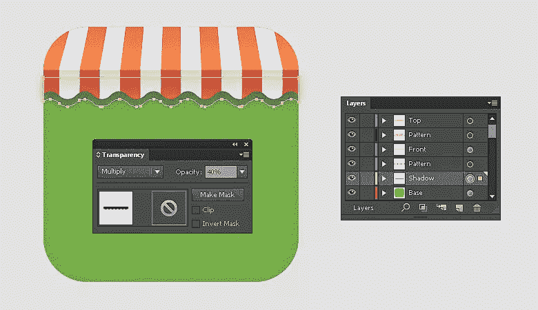

### 第十步

接下来，我们将绘制一个窗口；制作一个宽度为 80px，高度为 118px 的矩形，填充颜色为白色。选择它，并前往“对象”>“路径”>“偏移路径”。并将路径偏移“-6px”。将新的路径填充颜色更改为灰色。
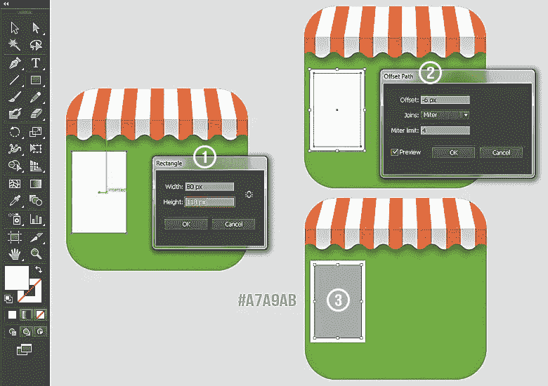

现在选择灰色路径，偏移“-4px”。如下图所示，将其填充为蓝色。
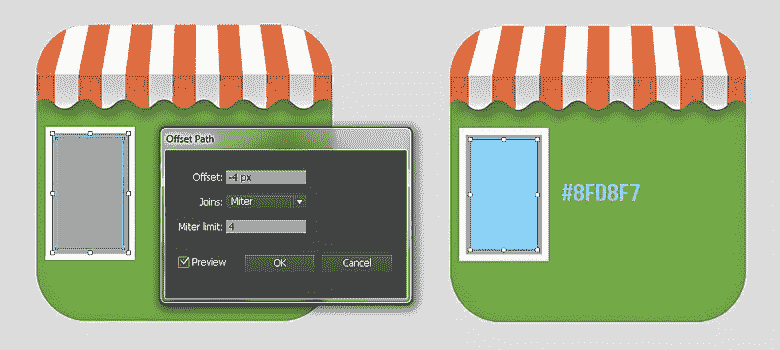

### 步骤 11

选择窗口的白色框架，并按下 Shift+“F6”查看外观面板。单击“外观”面板底部的“添加新填充”图标，并从色板中选择“线条”图案。将图案不透明度降低到 30%。你可以通过进入“窗口”>“样本库”>“图案”>“基本图形”>“基本图形-纹理”>“线条”找到这个图案。接下来，选择钢笔工具(“P”)在灰色框架上用深灰色填充颜色绘制以下形状。
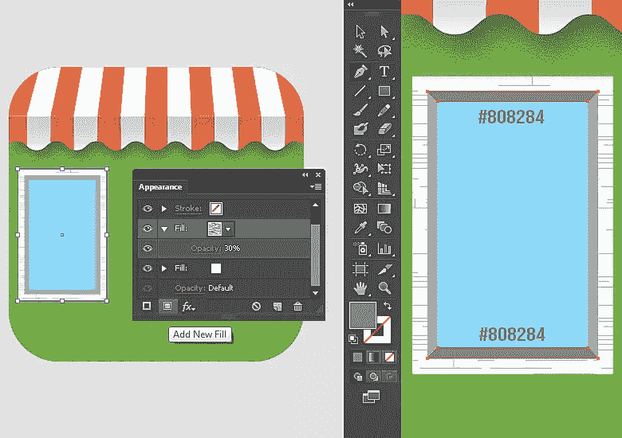

### 步骤 12

要制作窗口的阴影，选择白色框架，进入“效果”>“风格化”>“外发光”。在此应用给定的设置。
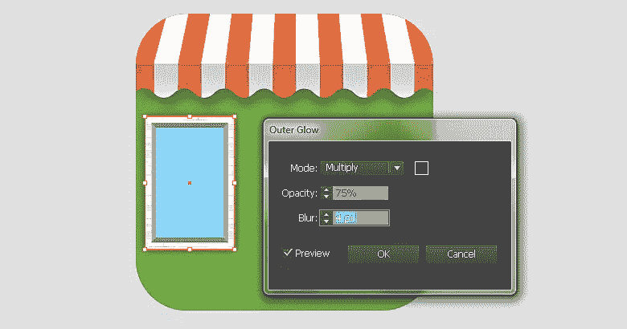

现在在窗口下面做一个小的黑色矩形，应用 5px 高斯模糊效果，不透明度降低到 40%。制作它的副本，并在调整大小后将其放置在玻璃上，如下所示。
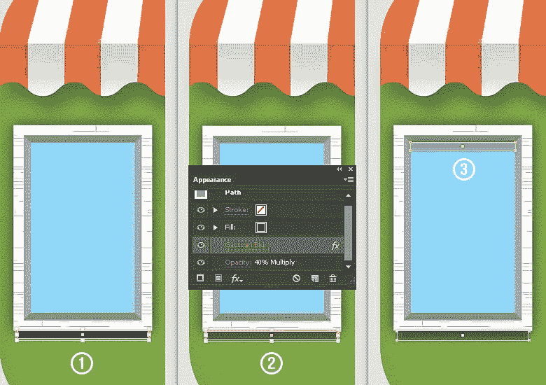

### 第十三步

接下来，我们将使建筑物在窗户玻璃上反射。在玻璃里画几个随机的矩形，然后在上面应用“蓝色到透明”的渐变。将不透明度降低到 40%。
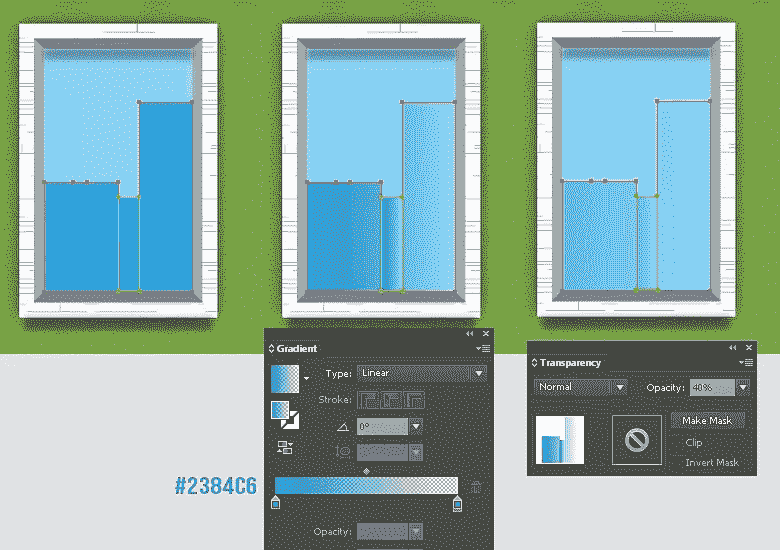

选择构成左侧窗口的所有图层，并从图层面板右上角的弹出菜单中选择“在新图层中收集”。贴上“左窗”的标签。复印一份，放在右边，贴上“右窗”的标签。只需通过绘制新的矩形来改变玻璃上的反射。同样，制作另一个窗口的副本，并使用选择工具(“V”)调整其大小，以制作如下所示的门。
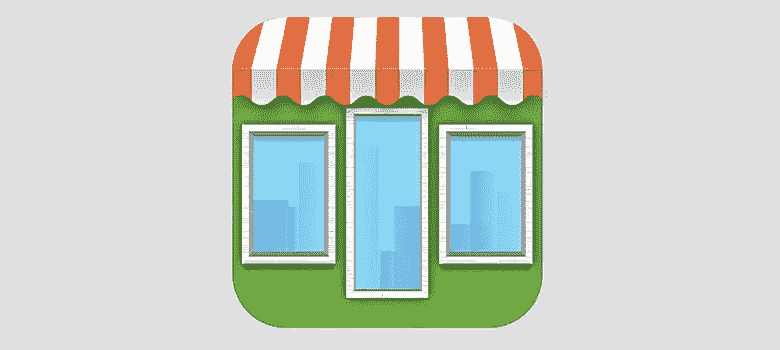

### 步骤 14

现在我们来做门把手。使用圆角矩形工具绘制一个矩形，并在其上应用“铬”渐变。你可以通过“窗口”>“样本库”>“渐变”>“金属”找到这个渐变。要制作它的阴影，选择手柄，按 Ctrl+ "C "复制，按 Ctrl+ "B "粘贴到后面，改变它的填充颜色为#808284，向左下拖动几步。

### 第十五步

现在用#C39A6B 填充颜色和#3B2314 颜色描边在门上画一个小矩形(描边粗细:1 磅)。复制并粘贴在前面，应用线条模式，改变其混合模式为“颜色减淡”，40%不透明度。在上面输入一些文字，我在这里用的是“Myriad Pro”字体。选择所有这些层，并使用选择工具(“V”)旋转一点，使其阴影。
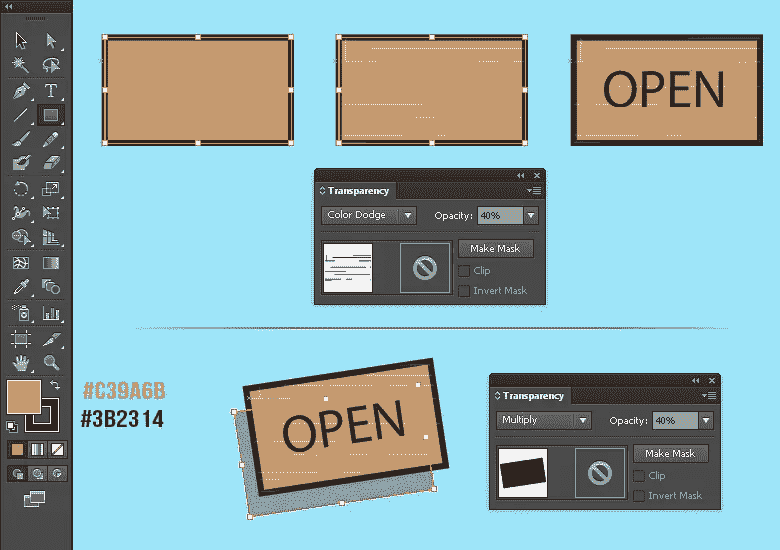

### 第十六步

使用钢笔工具(“P”)用#6D6E70 笔画颜色(1 磅)制作字符串。然后，画一个小椭圆，在上面加一些高光，如下图所示。然后制造他们的影子。
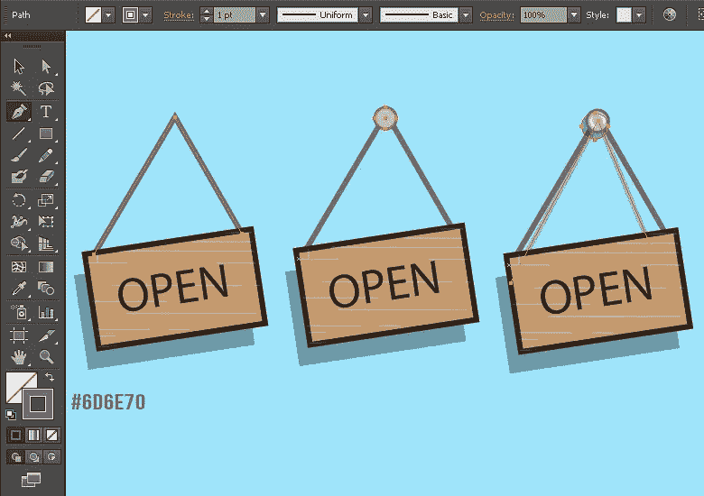

### 步骤 17

接下来，使用#6D6E70 填充颜色绘制一个矩形。并删除图标底部以外的部分。
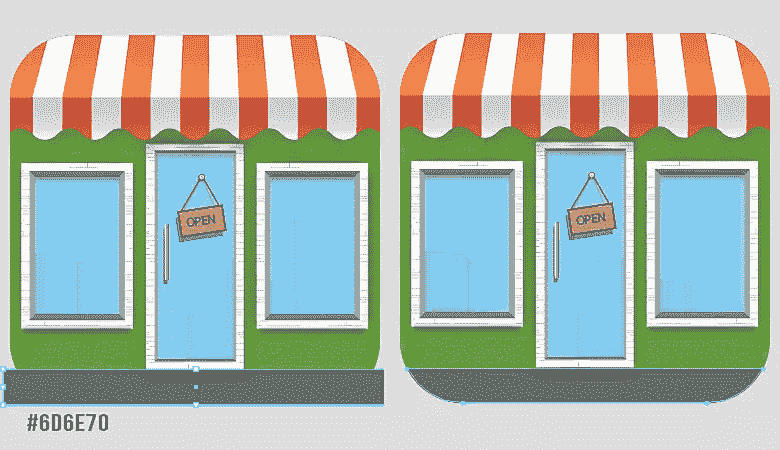

### 步骤 18

选择道路形状，并在外观面板中添加新的填充。选择“线条”图案作为填充。之后，选择它并应用给定的内部发光设置。
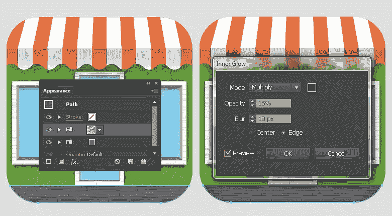

### 步骤 19

使用钢笔工具(“P”)用#BBBDC0 填充颜色绘制以下形状。你可以用#58585B 笔画颜色在上面添加几行。
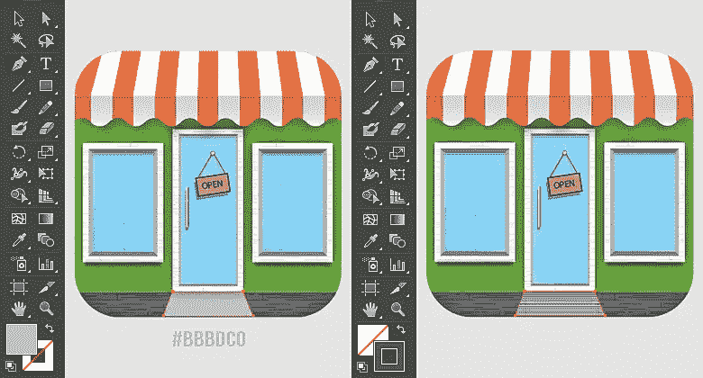

### 步骤 20

要制作商店阴影，使用钢笔工具(“P”)绘制如下所示的形状，并在其上应用 8px 高斯模糊效果。然后，复制它，用选区工具增加宽度，不透明度降低到 30%。
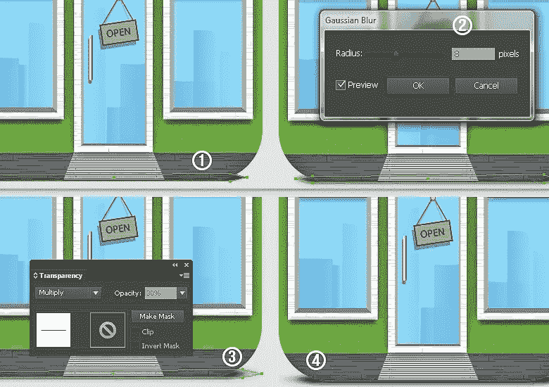

### 最终结果:

好了，伙计们，我们的应用图标准备好了。希望你喜欢这个教程，并学到一些有用的东西。

## 分享这篇文章