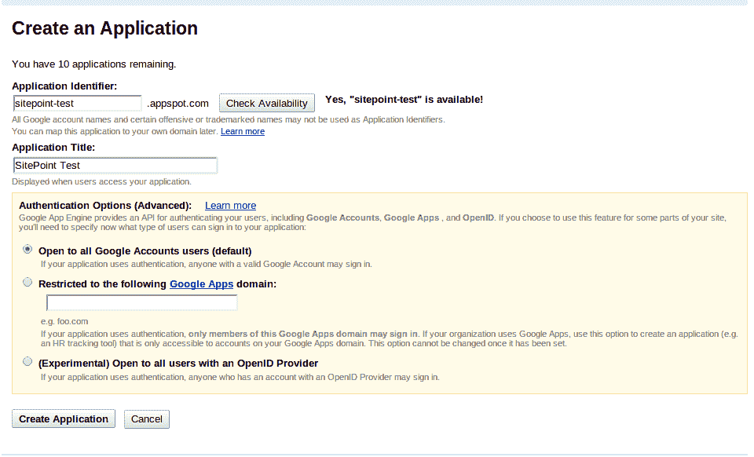
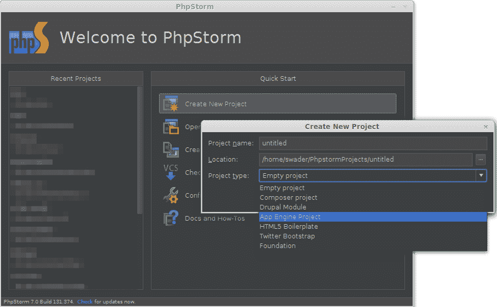
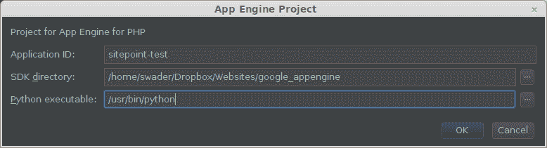
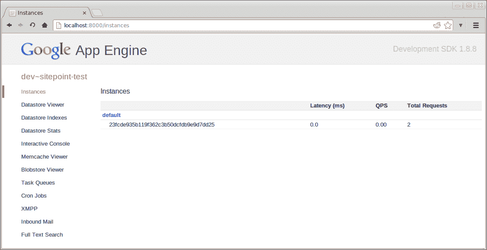
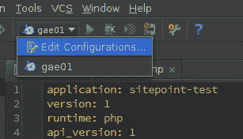
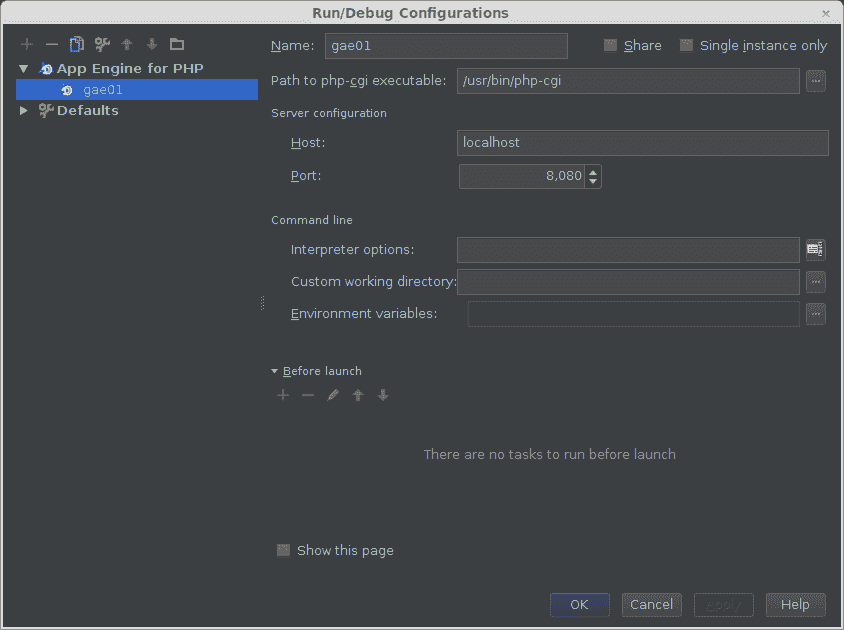
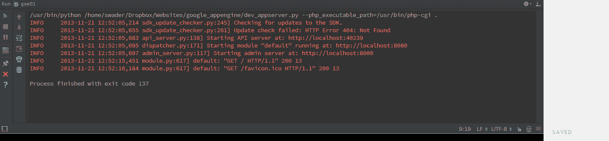
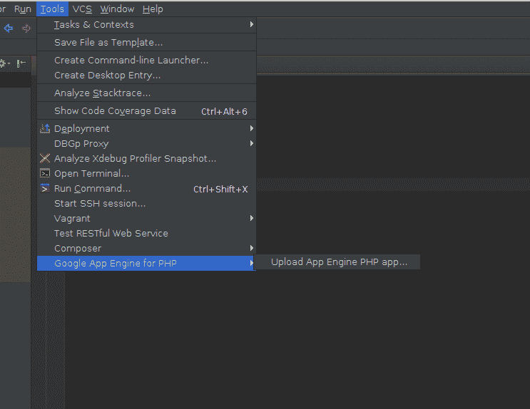
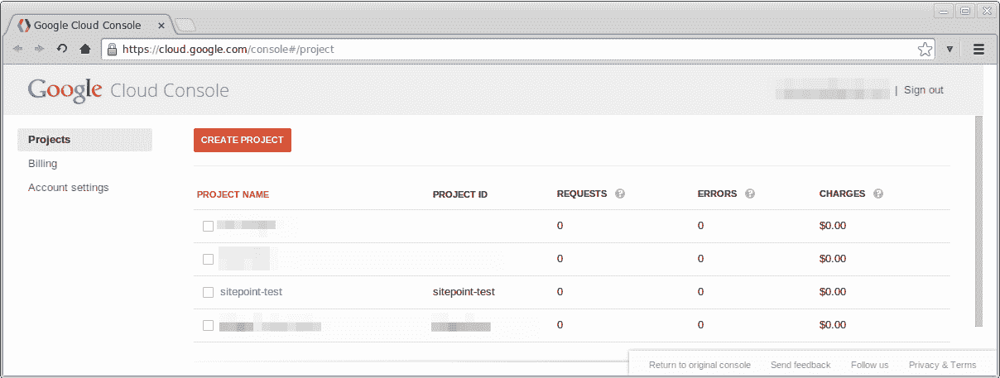
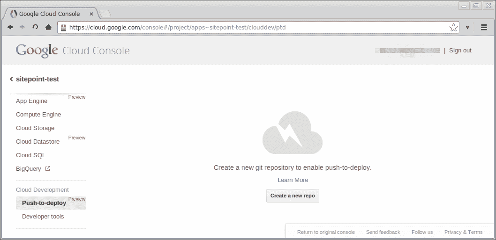

# Google 应用引擎和 PHP:入门

> 原文：<https://www.sitepoint.com/google-app-engine-php-getting-started/>

谷歌宣布在谷歌应用引擎上支持 [PHP 已经有一段时间了。本系列文章将带您完成在 GAE 上启动和运行您的应用程序的所有必要步骤。](https://www.sitepoint.com/google-app-engine-and-a-plea-for-phalcon/)

对于本教程，我们将使用 [PhpStorm](https://www.jetbrains.com/phpstorm/) ，它支持开箱即用的 GAE 项目，但是您可以使用您选择的任何 IDE。

从尊重[你的平台的先决条件](https://developers.google.com/appengine/docs/php/gettingstarted/installing)开始。这是必要的，因为 Google App Engine SDK 要求某些软件可以在本地运行，即运行“服务器”的 Python。

如果你的 PhpStorm 实例由于某种原因没有 GAE 插件，进入首选项并在插件浏览器中找到它——它可以通过插件库下载和安装。

## 在 GAE 上注册应用程序

要为 GAE 开发应用程序，您首先需要注册它并检索应用程序 ID。前往[https://appengine.google.com/](https://appengine.google.com/)，用你的谷歌账户登录。完成后，单击仪表板中的“创建应用程序”按钮，并在表单中输入所需的信息。



## 开始一个项目

要开始一个新的 GAE PHP 项目，只需从下拉菜单中选择它，并填写所需的数据。





一旦接受，IDE 将自动创建两个文件:`app.yaml`和`main.php`。如果您没有使用 PhpStorm，您可以自己创建这些。

`app.yaml`:

```
application: sitepoint-test
version: 1
runtime: php
api_version: 1
threadsafe: true

handlers:
- url: .*
  script: main.php
```

`main.php`:

```
<?php

echo 'Hello, world!';
```

让我们解释一下非自明的 YAML 属性。

指的是 PHP 的线程安全，这是一个非常有争议的问题，大多数人对此持怀疑态度，并且仍然怀疑 PHP 是否真正支持线程。更多信息，请阅读[这些](http://stackoverflow.com/questions/1623914/what-is-thread-safe-or-non-thread-safe-in-php) [两个](http://stackoverflow.com/questions/681081/is-php-thread-safe) StackOverflow 问题。

这个值[似乎是可选的](https://developers.google.com/appengine/docs/php/config/appconfig)，但我通常倾向于相信谷歌和 Jetbrains 知道他们在做什么，因为没有关于所述属性的适当文档，所以让它留在这里。

`handlers`是一组定义哪个脚本处理哪个 URL 模式的值。URL 模式是正则表达式，YAML 文件的这一部分可用于定义路由。

此时，您可以选择在 PhpStorm 中输入项目设置，在 Google App Engine for PHP 下，您可以输入您的 Google 帐户用户名和密码，这样在部署时就不会出现提示。

## 测试应用程序

我们有两种方法来测试我们的“应用程序”。

请注意，在尝试第二种方法之前，您必须至少运行一次第一种方法，因为第一种方法会询问您一个关于更新 Python 的问题，而 PHPStorm 目前不转发该问题。因此，如果您发现您的 PHPStorm 版本不工作，首先尝试通过终端运行它，说“是”，然后关闭它，并再次尝试使用 PHPStorm。感谢 Dave Wyers 的提示。

1.  从终端运行
2.  从 PhpStorm 运行

### 从终端运行应用程序

要从终端运行服务器，请输入以下内容:

```
{google_appengine folder}/dev_appserver.py {project folder}
```

或者，在我的情况下，特别是当我用真实值替换支撑值时:

```
google_appengine/dev_appserver.py gae01/
```

这会运行应用服务器，并将其指向作为第一个参数提供的文件夹。当你这样做的时候会发生两件事:管理控制台在`http://localhost:8000`运行，应用程序本身在`http://localhost:8080`运行。如果您访问管理控制台，您会看到大量有用的信息，从 memcache 内容到 cronjobs 等等:



将其指向`http://localhost:8080`会在浏览器中显示“Hello World”。

注意，如果你在运行应用程序时得到一个`The path specified with the --php_executable_path flag () does not exist.`错误，这意味着应用服务器不知道 php-cgi 在哪里，因此不能运行它。只需将它添加到执行行中:

```
google_appengine/dev_appserver.py --php_executable_path=/usr/bin/php-cgi gae01/
```

找到你的 php-cgi 在哪里很容易——输入`whereis php-cgi`,如果它在你的$PATH 变量中，它的位置将显示在终端中。

### 从 PhpStorm 运行应用程序

要从 PhpStorm 运行它，请单击“选择运行/调试配置”菜单中的“编辑配置”选项:



弹出的对话框中的大部分信息已经被填充。唯一缺少的值是“php-cgi 可执行文件的路径”,您可以通过在终端中键入`whereis php-cgi`找到它。在 Linux 上，我的是在`/usr/bin/php-cgi`。



点击“应用”和“确定”后，单击“选择运行/调试配置”菜单旁边的绿色箭头，或者按 Shift + F10 作为“运行默认”命令的快捷方式。PhpStorm 控制台应该输出关于它刚刚运行的服务器的信息，`http://localhost:8000`和`http://localhost:8080`现在应该都可以访问了，当在浏览器中被访问时，后者会产生一个“Hello World”输出。



通过 PhpStorm 运行还有一个额外的好处，就是能够设置断点并进行逐步调试。只需在代码中的行号附近(在编辑器窗口的空白处)单击一下，就会出现一个红色的球。那是一个断点。当运行您的应用程序时，服务器将在到达这一点时暂停，允许您检查当前定义的变量、内存消耗等。

## 部署

有三种方法可以将我们的应用程序部署到 GAE:

1)通过终端/命令行
2)通过 PhpStorm
3)通过 Git

### 通过终端部署

通过终端上传应用程序就像调用`{google_appengine}/appcfg.py update {project folder}`一样简单，或者在我的特殊情况下调用`google_appengine/appcfg.py gae01/`。

### 通过 PhpStorm 部署

要从 PhpStorm 部署，进入工具-> Google App Engine for PHP ->上传应用引擎 PHP 应用…



如果您已经在项目设置中输入了凭据，该过程将自动进行，不会出现任何问题。否则，系统会提示您输入用户名和密码，然后插件会调用您通过终端部署时手动调用的相同命令。

### 通过 Git 部署(即推即部署)

“一键部署”现在仍处于试验状态，但它值得您花时间和精力去掌握它。

要设置 PTD，你需要进入[云平台](https://cloud.google.com/console#/project)，在那里找到你的应用。



点击你的应用名称，滚动到左侧菜单中的“云开发”，点击“创建新的回购”。



保存回购网址，点击“获取密码”。这应该会产生一个类似于`machine code.google.com login {user} password {pass}`的字符串，其中`{user}`和`{pass}`被替换为您自己的数据。将这个字符串复制到一个名为`.netrc`的文件中，这个文件应该在您的主文件夹中创建。如果你在 Windows 上，它应该叫做`_netrc`。Windows 还需要定义 HOME 变量，这可以通过调用`setx HOME %USERPROFILE%`来实现。

你现在需要做的就是将远程 url 链接到你在本地机器上的 repo(要么添加远程，要么直接从云控制台之前给你的 repo URL 克隆)并推送它。由于我们在本文中创建的应用程序已经存在，让我们在它的基础上创建一个 Git repo，并向它添加一个远程 url。为了防止 IDE 垃圾和我们的源文件一起上传，添加 [this。gitignore](https://gist.github.com/Swader/7583361) 文件到文件夹中。

```
cd gae01
git init
git add .
git commit -am 'Initial commit'
git remote add appengine REPO_URL
```

用云控制台给你的 repo url 替换 REPO_URL。最后一个命令的作用是向本地 repo 添加一个远程链接，将它绑定到远程 repo。这个链接被称为“app engine”——app engine 只是一个标签，你可以选择你自己的，但是除了这里演示的自解释的缺省值之外，使用其他东西没有什么意义。

每当你做出改变时，像往常一样使用回购。您甚至可以在旁边设置一个 Github repo，并添加另一个到这个本地存储库的远程链接。如果你习惯于 Github 而不是 Google 代码，这将允许你在 Github 上进行版本控制，同时当你从 Github 中提取更改并推送到 appengine 链接时，仍然可以通过 PTD 部署到 GAE。

要立即在线推送应用程序，只需拨打

```
git push appengine master
```

注意，您可以拥有任意多的分支，就像在任何 Git repo 中一样，但是只有推送主分支才会实际部署到活动环境中。此外，您的源代码受到保护，不会被窥探，回购协议不是公开的，只对管理员和贡献者可见。然而，如果用户禁用 PTD 并再次打开它，回购将被丢弃，并创建一个新的回购-没有办法恢复旧的回购。小心你给谁许可。

现在访问适当的 URL(your-app-id.appspot.com)应该会给你 Hello World 消息，点击云控制台中的 repo 名称会给你一个版本历史列表和源代码概述。

## 结论

Google App Engine 是部署高流量、高可伸缩性应用程序的绝佳方式。他们的免费配额允许每月约 500 万次浏览，对任何应用程序来说都足够轻松，一旦需要，只需点击鼠标即可超过配额。

在本文中，我们讨论了使用和不使用 IDE 时的基本部署，并解释了一键部署机制。敬请关注即将到来的更高级的话题，并在下面的评论中让我们知道你的想法！

## 分享这篇文章