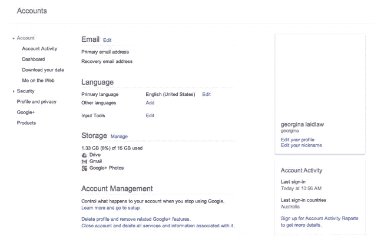

# 如何展示你的产品，而不是告诉它

> 原文：<https://www.sitepoint.com/show-product-rather-tell/>

“*秀*，不要讲！”

这是网络营销者最流行的口号之一，经常被用来证明在登陆页面应用免费多媒体的合理性。

网络确实使通过视频和动画展示东西变得容易，而且放置得当、精心使用的多媒体确实可以帮助交流复杂的想法。但是过度依赖这些元素会降低你的影响力——特别是对于那些不喜欢视频等多媒体的用户。

依我拙见，展示是进入营销页面的唯一途径。无论你使用什么——文字、图片、视频——你都应该用它来向人们展示你在提供什么。这包括展示优点和特点。科技公司太经常陷入展示功能，却忽视好处的陷阱。

让我们看看你展示而不是讲述功能*和*优势的选择，看看它们如何在网上发挥作用——而不仅仅是在登录页面上。

## 形象

很明显，图像是展示而不是讲述——那种一张图片讲述一千个单词的陈词滥调不是毫无意义的。

我们在网络上到处都可以看到图像，界面的图像经常被用来发布新产品和服务。但这并不是它们唯一的优点。

令人惊讶的是，很少有帮助工具使用图像，然而这是一个展示和讲述的理想场所。

比较一下 99designs 的这个图片丰富的帮助页面和 T2 的这个没有图片的谷歌帮助页面。

谷歌把我要找的屏幕标签加粗了，这很好，但它没有在页面上加粗，正如你在下面看到的。一个简单的屏幕截图，用一个箭头显示我到底应该点击什么，在这里会很方便。

帮助内容中的图像非常重要。在最好的情况下，人们是在轻度沮丧的状态下来帮忙的。图像可以帮助他们尽快愉快地回到正轨

## 录像

在这个 YouTube 时代，每个网站所有者和她的狗都想要一个精美的主页视频。通常，要求视频的人是那些尖叫着“不要说，展示！”声音最大。

问题是，这么多视频并没有传达这一口号。看看 http://www.collaborate.com/·Collaborate.com 主页上的视频。

是的，这个视频显示了人们通过应用程序滑动，但大多数镜头都是中景，而不是特写。你看不到到底发生了什么，也看不到它对任何人有什么帮助。没错，这些声音谈到了应用程序如何能提供帮助，但他们没有谈到应用程序如何能帮助 T2。

所以这个视频没有展示:它只是讲述了。就像其他无数的宣传片一样。

## 动画/游览

小动画作为展示应用程序如何工作的方式变得越来越受欢迎，也许是为了对抗几年前到处都是视频的页面(现在仍然很受欢迎)。

Archy 主页上的动画充当了一个快速浏览，向您展示该工具是如何简单地工作的。

这是这些简单动画的一个特点:简单就是简单。将这个动画与上面的协作视频进行比较，你就会明白我在说什么了。一个三分钟的多人对话视频，还是一个三屏一个动画的巡演？你觉得哪个更简单？

与这个动画配合得很好的另一件事是伴随它的文本——每个动画元素都有一个句子。也就是一屏一句。比方说，在 15 秒内，我就知道这个应用程序在做什么。

这里有一个障碍:我必须推断对我自己的好处。旅游，主页，完全是功能性的。

## 证明书

推荐书是展示一件重要事情的好方法:你的品牌让与之互动的人有多开心。

无论你是使用像 SitePoint 最近推出的 [Apostle](http://apostle.io/) 上的文字推荐，还是像 [99designs](http://99designs.com/) 上的视频推荐，推荐可以展示一系列事情中的任何一件:

*   你的观众如何从你的服务中获益
*   他们看重哪些功能
*   它如何改变了他们的职业和/或个人生活
*   你的品牌如何兑现它的承诺。

你可能知道，我有点喜欢展示而不是讲述精心挑选的证明。

## 样品/试验

想把展示而不是讲述提升到一个全新的水平吗？

让人们通过免费试用来体验你的产品或服务。这是最好的展示方式之一，因为它是体验式的和用户驱动的。用户通过向自己展示你的产品来购买展示品。你如何确保他们看到所有的 hawtest 功能？在界面中构建一些初始指针，向他们展示在哪里可以找到好东西，或者使用按键功能有多简单和容易。许多移动应用程序在“旅游”中构建小功能亮点；它们对于桌面产品也很方便。

审判真的是展示的终极，而不是讲述。

## 真实的话。对，短信！

我知道你在想什么。“但如果我们只是展示，而不是讲述，语言就是敌人。不能用文字表现！”

不是这样，朋友。但是你看，我们空间不够了。下周，我将向您展示(！)你怎样才能写出展示而不是讲述的文字。

## 分享这篇文章