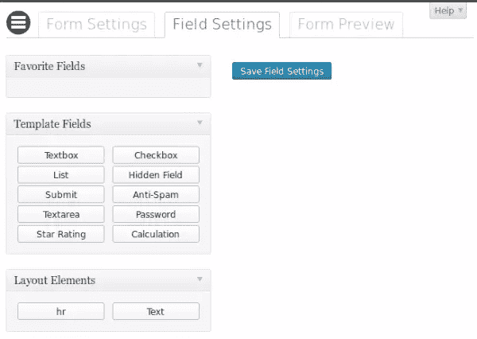
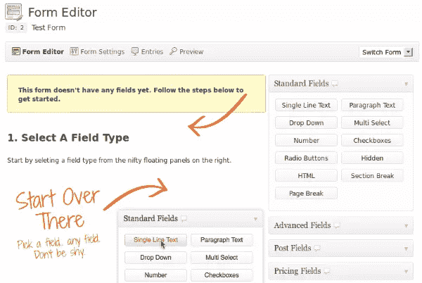
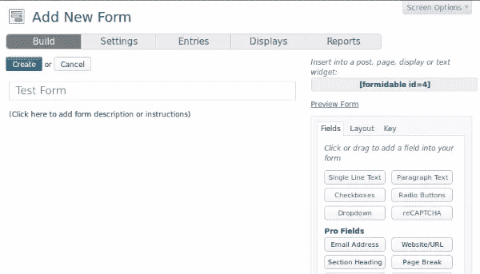
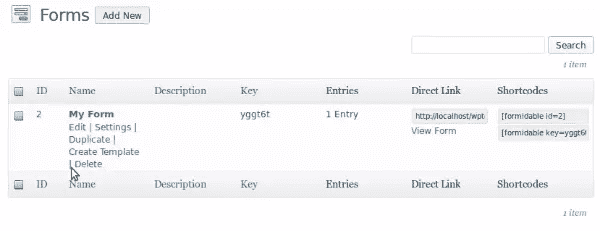
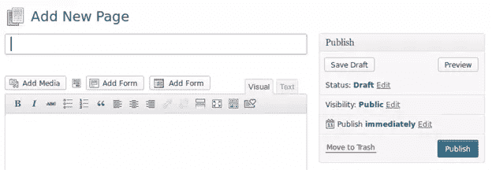
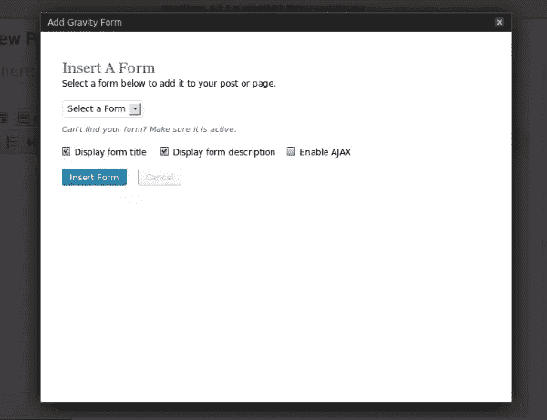

# 规划一个完美的 WordPress 表单插件

> 原文：<https://www.sitepoint.com/planning-perfect-wordpress-forms-plugin/>

如今，WordPress 支持的网站从简单的静态网站到复杂的动态网络应用。WordPress 为向用户提供内容提供了很好的内置特性，允许网站所有者从后端发布动态内容。让用户与网站互动是建设成功网站的另一个重要方面。因此，我们需要让用户与网站互动的方法。WordPress 表单插件是从用户那里获取动态内容的杰出解决方案。

在这篇文章中，我们将讨论表单插件如何适应 WordPress，以及作为一名开发者，你如何构建完美的表单插件。所以这篇文章是为那些计划用动态内容来改进他们的 WordPress 站点的用户，以及那些想要构建一个完美的表单插件来获取最大利润的开发者准备的。

让我们开始吧。

## 什么是表单插件？

简单来说，表单插件可以让你创建动态表单嵌入到你的网站的前端。一旦启用，用户就能够用动态内容填充表单，并将它们提交给站点管理员。作为授权用户，你有能力看到用户提供的所有数据。一般来说，技术知识较少的网站所有者会发现这些插件非常有用，因为他们可以创建高级功能，而不用担心编程或技术问题。

WordPress 表单插件打破了为非技术用户创建高级数据检索技术的障碍。

现在你可能对表单插件及其作用有了一个非常基本的了解。让我们通过查看 WordPress 的一些最流行的表单插件来更深入地了解表单插件的概念。

## WordPress 表单插件

有大量的 WordPress 表单插件，有免费版和高级版。尽管每个插件的工作方式不同，但所有插件的主要特性都是相同的。在这篇文章中，我将看看四个不同的插件，包括免费的和高级的。下面我们来快速介绍一下这四个插件。

1.  [Visual Form Builder](http://wordpress.org/plugins/visual-form-builder/) – (Free)

    

2.  [Ninja Forms](http://wordpress.org/plugins/ninja-forms/) – (Free)

    

3.  [Gravity Forms](http://www.gravityforms.com/) – (Premium)

    

4.  [Formidable Forms](http://wordpress.org/plugins/formidable/) – (Free and Premium)

    

在我们继续之前，您可以下载并安装这四个插件，并在提供的屏幕中查看它们的工作方式和可用功能。注意，你可以免费检查所有这些插件，除了重力形式。

如果你想开发一个完美的表单插件，并在你的网站中使用它的高级功能，我强烈推荐你做这个任务。现在让我们弄清楚表单插件的常见用法。

## WordPress 表单 sPlugins 的常见用法

整合一个高级的联系表单是 WordPress 表单插件最显著的用途。大多数插件的名字或主要描述中都包含联系形式，这证明了它是这些插件的主要目的。然而，除了构建联系表单之外，还有一些常见的用法。让我们来看几个这样的场景。

*   ### 意见或反馈表

    WordPress 提供了一个内置的评论表单，所有现有的主题都默认提供这个功能。但是有些时候我们需要更高级的评论表格来对用户反馈进行分类并获得更多信息。在这种情况下，使用表单插件比通过修改主题代码来修改现有的评论表单更容易。

*   ### 订单

    表单插件也用于接收销售产品的网站上的用户订单。我们可以创建一个表单来选择产品并提交订单。提交后，用户将收到通知，网站管理员将从后端手动处理订单。

*   ### 民意调查

    投票是从有限的一组答案中获取用户反馈的一种重要技术。表单插件可以很容易地配置来创建投票，并从后端检查结果。

*   ### 前端发布

    一般来说，用户需要登录 WordPress 管理区来创建帖子。但是，有些情况下允许用户在不登录的情况下向数据库提交内容。前端发布是一种常用的技术，允许用户通过填写表单从网站的前端创建内容。表单插件可以很容易地用来简化前端发布过程。

您可能已经注意到，这些特性中的大多数都允许用户提交表单并获得通知。基本上，这是一个单向过程，用户提交表单数据，管理员手动处理它。一旦提交了数据，用户的流程就结束了。所以这是我们可以改进插件的地方，通过减少管理员手动完成的任务来继续这个过程。我们将在后面的“让你的插件脱颖而出”中详细讨论这个问题。

现在我们已经拥有了设计一个完美表单插件的所有要素。在下一部分，我们将讨论计划流程。

## 计划一个 WordPress 表单插件

识别和计划需求是任何开发项目的第一个也是最重要的任务。有很多插件可以用来创建 WordPress 表单。除非我们计划得当，否则我们不可能有一个完美的插件来挑战现有的插件。

让我们考虑一下设计这样一个插件的最基本的步骤。

*   ### 使用简单干净的设计

    简洁是现代网页设计的趋势，它让我们能够抓住潜在用户的眼球。如果你研究最佳主题，你会发现最受欢迎的主题是那些设计非常简洁的主题。有些人用非常高质量的图形和多种颜色来创建设计，以给用户留下深刻印象。但是很快他们就意识到了错误，转而使用最小化的设计来适应最广泛的用户。所以确保插件布局设计尽可能简单。

*   ### 减少步骤的数量

    用户希望尽可能快地做事，而开发人员通常希望提供尽可能多的功能。这是用户决定使用插件或寻找替代插件的转折点。作为开发人员，我们必须找到以简单、用户友好的方式呈现所有可用特性的方法。登记表可以被认为是一个很好的例子来说明这一点。几年前，我们的注册表单包含大量字段。后来，注册表单字段被分布在几个步骤中，以简化流程。这些天来，我们只有最多 2-3 个领域或社会登录注册为会员。所以我们需要减少在插件中创建和管理表单所需的步骤。

*   ### 使用现有的 WordPress 功能

    有些开发者使用花哨的第三方插件来创建表单插件中的特性，希望他们能从竞争者中脱颖而出。但事实是，这些类型的插件与你的 WordPress 应用程序中现有的主题和插件产生了更多的冲突。WordPress 在其核心中提供了对拖放、数据网格、文件上传等功能的支持，这些应该在每一个可能的场景中使用。此外，它还标准化了功能，使得用户可以轻松地从一个插件切换到另一个插件。当你开发一个新的插件时，确保最大限度地使用现有的 WordPress 特性和功能，以提供灵活的解决方案。

*   ### 包括强制特征

    一般来说，所有的 WordPress 表单插件都有一套通用的特性。拥有与其他插件竞争的强制性特性是很重要的。

在下一节中，我们将详细了解这些强制特性。

## 必须有一个表单插件的功能

作为开发人员，我们不必重新发明轮子来创建表单插件。首先，我们必须对现有的插件进行适当的研究，以确定基本的功能。一旦我们有了一个包含基本特性的良好基础，就很容易添加新特性来使插件变得独一无二。所以让我们通过比较前面介绍的四个插件来看看表单插件的基本特性。

*   ### 添加具有动态内置字段类型的新表单

    表单创建是表单插件的主要功能。通常，这些类型的插件提供动态字段类型来使用拖放效果创建表单。考虑前面这四个插件的截屏，了解可用的字段类型。

    正如你可能注意到的，大多数表单插件都有一组基本字段，如文本框、文本区、复选框、HTML 等，同时还有一组插件特有的唯一字段。基本上，我们必须提供对所有基本 HTML 表单域类型的支持，以便开发一个插件来匹配任何现有插件的功能。然后，我们可以决定高级字段类型，使我们的插件不同于现有的插件。

*   ### 显示表单列表

    创建之后，用户应该有办法列出站点中所有可用的表单。重要的是使用现有的 WordPress 数据网格来保持与其他插件的一致性。该列表应该包含所有与表单相关的强制信息和操作。考虑下面这个强大插件中表单列表的截图。其他插件包含类似的表单列表屏幕。

    

    正如您所看到的，这个插件使用了现有的数据网格。表单列表中的每个条目都有许多链接，可以导航到各种选项。最常见的操作应该是编辑、删除、设置和复制。此外，这些表单是使用短代码集成到页面或帖子中的，因此必须与表单一起显示。

*   ### 帖子编辑器中的添加表单按钮

    一般来说，WordPress 网站的用户技术知识有限。因此，他们很难理解短码的概念并在不出错的情况下分配参数。因此，我们需要一种简化的方式来允许用户将表单添加到页面或帖子中。大多数现有插件通过在帖子编辑器中添加“新建”按钮来提供这一功能。考虑以下 post 编辑器中表单生成按钮的屏幕。

    

    所有的表单按钮本质上都是相似的，你可以从下拉菜单中选择表单并直接插入到编辑器中。我们必须使弹出窗口尽可能简单，只有强制选项，以便用户可以快速添加新的表单。

*   ### 管理表单条目

    一旦表单被插入到站点中，用户就可以用数据填充它们并提交它们。所以计划表单插件的下一个要点是管理提交的数据并显示在 WordPress 的后端。一般来说，我们可以使用 WordPress 管理列表在数据网格中显示提交的条目。以下屏幕包含重力表格的表格条目列表。您可以在“表单”列表中的每个表单下找到“条目链接”部分。

    

    所有提交的条目都显示在一个网格中，允许管理员对提交的数据采取必要的操作。Gravity Forms 通过提供称为标记为已读、标记为未读、添加星号、删除星号等自定义状态，为表单条目提供扩展选项。您可以通过添加更多重要的动作来过滤表单条目，从而使您的插件与众不同。

*   ### 导入/导出表单数据

    这是表单插件最重要的特性之一。用户应被允许导出各自数据的所有形式，并将其导入到另一个网站或同一网站。与本文讨论的其他三个插件相比，Gravity Forms 提供了最有组织的导入/导出过程。以下屏幕预览重力表格的导入/导出屏幕。

    

    如您所见，您可以选择表格、必要的字段和各自的日期范围用于导出目的。导出过程将创建一个 CSV 文件，可以随时导入该文件以恢复数据。CSV 是最简单的文件格式，因此应该使用，而不是依赖于不同的文件格式。

    大多数现有插件都提供了自己的导入/导出选项。在这里，我们试图找出构建完美表单插件的要求。因此，您可以通过支持其他流行的表单插件的导出文件并将它们导入到您的插件中来扩展导入/导出过程。这将使你的插件脱颖而出。

*   ### 逐步表格

    一般来说，用户不喜欢有大量字段的长表单。作为一个解决方案，我们使用逐步表格来简化表格填写过程。我们可以对这些插件生成的表单应用同样的技术。基本上，用户可以在表单创建过程中将表单分成多个部分。一旦表单显示出来，我们需要一次提供一个部分，直到用户填写完所有部分。只有几个插件支持这个特性，因此在其他插件中改进你的插件是有用的。

到目前为止，我们已经了解了表单插件的基本用法和与流行插件竞争的强制特性。现在是时候让我们的插件与众不同了。在下一节中，我们将看看使我们的表单插件与其他插件竞争的特殊特性。

## 让你的插件脱颖而出

表单插件可以用于 WordPress 网站的各种任务，因此有无限的创造新功能的可能性。所以让我们来讨论一些有用的特性，这些特性为你的插件增加了价值，使它比其他的插件“更完美”。

*   ### 支持表单模板

    基本上，这些表单插件让我们使用动态拖放字段从头开始创建表单。但是可以有很多场合需要预建表单。在这种情况下，我们可以允许用户创建表单模板，并在多个表单中重用它们。因此，用户只需选择一个模板，更改必要的字段并使其工作，而无需从头开始制作大型表单。

    许多插件都不支持这个特性，因此可以用来增加你的插件的价值。

*   ### 条件逻辑

    这是表单插件最有前途的特性之一，允许用户根据预定义的条件动态地更改表单域内容或表单域。条件逻辑的完美解决方案在引力形式中是可用的。

*   ### 启用自定义挂钩

    前面，我们讨论了表单条目的需要，并通过执行批量操作列表中的自定义操作来过滤它们。这些插件主要用于联系人表单，因此条目列表对于大多数场合来说已经足够好了。但是我们可以通过添加自定义挂钩来使这些插件强大，并使开发人员能够在表单条目上实现他们自己的功能。

    您可以创建自定义挂钩来将更多状态添加到表单条目操作列表中，并创建另一组操作挂钩来执行表单条目上的任务。例如，假设我们正在构建一个用于竞赛的表单插件。您可以定义一个名为 Select Winner 的自定义操作，并指定一个操作挂钩。然后，当获胜者被选中时，开发人员可以实现 action 钩子来执行必要的任务。

*   ### 整合现有的 WordPress 功能

    大多数人会使用 WordPress 的默认功能，而不是使用插件来构建定制的应用程序。因此，用表单插件尽可能地支持现有的 WordPress 特性是很重要的。Gravity Forms 非常有效地做到了这一点，它允许管理员创建表单，用户可以从前端提交帖子。

    同样，我们可以在插件中加入更多 WordPress 特有的功能。例如，我们可以添加一个上传按钮来加载 WordPress 媒体上传程序，允许从前端创建用户等等。只要我们能用 WordPress 特有的特性扩展我们的插件，我们就能让它在其他插件中脱颖而出。

## 包裹

在整篇文章中，我们已经讨论了表单插件的基础，以及我们如何计划我们的插件来与现有的 WordPress 表单插件竞争。主要有两种方法可以让你的插件与众不同。

*   在表单创建和管理过程中添加尽可能多的 WordPress 特性
*   支持不常见的用例，以满足表单插件的需求，而不是完全依赖于联系人表单

如今，表单插件被广泛用于测验、投票、订单提交、支付整合以及更多用途。因此，制作一个独特的高级表单插件可能是一个非常有利可图的业务。

我们现有的四个表单插件提供者给了我们一些非常有用的功能和一些巧妙的实现。其中，重力形式似乎是目前最先进的。但我们是开发商，对吧？让网络变得更完美是我们的职责。这就是我们的客户想要的。因此，我们没有理由不能构建自己的表单插件。也许我们永远也做不出“完美”的表单插件，但是追求完美让我们不断前进。

让我们知道你对 WordPress 表单插件的想法，以及你希望它们如何在不同的场景下工作。

也可以随意分享你的想法，这样愿意开发表单插件的开发者就可以为你开发了。或者你更愿意自己建造它们？

## 分享这篇文章