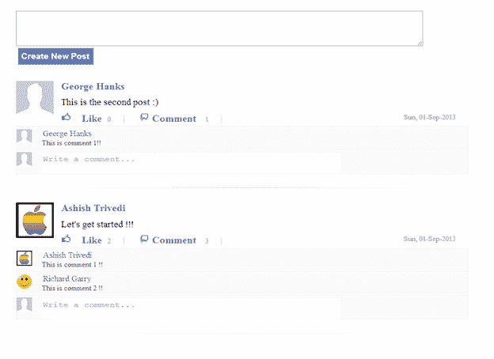

# 用 PHP、MongoDB 和 jQuery 发布社交网络风格——第 2 部分

> 原文：<https://www.sitepoint.com/social-network-style-posting-php-mongodb-jquery-part-2/>

在本系列的[前一部分中，我们解释了开发我们的发布机制所需的数据库架构、发布流设计和应用流程，在该机制中，用户将能够发布状态，喜欢/不喜欢其他人的状态，并对其进行评论。本系列的这一部分将引导您完成实现这些功能所需的编码。我们将使用上一篇文章中讨论的应用程序流和数据库结构。如果你想继续下去，别忘了从](https://www.sitepoint.com/social-network-style-posting-php-mongodb-jquery-part-1) [github repo](https://github.com/phpmasterdotcom/AshishTrivedi-SocialNetworkPost) 下载代码。

## 插入帖子:

在我们的`index.php`文件中，我们添加了一个*创建新帖子*按钮。单击它将调用一个 JavaScript 函数`new_post`,将会话中的用户 id 作为其参数。

```
<input type="button" value="Create New Post" id="btn_new_post" 
onClick="new_post('<?php echo $_SESSION['user_id']; ?>')" class="button_style"/>
```

参照`script.js`中的代码，让我们一步步了解`new_post`的功能:

我们首先获取变量`new_post_text`中的文章文本，并使用 JavaScript 的`trim`函数检查该文本是否为空。如果文本为空，我们会显示一条提示消息来输入文章文本。

```
function new_post(user_session_id) 
{    
    var new_post_text = $('#post_textarea').val();
    if(!$.trim(new_post_text))
    {
        alert("Please enter some text in the post");
           return;    
    }
```

然后我们使用 jQuery 的`$.POST`函数发送一个 AJAX POST 请求:

```
$.post('php_scripts/insert_new_post.php',{
     user_id: user_session_id,
post_text: new_post_text
},function(output){
         // code to be executed after success of AJAX call
    });
```

jQuery 的`$.POST`函数的格式是:

```
jQuery.post(url,{parameter:value}, success(output){ //function body });
```

第一个参数是要调用的文件的 url。第二个参数是要发送到 url 的参数列表。第三个参数是在 AJAX 请求成功时执行的回调函数。变量 output 包含从被调用文件接收的输出。

因此，在我们的例子中，我们调用`insert_new_post.php`，同时将用户 id 和 post 文本作为参数传递。我们稍后将回到这个函数，在回调函数中编写代码。

接下来，打开`php_scripts`文件夹中的文件`insert_new_post.php`。我们将在这个文件中编写与数据库交互的代码。首先，我们使用 new *MongoId()* 创建一个新的帖子 id。然后，我们使用`$_POST`超全局变量从 JS 函数获得用户 id 和文章文本。正如你可能知道的，一个 *MongoID* 是时间和其他参数的组合。我们使用`post_id`和`getTimestamp`函数获取文章的创建时间。我们将使用这个时间戳作为我们帖子的创建时间。

```
$post_id = new MongoId();
$user_id = new MongoId($_POST['user_id']);
$user_session_id = new MongoId($_SESSION['user_id']);
$post_text = $_POST['post_text'];
$timestamp=date('D, d-M-Y', $post_id->getTimestamp());
```

然后，我们检查通过 AJAX 请求接收的用户 id 是否与当前会话的用户 id 相同。这只是一个小检查，以确认文件是从正确的来源调用的——我们不希望用户为其他人执行操作。然后，我们创建一个包含所有 post 元素的文档，并使用相同的。

```
if($user_id == $user_session_id)
{
    $collection = $database->selectCollection('posts_collection');
    $new_post_mongo = array ( '_id'=> $post_id,
                              'post_author_id' => $_SESSION['user_id'],
                              'post_text' => $post_text,
                              'total_likes' => 0,
                              'likes_user_ids' => array (),
                              'comments' => array (),
                              'total_comments' => 0,
                              'timestamp'=>$timestamp
                            );
    $collection->insert($new_post_mongo);                          
}
```

一旦新文档被插入到数据库中，我们必须在索引页面上显示新插入的文章。为此，我们将从这里创建并发送 HTML 内容，这个输出将被调用这个页面的 jQuery 函数`new_post`作为输出接收。生成这个 HTML 的代码类似于我们在上一篇文章中在主页流上显示每篇文章的代码。因此，我在这里再次跳过解释相同代码的这一部分。可以参考`insert_new_post.php`中插入查询后的代码。

回到 jQuery 函数`new_post`，让我们修改回调中的 post 成功逻辑。这里，我们使用`prepend`方法将接收到的输出添加到现有的 post 流中，然后使用 jQuery `hide`和`slideDown`动画显示它。最后，我们清除 post textarea 的所有现有内容。

```
$.post(insert_new_post_filename,{
    user_id: user_session_id,
    post_text: new_post_text},function(output){
               $('#post_stream').prepend(output);
    var new_post_id=$("#post_stream div:first-child").attr("id");
    $("#"+new_post_id).hide().slideDown();
    $('#post_textarea').val(null);
});
```

仅此而已。我们已经完成了插入一篇新文章并将其显示在索引页面上的整个过程，而无需刷新整个页面。现在让我们快速地看一下喜欢/不喜欢帖子的类似过程。

## 喜欢/不喜欢的帖子:

在`index.php`中找到显示*相似/不相似*标签的跨度。添加一个`onclick`函数调用`post_like_unlike`，将当前会话用户 id 作为其参数。

```
<span class="post_feedback_like_unlike" id="<?php echo $post_like_unlike_id;?>"  
onclick="post_like_unlike(this,'<?php echo $_SESSION['user_id']; ?>')">
    <?php echo $like_or_unlike; ?>
</span>
```

在这个 JS 函数中，我们将首先检查用户是像一样点击了*，还是像*一样点击了*。为此，我们使用作为参数接收的*post _ id _ Like _ Like _ Unlike*的 id 属性来获取上面声明的 span 元素的 HTML 文本( *Like/Unlike* )。这里，*类型*将包含文本*喜欢或不喜欢*。*

```
function post_like_unlike(post_id_like_unlike,user_session_id)
{
    var type = ($('#'+(post_id_like_unlike.id)).html());
    ..
```

在拆分 span id 之后，我们还将 post id 作为第一部分。请记住，我们在上一篇文章中已经像这样声明了 span id:

```
$post_like_unlike_id=$post_id.'_like_unlike';
```

像这样声明元素的原因现在您一定很清楚了。这允许我们像现在一样在 JS 中使用文章 id:

```
var post_id_of_like_unlike= ((post_id_like_unlike.id).split("_")) [0];
var post_id_like_count = post_id_of_like_unlike+'_like_count';
```

如果用户点击了*，比如*，我们会向`post_like.php`发送一个 AJAX 调用。否则我们称之为`post_unlike.php`。在回调函数中，如果用户点击了类似于的*，我们将*喜欢/不喜欢*选项的文本改为*不喜欢*，反之亦然。此外，我们使用 *post_id_like_count* 增加/减少赞数。*

```
if (type == 'Like')
{
   $.post('php_scripts/post_like.php',{
        post_id:post_id_of_like_unlike,
        user_id:user_session_id},function(output){
            $('#'+(post_id_like_unlike.id)).html('Unlike');
            $('#'+(post_id_like_count)).html(parseInt($('#'+(post_id_like_count)).html())+1);
       });
}
else 
{
    $.post('php_scripts/post_unlike.php',{
        post_id:post_id_of_like_unlike,
        user_id:user_session_id},function(output){
            $('#'+(post_id_like_unlike.id)).html('Like');
            $('#'+(post_id_like_count)).html(parseInt($('#'+(post_id_like_count)).html())-1);
        });
};
```

在`post_like.php`中，我们通过将`total_likes`递增 1 并将当前用户 id 放入数组`likes_user_ids`来更新 post 文档。

```
$collection->update(array('_id' =>$post_id),
                    array('$push' => array('likes_user_ids'=>$user_id),
                          '$inc' => array('total_likes' => 1 )) 
                    );
```

类似地，在`post_unlike.php`中，我们通过将`total_likes`减 1 并从数组`likes_user_ids`中取出用户 id 来更新 post 文档。

```
$collection->update(array('_id' => $post_id),
                    array('$pull' => array('likes_user_ids'=>$user_id),
                          '$inc' => array('total_likes' => -1 )) 
                    );
```

## 插入注释:

理解了文章插入和喜欢/不喜欢功能的工作原理后，您将能够很容易地理解评论功能的工作原理。在将评论文本和帖子 id 从`index.php`传递到 JS，然后传递到`new_comment.php`之后，我们将更新帖子文档以插入新的评论并增加计数。

```
$collection->update(array('_id' => $post_id),
                    array('$push' => array('comments'=> array (
                                                'comment_id'=>$comment_id,
                                                'comment_user_id' =>$user_id,
                                                'comment_text' => $comment_text
                                               )),      
                           '$inc' => array('total_comments' => 1 ))
                    );
```

然后，我们会将这个新评论添加到帖子上现有的评论列表中。

最后，我们已经实现了我们想要实现的一切。*图 1* 展示了我们最终工作应用的样子。(注意，在图中，您可以看到三个用户。出于演示的目的，我已经从 *session_variables.php* 文件中更改了这些用户。)



## 结论:

在本系列的两篇文章中，我们学习了如何设计数据库模式，理解了 HTML 结构，然后实现了整个 post 机制。然而，请注意，这篇文章只展示了实现这些功能的一种方法，这可能与此类社交网络使用的方法不同。此外，还有许多其他功能和问题(安全性、设计等。)在我们可能没有在这里讨论的应用中被考虑。

此外，代码没有遵循最佳实践——这是读者可以尝试的。实现面向对象的代码，使用 JavaScript 框架，整个后端使用 PHP 框架——没有限制。这个发布机制仅仅是一个提示，告诉你如何在你自己的社交网络中实现一个单独的特性。

总之，本文只是使用类似概念可以实现的许多事情的基础。你可以继续实现很多我在这里无法解释的功能，比如显示喜欢这篇文章的用户的名字，显示可折叠的评论，删除评论，删除文章，喜欢/不喜欢评论，热门文章，建立一个更具互动性的文章流，显示用户朋友的文章，以及其他高级功能。如果你有任何建议或批评，请在下面的评论中留下。

## 分享这篇文章