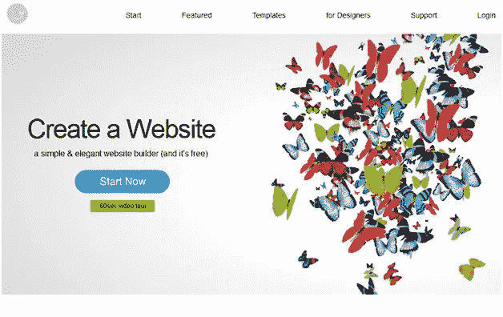
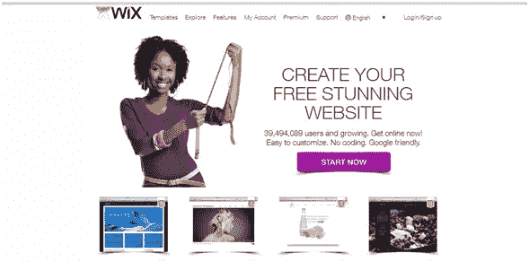
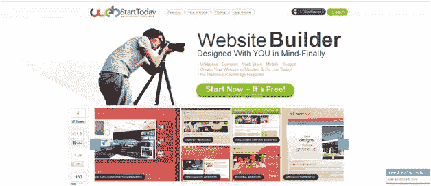
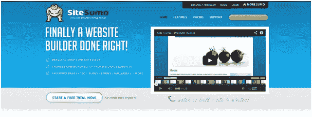
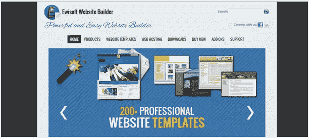
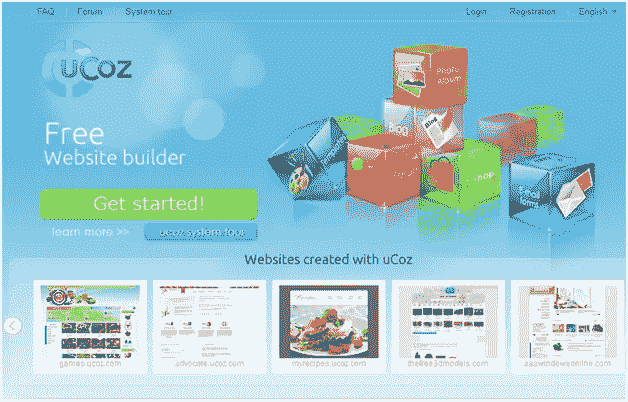

# 你可以使用的八个网站建设者

> 原文：<https://www.sitepoint.com/website-builders/>

如今互联网比以往任何时候都更受欢迎，而且没有理由怀疑在未来的日子里它会变得更加受欢迎。几乎没有人不受这种强大媒体的影响或不使用这种媒体。

因此，越来越多的人正在创建网站，以获得良好的在线形象。如今，企业、小说家、音乐家、演员，每个人都有自己的网站。

如果你懂编码，那对你更好，但是不要让缺乏编码知识妨碍你拥有一个漂亮的在线形象。现在有很多工具可以让你创建高质量的网站，即使你只有很少或者没有技术知识。使用这些工具类似于画素描。你只需要在你想要的地方插入页面元素，软件会处理好一切。

下面我列出了八个工具，它们将帮助你创建你的网站。

1) [**它由谷歌和亚马逊提供支持。这可以确保为您的网站提供强大且值得信赖的解决方案。**](http://imcreator.com/)

2)[Site123.com](https://www.site123.com)——虽然 Site123 有一个 9.8 美元/月的收费计划，并提供额外的功能，但它的免费计划为小型网站提供了充足的规格。在一个直观的页面生成器和一系列 [Site123 模板](https://www.site123.com/templates/free-website-templates)之间，你的网站看起来也会很棒。

3)[**Wix.com**](http://wix.com/)–Wix 完全免费。没有隐藏的条款或条件。他们的拖放功能是业界最先进的功能之一。一切都是可定制的。因此，您可以更改文本、图片、背景、布局等。

4)

5)**——他们的口号是“终于有一个网站建设者做对了！”除了创建网站，他们还允许通过拖放功能创建脸书页面。他们的图像滑块功能允许您使用一系列滑块和淡入淡出选项将您的图像作为动画。**

**

6) [**中的**。**godaddy.com**](http://in.godaddy.com/)–go daddy 几乎和互联网本身一样古老。支持其可信度的最佳论据是谷歌官方引导其博客用户购买域名。

7) [**你可以下载免费版用一下，看你喜不喜欢再升级到付费版。**](http://ewisoft.com/)

8)**——该网站有许多不同类型的账户可供选择。免费帐户可以维持无限的流量，400 MB 的磁盘空间，15 MB 的文件大小通过 FTP 上传，可以选择附上自己的域名等。**

**

我希望你会发现上面的列表很有用。你知道你用过的其他有用的网站创建工具吗？请在下面的评论中告诉我。**** 

## ****分享这篇文章****