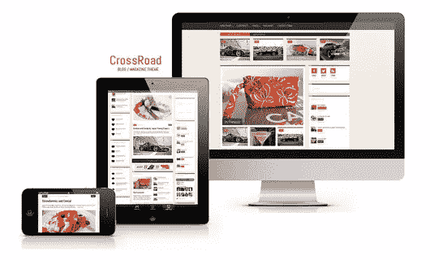
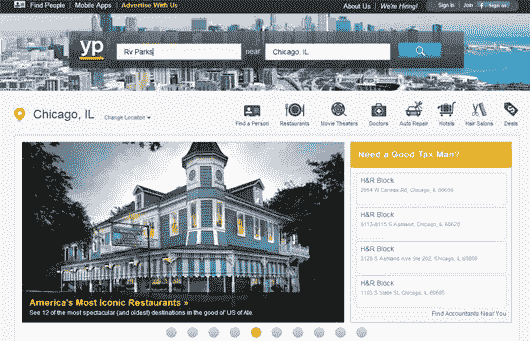
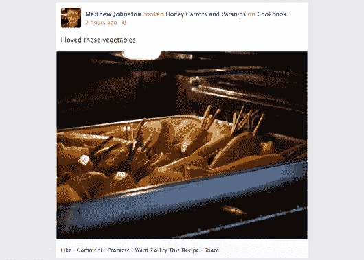
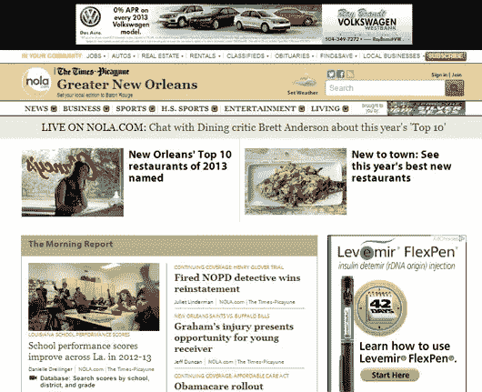

# 赢得当地自由职业者市场的 10 种方法

> 原文：<https://www.sitepoint.com/local-internet-marketing-tips-graphic-designers/>

*图片来源:[劳伦·米歇尔](http://www.flickr.com/photos/40551263@N00/5205301084/) via [康普菲](http://compfight.com) [cc](http://creativecommons.org/licenses/by/2.0/)*

作为一名自由设计师或网站开发者的众多好处之一是你可以和来自世界各地的客户一起工作。对于一个合格的、精明的、勤奋的设计师来说，互联网每天都能提供足够多的项目让你竞标。

但是，这种好处也伴随着负面影响。投标项目需要时间。很多时间。通常，在获得一份工作之前，你可以投标 10-20 个项目。更有可能的是，你在你的其他项目完成之前就开始了投标过程，以保持你的自由职业工作的连续性。

这就是营销你自己的才能和服务对自由职业者非常有益的地方，尤其是在网上。当你开始建立一个投资组合，并作为一个行业老手建立自己的名声时，你将不必花太多时间寻找客户——他们会开始找你。

然而，许多自由职业者忽略的一个领域是当地的努力。拥有遍布全球的机会并不意味着你不应该偏爱你所在地区的工作。对于自由设计师来说，当地企业往往是一座尚未开发的金矿。有些人坚持亲自做生意，这让工作远离了竞争激烈的全球自由职业者的视野，让它在你的后院成熟地等待采摘。那些知道如何在当地营销的人可能会通过参与社区活动、邮寄传单或在其他企业留下名片来做到这一点，但有更明智的方法来到达和收获你的当地市场。

本地 SEO 对于让你所在地区的潜在客户看到你是至关重要的。以下本地互联网营销技巧将有助于你在本地人才名单上名列前茅。即使你已经采取了一些众所周知的步骤进行本地网上营销，你可能会发现以下几个可以添加到你的计划中。请记住，你不可能在一天内完成所有这些步骤。建立一个强大的营销活动需要时间，尤其是如果你是一个小企业，甚至是一个业主。所以，列一个清单，一次完成一两个任务，最终你会成为当地社区知名的行业偶像。

### 设计一个手机友好的网站

*图片来源:[ZERGE _ violer](http://www.flickr.com/photos/47257185@N03/8145106535/)via[Compfight](http://compfight.com)[cc](http://creativecommons.org/licenses/by/2.0/)*

这可能是确保你的设计业务更加引人注目的最重要的第一步——不仅是在世界范围内，尤其是在本地。如果你的网站不容易通过移动设备浏览，那么一个潜在的客户会转向一个更适应移动设备、更能展示自己才华的自由职业者。如果一个本地客户正在去你办公室的路上，需要指路，该怎么办？或者，也许他们正在办公室外研究平面设计师。你永远不知道客户是如何找到你的服务的，但是坐在桌面前的潜在客户可能会在全球范围内进行严格的自由职业人才搜索，所以最好的策略是让你自己在尽可能多的设备上可用。如果你在本地营销策略中加入了手机友好的便利性，当客户意识到他们需要自由职业者的帮助时，你可能会获得宝贵的第一次接触，而不是在一个疲惫不堪、往往毫无结果的投标过程中竞争。

### 向您的网站添加本地标签

优化你的业务的第二个最重要的步骤，无论是本地的还是全球的，是在你的站点标记中加入位置标签。您可以在站点代码中包含您的位置，如德克萨斯州达拉斯。

一些最重要的标签是你的<title>标签、<h1>标题标签和元描述标签。如果相关，标签应该包括关键字和位置。例如，如果你只想在你网站的某些页面上定位本地流量，比如你的联系页面，那么只在这些页面的标签中包括你的城市和州，而不在其他页面上。</h1></title>

对于那些不熟悉网站标签的人来说，你的标题标签是出现在浏览器顶部的 70 个字符以内的描述，位于你的 HTML 的部分。

标签通常被用作特定页面内容的概要。它们可以比标题标签更长，可以包括额外的信息，以进一步帮助搜索引擎如谷歌从算法上理解你的内容的性质。网站通常使用与标题标签中相同的关键字，但顺序不同或措辞略有不同。

最后，meta description 标签是 Google 在搜索结果中显示的预览。这不会显著影响谷歌搜索结果，但它会被有洞察力的人类眼球所阅读。不管你的 meta 标签针对的是什么样的受众，一定要包含一个清晰的行动号召。

### 在线黄页和搜索引擎上的列表

将你的业务放在在线黄页上是帮助搜索引擎将你的自由职业者服务定位的好方法。这也是为你的工作收集评价的一个很好的方式。让满意的顾客留下一个评价，并附上你的“谢谢你的付款”邮件。你甚至可以为他们的下一个项目提供折扣或免费赠品，以换取诚实、公正的评价。

一些重要的黄页网站包括

*   [Yellowpages.com](http://www.yellowpages.com/)
*   [Yelp.com](http://www.yelp.com/)
*   [Mapquest.com](http://www.mapquest.com/)
*   [SuperPages.com](http://www.superpages.com/)
*   更多的[黄页在这里列出](http://www.locallytype.com/pages/submit.htm)。

当然，不要忘记搜索引擎的地图和本地业务功能。雅虎有 local.yahoo.com，允许你创建一个免费的基本账户，以确保你的企业出现在他们的网站和互动地图上。

Google Places 还允许你免费将你的企业添加到他们的地图和本地企业搜索中。在 Places 上列出你的企业也意味着你的企业可能会出现在谷歌搜索结果右侧的特色本地企业部分。谷歌还提供了一个应用程序来帮助你管理你的位置账户。如果你没有出现在这些主要的地图上，你可能会错过很多当地的机会。

### 使用模式标记

Schema.org 为 HTML 内容提供了标签词汇——这个词汇帮助搜索引擎如谷歌和雅虎更好地理解你网页上的信息。事实上，Google 甚至提供了一个[结构化数据测试工具](http://www.google.com/webmasters/tools/richsnippets)，你应该在合并任何语义标记之前使用它。你不想把有限的时间和精力浪费在有缺陷或无效的标签上。

许多基于位置的企业在其网站的每个页面底部创建一个页脚。该页脚包含他们的联系信息，包括地址和电话号码。作为一名自由职业者，你当然不会被局限在一个地方，但是你仍然可以考虑用语义标记在每个页面上包含联系信息。在你的“联系”或“关于”页面上，你应该明确地用语义标记包括你的位置和电话号码。

Schema.org 的其他重要语义标记包括证明、评论、事件、日期、优惠券等等。SearchEngineLand 为本地商业营销提供了一些最重要的语义标记。

### 对脸书使用开放图协议

脸书是许多企业进行本地营销的优秀社交媒体工具，包括自由职业者和基于服务的运营。为了充分利用脸书的本地营销潜力，你需要整合脸书使用的[开放图协议](http://opengraphprotocol.org/)。你可以在脸书上找到它的用法和[说明的极好例子。](https://developers.facebook.com/docs/opengraph/)

不久前，脸书要求网站使用开放图形协议进行语义标记，将其共享内容与谷歌完全分离。好消息是，这种开源协议(基本上，它将网页变成了社交图上的丰富对象)可以与其他语义标记一起使用。所以，没有必要在谷歌和脸书之间做出选择。使用开放图协议只是让你的网站在脸书搜索中更引人注目。您还可以创建明确的图像共享参数，编写和共享故事，等等。

### 创建一个 Google+作者

一般来说，拥有一个链接到你的网页的 Google+作者对于网络营销来说是非常重要的。然而，它特别有助于本地定位的原因是，作者身份功能意味着您的图片会显示在您的搜索结果旁边。这样做有两个好处:(1)你会更容易被记住，因为人们会更好地记住与图片相关的信息，以及(2)图片会让你更有魅力，更“真实”，这对来自遥远国度的未经证实的自由职业者来说是一个优势。只要确保你的照片给人的印象是可靠、友好和值得信赖的。

Google+作者身份的另一个重要方面是，它将你的所有内容统一在一个署名下，例如“由塔拉·霍诺尔撰写”或“由塔拉·霍诺尔撰写”。WordPress 会自动在你的个人资料中包含一个部分，用于添加 Google 提供给你的作者 URL。如果你为另一个博客写文章，那么你可以简单地在“关于作者”部分把你的名字和你的作者 URL 联系起来。在此注册 [Google+著作权。](https://plus.google.com/authorship)

### 为当地出版物写一篇文章

大多数本地出版物，如杂志或报纸，也有在线版本。有时候，你可以为当地杂志或报纸写一篇文章，同时在印刷版和网络版上发表，从而实现两个营销目标。你不仅可以在当地企业面前树立自己的名声和形象，还可以增加你在当地的可信度和影响力。本地出版物喜欢高质量的内容。

请记住，你不必把自己局限于你的专业。你也可以写下你在当地作为自由职业者的一般经历。或者你也可以写一些像你一样的当地小企业，它们回馈社区或者采取积极措施保护生态环境。只要确保在你的作者简历中包含你的信息，比如网址和电话号码。

### 将位置添加到 YouTube 视频

在 YouTube 上制作视频总是保持内容新鲜和为网站建立链接的好方法——这两者都是提高你在搜索引擎上页面排名的非常重要的因素。确保使用位于视频管理器高级设置中的地理标签，将您的视频锁定在本地。您可能还想通过在描述中包含您的位置以及您的关键词来为当地观众优化您的视频。你也可以在视频结尾的描述中加入你的公司名称、地址、电话号码，当然还有网站地址。谷歌的算法现在能够识别视频内容中的文本，你应该充分利用这一点。

### 本地商业网站上的联盟营销

另一个获得当地认可的好方法是与和你有相同目标市场但不是直接竞争对手的当地企业建立附属关系。询问他们是否会考虑推荐客户，你是否会为他们做同样的事情。您也可以将他们的网站放在合作伙伴列表中，或者您可以写一两篇关于他们的文章作为读者的资源。你可以与当地的其他企业一起制定细节，不需要像传统的联盟营销那样涉及任何金钱交易。你可以把它想象成一个非正式的、本地化的推荐系统。

### 举办比赛

为客户和本地人举办一场比赛是帮助人们感觉和你联系更紧密的好方法。作为一名自由开发人员或设计师，建立人际关系是你业务中非常有价值的一部分，因为客户通常希望从当地雇佣的人才那里获得一对一的个人服务。你可以自己举办比赛，也可以与其他当地企业一起举办比赛，以帮助与他们和他们的客户建立联系，从而以优惠的价格获得更广阔的市场。

为了通过在线比赛吸引当地观众，你可以设计规则来关注这些联系。假设你的比赛要求客户至少在你的一个社交媒体账户上与你联系。随着每一个“喜欢”、“关注”、“联系”或其他什么，他们的名字会被放进一顶帽子里，以获得奖品。你还可以加上一句，住在你当地的人因为地理位置接近而获得了独特的优势。通过这种方式，你仍然可以在世界各地建立联系，但会进一步鼓励当地人加入。

### 向当地慈善机构捐赠设计服务

*图片来源:[asenat 29](http://www.flickr.com/photos/72153088@N08/6510934443/)via[Compfight](http://compfight.com)[cc](http://creativecommons.org/licenses/by/2.0/)*

向当地慈善机构捐赠你的服务不一定是在线营销任务，除非你的提议是为了改善他们的网站。这仍然是一个值得一提的优秀的本地营销技巧，因为它不仅有利于你，也有利于你的社区。为你的社区做贡献会在你和你的自由职业周围创造积极的情绪，这可以在以后带来容易赢得的自由职业工作。只是一定要问公司你是否可以把你的标志放在设计的某个地方，比如传单的底部或者网站的页脚。让你的赞助信息引人注目，但又足够小，以免影响慈善行为本身。

如果当地慈善机构需要人力或现金(这是通常的情况)，你可能还想考虑志愿贡献你的时间或在一定时间内(如 11 月和 12 月)向该组织捐赠一部分利润。这通常对组织更有利，并且向当地社区表明你不介意为那些需要的人放弃时间和金钱。如果执行得好，它还可以带来收入的净收益。

你尝试过这些本地互联网营销技巧吗？你有更多针对当地受众的在线营销技巧吗？在下面的评论里分享吧！

## 分享这篇文章