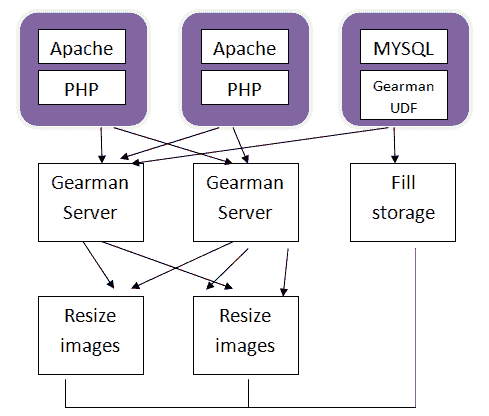

# Gearman 简介 PHP 中的多任务处理

> 原文：<https://www.sitepoint.com/introduction-gearman-multi-tasking-php/>

有多少次你开发了一个 web 应用程序，它的一些功能会从运行一个外部程序或者甚至派生一个独立的进程中受益？这不是你通常喜欢在 web 应用程序中做的事情，因为你想让它尽可能快速高效地运行，同时保持网站对最终用户的功能。那么，我们如何获得一个快速但功能全面的应用程序，能够比我们习惯的普通应用程序处理更多的数据呢？

几年前，一个网站的开发者面临着类似的问题。用户上传了太多的图片，所有这些图片都必须被处理到他们各自的账户中。这包括调整大小的功能，如创建缩略图或将原始图像尺寸缩小到更适合网站显示的尺寸。这些图片大多由头像组成，数以百万计的头像让应用程序不堪重负。该团队想到了一个解决方案:在 web 服务器应用程序之外，有一个服务器来产生处理图片等事情的进程。这就产生了 [**Gearman**](http://gearman.org/) 。

## Gearman 是什么？

Gearman 提供了一个分布式应用程序框架，用于处理多台机器或多个进程。它允许应用程序并行完成任务，负载平衡处理，并在语言之间调用函数。该框架可用于各种应用。Gearman 是多线程的，已知每秒能够执行 5 万个作业。
一些使用 C 版 Gearman 的知名网站有:
–Digg:45+服务器，每天 40 万个工作岗位
–雅虎:120+服务器，每天 1200 万个工作岗位

Gearman 最初是用 Perl 编写的，但是作业服务器和客户机 API 最近由 Eric Day 用 C 重写，因为他想要更好的性能。



该图描述了可用于调整图像大小的设置类型。传统上，图像大小调整将完全在 web 应用程序中实现。用户上传一个图像，在 HTTP 请求中提供页面服务，PHP 必须运行图像转换来执行大小调整。在图像调整完成之前，页面加载不会完成。现在，有了 Gearman，web 应用程序可以通过 Gearman 客户端向 Gearman 作业服务器请求调整图像大小。Gearman 允许您将一些功能从 web 应用程序中分离出来，让环境的其他部分来处理这些功能。

## 安装和运行 Gearman

如果你只是按照[他们的综合教程](http://gearman.org/getting-started/)进行安装，假设你对像作业服务器、客户机和工人这样的角色有高层次的理解；如果你在安装时遇到任何问题，请在下面的评论中告诉我们。

## Gearman 和 PHP

将 Gearman 与 PHP 结合使用是一种理想的易用组合。您有一个 Gearman 客户机，它通常是您的应用程序，是将作业发送到 Gearman 作业服务器的代码。您还有 worker 组件，它使用 PHP Gearman worker 库将自己注册为处理一个命名的作业，然后为该作业指定函数名。PHP 扩展扩展了过程接口，也提供了本地面向对象的接口。

要在 PHP 中安装 Gearman 扩展，请参考您的操作系统文档。比如在 Ubuntu 和 Linux Mint 上，就像`sudo apt-get install php5-gearman`一样简单。然而，在某些系统上，您可能必须手动构建它，并将其包含在 PHP 扩展文件夹中(您可以通过查看您的`phpinfo()`找到它的位置)，然后将其包含在`php.ini`文件中，如下所示:`extension="gearman.so"`。

要检查 Gearman 是否安装成功，请再次查看您的`phpinfo()`或运行一个测试方法:

```
<?php
var_dump( gearman_version() );
?>
```

让我们看一个例子:

```
<?php
$client= new GearmanClient();

$client->addServer(‘127.0.0.1’);

$client->setCreatedCallback("create_change");

$client->setDataCallback("data_change");

$client->setStatusCallback("status_change");

$client->setCompleteCallback("complete_change");

$client->setFailCallback("fail_change");

$data_array =array('mydata'=>’task’);

$task= $client->addTask("reverse", "mydata", $data_array);

$task2= $client->addTaskLow("reverse", "task", NULL);

echo "DONE\n";

function create_change($task)
{
    echo "CREATED: " . $task->jobHandle() . "\n";
}

function status_change($task)
{
    echo "STATUS: " . $task->jobHandle() . " - " . $task->taskNumerator() . 
         "/" . $task->taskDenominator() . "\n";
}

function complete_change($task)
{
    echo "COMPLETE: " . $task->jobHandle() . ", " . $task->data() . "\n";
}

function fail_change($task)
{
    echo "FAILED: " . $task->jobHandle() . "\n";
}

function data_change($task)
{
    echo "DATA: " . $task->data() . "\n";
}
Function Client_error()
{
if (! $client->runTasks())
    return $client->error() ;
}

?>
```

在这个客户机示例中，实例化了 GearmanClient 对象。接下来，调用 Gearman 客户端 API `addServer()`方法来添加用于客户端连接的服务器。如果需要，可以添加多个服务器。空参数将默认为`localhost`——为了清楚起见，这里明确指定了它。

接下来，我们为任务的不同阶段设置一些回调——回调的概念应该为每个中级开发人员所熟悉。

`addTask`添加与其他任务并行运行的任务。`addTaskLow`添加与其他任务并行运行的低优先级后台任务。为了执行这项工作，我们称之为`GearmanClient::runTasks()`。请注意，要并行运行任务，需要有足够的工作人员。优先级较低的任务将在优先级较高的任务之后从队列中选择。

## 结论

在对 Gearman 的简短介绍中，您了解了 PHP 应用程序的多任务处理。现在，您可以在 web 应用程序外部实现某些功能，并获得更好的性能，同时让系统的其余部分几乎没有空闲。

在以后的文章中，我们将通过一个工作演示来详细介绍 Gearman 的真实用例。现在，如果你想知道更多细节，请不要犹豫，在下面留下你的评论。

## 分享这篇文章