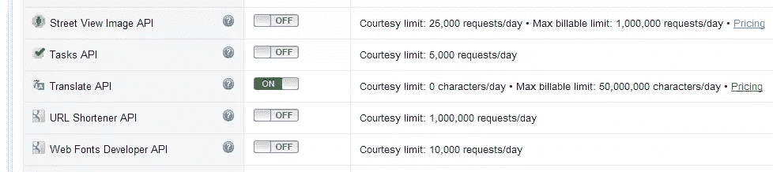
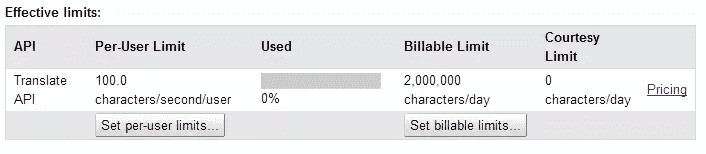
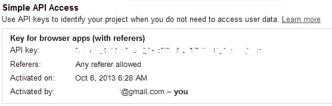

# 在 PHP 中使用谷歌翻译 API

> 原文：<https://www.sitepoint.com/using-google-translate-api-php/>

*注意:可在[这里](https://www.sitepoint.com/auto-translating-user-submitted-content-using-google-translate-api/)访问本主题的高级延续*

如果您的站点为来自不同国家的访问者提供服务，您可能已经将其所有静态内容翻译成了几种语言。但是如何处理用户每天在评论、观点和评级中发布的内容呢？因为这可能和静态内容一样是你网站的重要部分，你应该想办法把它翻译成其他语言。当然，有一项服务可以提供帮助，那就是谷歌翻译。

阅读完本教程后，你将能够直接从你的应用程序中获取谷歌翻译 API 的翻译。您将学习如何访问 API，如何使用它，以及如何处理出现的错误。

[](https://www.sitepoint.com/premium/books/php-mysql-novice-to-ninja-7th-edition/)

### 创建 Google API 帐户

为了访问 Google 翻译 API，您必须在[Google API 控制台](http://code.google.com/apis/console)上创建一个新项目，这需要一个有效的 Google 帐户。创建新项目后，只需轻触开关，打开所有可用 API 列表中的翻译 API。



#### 定价

由于 Google Translate API 是一个[付费服务](https://developers.google.com/translate/v2/pricing)，您还需要在项目设置中启用计费。为此，在 Google APIs 控制台上点击左侧菜单中的*计费*，然后点击*启用计费*。您将被要求输入支付数据，如您的地址和信用卡号码。不同的国家有不同的支付方式，但信用卡支付应该在全球范围内得到认可。

在写这篇文章的时候，使用费是每 100 万字符的翻译或语言检测 20 美元。这意味着翻译一条 300-400 个字符的用户评论将花费你 0.006-0.008 美元。当然，如果你想把一篇文章翻译成一种以上的目标语言，你必须为每篇译文分别付费。

如果您担心翻译费用过高，您可以通过设置每天可以翻译的最大字符数来控制项目中 API 的使用。整个配置可以在 Google APIs 控制台上获得。



#### 获取 API 密钥

要从您的应用程序访问翻译 API，您需要一个 API 键连接到您在 Google APIs 控制台上创建的项目。要获得 API 密钥，只需在 Google API 控制台页面的菜单中点击 *API 访问*。你会在*简单 API 访问*下找到你需要的密钥。



### 从您的应用程序访问翻译 API

Translate API 提供了 3 种方法:
–*Translate*，它将给定的文本从一种语言翻译成另一种语言，
–*detect*，它检测给定文本的语言，
–*languages*，它列出了 API 支持的源语言和目标语言。

所有的方法都是通过 GET 请求调用的。在 PHP 中进行这种请求的一种常见方式是使用 [cURL 库](https://www.sitepoint.com/using-curl-for-remote-requests/)，我们将在下面的例子中使用它。传递给每个方法的参数需要进行 URL 编码，这可以在 PHP 中使用 [rawurlencode()](http://www.php.net/manual/en/function.rawurlencode.php) 函数来实现。请记住，在每次调用中，您必须将您的 API 键作为一个*键*参数来传递。

每个 Google Translate API 方法的结果都作为表示 JSON 对象的字符串返回。为了解析它，我们将使用 [json_decode()](http://php.net/manual/en/function.json-decode.php) 函数。

#### 样品申请

*翻译*和*检测*服务是付费的，但我们可以使用第三种方法——*语言*——只是为了检查我们的应用程序是否可以与 API 连接。为此，我们将向以下 URL 发出请求:`https://www.googleapis.com/language/translate/v2/languages`

整个代码如下所示:

```
<?php
    $apiKey = '<paste your API key here>';
    $url = 'https://www.googleapis.com/language/translate/v2/languages?key=' . $apiKey;

    $handle = curl_init($url);
    curl_setopt($handle, CURLOPT_RETURNTRANSFER, true);     //We want the result to be saved into variable, not printed out
    $response = curl_exec($handle);                         
    curl_close($handle);

    print_r(json_decode($response, true));
?>
```

执行上面的代码后，您应该会看到 Google Translate API 可以处理的所有语言的数组。类似的表格可在[文档](https://developers.google.com/translate/v2/using_rest#target)中找到。浏览该表是很重要的，因为当提交翻译特定文本的请求时，您将需要包括该表中规定的语言代码。

## 获取翻译

Google Translate API 的核心功能可以通过它的 *translate* 方法获得。可通过以下网址访问:`https://www.googleapis.com/language/translate/v2`

*翻译*方法有几个参数。最重要的有:
–*q*–输入文本，
–*source*–源语言(如果没有指定，Google 会尝试自动识别)，
–*target*–目标语言

如果您想获得一个翻译的文本，您必须改变前一个例子中请求的 URL。代码的其余部分看起来非常相似:

```
<?php
    $apiKey = '<paste your API key here>';
    $text = 'Hello world!';
    $url = 'https://www.googleapis.com/language/translate/v2?key=' . $apiKey . '&q=' . rawurlencode($text) . '&source=en&target=fr';

    $handle = curl_init($url);
    curl_setopt($handle, CURLOPT_RETURNTRANSFER, true);
    $response = curl_exec($handle);                 
    $responseDecoded = json_decode($response, true);
    curl_close($handle);

    echo 'Source: ' . $text . '<br>';
    echo 'Translation: ' . $responseDecoded['data']['translations'][0]['translatedText'];
?>
```

包含翻译文本的示例响应如下所示:

```
{
 "data": {
  "translations": [{"translatedText": "Bonjour tout le monde!"}]
 }
}
```

#### 如果不设置源语言会怎么样？

如果您决定不在请求中包含源语言(参数 *source* ),可能会发生两种情况:
1。Google 将设法自己检测语言，JSON 响应将因此包含一个额外的 *detectedSourceLanguage* 属性来保存源语言代码。
2。无法成功检测到源语言(例如，当源文本太短时), Google Translate API 将返回 HTTP 500 错误。这就引出了教程的下一部分——处理错误。

## 处理错误

当您的请求无法处理时，Google Translate API 会返回一个 HTTP 响应，其中包含表示错误类型的代码。使用 cURL 执行请求后，可以使用 [curl_getinfo()](http://www.php.net/manual/en/function.curl-getinfo.php) 函数获得服务器响应代码。如果响应代码与 **200** 不同，则意味着出现了问题。

Google Translate API 可能会返回以下错误代码:
–**400(错误请求)**–您的请求缺少一些参数，或者您向请求中的参数传递了错误的值(例如，无效的语言代码)，
–**403(禁止使用)**–您输入了错误的 API 密钥或超出了限额，
–**500(内部服务器错误)**–Google 无法识别您的文本的源语言或出现了其他错误。

此外，当出现错误时，Google Translate API 会返回一个包含错误描述的 JSON 响应。例如，当缺少一个必需的参数时，服务器将回复以下响应:

```
{
 "error": {
  "errors": [
   {
    "domain": "global",
    "reason": "required",
    "message": "Required parameter: target",
    "locationType": "parameter",
    "location": "target"
   }
  ],
  "code": 400,
  "message": "Required parameter: target"
 }
}
```

因此，在查询 Google Translate API 服务时，处理错误的最佳方式是结合检查 HTTP 响应代码和解析来自服务器的 JSON 响应。重要的是， *curl_getinfo()* 必须在 *curl_close()* 之前调用:

```
<?php
    $apiKey = '<paste your API key here>';
    $text = 'Hello world!';
    $url = 'https://www.googleapis.com/language/translate/v2?key=' . $apiKey . '&q=' . rawurlencode($text) . '&source=en&target=fr';

    $handle = curl_init($url);
    curl_setopt($handle, CURLOPT_RETURNTRANSFER, true);
    $response = curl_exec($handle);
    $responseDecoded = json_decode($response, true);
    $responseCode = curl_getinfo($handle, CURLINFO_HTTP_CODE);      //Here we fetch the HTTP response code
    curl_close($handle);

    if($responseCode != 200) {
        echo 'Fetching translation failed! Server response code:' . $responseCode . '<br>';
        echo 'Error description: ' . $responseDecoded['error']['errors'][0]['message'];
    }
    else {
        echo 'Source: ' . $text . '<br>';
        echo 'Translation: ' . $responseDecoded['data']['translations'][0]['translatedText'];
    }
?>
```

### 一个请求中的多个翻译

您可以在一个请求中翻译几个文本，这无疑比为每个翻译执行单独的请求更高效。为此，只需传递几个 *q* 参数，每个参数包含一个要翻译的文本。

不过这里有点棘手:
——如果你的源文本都是同一种语言，你可以传递包含所有文本的语言代码的 *source* 参数；
–但是如果你想翻译几个不同语言的文本，你不能传递几个*源*参数。在这种情况下，您必须省略 *source* 参数，让 Google 猜测源文本的语言。

还要注意，您不能在一个请求中获得一个源文本的多个翻译。如果你想把一个文本翻译成不同的目标语言，你必须提出单独的请求。

## 结论

现在你知道了将你的应用程序连接到谷歌翻译 API 的基础。更复杂的 API 实现可能包括当用户提交某些内容时(或者当站点管理员批准时)自动获取翻译并将翻译保存到数据库中。我们将在以后的文章中讨论这些高级的例子(第 2 部分[这里](https://www.sitepoint.com/auto-translating-user-submitted-content-using-google-translate-api/))。

如果你计划在你的应用中使用谷歌翻译 API，请记得阅读[服务条款](https://developers.google.com/translate/v2/terms)和[归属要求](https://developers.google.com/translate/v2/attribution)，它们包含了一些关于如何在网页上显示翻译内容的指导方针。

如果你对这篇文章有任何问题或评论，欢迎在下面发表评论或通过 [Google+](https://plus.google.com/112138584619019192671?rel=author) 联系我。

## 分享这篇文章