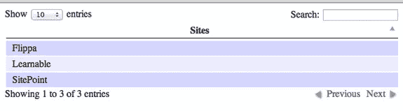
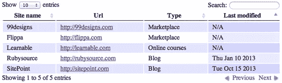

# 使用 jQuery 数据表

> 原文：<https://www.sitepoint.com/working-jquery-datatables/>

DataTables 是一个强大的 jQuery 插件，用于创建表格列表并向其中添加交互。它提供搜索、排序和分页，无需任何配置。在本文中，我们将介绍数据表的基础知识，以及如何使用一些高级功能。

## 设置数据表

第一步是从[数据表](http://www.datatables.net/download/)网站获取库。1.9.4 是当前的稳定版本，1.10 正在开发中。如果你不想下载文件，你也可以利用[微软 CDN](http://www.datatables.net/blog/Microsoft_CDN) 。因为它是一个 jQuery 插件，你也应该包含 jQuery 库，最好是最新的版本。

## 命名规格

在我们继续之前，了解一下库中使用的约定是有用的。DataTables 使用匈牙利符号来命名变量，这基本上是在它的名称上添加了特定的前缀，有助于理解变量所保存的数据类型。

n-变量代表一个节点。
o–变量代表一个对象。
一个–变量代表一个数组。
s-变量是一个字符串。
b–布尔型
f–浮点型
I–变量保存整数值。
fn–变量代表一个函数。

有时候你会看到多个前缀一起使用，比如 ao，它代表一个对象数组。

## 入门指南

数据表可以处理来自各种来源的数据。它可以直接在 HTML 表上工作，或者我们可以在初始化时将数据指定为数组。或者它可以处理来自 Ajax 源的数据。

在本文中，我们将在 SitePoint 网络中创建一个网站列表。我们将从列出几个网站名称开始，然后我们将添加更多的栏目和功能。这里我们有一个 HTML 表，其中一列只列出了三个网站的名称。让我们看看通过最小的设置数据表可以做什么。

```
<html>
<head>
  <link rel="stylesheet" type="text/css" href="http://ajax.aspnetcdn.com/ajax/jquery.dataTables/1.9.4/css/jquery.dataTables.css">
</head>
<body>
  <table id="example">
    <thead>
      <tr><th>Sites</th></tr>
    </thead>
    <tbody>
      <tr><td>SitePoint</td></tr>
      <tr><td>Learnable</td></tr>
      <tr><td>Flippa</td></tr>
    </tbody>
  </table>
  <script type="text/javascript" charset="utf8" src="http://ajax.aspnetcdn.com/ajax/jQuery/jquery-1.8.2.min.js"></script>
  <script type="text/javascript" charset="utf8" src="http://ajax.aspnetcdn.com/ajax/jquery.dataTables/1.9.4/jquery.dataTables.min.js"></script>
  <script>
  $(function(){
    $("#example").dataTable();
  })
  </script>
</body>
</html>
```

将这段代码复制粘贴到一个 html 页面，并在浏览器中打开它。你会看到一个漂亮的桌子，如下所示。



现在您知道了 DataTable 的强大功能以及我们可以用它来完成什么。有了这个最基本的设置，我们可以从顶部的搜索框中搜索站点名称，并通过单击列名对它们进行排序。如果您试图自己实现这些特性，会有多困难？

这里我们首先在顶部包含了数据表 CSS 文件，在底部包含了 Js 文件。`$("#example").dataTable()`将在 id 为`example`的表上实例化 DataTable。

现在我们需要列出更多的网站，每个网站的更多细节。假设我们手里有一个列表，包含站点名称、URL、类型和上次更新时间等详细信息，但是是在 JavaScript 数组中，而不是在 HTML 表中。类型可以是博客、论坛或市场，对于非博客的网站,“最后更新”列将为空值。

这里，我们希望在最后更新的列中显示 N/A 而不是 null 值，并使 URL 成为可点击的链接。

我们将首先创建一个 HTML 表，带有所需的列标题和一个空的表体。

```
<table id="example">
  <thead>
    <tr><th class="site_name">Name</th><th>Url </th><th>Type</th><th>Last modified</th></tr>
  </thead>
  <tbody>
  </tbody>
</table>
```

现在让我们将数据表应用到这个表中。

```
$("#example").dataTable({
  "aaData":[
    ["Sitepoint","https://www.sitepoint.com","Blog","2013-10-15 10:30:00"],
    ["Flippa","http://flippa.com","Marketplace","null"],
    ["99designs","http://99designs.com","Marketplace","null"],
    ["Learnable","http://learnable.com","Online courses","null"],
    ["Rubysource","http://rubysource.com","Blog","2013-01-10 12:00:00"]
  ],
  "aoColumnDefs":[{
        "sTitle":"Site name"
      , "aTargets": [ "site_name" ]
  },{
        "aTargets": [ 1 ]
      , "bSortable": false
      , "mRender": function ( url, type, full )  {
          return  '<a href="'+url+'">' + url + '</a>';
      }
  },{
        "aTargets":[ 3 ]
      , "sType": "date"
      , "mRender": function(date, type, full) {
          return (full[2] == "Blog") 
                    ? new Date(date).toDateString()
                    : "N/A" ;
      }  
  }]
});
```

现在我们的表将如下所示。我们在所有记录的 URL 列中有一个可点击的链接，最后修改的列看起来非常整洁。



我们已经使用数据表的`aaData`选项给出了 json 数组。如果您查看代码，您会看到一个“`aoColumnDefs`”选项被传递给数据表，其中包含一些对象的数组。`aoColumnDefs`属性基本上决定了表中每一列应该如何呈现。使用这个属性，您可以修改表中的任意列，由对象的`aTargets`属性指定。

`aTargets`数组中的值可以是列标题中指定的类名、列的索引(从 0 开始表示从左到右，或从负索引表示从右到左)或“`_all`”以匹配表中的所有列。"`sTitle` ":" `Site name`"第一列将覆盖第一列的列标题。

注意，第二列中缺少排序图标，因为基于 URL 的排序没有多大意义。我通过为相应的列设置`bSortable:false`来删除它。`mRender`是一个强大的选项，可用于改变显示的数据。这种属性可以通过多种方式赋予。当使用整数值时，它将使用该值作为数据数组的索引。当给出一个字符串时，它将使用具有该名称的 json 对象的属性。

当我们显示从服务器返回的 json 数据时，这些特别有用。`mRender`也可以是一个函数，在渲染该列的每个单元格时都会调用。该函数将获得三个参数，值，类型和整个行，它应该返回我们希望在它的位置呈现。我们的函数只是创建了一个到那个 URL 的链接并返回它。

同样，对于最后更新的列，我们检查每行第三列中的值。如果是博客，函数将返回格式化的日期，否则将返回“不适用”。

“`sType`”属性帮助我们指定该列的预期类型，这决定了该列的值将如何排序。默认情况下，数据表支持四种类型:字符串、数字、日期和 HTML。您可以通过定义自定义类型来扩展它。这里我们将类型指定为“date ”,因此它将使用基于日期的排序。否则，它会认为该列只是字符串，排序可能没有任何意义。

## 服务器端处理

在上面的例子中，我们使用了一个普通的 HTML 表和一个直接在客户端给出的 json 数组。有时数据库会有太多的记录，一次取出所有记录并对其应用数据表可能并不明智。相反，我们可以使用库提供的服务器端处理特性，只获取当前显示在前端的记录。

每次呈现表格时，DataTables 将向服务器发送一个带有多个参数的请求，包括起点、显示长度、搜索数据、排序列等。服务器可以在 SQL 查询中使用它们来过滤数据并将它们发送回客户端。数据表期望返回的 json 数据中的一些属性能够在前端正确显示它们。它们是:

`iTotalRecords`–在应用过滤器之前，表中的总记录数。
`iTotalDisplayRecords`–应用过滤器后返回的记录数。
`sEcho`–客户发来的未修改的副本。
`aaData`–来自服务器的数据数组。

来自服务器的 json 响应可能类似于:

```
{ 
    "iTotalRecords": 50,
    "iTotalDisplayRecords": 10,
    "sEcho":10,
    "aaData": [
        {"name": "Sitepoint", "url": "https://www.sitepoint.com", "editor" :{ "name" : "John Doe", "phone" : ["9191919", "1212121"], "email":[]}},
        {"name": "Flippa", "url": "http://flippa.com",  "editor": { "name": "Adam Smith", "email" : ["adam.smith@domain.com"], "phone":[] }}
    ]
}
```

为了呈现这一点，我们将首先创建一个带有相应列标题的 html 表。

```
$("#example").dataTable({
  "bServerSide": true,
  "sAjaxSource": "http://localhost/data_source.json",
  "aoColumns": [{
    "mData":"name",
    "sTitle": "Site name"
  },{
    "mData": "url",
    "mRender": function ( url, type, full )  {
      return  '<a href="'+url+'">' + url + '</a>';
    }
  },{
    "mData": "editor.name"
  },{
    "mData": "editor.phone"
  },{
    "mData":"editor",
    "mRender": function(data){
      return data.email.join("<br>");
    }
  }]
});
```

在这里，我们只是通过将`bServerSide`设置为`true`来告诉数据表从服务器加载数据。一旦启用，我们还应该提供一个数据源，使用`sAjaxSource`属性。在从服务器返回的 json 数据中，默认情况下 DataTables 会寻找`aaData`来获取要在表中显示的数据。您可以通过在`sAjaxDataProp`属性中指定属性名来覆盖它。

在本例中，我们获得了一个 json 对象数组，因此我们应该映射哪个键应该显示在哪个列中。我们使用了`aoColumns` 而不是`aoColumnDefs`。两者做同样的事情，但方式不同。当使用`aoColumns`时，数组的长度应该等于 HTML 表中的列数，这样我们就可以为每一列提供一个映射。

在 json 响应编辑器字段中是一个具有名称、电子邮件和电话字段的对象。"`mData` ": " `editor.name`"告诉数据表获取编辑器对象的 name 属性。注意，`phone`和`email`是数组，它们会用逗号自动连接起来，或者我们可以编写一个自定义的`mRender`函数来让它看起来更好。

还有更多…

除了上面提到的特性，数据表提供了许多真正有用的功能，我们可以通过使用或编写自己的插件来扩展它们。它还提供了一个简单的 API 来操作创建好的表。

```
var oTable =  $('#example'). dataTable();
$('#example').on('click', 'tr', function(){
	var oData = oTable.fnGetData(this);
	console.log(oData);
})
```

当我们点击它时，这个代码将记录一行值数据。`fnGetData`基本上接受一个 TR/TD 节点或行的索引，并返回该行或单元格中的值。

当我们从一个页面切换到另一个页面时，保存表格的当前状态有时会很有用。初始化时，您可以通过设置“`bStateSave`”: `false`来启用状态保存。默认情况下，状态将保存在 cookie 中。数据表允许我们定义回调函数来覆盖它，这样我们就可以把它存储在`Localstorage`或者服务器本身。下面是一个保存`Localstorage.a`中状态的例子

```
$("#example").dataTable({
      bStateSave : true,      
      fnStateSave :function(settings,data){
        localStorage.setItem("dataTables_state", JSON.stringify(data));
      },
      fnStateLoad: function(settings) {
        return JSON.parse(localStorage.getItem("dataTables_state"));
      }
    });
```

在这里，一旦表被呈现，就会调用`fnStateSave`来保存状态。下一次在呈现表格之前，它将调用`fnStateLoad`并加载之前存储的状态。**注意:**在 1.10 版本中，数据表将使用`localStorage`作为保存州的默认存储。

## 摘要

DataTables 是一个高度灵活且功能丰富的库，可以处理表格和列表。该库提供了许多配置选项和一个简单的 API。不可能在一篇文章中讨论所有的功能。因此，我们简要讨论了一些最有用的特性以及如何使用它们。

请试用它们，如果您有任何问题，请告诉我。我会尽力帮忙。

*使用 [SitePoint 的高级订阅服务](https://learnable.com/join/trial?utm_source=sitepoint&utm_medium=referral&utm_content=working-jquery-datatables&utm_campaign=top20articles)，将您的 jQuery 技能提升到一个新的水平。您会发现许多关于 JavaScript 和 jQuery 的书籍和课程——而且每个月还会增加更多！*

## 分享这篇文章