# 在 Photoshop 中创建一个风格化的万圣节南瓜

> 原文：<https://www.sitepoint.com/create-stylized-halloween-pumpkin-photoshop/>

季节性广告很常见，理由很充分。将您的促销活动与时间敏感的年度活动结合起来，可以为您的产品营造一种明显的紧迫感，而这种紧迫感可能是您的产品所不具备的。许多消费者已经成为一年中这些特定时间的习惯性消费者，如果你没有将你的产品定位为周期性节日的一部分，你很可能会将收入输给你的竞争对手，他们不必拿出大幅折扣或创造性的营销来击败你。我们不要让这种情况发生。

在本教程中，我将带你经历制作一个完美的方法来将你的产品与节日联系起来——万圣节南瓜。我们将使用钢笔工具，画笔工具，形状工具，以及过滤器和编辑菜单中的各种选项来实现最终的结果。希望你会学到一些有用的技巧。所以，让我们开始吧！

### 资源:

詹妮弗·摩尔的免费万圣节 Photoshop 笔刷

[肉宴 BB 字体](http://www.dafont.com/feast-of-flesh-bb.font)

### 最终结果:

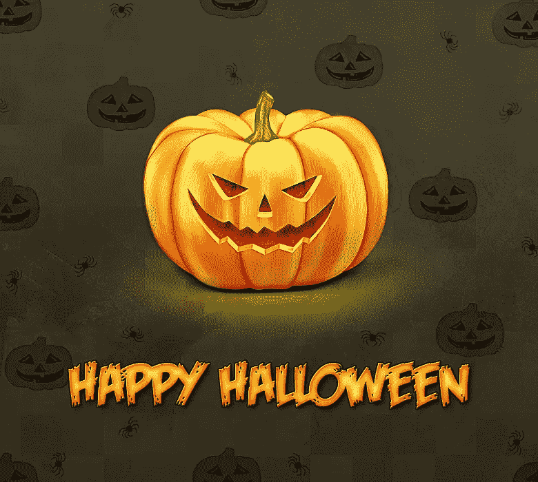

**( [下载完成的，图层化的 Photoshop 文件](https://www.dropbox.com/s/j7c19vcblarndr4/Halloween%20Pumpkin.zip)。)**

### 第一步

在 Photoshop 中创建一个宽度为 780 像素、高度为 700 像素的新文档。
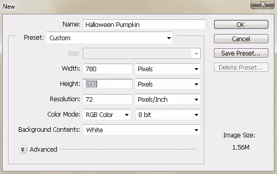

### 第二步

我们将从制作南瓜的草图开始。如果你想把草图导入 Photoshop，你可以在纸上画草图。我已经用 2px 软圆形笔刷画出了草图。
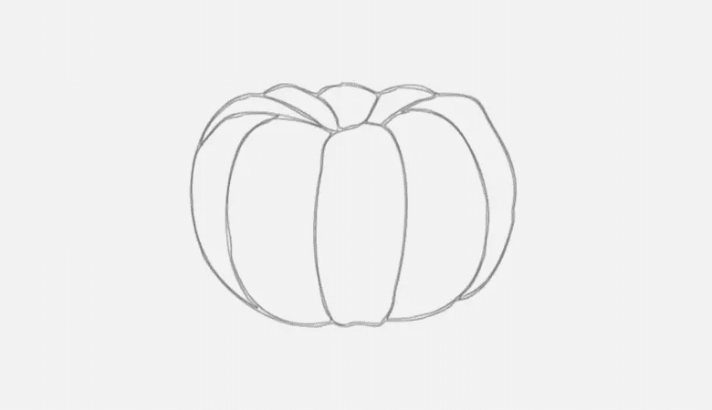

现在，我们将使用钢笔工具(“P”)来描绘它。选择#ff6b07 作为你的填充颜色，选择钢笔工具(“P”)；确保在顶部控制栏中选择“形状”作为工具模式。开始在草图下面的图层上画南瓜的一部分。
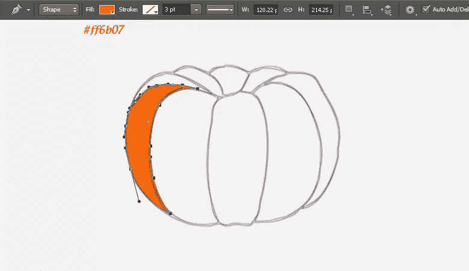

### 第三步

在单独的新图层上绘制每个部分。完成后，通过按住“Shift”键并按 Ctrl+“G”来选择它们，将它们收集到一个组中。将该组标记为“基地”。
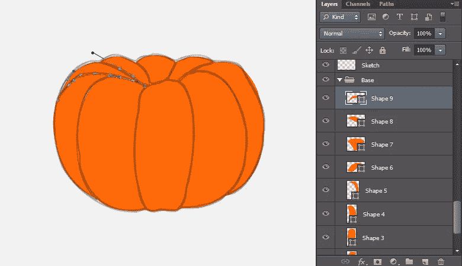

### 第四步

隐藏或删除草图层。现在，双击其中一个图层，查看“图层样式”窗口，并为“内阴影”应用以下设置。现在，右键单击这一层，并选择“复制图层样式”选项。之后，右键单击其余的形状一个接一个，并选择“粘贴图层样式”从选项中应用相同的内阴影设置。
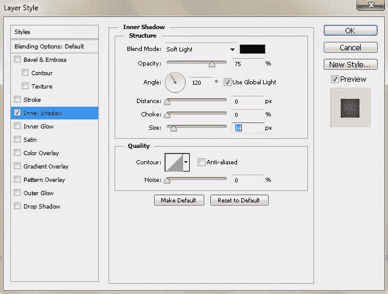

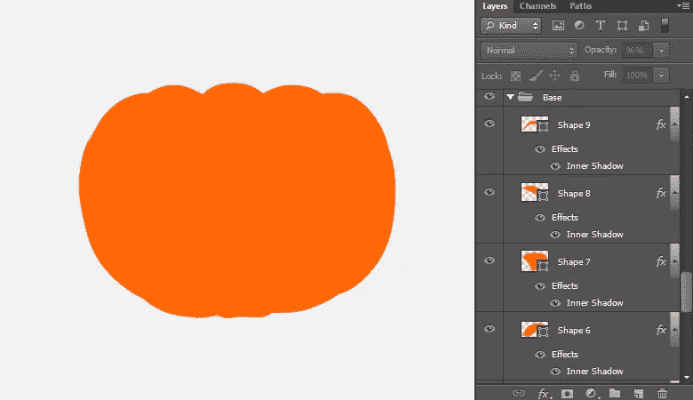

### 第五步

下一步，我们将应用一些阴影，使我们的南瓜现实和有趣。按 Ctrl + <click on="" one="" of="" the="" shapes="" layers="">在其周围进行选择。现在，点击图层面板中的“新建图层”图标，在图层上方新建一个图层。对于阴影，我们将使用大小在 12px 到 30px 之间的“软圆形笔刷工具”。现在，使用#fada52 作为填充颜色，在你的选区中的这个新图层上制作一些近似的高光。对于阴影，使用颜色#d14e00。将这个新图层命名为“阴影”。
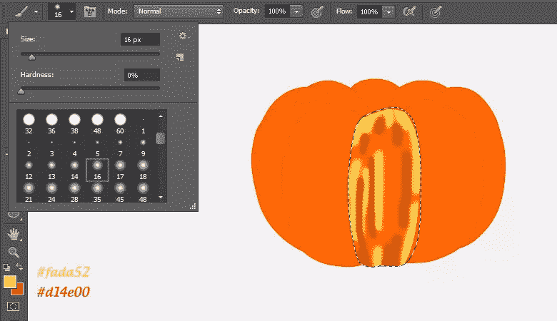</click>

### 第六步

点击新建的阴影层，进入“滤镜”>“模糊”>“运动模糊”，在这里应用以下设置。

之后，进入“滤镜”>“模糊”>“高斯模糊”，应用 5-6px 高斯模糊效果，适当模糊底纹。
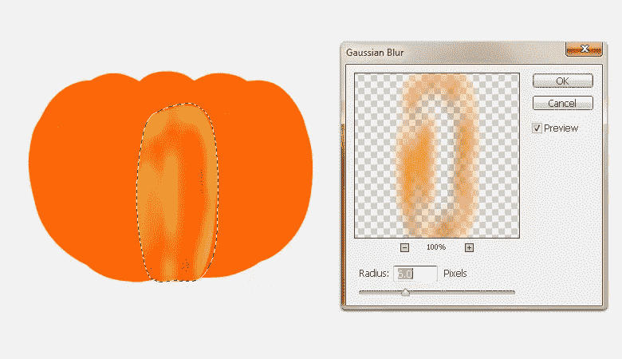
现在将其混合模式改为“网屏”，不透明度调整为 50-70%。
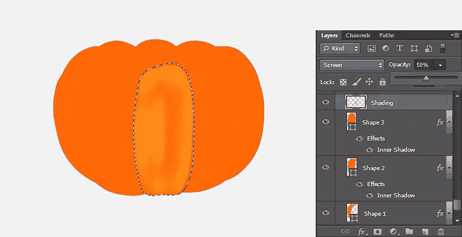

### 第七步

使用步骤 5-6 中解释的相同技术，将阴影一个接一个地应用到南瓜的其余部分。改变所有阴影层的混合模式为“屏幕”，不透明度设置在 50-70%之间。
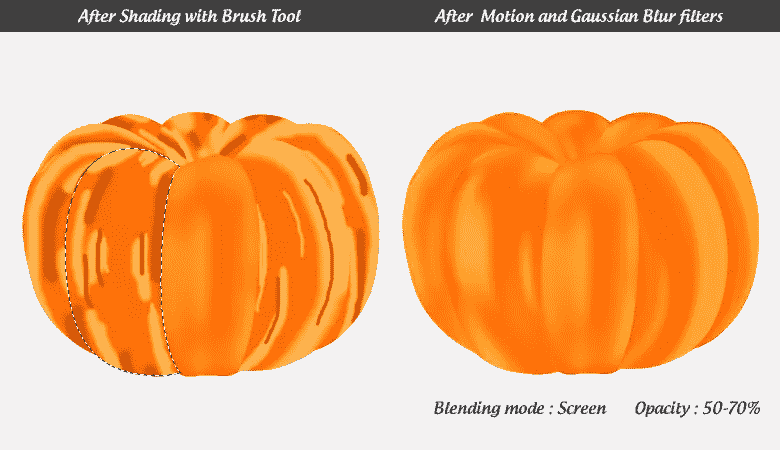

混合阴影的另一种方法是使用涂抹工具，可以在工具栏的模糊工具下查看。选择涂抹工具，从顶部控制栏中选择一个 100 像素的软圆形笔刷，强度为 15-25 像素，在选定的区域内轻轻混合笔画。

### 第八步

接下来，我们将添加纹理到我们的南瓜。在新图层上使用矩形选框工具绘制一个矩形。使用油漆桶工具填充黑色，进入“滤镜”>“噪波”>“添加噪波”，应用以下设置添加噪波。之后，应用提供的“运动模糊”设置。将这个新图层命名为“纹理”,复制 2-3 次。
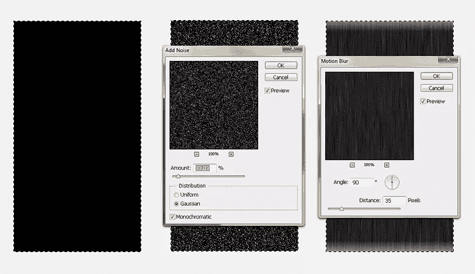

### 第九步

现在取一个纹理层，将它的混合模式改为“线性减淡”，透明度为 30-40%，放置在南瓜的左侧。现在，转到“编辑”>“变换”>“扭曲”，操纵工具将纹理排列成曲线，如下图所示。
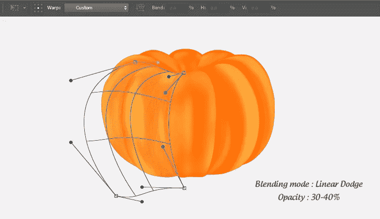

为了限制南瓜的纹理，我们将对它应用图层蒙版。复制基础层并将其合并。现在，点击纹理层，按 Ctrl + <click on="" the="" merged="" base="" layer="">选择南瓜区域，点击图层面板底部的图标“添加图层蒙版”。
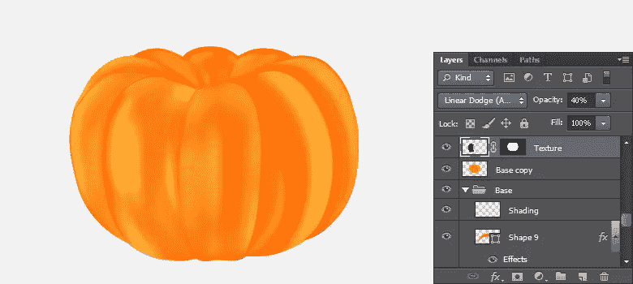</click>

### 第十步

现在，复制一个纹理(混合模式:“线性减淡”，不透明度:30-40%)，将其放置在南瓜的右侧，使用扭曲工具将其弯曲。同样，修改南瓜顶部的纹理。
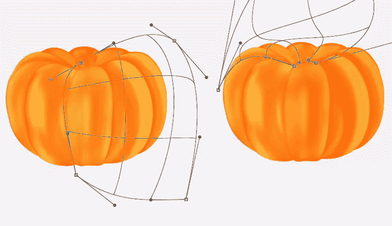

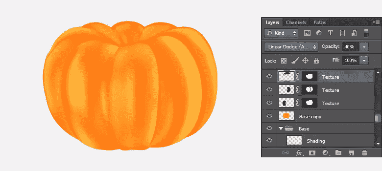

### 步骤 11

新建一个图层，选取一个 4-5px 的软圆形笔刷工具，不透明度 30%，在这个新图层上，在各个南瓜部位的交界处涂抹。之后，应用 2px 高斯模糊过滤器。复制它，改变原始图层的混合模式为“叠加”，不透明度为 100%，改变复制图层的混合模式为“叠加”，不透明度为 30%。

### 步骤 12

现在，我们将在南瓜上应用更多的阴影。按 Ctrl + <click on="" the="" copy="" layer="">在南瓜周围进行选择。新建一个图层，使用 35px 的软圆形笔刷工具，选择#fddd4c 作为你选择的颜色，在图层顶部制作高光。改变其混合模式为“叠加”，透明度为 70%。创建另一个层，在底部用软圆刷填充黑色。改变其混合模式为 30%不透明度的“乘”。
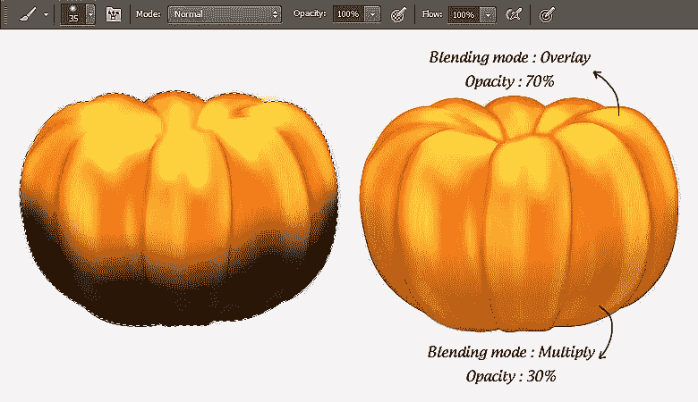</click>

### 第十三步

将“基本拷贝”层放在其余层之上，将其混合模式改为“强光”，不透明度为 35%。
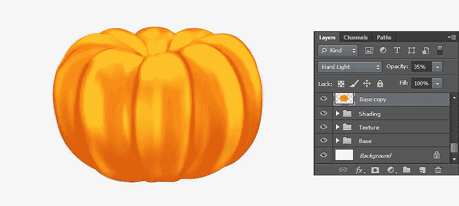
按 Ctrl + <click on="" the="" copy="" layer="">对其周围进行选择。现在，创建一个新层，并应用软圆刷工具在绿色和红色阴影的选择。改变其混合模式为“强光”，不透明度为 15%。
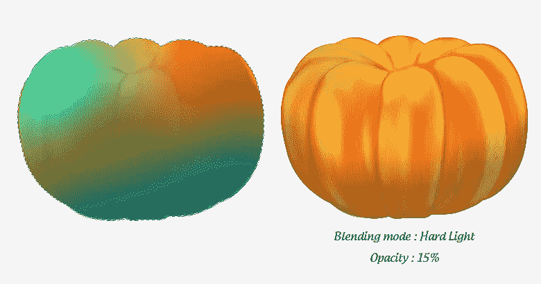</click>

现在，选择#ffca6c 作为你的颜色，在一个新的图层上使用一个柔软的圆形笔刷，如下图所示。改变其混合模式为 100%不透明度的“除”。
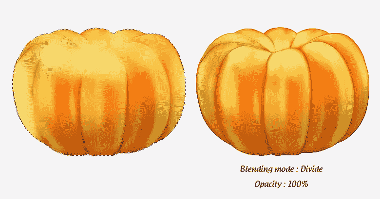

### 步骤 14

接下来，我们将绘制南瓜的雕刻眼睛。选择钢笔工具(工具模式:形状)绘制如下所示的两个三角形。将这些形状标记为“外眼”和“内眼”。
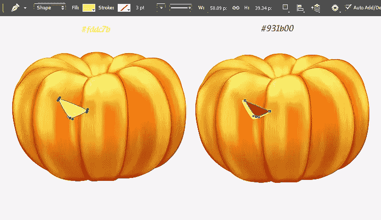

按 Ctrl + <click on="" the="" eye="" layer="">选择它，使用软圆形笔刷工具，用#fab01d 作为你选择的颜色，在新图层上应用阴影。之后，用颜色#741300 在“内眼”上涂上阴影。当内眼选择处于活动状态时，新建一个图层，填充黑色，然后进入“滤镜”>“像素化”>“mezzo tint”，选择“粒状点”。改变其混合模式为“柔光”，不透明度为 15%。
</click>

收集眼睛层到一个组中，复制它，然后通过“编辑”>“变换”>“水平翻转”来水平翻转它。如下图所示，将其放置在右侧。同样，用同样的方法制作南瓜的鼻子。

### 第十五步

要做嘴巴，画下面两个形状。分别贴上“外口”和“内口”的标签。按 Ctrl + <click on="" mouth="" shape="">选择它的周围，在一个新图层的顶部边缘应用阴影，并给它一个粒状点纹理，就像我们在眼睛上做的一样。
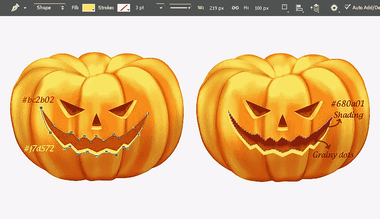</click>

现在，按 Ctrl + <click on="" mouth="" layer="">选择该区域，并在一个新图层上应用阴影，如下所示。改变阴影层混合模式为“颜色加深”。
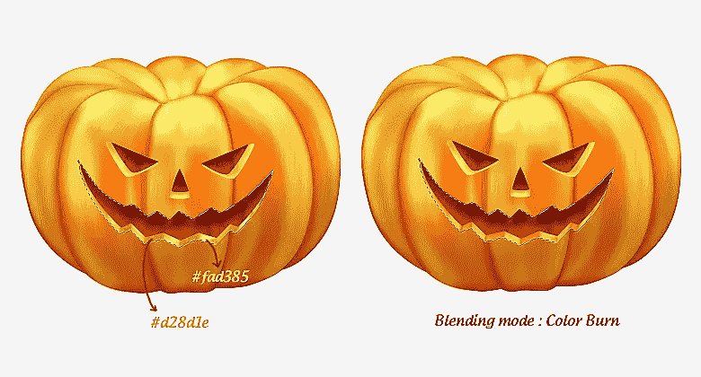</click>

### 第十六步

为了制作南瓜茎，使用钢笔工具(工具模式:形状)以#a0910e 为颜色绘制以下形状。用下面两种颜色的软圆形笔刷工具给它添加一些阴影。用 1px 硬圆笔刷工具创建黄色高光；改变其混合模式为“屏幕”，不透明度为 30%。
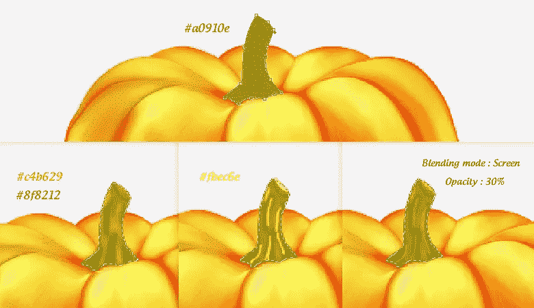

### 步骤 17

为了锐化所有的细节，收集所有的图层到一个单独的组中，并标记为“南瓜”。复制这个新图层，合并，进入“滤镜”>“其他”>“高通”。对其应用 2px 高通效果。改变其混合模式为“线性减淡”，透明度为 75%。

### 步骤 18

接下来，我们将制作南瓜的影子。在背景上方新建一个图层，用 30px 大小的软圆形笔刷，在南瓜底部附近填充黑色。之后，应用一个运动模糊滤镜，角度为 O 度，距离为 30px。复制这个新图层，再次在这个图层上应用一个运动模糊滤镜，角度为 0 度，距离为 150 像素。
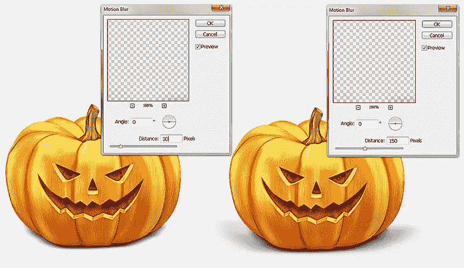

### 步骤 19

现在，我们将在南瓜下发出微弱的光。使用#efd274 作为填充颜色，在剩下的图层下面画一个椭圆，应用 20px 高斯模糊滤镜。
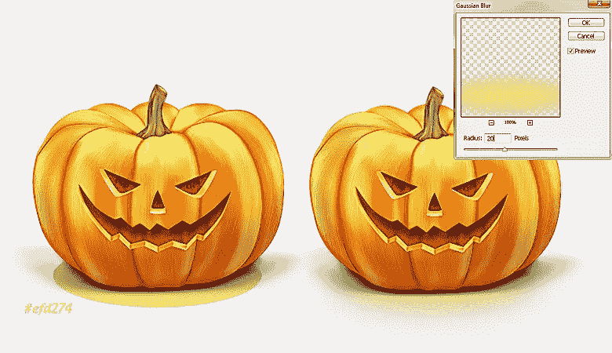

### 步骤 20

我们的万圣节南瓜准备好了。你现在可以添加一个合适的补充背景和标题。

我希望你喜欢这个教程并学到一些有用的东西。我等你的反馈。万圣节快乐！

## 分享这篇文章