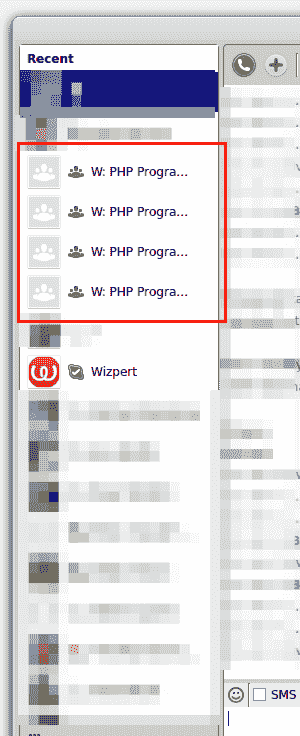
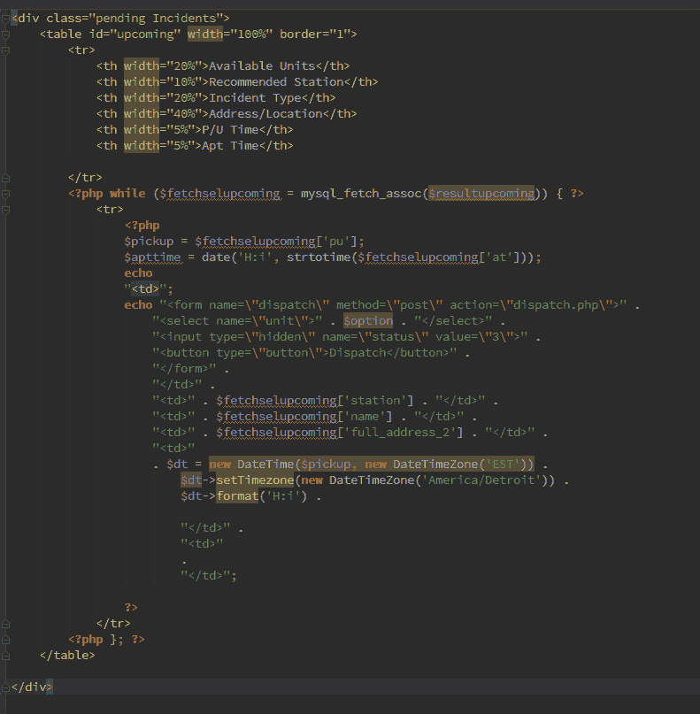
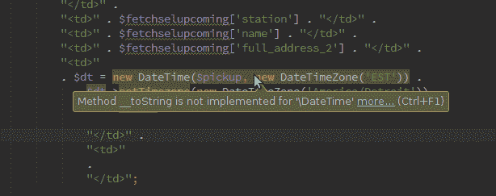
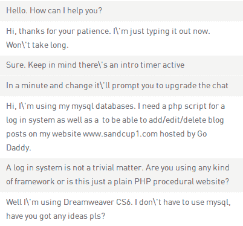

# wiz pert——激励性帮助

> 原文：<https://www.sitepoint.com/wizpert-incentivized-helping/>

2013 年 10 月 18 日，我收到一封电子邮件，邀请我加入一个新平台， [Wizpert](http://www.wizpert.com) 。尽管该服务错误地将我识别为谷歌 PHP-for-GAE 博客的所有者，我还是对其进行了简单的测试，并形成了一个[草率的意见](https://plus.google.com/u/0/104771776404197897488/posts/YMYdNiLgm6Z)。

不到半小时后，他们的首席执行官迈克尔·温伯格联系了我，希望澄清我列出的一些误解。在我的书中，这是一个很大的优势——对这种速度的适当公关控制是极其重要的。

我们在接下来的周一安排了一次 Skype 通话，简短的交谈涵盖了我关心的所有方面，甚至更多。

### Wizpert 是什么？

Wizpert 是一个平台，特定领域的专家可以在这个平台上注册成为“wiz pert”。然后，访客就有机会和他们聊天，询问他们可能有的关于任何现有话题的问题——从恋爱建议到编程。

如果巫师有帮助，游客可以选择用硬币奖励他们，一定数量的硬币可以兑换成真钱。一次性积累和交换越多，交换比例越好。

游客可以用真钱购买这些硬币，当然，他们一次购买的越多，货币与硬币的比率就越好。

本质上，它是一个付费的服务台。想象一下，在 StackOverflow.com 进行一对一的交流，并且(有时)还能获得报酬。

从技术上讲，Wizpert 做得非常好。由于非常年轻，他们当然有一些问题需要解决，但是他们与 Google Hangouts 和 Skype 的整合是完美的。你将这些服务与你的 Wizpert 帐户连接起来，每当有人想与你聊天时，你就会在任何可用的上收到 pinged。有人可能会说这种方法在 Skype 中产生了太多的混乱(见图 1)，但这真的没什么大不了的。



### 收入潜力如何？

不太好。当游客首次注册时，他们会获得 100 枚促销币。你可以通过各种方式获得这些硬币——甚至只是在发布期间访问网站。但是，促销币不能换钱。它们可以用来延长聊天的持续时间(每个聊天都有一个 3 分钟的介绍期，之后必须由专家或访问者延长)，与其他专家交谈，等等。为了奖励某人，游客**必须**购买硬币——只有购买的硬币才能兑换成钱。

"那么比率是多少呢？"，你可能会想。在我的[初始帖子](https://plus.google.com/u/0/104771776404197897488/posts/YMYdNiLgm6Z)中，我漏了一个转化率，算错了。如果在购买硬币时，你去了结账页面，另一个选项出现了——200 美元的 10k 硬币。鉴于 30k 硬币可以兑换 500 美元，这使得平台的利润为 100 美元(如果 Wizpert 和 visitor 都以最佳比例兑换的话)，这无可否认是相当公平的。没错，但所有这一切仍然意味着人们需要购买硬币来奖励那些他们认为额外有用的人，没有人真的这么做。或者他们有吗？

Michael 在我们的聊天中提到，事实上，他们不仅在聊天过程中看到了很高的访问者满意度，而且有很高比例的人实际上付出了额外的努力，购买硬币并奖励人们。我自己也得到了硬币，所以我最初的偏见似乎是非常错误的。

现在，当然，这仍然不能归结为很多钱。即使你每天赚 1000 个硬币，那也是每月 30k，也就是 500 美元，尽管还有其他费用。作为零花钱还不错，尤其是如果你花一天时间做开源软件和帮助别人，但也不值得为此辞职。然而，还有一些其他的东西可以获得，我们稍后会讲到。

### 作为一名开发奇才，我在那里具体做什么？

我们来看一些例题(转述):

#### Q1:“[……]在第 75 行得到这个错误致命错误:在非对象上调用成员函数`setTimezone()`

```
 <div class="pending Incidents">
        <table id="upcoming" width="100%" border="1">
  <tr>
    <th width="20%" >Available Units</th>
    <th width="10%" >Recommended Station</th>
    <th width="20%" >Incident Type</th>
    <th width="40%" >Address/Location</th>
    <th width="5%" >P/U Time</th>
    <th width="5%" >Apt Time</th>

  </tr>
<?php while ($fetchselupcoming = mysql_fetch_assoc($resultupcoming)) { ?>
  <tr>
<?php
  $pickup = $fetchselupcoming['pu'];
  $apttime = date('H:i', strtotime($fetchselupcoming['at']));
    echo 
        "<td>";
        echo "<form name=\"dispatch\" method=\"post\" action=\"dispatch.php\">". 
        "<select name=\"unit\">".$option."</select>".
        "<input type=\"hidden\" name=\"status\" value=\"3\">".
        "<button type=\"button\">Dispatch</button>". 
        "</form>".
        "</td>".
        "<td>".$fetchselupcoming['station']."</td>".
        "<td>".$fetchselupcoming['name']."</td>".
        "<td>".$fetchselupcoming['full_address_2']."</td>".
        "<td>"
        .$dt= new DateTime($pickup, new DateTimeZone('EST')).
        $dt->setTimezone(new DateTimeZone('America/Detroit')).
        $dt->format('H:i').

        "</td>".
        "<td>"
        .
        "</td>";

?>
        </tr>
<?php };?>
          </table>

</div>
```

任何中级以上的 PHP 开发人员都会意识到这段代码非常恐怖。显然，这个人试图将一些数据库获取的值回显到一个表中，但是代码失败了。由于代码布局的混乱性质，乍一看很难找出错误。

因此，我们做的第一件事就是将代码粘贴到高质量的 IDE 中，比如 [PHPStorm](http://www.jetbrains.com/phpstorm/) 。接下来，我们运行自动套用格式器来修复布局，这样我们可以更流畅地浏览代码。我们得到这个:



除了无效的宽度属性和一个未定义的变量之外，客户端一定在包含的文件中或者在粘贴的代码范围之外留下了变量，我们只看到了另一个部分——发生错误的行上的日期时间部分。将鼠标悬停在该部分上，一个错误清晰可见:`Method __toString is not implemented for \DateTime`。



现在，虽然这对于大多数中级以上的开发人员来说可能是非常明显的，但是这种类型的错误提示使初学者也能够调试其他人的代码，同时在这个过程中提高他们自己的错误发现技能。

显然，客户犯了一个常见的错误。如此混合视图和逻辑从来都不是一个好主意，回显 HTML 字符串几乎总是会导致糟糕的代码，尤其是在糟糕的代码编辑器中，它们不会突出问题。在这个特殊的例子中，客户机打印出一个完整的 HTML 字符串，并简单地添加一系列链接的 DateTime 方法调用。

解决方案是简单地从字符串中删除实例化和`setTimezone`,并将其移动到所有内容之上。这并没有使代码质量提高，但至少代码现在工作了，客户很高兴，如果你建议他这么做，他可以用硬币奖励你，甚至雇佣你进行更合适的重写(例如，`mysql_fetch_assoc`应该被丢弃，表格应该用 HTML 而不是 PHP 打印，应该用 CSS 样式化，而不是用表格标题的宽度，等等)。

让我们看另一个。

#### Q2:登录系统



如你所见，我们甚至在移动之前就撞上了墙。显然，这个人是个新手——甚至可能是第一次接触 PHP。接下来是耐心的 10 分钟解释使用什么数据库，数据库的模式，登录/注册表单，以及登录系统逻辑如何工作的基础知识。我用一些有用的链接结束了聊天，并解释了如何再次联系我，如果他在未来需要关于相同问题的帮助。

聊天时间一般为 10-20 分钟。我鼓励作为开发人员的你提到硬币奖励。毕竟，在这里度过的是你的时间。然而，我没有提到硬币的货币价值；我提到它们是因为它们巩固了关系，让客户专注于这一次聊天和一个问题，并迫使他们和你在这个过程中投入更多的感情，这将我们带到下一部分。

### Wizpert 提供的东西比金钱更有价值

很久以前，我是一个 PHP 指导团队的成员。这是一个高年级学生和低年级学生合作的项目，西斯尊主风格。有一个学徒，你可以把你琐碎的工作交给他，赚取零用钱，同时在这个过程中教他们正确的编码技术，这是一个很棒的经历，尽管这很耗时，有时也很伤脑筋。我记得它使我更善于与人交流，更善于把我头脑中的想法翻译成大家都能理解的更普通的语言，它教会了我(一些)耐心。但这也占用了我太多的时间——有一个固定的学徒本身几乎就是一份全职(无薪)工作。Wizpert 上的第一次聊天让我想起了那次经历。

当你和一个随机的人聊天时，如果那个人有问题，通常很容易认为他们是“愚蠢的”，因为他们没有尝试*这个*或*那个*的解决方案，因为他们的 Google-fu 很弱，或者只是因为他们不能理解他们正在涉猎的语言。毕竟编程无非就是和电脑用英语对话，能有多难呢，对吧？不对。如此大错特错。

我在 Wizpert 上的几次聊天让我重新认识到这一点。我遇到过乍看之下对我来说微不足道的问题。但是随着我和客户的深入挖掘，问题变得越来越复杂，我感到一种动力，一种渴望，一种好奇。我**想要**解决它，我想要更多地挖掘和发现它。我最初的冲动是“哦，是的，那是*这个*和*那个*，你必须做*那个*”，随后立即想到解雇，但最终，它变成了“你试过这个吗？你试过吗？”。自大的确定性正在消散。这并不是这种类型的最后一次聊天——我在任何一天都会认为是琐碎和平庸的问题在几乎每个人看来都很有趣，因为它们教给我的不仅仅是解决一个愚蠢的新手问题的方法。

我要说的是:通过解决这些显而易见且基本上没有挑战性的问题，并通过查看我的聊天记录，我开始明白我在对待客户和新人的方式中，哪些部分需要改进。我学会了从不同的角度去接近他们和他们的需求。我正在提高对非母语人士的英语技能，学习如何让事情变得简单易懂，并且我正在慢慢掌握挖掘未知信息以找到问题根源的艺术。

### 结论

Wizpert 能提供的比金钱更有价值——是个人成长。你的耐心，你的知识，你的速度，你的同情心——一切都在接受考验。如果你不仅对提升你的编码技能感兴趣，而且对提升你的人际交往技能、直觉和问题诊断的精确性感兴趣，我鼓励你尝试一下 Wizpert。你可以在那里找到我。

## 分享这篇文章