# 在 Photoshop 中创建一个明亮的几何事件传单

> 原文：<https://www.sitepoint.com/create-bright-geometric-event-flyer-photoshop/>

绝大多数活动都被设计成喜庆、积极、有启发性、令人振奋和有趣的。如果你的活动的印刷宣传材料没有反映出同样的质量和目标，他们就错过了目标，你作为设计师设定了错误的期望。印刷促销的正确方法包括在设计中巧妙地体现主题和概念，迫使观众多看两遍，并认真考虑出席情况。

所以今天，我要在 Photoshop 里为一个“牛逼事件”设计一个亮眼的几何事件宣传单。在本教程中，我们将使用一些有趣的风格，模式，技术和混合选项来实现预期的结果，并撩拨我们的观众。

**资源:**
[镶嵌图案](http://rotrio.deviantart.com/art/Free-Mosaic-Patterns-336339164)
[细微图案](http://www.graphicsoulz.com/premium-item/subtle-patteren-set-vol1-free/)

所以开始之前先好好看看我们的最终设计:
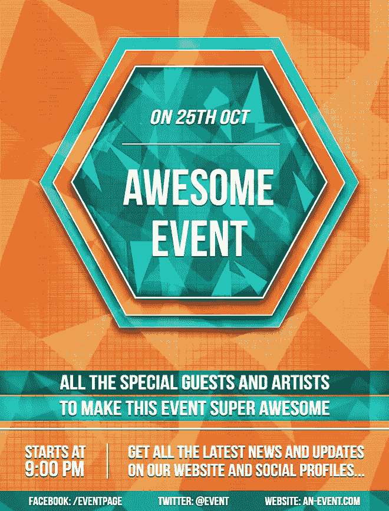

**( [下载完成的、分层的 PDF 文件](https://www.dropbox.com/s/c1dcnihaaxwfitt/Event%20Flyer.zip)。)**

**第一步:**
打开 Photoshop，新建一个文件。传单的尺寸可以变化；你可以选择你喜欢的任何尺寸。我将使用标准的 8.5 英寸宽和 11 英寸高，CMYK 作为我的颜色模式。
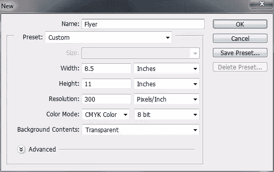

**第二步:**
现在，设置出血为 0.25 英寸，点击“查看”>“新建指南”创建一些指南。
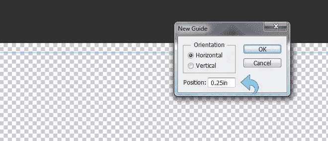

第三步:
对于背景，我们将使用明亮，大胆的颜色(#d8602b)，并使用油漆桶工具填充背景。
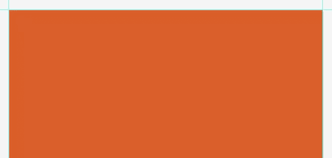

第四步:
现在，选择背景图层，点击“图层样式”添加一个图案。使用上面参考资料中提到的微妙模式。改变混合模式为“叠加”，设置不透明度为 50%，保持设置如下图所示。
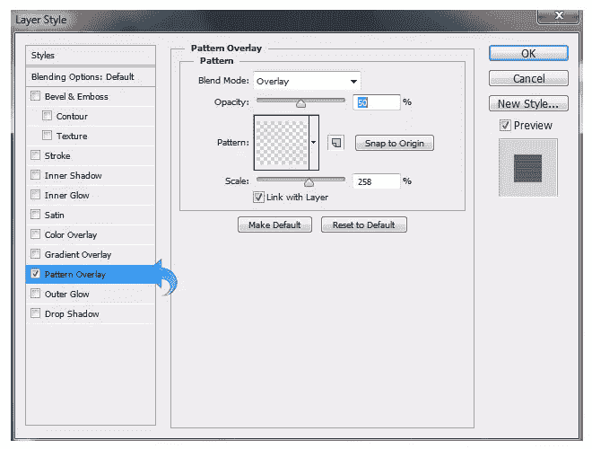

步骤 5:
新建一个图层，使用油漆桶工具填充颜色#ffffff。现在，减少填充到只有 5%,点击“图层样式”,添加一个镶嵌图案，混合模式切换到“柔光”,不透明度设置为 50%。使用下图作为指导，调整其余设置。
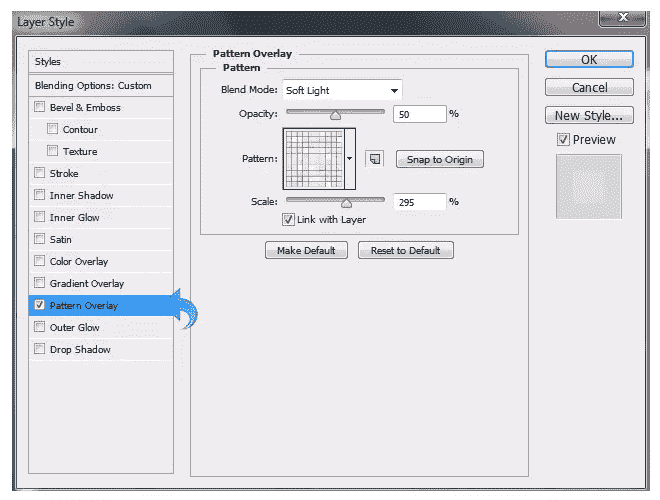

**第六步:**
选择上面的图案图层，点击【图层】>【图层蒙版】>【隐藏全部】。现在，选择一个白色前景色的软圆刷，在中间斜着使用，这样图案只出现在中间。为了清楚起见，请看下面。
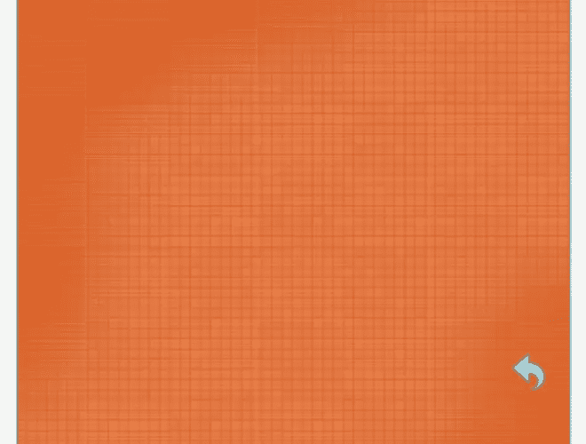

第七步:
新建一个图层，选择钢笔工具，用各种深浅灰创建一些三角形和其他形状。
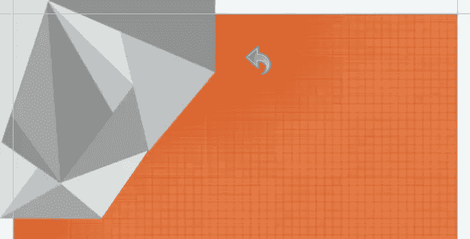

步骤 8:
重复同样的过程填充整个背景。(我将用它创建一个模式，这样我们也可以对其他元素使用相同的模式。)现在，改变图层的混合模式为“叠加”，不透明度降低到 50%。我们将保持这一层总是在顶部。
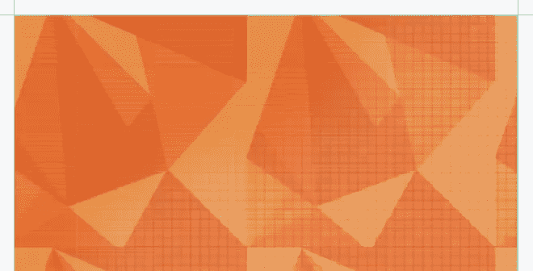

**第九步:**
选择多边形工具，在中间创建一个六边形，有六个边。用颜色#02a598 填充；确保将形状层放在我们之前创建的图案层下面。
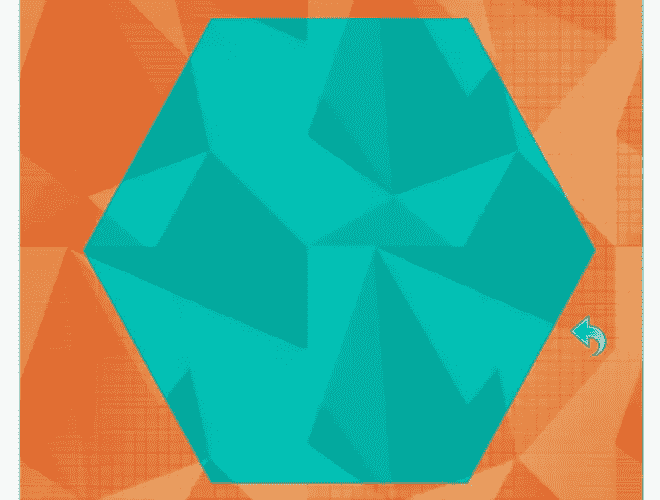

**步骤 10:**
选择形状图层，点击“图层样式”添加一些笔画、图案、阴影。使用下图所示的设置。
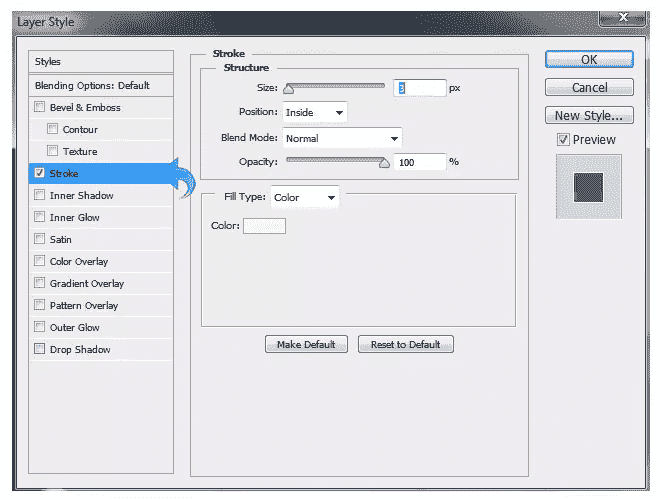
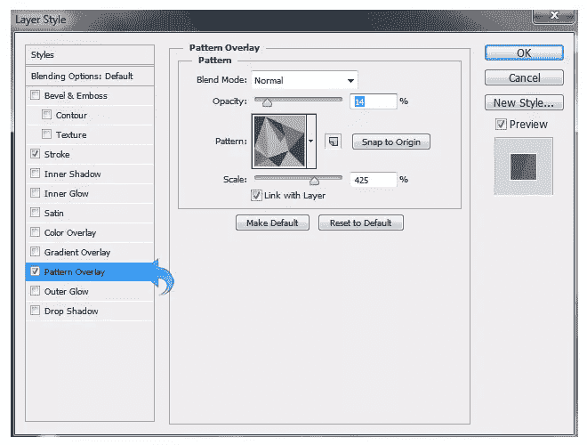

**步骤 11:**
使用多边形工具再创建一个有六条边的形状；这次用颜色#f36521 填充。使这个形状比前一个小一点。然后，点击“图层样式”添加一个模式和阴影使用相同的设置。然后，添加一个外部发光和中风使用以下设置。
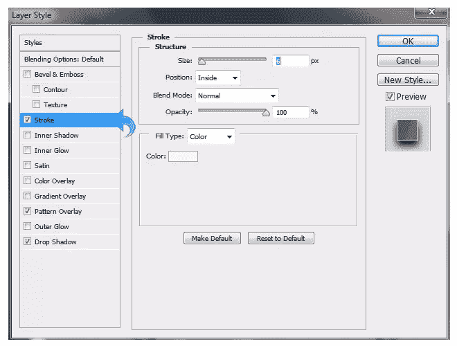

步骤 12:
重复同样的过程，使用多边形工具创建另一个有六条边的多边形。再次，使这个比以前的形状小。填充颜色#00746b，然后点击“图层样式”添加一个图案和阴影，设置和第一个形状一样。然后，添加内部阴影和中风的设置如下所示。
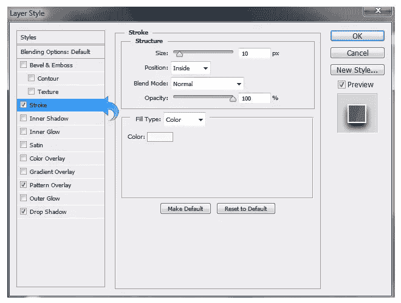

步骤 13:
使用多边形工具创建另一个形状；它应该与上一步中的形状大小相同。(您也可以简单地复制先前的形状。)现在，将图层填充减少到 0%，点击“图层样式”添加一个图案。这里，我们将使用我在参考资料中提到的镶嵌图案。
保持模式设置如下图所示。
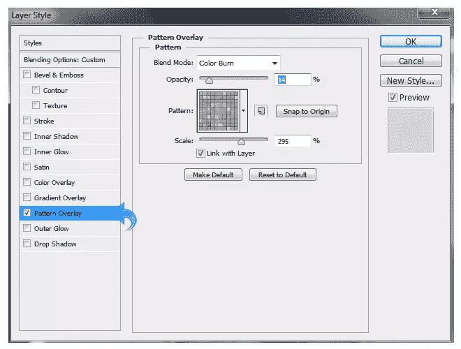

第十四步:
为了让我们的主多边形漂亮明亮，我们将添加一些随机的三角形和其他形状，让它更有趣。因此，创建一个新的层，并选择钢笔工具创建一些三角形使用#e1af9a，#f0f0f0，和#abe6d4 的颜色。
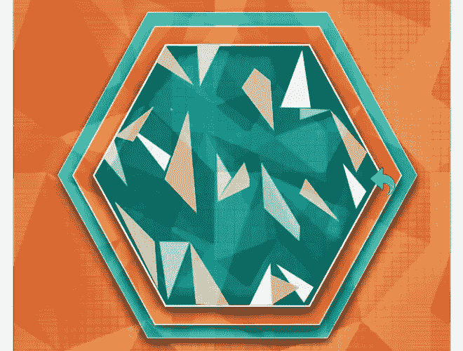

步骤 15:
现在，将三角形图层的混合模式改为“叠加”，透明度为 100%。
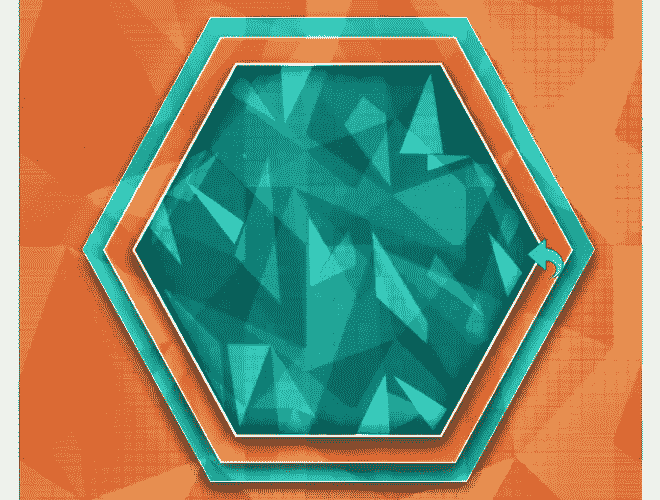

步骤 16:
是时候开始添加文字了，选择文字工具，使用颜色#fffaec 添加标题。然后，选择文字层，点击“图层样式”添加阴影。调整阴影设置，以反映那些在下面的图像。
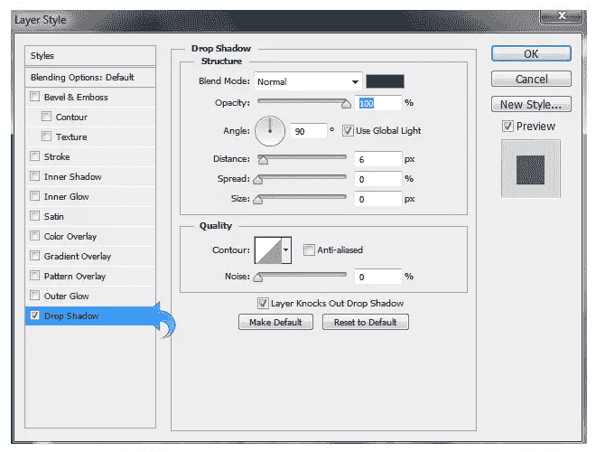

**步骤 17:**
选择线条工具，用#ffffff 颜色创建一条小线条，然后点击“图层样式”给线条添加一些阴影。
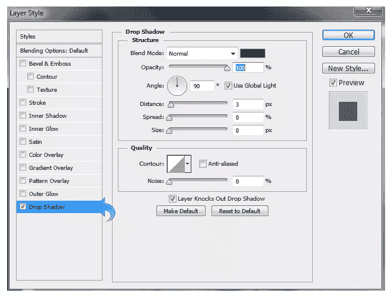

步骤 18:
现在，使用矩形工具创建三个条纹，填充颜色#005952、#00a99d 和#006b65。对于前两个条纹，点击“图层样式”,使用下图中的设置添加一些内部阴影和图案叠加。
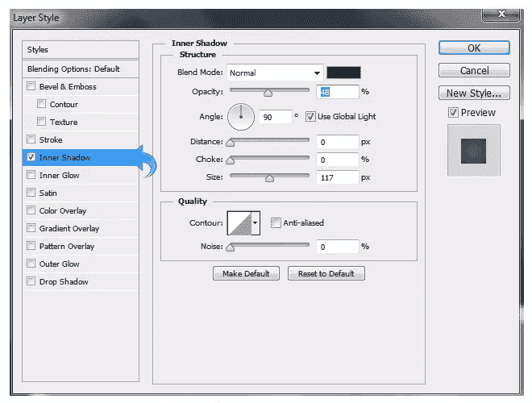

第 19 步:
让我们最后添加剩下的文字。选择文字工具，使用与标题文本相同的颜色和阴影设置添加文本。
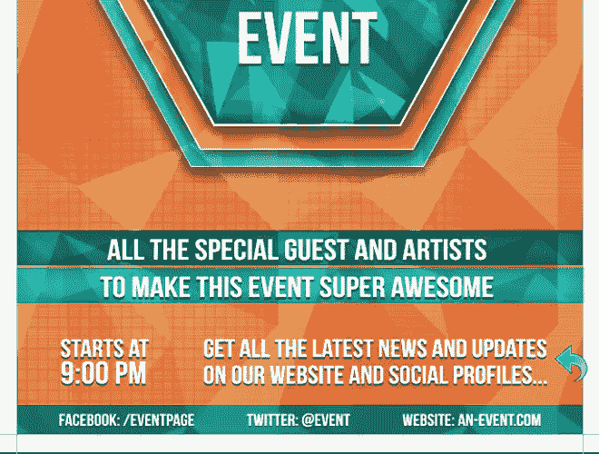

步骤 20:
现在，使用线条工具添加一些基本的分隔线。使用与前面相同的方法创建一个水平分隔线。对于小的垂直分隔线，使用颜色#252525 创建两条线，然后使用颜色#ffffff 创建第三条线。
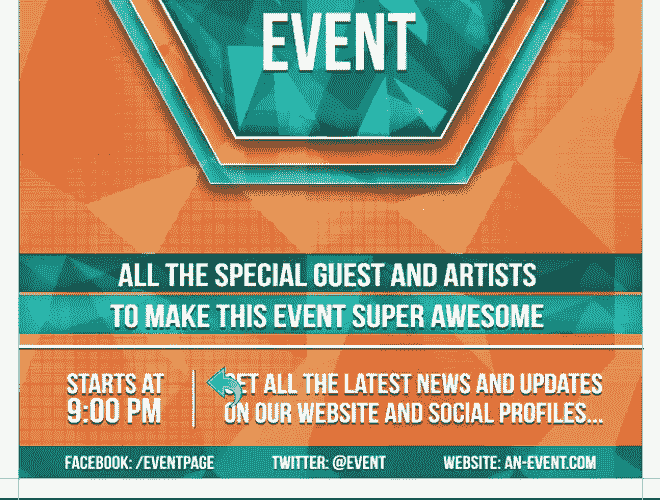

我们完成了明亮的几何事件传单。我希望你喜欢这个过程。请分享你的想法。

## 分享这篇文章