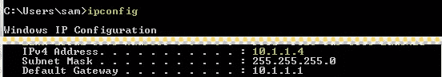

# 在 ipad WAMP 上查看本地主机

> 原文：<https://www.sitepoint.com/view-localhost-ipad-wamp/>

你可以使用 WAMP 在局域网上运行本地主机。然后，可以使用您的移动设备、平板电脑/ipad/andr iods 等来测试您的 web 开发网站/应用程序

只需将您的无线设备连接到局域网(计算机所在的局域网)。

**去跑步> cmd**

**键入 ipconfig**

转到您的无线网络，打开浏览器并键入:

10.1.1.4:80

其中 10.1.1.4 是您的 ip 地址(可以是任何地址), 80 是端口(WAMP 通常运行在端口 80 上)。

**就是这样！**

## 分享这篇文章