# 在 Illustrator 中设计现代图案标志

> 原文：<https://www.sitepoint.com/design-modern-pictorial-logo-illustrator/>

尽管固有的简单，标志设计可以是惊人的困难。对于任何设计师来说，适应所有必要的方面并考虑所有的约束都是一个挑战。试图为每个新标志发明新技术是一个失败的策略；最好的标志是基于正确的基本原则——在一个小而简单的视觉设计中传达一个大的信息。

在本教程中，我将带您了解在 Adobe Illustrator 中为电影工作室设计徽标的过程。我们将使用各种形状工具，钢笔工具，旋转工具，形状生成器工具，剪刀工具，以及对象和效果菜单中的各种选项来实现最终的结果。我希望你在这个过程中学到一些有用的技巧。所以，让我们开始吧！

### 资源:

[大酒店字体](http://www.fontsquirrel.com/fonts/grand-hotel)

### 最终结果:

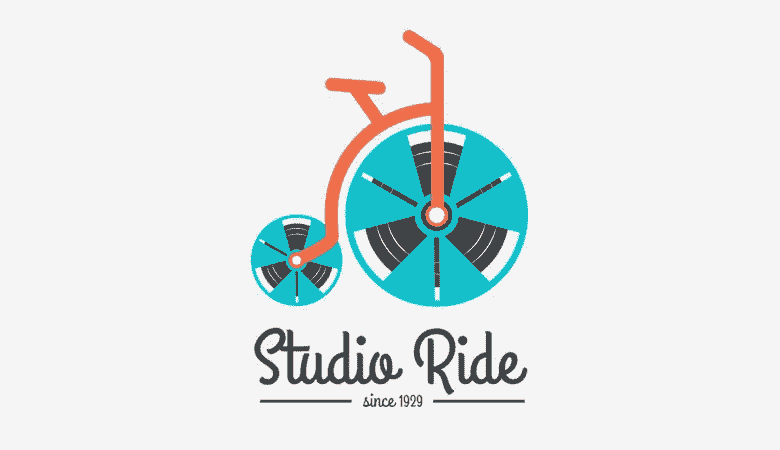

**( [下载完成的 Illustrator 文件](https://www.dropbox.com/s/bh62s81gprjdvnf/Designing%20a%20Logo.zip)。)**

### 第一步

在 Illustrator 中创建新文档，宽度为 600 像素，高度为 450 像素。
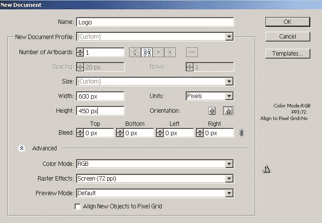

### 第二步

我们将为一个名为“Studio Ride”的虚构电影工作室创建徽标正如我所说的，构思你的标志通常是设计过程中最困难的部分。通常你有几个想法，你想在视觉上融入你的标志。我想用自行车的形式来说明这个概念(以传达叙事、发展和进步的“向前”感),并用胶卷作为象征电影工作室的自行车轮子。你的方法可能会不同；我只是向你展示一种方法。

我们将从制作胶卷开始。选择椭圆工具(“L”)并点击画布打开椭圆窗口。输入 210px 作为宽度和高度，然后点击“确定”。设置你的填充为“无”,选择颜色#0FBBC7 作为你的笔画。在顶部控制栏中选取 8 磅的笔画粗细。
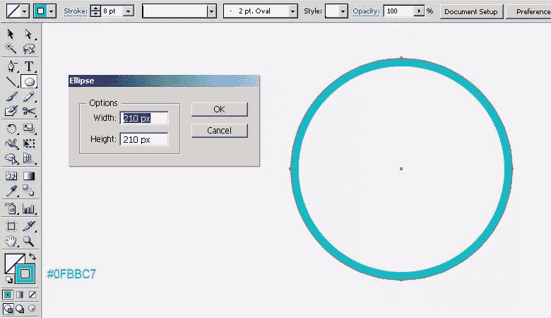

### 第三步

通过单击相应层右侧的环形目标来选择圆形描边。现在，转到“对象”>“路径”>“偏移路径”，将路径偏移“-85px”在里面做一个更小的笔画，如下图。然后，转到“对象”>“扩展外观”，将笔画转换为形状。将这一层标记为“框架”。
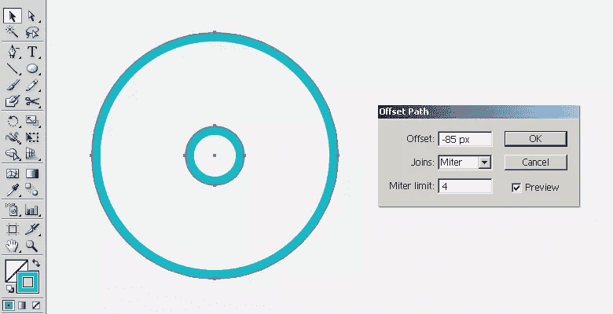

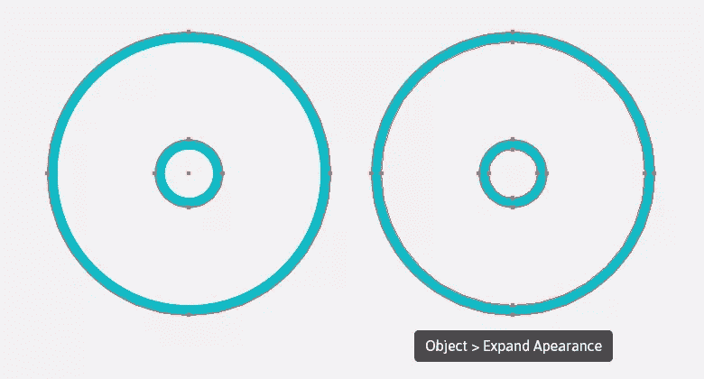

### 第四步

选择矩形工具(“M”)并单击画布以打开矩形窗口。输入 80px 的宽度和 100px 的高度，然后单击“确定”绘制一个矩形。选择#0FBBC7 作为没有描边的填充颜色。
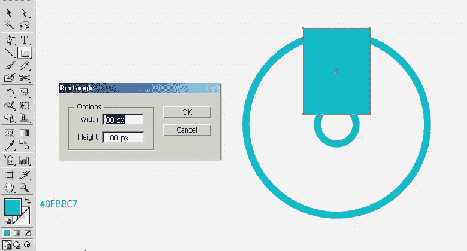

### 第五步

选择直接选择工具(“A”)并单击矩形的左下角锚点，将其拖动到内部。然后，拖动右下角的锚点，如下所示。
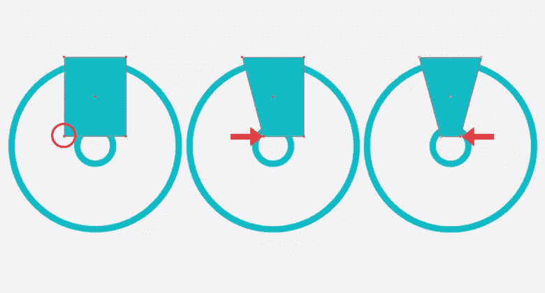

### 第六步

选择这个新的形状，进入“效果”>“扭曲和变形”>“变形”。应用以下设置。
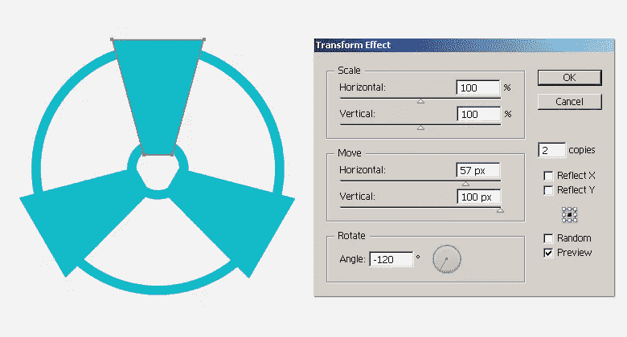

当形状仍处于选中状态时，转到“对象”>“扩展外观”来修改形状。将这一层标记为“翅膀”。
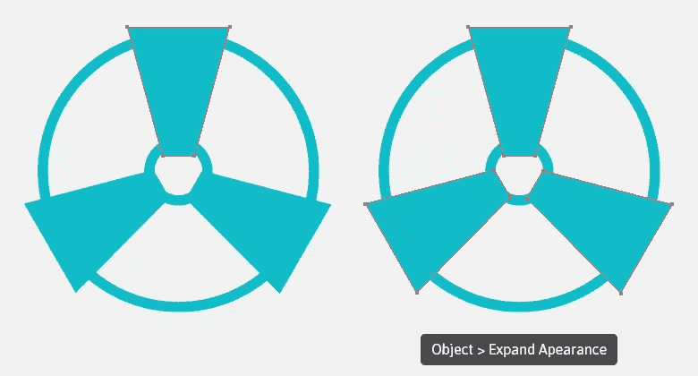

### 第七步

接下来，使用椭圆工具画一个圆，大小与第 6 步创建的“翅膀”层下面的外圆相同。现在，选择这两个层，并在路径查找面板中点击“负前部”(Shift + Ctrl + F9)。
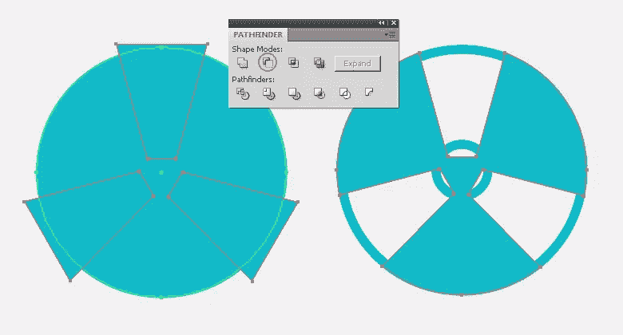

### 第八步

要去除“翅膀”的中心部分，选择帧和翅膀层，并选择形状生成器工具(Shift+“M”)。当你把工具放在中心部分的时候，应该会出现一个图案。现在，按住“Alt”键的同时单击该部分以删除它。为了清楚起见，请看下面。
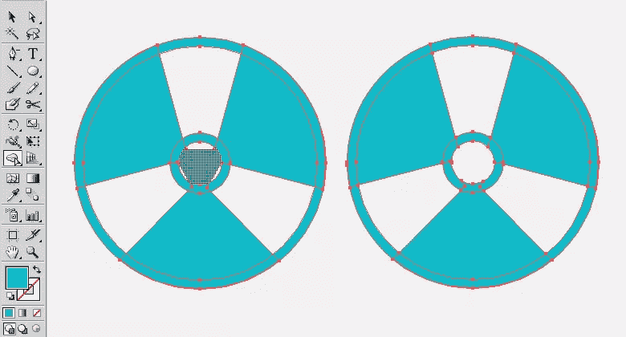

### 第九步

选择矩形工具(“M”)，画一个 6px 宽，130px 高的矩形。现在，选择矩形并选择旋转工具(“R”)。点按画布以查看旋转窗口，并输入 60⁰角度。在选择工具(“V”)的帮助下，如下图所示放置矩形。
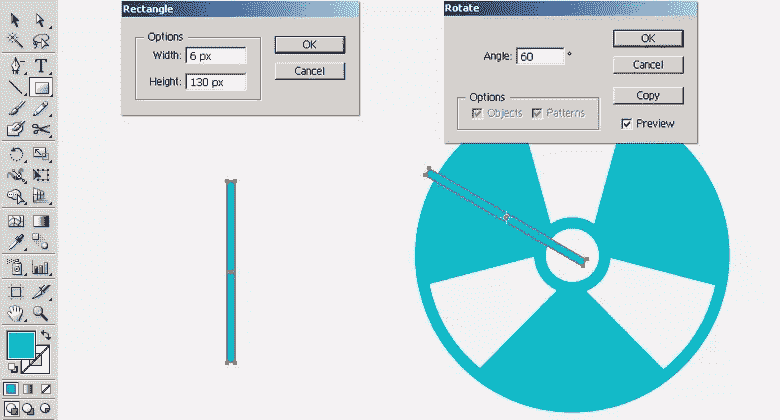

### 第十步

选择矩形，进入“效果”>“扭曲和变换”>“变换”。在此应用以下设置来制作和排列两份副本，如下所示。
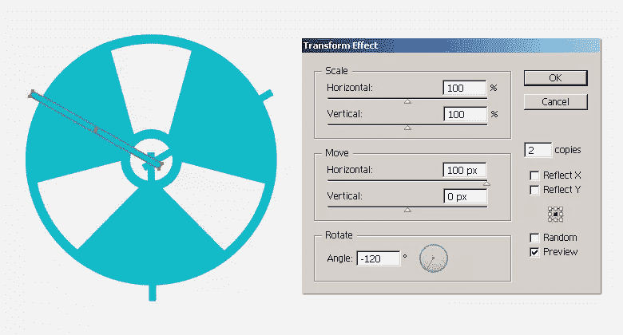

选择新的矩形，然后进入“对象”>“扩展外观”，将副本转换成形状。将这一层标记为“酒吧”。
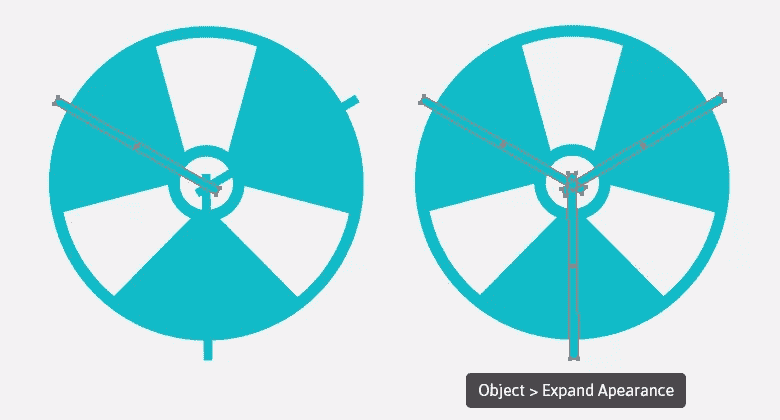

### 步骤 11

现在，选择框架和酒吧层，并删除部分酒吧落在框架外使用形状生成器工具(Shift + "M ")。该技术与步骤 8 中解释的相同。
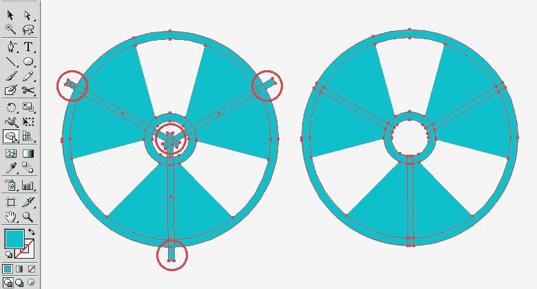

### 步骤 12

选择翅膀和酒吧层，并删除酒吧区从“翅膀”层使用形状生成器工具(Shift+“M”)。要做到这一点，将工具一个一个地悬停在条上，并按下“Alt”键，同时单击以删除它们。
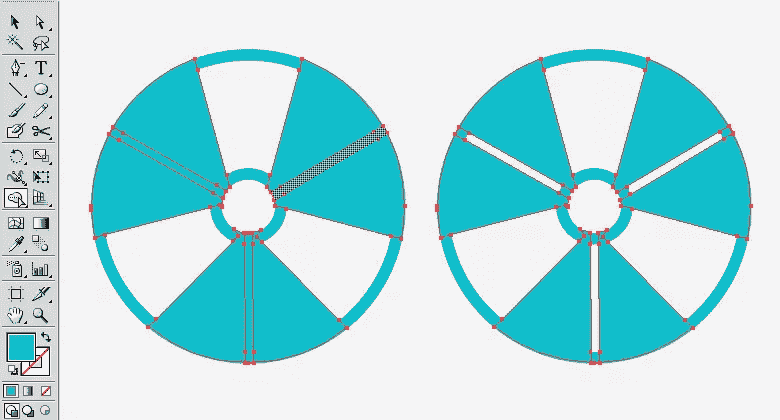

### 第十三步

现在，在剩下的图层下面新建一个图层，用填充颜色#414143 画一个 178 像素乘 178 像素的圆。
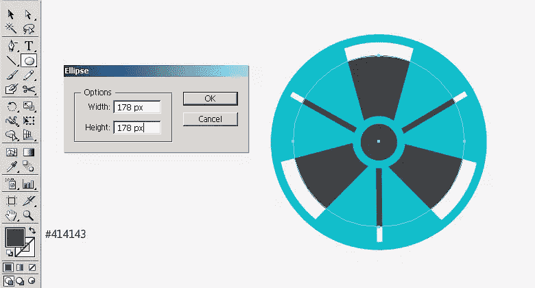

选择椭圆并转到“对象”>“路径”>“偏移路径”。将路径偏移“-14px”。现在，选择这条新路径，并将其偏移相同的距离——“14px”。现在，给这些新路径一个灰色的(#848484)描边，描边粗细为 1 磅，如下所示。
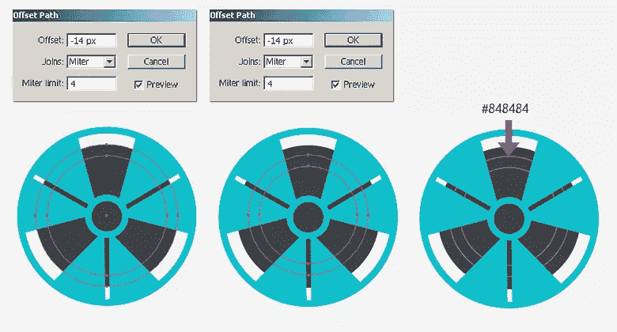

### 步骤 14

接下来，我们将在这些圆形的灰色路径上制作一些高光。选择其中一个圆形路径，按 Ctrl + "C "复制，然后按 Ctrl + "F "粘贴到前面。暂时隐藏原始路径，选择新创建的副本。我们只想要翅膀之间区域的高光，所以我们将使用剪刀工具(“C”)去掉路径的其余部分。如下图所示，只需用剪刀工具在你想要剪切路径的地方点击路径。你的圆形路径应该被切割成不同的部分；现在删除机翼下的路径。
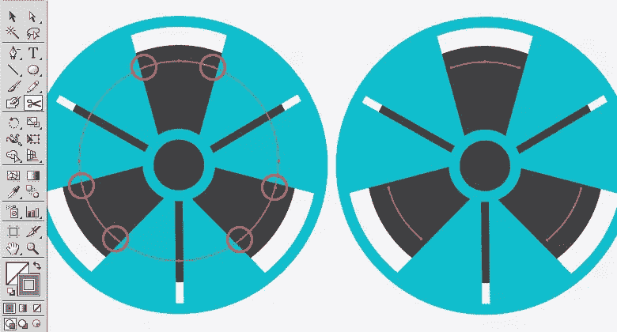

在顶部控制栏内，将高光描边颜色更改为白色，并将它们的宽度轮廓更改为“宽度轮廓 1”。
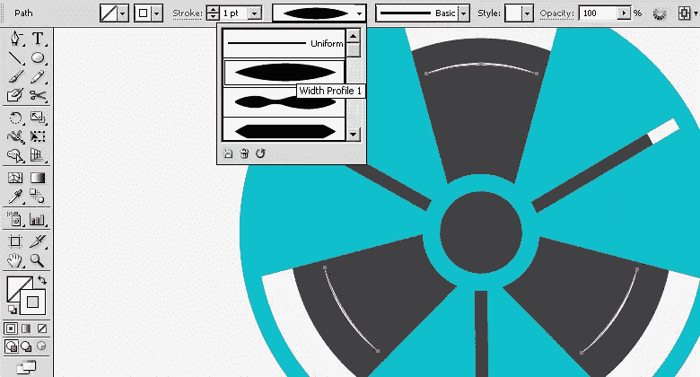

使用相同的技术为内部路径制作高光，并取消隐藏原始路径，以获得与我创建的相同的效果。
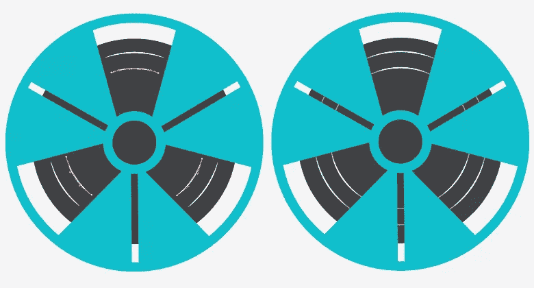

### 第十五步

接下来，选择所有图层，并从图层面板右上角的弹出菜单中选择“在新图层中收集”。复制它，然后到“对象”>“变换”>“缩放”，将副本放大 50%。现在，拖动并定位在左侧使用选择工具(“V”)如下所示。
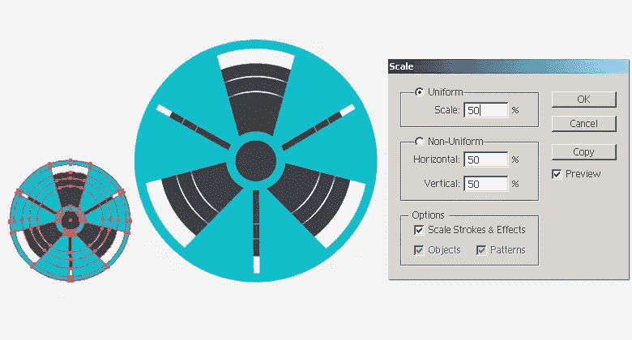

### 第十六步

选择钢笔工具(“P”)，使路径如下所示。将其填充设置为“无”，并将#ED6B48 的笔画设置为 16 磅的粗细。
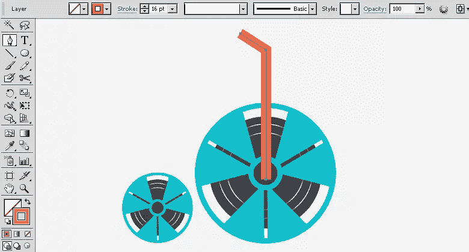

画出下列路径来完成自行车。
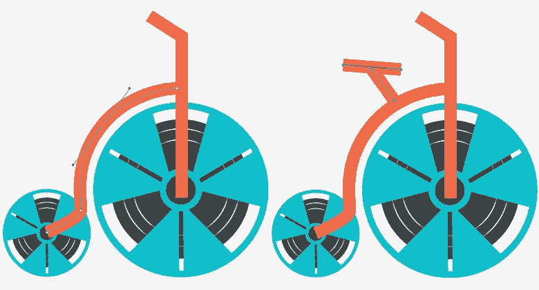

### 步骤 17

选择所有这些路径，并前往“对象”>“扩展”。展开填充和描边，将其转换为形状。
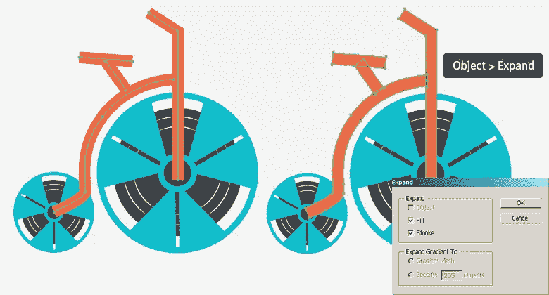

### 步骤 18

现在，选择下面两条路径，进入“效果”>“风格化”>“圆角”。输入 8px 作为半径，使它们的角变圆。
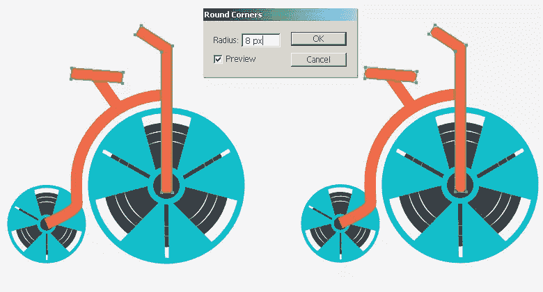

现在，转到“对象”>“扩展外观”来修改形状，并绘制两个小圆圈，如下所示。
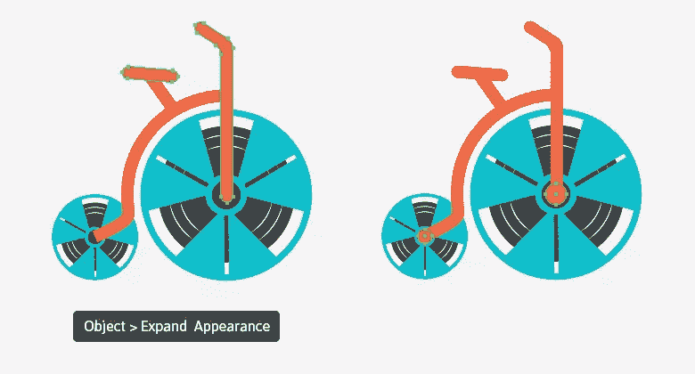

### 步骤 19

下一步，选择两个圆，并前往“对象”>“路径”>“偏移路径”。将它们偏移“-4px”并将新路径的填充改为纯白。
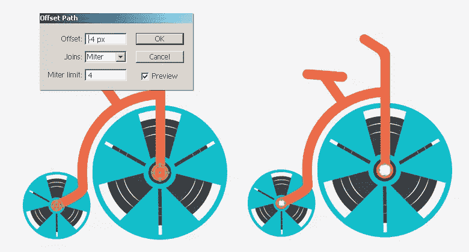

现在，我们将删除其余层的白色椭圆区域。要做到这一点，选择所有的层，并删除所有的白色椭圆区域内的路径使用形状生成器工具(Shift+“M”)。
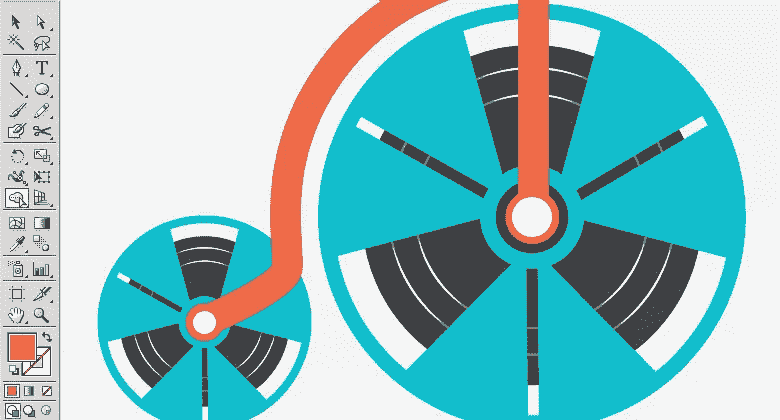

### 步骤 20

选择文字工具(“T”)添加公司名称，使用#414143 作为填充颜色。我在参考资料中使用了上面提到的“Grand Hotel”字体。
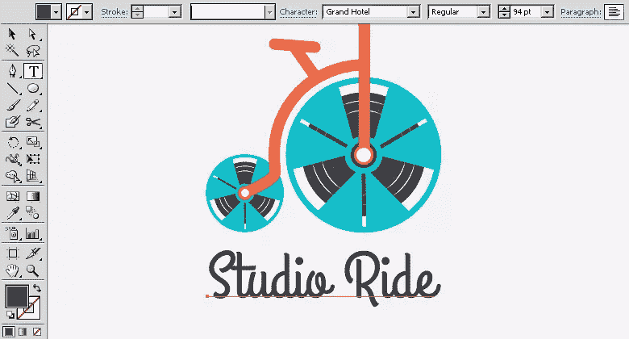

为了完成徽标，我添加了创建日期和两侧的两个细矩形。最后，选择文本层，进入“对象”>“扩展”，将它们转换成形状。确保#414143 是你选择的填充颜色
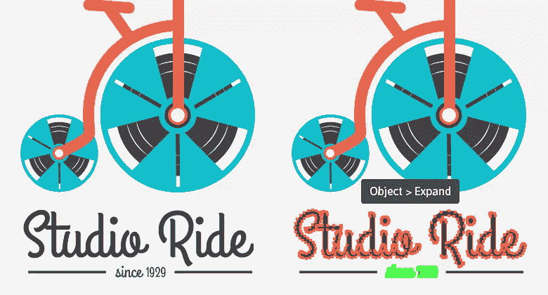

### 最终结果:

就是这样！我尽了最大努力将几个想法融入一个简单的标志中。让我知道你的想法。

## 分享这篇文章