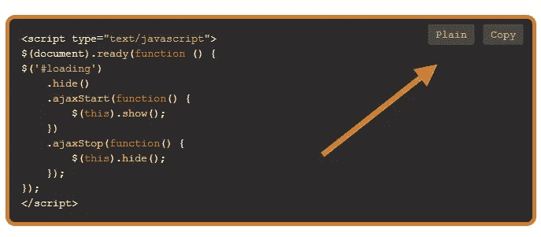

# 使用 CodeColorer 语法荧光笔复制剪贴板

> 原文：<https://www.sitepoint.com/copy-clipboard-codecolorer-syntax-highlighter/>

好了，这里有一些代码，我用来将剪贴板的副本添加到这个博客的代码片段中。这是继[jQuery copy clipboard 4 options](http://www.jquery4u.com/plugins/jquery-copy-clipboard-4-options/)post 之后的又一篇文章，其中有几个选项。**这个的演示在这一页。**该选项使用 Zero Clipboard 插件和一个 SWF 文件来完成点击复制到剪贴板。



## 1:添加 CodeColorer 插件

添加 [CodeColorer WordPress 插件](http://wordpress.org/plugins/codecolorer/screenshots/) (+配置你的显示设置——配色方案等..)

## 2:添加 ZeroClipboard 插件

将 ZeroClipboard 插件添加到您的页面。
[ZeroClipboard.min.js](https://github.com/zeroclipboard/zeroclipboard/blob/master/ZeroClipboard.min.js)

## 3:设置 ZeroClipboard 插件

用 Code Colorer 生成 HTML 标签。

```
ZeroClipboard.setMoviePath("http://" + window.location.hostname + "/files/ZeroClipboard.swf");
a(".copy").mouseover(function () {
    var b = a(this).parents(".codecolorer-container:first").find(".codecolorer:first").text();
    clip = new ZeroClipboard.Client;
    clip.setHandCursor(!0);
    clip.setText(b);
    clip.glue(this);
    var c = a(this);
    clip.addEventListener("complete", function () {
        c.text("copied!").fadeIn("slow")
    })
});
```

## 4:将副本添加到剪贴板

将“复制到剪贴板”按钮附加到页面上的所有代码片段。

```
a(".codecolorer-container").each(function (b) {
    a(this).prepend('');
    a(this).attr("id",
        "d_clip_container_" + b)
});
a(".codecolorer-container").on("mouseenter", function () {
    a(this).find("a").addClass("showactive")
}).on("mouseleave", function () {
    a(this).find("a").removeClass("showactive")
});
```

## 5:可选地添加普通(原始)视图

```
a(".codecolorer-container a.plain").live("click", function () {
    console.log("copy to plain..");
    var b = a(this).parents(".codecolorer-container:first").find(".codecolorer:first").text();
    this._Window = window.open("", "jQuery4u Code Snippet", "location=0,status=0,toolbar=0,dependent=1,resizable=1,menubar=0,screenX=100,screenY=100,width=600,height=400");
    this._Window.document.write("");
    this._Window.document.write("");
    this._Window.document.write("

```
<xmp>" +
        b + "</xmp>
```

");
这个。_ window . document . write(" ")；
这个。_ window . document . write(" "
})
ror . insertafter(element)；
} })； 

```

## 分享这篇文章